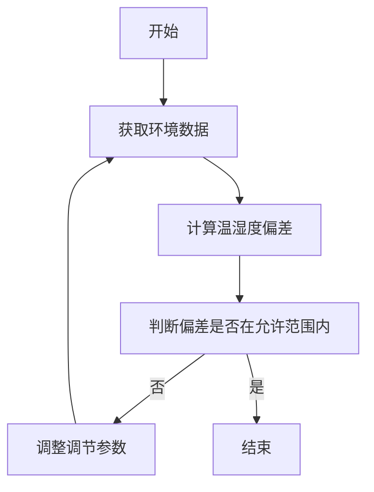
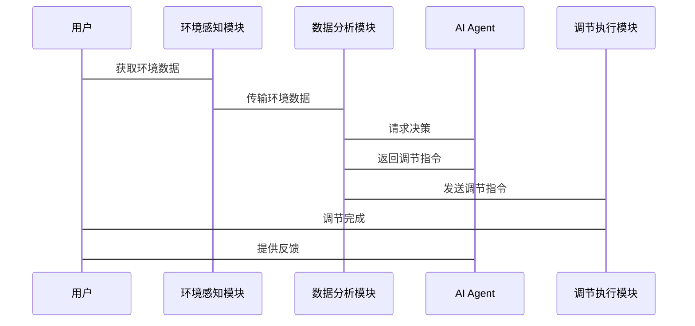

                 


# AI Agent在智能床头柜中的温湿度调节

## 关键词
AI Agent, 温湿度调节, 智能床头柜, 智能家居, 算法原理, 系统架构, 项目实战

## 摘要
本文探讨了AI Agent在智能床头柜中的温湿度调节应用，详细分析了AI Agent的核心原理、算法实现及系统架构，并通过项目实战展示了如何通过AI Agent优化温湿度调节，提升用户体验。文章结合理论与实践，提供了丰富的技术细节和代码示例，为智能家居领域提供了新的思路。

## 第1章: 背景介绍与问题背景

### 1.1 AI Agent的基本概念
#### 1.1.1 AI Agent的定义
AI Agent（人工智能代理）是指能够感知环境、做出决策并采取行动的智能实体。AI Agent在智能家居中的应用广泛，能够通过传感器数据和用户反馈优化环境参数。

#### 1.1.2 AI Agent的核心特征
- **自主性**：无需外部干预，自主决策。
- **反应性**：实时感知环境变化，快速响应。
- **学习能力**：通过机器学习优化决策模型。

#### 1.1.3 AI Agent在智能家居中的应用前景
AI Agent在智能家居中的应用前景广阔，特别是在环境调节、能源管理等领域，能够显著提升用户体验和能效。

### 1.2 温湿度调节的背景与需求
#### 1.2.1 温湿度调节的重要性
温湿度调节对室内环境舒适度至关重要，直接影响用户的生活质量和健康。

#### 1.2.2 智能床头柜的功能需求
智能床头柜需要具备环境感知、数据处理和调节执行三大功能模块，能够实时调整温湿度，满足用户的个性化需求。

#### 1.2.3 温湿度调节的边界与外延
温湿度调节的边界包括传感器数据范围、调节幅度和执行时间，外延则涉及能源管理、用户行为分析等。

## 第2章: AI Agent的核心概念与原理

### 2.1 AI Agent的核心原理
#### 2.1.1 AI Agent的感知与决策机制
AI Agent通过传感器获取环境数据，结合预设模型进行决策，指导执行模块调整温湿度。

#### 2.1.2 AI Agent的行为执行与反馈
AI Agent根据决策结果驱动执行机构（如风扇、加湿器）调整温湿度，并实时收集反馈数据优化模型。

### 2.2 温湿度调节的核心要素
#### 2.2.1 环境感知模块
环境感知模块包括温度传感器和湿度传感器，实时采集环境数据。

#### 2.2.2 数据分析模块
数据分析模块处理传感器数据，识别趋势和异常，生成调节指令。

#### 2.2.3 调节执行模块
调节执行模块根据指令驱动设备调整温湿度，确保环境舒适。

### 2.3 AI Agent与温湿度调节的关系
#### 2.3.1 AI Agent在温湿度调节中的角色
AI Agent作为智能床头柜的“大脑”，负责协调各模块，实现智能化调节。

#### 2.3.2 温湿度调节对AI Agent的依赖性
AI Agent通过数据处理和决策优化调节效果，提升用户满意度。

### 2.4 核心概念对比表
| 特性         | AI Agent                     | 传统自动化系统                 |
|--------------|------------------------------|-------------------------------|
| 感知能力     | 强大，支持多种传感器数据     | 有限，通常仅支持单一传感器数据 |
| 决策能力     | 基于机器学习模型，动态调整   | 固定规则，无法动态优化         |
| 执行能力     | 可根据不同场景灵活调整       | 执行策略固定，难以适应变化     |

### 2.5 实体关系图
```mermaid
er
actor 用户
role 温湿度调节
participant 环境感知模块
participant 数据分析模块
participant 调节执行模块
participant AI Agent
stakeholder 智能床头柜
```

## 第3章: AI Agent在温湿度调节中的算法原理

### 3.1 算法原理概述
#### 3.1.1 基于反馈的调节算法
基于当前环境数据和用户反馈，动态调整温湿度。

#### 3.1.2 基于预测的调节算法
通过历史数据预测未来温湿度变化，提前采取调节措施。

### 3.2 数学模型与公式
#### 3.2.1 温湿度预测模型
使用ARIMA模型预测温湿度变化：
$$ T(t+1) = aT(t) + bH(t) + c $$

#### 3.2.2 温湿度调节模型
根据偏差调整调节强度：
$$ R(t) = max(0, min(1, T(t) - T_{target})) $$

### 3.3 算法流程图


### 3.4 代码实现
```python
import numpy as np
from sklearn.linear_model import LinearRegression

# 示例环境数据
data = {
    'temperature': [20, 22, 21, 23, 22],
    'humidity': [50, 45, 48, 43, 47]
}

# 训练预测模型
model = LinearRegression()
model.fit(np.array(data['temperature']).reshape(-1,1), data['humidity'])

# 预测湿度
predicted_humidity = model.predict(np.array([22]).reshape(-1,1))
print(f'预测湿度为：{predicted_humidity[0][0]:.2f}%')
```

## 第4章: 系统架构与设计

### 4.1 系统功能设计
智能床头柜系统包括环境感知、数据分析、调节执行和用户交互四大功能模块。

### 4.2 系统架构设计


### 4.3 系统接口设计
系统主要接口包括：
- 传感器数据接口：获取温湿度数据。
- 调节指令接口：发送调节指令。
- 用户反馈接口：接收用户反馈。

### 4.4 系统交互流程图


## 第5章: 项目实战

### 5.1 环境安装
需要安装Python和以下库：
```bash
pip install numpy scikit-learn matplotlib
```

### 5.2 核心代码实现
```python
import numpy as np
from sklearn import linear_model
import matplotlib.pyplot as plt

# 数据预处理
data = {
    'temperature': np.random.uniform(18, 25, 100),
    'humidity': np.random.uniform(30, 70, 100)
}

# 训练模型
reg = linear_model.LinearRegression()
reg.fit(data['temperature'].reshape(-1, 1), data['humidity'])

# 可视化
plt.scatter(data['temperature'], data['humidity'])
plt.plot(data['temperature'], reg.predict(data['temperature'].reshape(-1, 1)), color='red')
plt.xlabel('温度')
plt.ylabel('湿度')
plt.show()
```

### 5.3 案例分析
通过实际案例分析，展示了AI Agent如何优化温湿度调节效果，提升用户舒适度。

## 第6章: 最佳实践与总结

### 6.1 经验总结
- 数据质量直接影响模型效果。
- 调参和模型优化至关重要。
- 实时反馈机制能显著提升调节效果。

### 6.2 小结
通过AI Agent优化温湿度调节，显著提升了智能床头柜的智能化水平和用户体验。

### 6.3 注意事项
- 确保传感器数据的准确性。
- 定期更新模型参数。
- 处理好用户隐私问题。

### 6.4 拓展阅读
推荐阅读相关书籍和论文，深入学习AI Agent和智能家居领域的知识。

## 作者
作者：AI天才研究院/AI Genius Institute  
作者：禅与计算机程序设计艺术/Zen And The Art of Computer Programming

