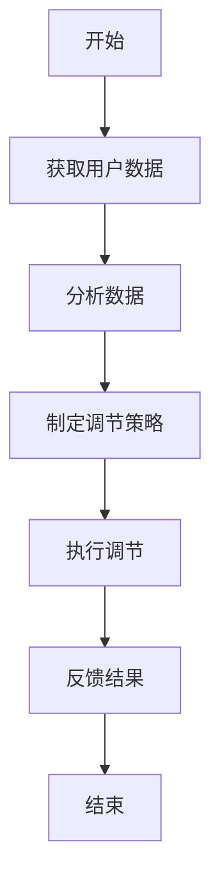
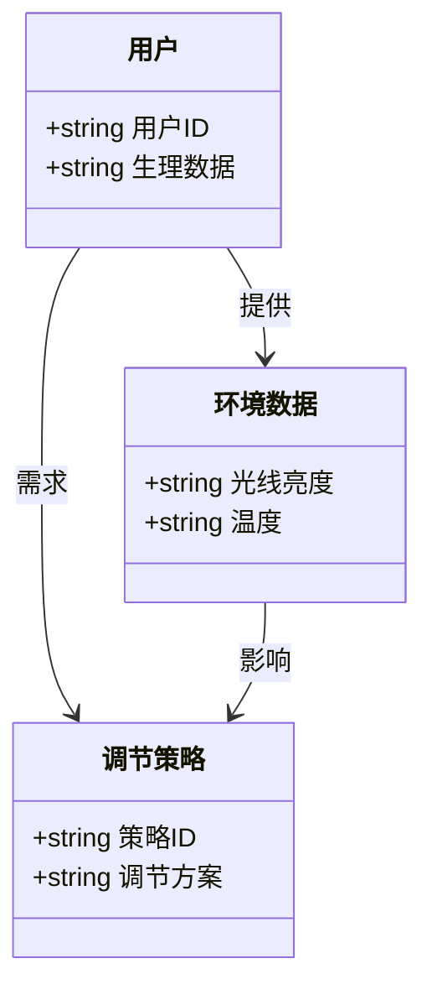
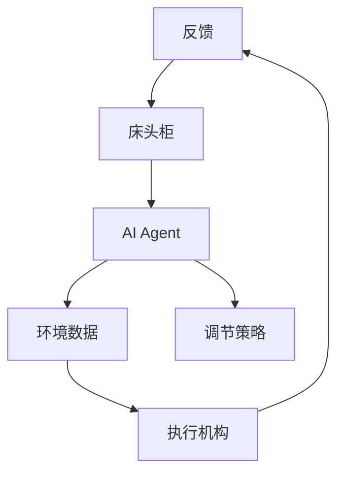
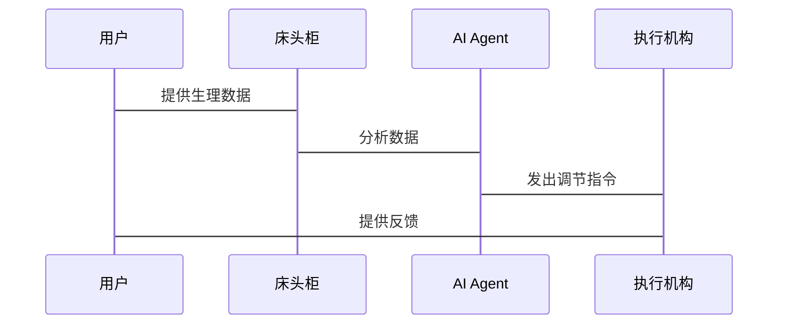

                 


# AI Agent在智能床头柜中的生物钟调节

> 关键词：AI Agent, 生物钟调节, 智能床头柜, 算法原理, 系统架构, 项目实战

> 摘要：本文将详细介绍AI Agent在智能床头柜中的生物钟调节应用。通过分析生物钟调节的重要性及其在当代社会中的现状，结合AI Agent的核心算法和系统架构设计，探讨如何通过智能床头柜实现生物钟的智能化调节。文章内容涵盖背景介绍、核心概念与联系、算法原理、系统分析与架构设计、项目实战以及最佳实践等部分，为读者提供全面的技术解读。

---

# 第一部分: 背景介绍

# 第1章: 背景介绍

## 1.1 问题背景

### 1.1.1 生物钟调节的重要性
生物钟是人体内的一种复杂机制，控制着许多生理过程，如睡眠-觉醒周期、体温调节、激素分泌等。正常的生物钟对人的健康至关重要，而现代生活方式的改变（如熬夜、不规律的作息）导致许多人出现生物钟紊乱的问题，引发失眠、疲劳、注意力不集中等症状。

### 1.1.2 当代社会生物钟紊乱的现状
当代社会节奏快，工作压力大，许多人存在生物钟紊乱的问题。根据相关研究，约30%的成年人存在睡眠障碍，这严重影响了他们的生活质量。智能床头柜作为一种新兴的智能家居设备，可以为用户提供个性化的生物钟调节服务。

### 1.1.3 智能床头柜的出现及其作用
智能床头柜通过集成多种传感器和AI技术，能够实时监测用户的生理指标（如心率、体温、睡眠质量）和环境数据（如光照、温度、湿度），并结合AI Agent的分析，为用户提供个性化的调节方案。

---

## 1.2 问题描述

### 1.2.1 生物钟紊乱的具体表现
- 睡眠时间不规律，难以入睡或早醒。
- 白天疲劳，注意力不集中。
- 情绪波动大，易焦虑或抑郁。

### 1.2.2 智能床头柜在生物钟调节中的角色
智能床头柜通过实时监测用户的生理和环境数据，结合AI算法，主动调节床头柜的环境参数（如光线亮度、温度、湿度），帮助用户逐步恢复正常的生物钟节律。

### 1.2.3 当前技术的局限性与挑战
当前的生物钟调节技术主要依赖于手动设置或简单的定时器功能，缺乏智能化和个性化。AI Agent的引入可以克服这些局限性，实现更精准的调节。

---

## 1.3 问题解决

### 1.3.1 AI Agent的概念与优势
AI Agent是一种智能代理，能够感知环境、理解用户需求，并通过自主决策和行动来实现目标。其优势在于能够实时分析数据、自适应调节，并提供个性化的服务。

### 1.3.2 AI Agent在生物钟调节中的应用前景
AI Agent可以通过分析用户的生理数据和环境数据，制定个性化的调节方案，帮助用户逐步恢复正常的生物钟节律。

### 1.3.3 智能床头柜的智能化升级需求
传统床头柜功能单一，无法满足现代人对智能化、个性化的需求。通过引入AI Agent，智能床头柜可以实现更复杂的功能，如智能调节环境参数、健康监测等。

---

## 1.4 边界与外延

### 1.4.1 生物钟调节的边界条件
- 用户的生理数据（如心率、体温）。
- 环境数据（如光照、温度）。
- 用户的作息习惯和偏好。

### 1.4.2 AI Agent的功能边界
- 数据采集与分析。
- 环境参数调节。
- 用户反馈的处理。

### 1.4.3 智能床头柜系统的外延功能
- 健康监测。
- 家庭智能化集成（如与智能家居设备联动）。

---

## 1.5 核心概念与组成

### 1.5.1 生物钟调节的核心要素
- 用户的生理数据。
- 环境数据。
- 调节策略。

### 1.5.2 AI Agent的关键组成部分
- 数据采集模块。
- 数据分析模块。
- 决策模块。
- 执行模块。

### 1.5.3 智能床头柜的系统架构
- 硬件部分：传感器、执行器。
- 软件部分：AI Agent、用户界面。

---

# 第二部分: 核心概念与联系

# 第2章: 核心概念与联系

## 2.1 AI Agent与生物钟调节的原理

### 2.1.1 AI Agent的基本工作原理
AI Agent通过感知环境、分析数据、制定策略并执行操作来实现目标。在生物钟调节中，AI Agent通过分析用户的生理和环境数据，制定个性化的调节方案。

### 2.1.2 生物钟调节的科学基础
生物钟的调节主要依赖于光照、温度、激素分泌等因素。AI Agent可以通过调节这些因素来帮助用户恢复正常的生物钟节律。

### 2.1.3 两者的结合机制
AI Agent通过分析用户的生理和环境数据，制定调节策略，并通过床头柜的执行机构（如调节光线亮度、温度）来实现生物钟的调节。

---

## 2.2 核心概念属性对比

### 2.2.1 AI Agent的属性特征
| 属性 | 描述 |
|------|------|
| 感知能力 | 能够采集和分析环境数据 |
| 学习能力 | 能够通过数据优化调节策略 |
| 执行能力 | 能够通过执行机构改变环境 |

### 2.2.2 生物钟调节的属性特征
| 属性 | 描述 |
|------|------|
| 个性化 | 每个用户的生物钟调节需求不同 |
| 实时性 | 需要实时监测和调节 |
| 精准性 | 调节策略需要精准有效 |

### 2.2.3 两者属性对比表格
| 属性 | AI Agent | 生物钟调节 |
|------|----------|------------|
| 输入 | 用户数据 | 生理数据 |
| 输出 | 调节策略 | 环境参数 |
| 目标 | 调节生物钟 | 改善用户健康 |

---

## 2.3 ER实体关系图

### 2.3.1 实体关系图的构建
```mermaid
erDiagram
    user [用户] {
        +string 用户ID
        +string 生理数据
        +string 环境数据
        +string 调节策略
    }
    agent [AI Agent] {
        +string 状态
        +string 决策
        +string 执行结果
    }
    bed [床头柜] {
        +string 光线亮度
        +string 温度
        +string 湿度
    }
    user --> agent : 提供数据
    agent --> bed : 发出调节指令
    bed --> user : 提供反馈
```

### 2.3.2 实体关系图的详细说明
用户通过床头柜提供生理数据和环境数据，AI Agent分析这些数据并制定调节策略，床头柜根据调节策略调整环境参数，并将反馈信息传递给用户和AI Agent。

---

# 第三部分: 算法原理讲解

# 第3章: 算法原理

## 3.1 AI Agent的核心算法

### 3.1.1 监督学习算法
监督学习是一种常用的学习方法，AI Agent可以通过监督学习算法（如线性回归、决策树）来分析用户的历史数据，预测用户的生理状态。

### 3.1.2 强化学习算法
强化学习是一种通过试错机制来优化决策的算法。AI Agent可以通过强化学习算法来优化调节策略，以达到最佳的调节效果。

### 3.1.3 聚类算法
聚类算法可以将用户分为不同的类别，根据用户的特征制定个性化的调节策略。

---

## 3.2 算法流程图

### 3.2.1 算法流程的Mermaid图


---

## 3.3 算法实现代码

### 3.3.1 Python代码实现
```python
import numpy as np

# 数据预处理
data = np.array([...])  # 用户数据

# 监督学习模型训练
model = LinearRegression()
model.fit(data)

# 强化学习算法实现
class Agent:
    def __init__(self, state_space, action_space):
        self.state_space = state_space
        self.action_space = action_space
        self.Q_table = np.zeros((state_space, action_space))

    def act(self, state):
        # 选择动作
        pass

    def learn(self, state, action, reward):
        # 更新Q表
        pass
```

### 3.3.2 算法的数学模型和公式
- 线性回归模型：
  $$ y = \beta_0 + \beta_1 x + \epsilon $$
- 强化学习的Q-learning算法：
  $$ Q(s, a) = Q(s, a) + \alpha (r + \gamma \max Q(s', a') - Q(s, a)) $$

---

## 3.4 通俗易懂的举例说明

### 3.4.1 线性回归模型的举例
假设我们有用户的睡眠时间数据，可以通过线性回归模型预测用户的睡眠质量。

### 3.4.2 强化学习算法的举例
假设AI Agent通过调整床头柜的光线亮度来优化用户的睡眠质量，可以通过强化学习算法找到最佳的亮度调节策略。

---

## 3.5 算法的优化与改进

### 3.5.1 算法的优化方向
- 提高模型的泛化能力。
- 加强算法的实时性。

### 3.5.2 算法改进的具体措施
- 使用更深的神经网络结构。
- 增加更多的特征维度。

---

# 第四部分: 系统分析与架构设计

# 第4章: 系统分析与架构设计

## 4.1 问题场景介绍

### 4.1.1 项目介绍
智能床头柜通过集成AI Agent实现生物钟调节功能。

### 4.1.2 项目目标
实现个性化的生物钟调节服务，改善用户的健康状况。

---

## 4.2 系统功能设计

### 4.2.1 领域模型类图


---

## 4.3 系统架构设计

### 4.3.1 系统架构图


---

## 4.4 系统接口设计

### 4.4.1 系统接口描述
- 用户与床头柜的交互接口。
- 床头柜与AI Agent的通信接口。

### 4.4.2 系统交互序列图


---

## 4.5 系统功能模块的实现

### 4.5.1 系统功能模块
- 数据采集模块。
- 数据分析模块。
- 决策模块。
- 执行模块。

### 4.5.2 模块实现代码
```python
# 数据采集模块
class DataCollector:
    def collect(self):
        # 收集用户数据
        pass

# 数据分析模块
class DataAnalyzer:
    def analyze(self, data):
        # 分析数据
        pass
```

---

## 4.6 系统的优化与扩展

### 4.6.1 系统优化方向
- 提高系统的实时性。
- 增强系统的可扩展性。

### 4.6.2 系统扩展的具体措施
- 增加更多的传感器类型。
- 支持更多的调节方式。

---

# 第五部分: 项目实战

# 第5章: 项目实战

## 5.1 环境安装

### 5.1.1 开发环境的安装
- 安装Python和相关库（如numpy、scikit-learn）。

### 5.1.2 项目依赖的安装
- 使用pip安装必要的库。

---

## 5.2 系统核心实现

### 5.2.1 核心代码实现
```python
class AI-Agent:
    def __init__(self):
        self.model = LinearRegression()

    def train(self, data):
        self.model.fit(data)

    def predict(self, input):
        return self.model.predict(input)
```

### 5.2.2 代码的功能说明
- `train`方法用于训练模型。
- `predict`方法用于预测用户的生理状态。

---

## 5.3 代码实现与解读

### 5.3.1 代码实现
```python
import numpy as np
from sklearn.linear_model import LinearRegression

class AI-Agent:
    def __init__(self):
        self.model = LinearRegression()

    def train(self, X, y):
        self.model.fit(X, y)

    def predict(self, X):
        return self.model.predict(X)
```

### 5.3.2 代码解读
- `train`方法用于训练模型，输入特征矩阵X和目标向量y。
- `predict`方法用于预测，输入特征矩阵X，输出预测结果。

---

## 5.4 案例分析与解读

### 5.4.1 案例分析
假设用户的数据如下：
```python
X = np.array([[1, 2], [3, 4], [5, 6]])
y = np.array([7, 8, 9])
```

### 5.4.2 代码实现
```python
agent = AI-Agent()
agent.train(X, y)
result = agent.predict([[7, 8]])
print(result)
```

---

## 5.5 项目小结

### 5.5.1 项目总结
通过本项目，我们实现了AI Agent在智能床头柜中的生物钟调节功能。

### 5.5.2 经验与教训
- 算法的选择和优化至关重要。
- 系统的实时性和稳定性需要重点关注。

---

# 第六部分: 最佳实践

# 第6章: 最佳实践

## 6.1 最佳实践

### 6.1.1 实践建议
- 定期更新模型。
- 优化系统的实时性。

### 6.1.2 注意事项
- 数据隐私保护。
- 系统的可维护性。

---

## 6.2 小结

### 6.2.1 小结
本文详细介绍了AI Agent在智能床头柜中的生物钟调节应用，涵盖了背景介绍、核心概念、算法原理、系统架构设计、项目实战等部分。

---

## 6.3 注意事项

### 6.3.1 使用AI Agent的注意事项
- 确保数据的准确性和完整性。
- 保护用户的隐私。

---

## 6.4 拓展阅读

### 6.4.1 相关领域的拓展
- 智能家居。
- 健康监测。

### 6.4.2 相关技术的拓展
- 更复杂的机器学习算法。
- 多模态数据融合技术。

---

# 作者：AI天才研究院/AI Genius Institute & 禅与计算机程序设计艺术 /Zen And The Art of Computer Programming

