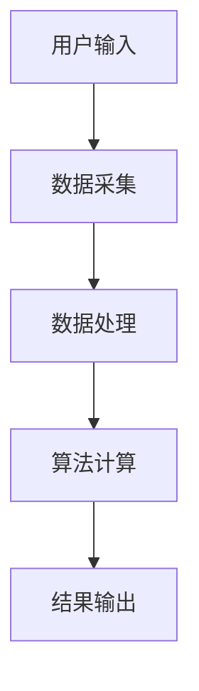

                 


# AI Agent在智能床头柜中的生物钟调节

> 关键词：AI Agent、生物钟调节、智能床头柜、算法原理、系统设计、项目实战

> 摘要：本文探讨了AI Agent在智能床头柜中的生物钟调节应用，分析了生物钟调节的重要性，详细讲解了AI Agent的核心算法和系统设计，并通过实际案例展示了项目的实现与效果。本文还提供了最佳实践建议和未来发展的展望。

---

# 第1章: 生物钟调节的重要性与AI Agent的引入

## 1.1 生物钟调节的背景与意义

### 1.1.1 生物钟的基本概念
生物钟是指生物体内一种调节生理活动的内源性机制，帮助生物体适应环境的变化。人类的生物钟主要由下丘脑的视交叉上核（SCN）控制，周期约为24小时。生物钟调节着我们的睡眠-觉醒周期、体温、激素分泌等生理活动。

### 1.1.2 现代生活方式对生物钟的影响
现代社会的快节奏生活、不规律的工作时间、电子设备的普及等因素，导致许多人出现生物钟紊乱的问题。生物钟紊乱会引起失眠、疲劳、注意力不集中等症状，严重时可能导致抑郁、焦虑等心理问题。

### 1.1.3 生物钟紊乱的健康危害
生物钟紊乱不仅影响日常生活质量，还可能增加患慢性病的风险，如肥胖、糖尿病、心血管疾病等。研究表明，长期的生物钟紊乱与免疫系统功能下降、癌症发病率增加等健康问题密切相关。

## 1.2 AI Agent的基本概念与特点

### 1.2.1 AI Agent的定义
AI Agent（人工智能代理）是指能够感知环境、自主决策并采取行动以实现目标的智能实体。AI Agent可以通过传感器或数据输入获取信息，利用算法进行分析和推理，并根据结果采取相应的行动。

### 1.2.2 AI Agent的核心特征
- **自主性**：AI Agent能够自主决策，无需外部干预。
- **反应性**：能够实时感知环境变化并做出反应。
- **学习能力**：通过机器学习算法不断优化自身行为。
- **适应性**：能够根据环境变化调整策略。

### 1.2.3 AI Agent在智能设备中的应用
AI Agent广泛应用于智能家居、健康管理、自动驾驶等领域。在智能床头柜中，AI Agent通过收集用户的生理数据、环境数据，结合生物钟调节算法，为用户提供个性化的睡眠管理方案。

## 1.3 AI Agent与生物钟调节的结合

### 1.3.1 生物钟调节的智能化需求
传统的生物钟调节方法依赖于用户的自我调整，缺乏科学性和个性化。AI Agent可以通过实时数据采集和智能算法，提供精准的生物钟调节方案。

### 1.3.2 AI Agent在智能床头柜中的作用
AI Agent通过分析用户的睡眠数据、光照强度、环境温度等信息，优化用户的睡眠周期，帮助用户建立健康的生活习惯。

### 1.3.3 生物钟调节的AI Agent解决方案
AI Agent通过机器学习算法，建立用户的生物钟模型，预测用户的最佳睡眠时间，并通过智能床头柜提供个性化的调节建议。

---

## 1.4 本章小结
本章介绍了生物钟调节的重要性和AI Agent的基本概念，分析了AI Agent在智能床头柜中的应用价值。通过AI Agent与生物钟调节的结合，可以为用户提供智能化的睡眠管理方案，帮助用户改善睡眠质量，提升生活品质。

---

# 第2章: 生物钟调节的核心概念与原理

## 2.1 生物钟调节的数学模型

### 2.1.1 生物钟调节的基本原理
生物钟调节是一个复杂的动态过程，受到多种因素的影响。数学模型可以帮助我们理解生物钟调节的内在机制。

### 2.1.2 生物钟调节的数学模型
生物钟调节的数学模型通常采用微分方程来描述生物钟的动态行为。以下是常见的生物钟调节模型：

$$
\frac{d}{dt}x = a \cdot x - b \cdot y \\
\frac{d}{dt}y = c \cdot x - d \cdot y
$$

其中，$x$和$y$表示生物钟系统中的两种变量，$a$、$b$、$c$、$d$是模型参数。

### 2.1.3 生物钟调节的关键参数
关键参数包括周期、振幅、相位等。这些参数决定了生物钟的运行特性。

## 2.2 AI Agent的核心算法

### 2.2.1 AI Agent的感知与决策机制
AI Agent通过感知环境信息，利用决策算法做出最优选择。感知信息包括用户的行为数据、环境数据等。

### 2.2.2 基于AI的生物钟调节算法
基于机器学习的生物钟调节算法可以通过用户数据训练模型，预测用户的最佳睡眠时间。以下是常用的算法：

$$
\text{预测睡眠时间} = \text{模型}(\text{用户数据})
$$

### 2.2.3 算法的优化与改进
通过不断优化算法参数，提高模型的预测精度和响应速度。

## 2.3 生物钟调节的系统架构

### 2.3.1 系统的整体架构
生物钟调节系统通常包括数据采集、数据处理、算法计算、结果输出四个部分。

### 2.3.2 系统的核心模块
- **数据采集模块**：采集用户的生理数据和环境数据。
- **数据处理模块**：对数据进行预处理和特征提取。
- **算法计算模块**：利用AI算法进行生物钟调节。
- **结果输出模块**：输出调节建议和执行命令。

### 2.3.3 系统的交互流程
用户输入数据 -> 数据处理 -> 算法计算 -> 输出结果。

## 2.4 本章小结
本章详细讲解了生物钟调节的数学模型和AI Agent的核心算法，分析了系统的整体架构和交互流程。通过这些内容，我们可以更好地理解生物钟调节的内在机制和AI Agent的工作原理。

---

# 第3章: AI Agent算法的数学模型与公式

## 3.1 生物钟调节的数学模型

### 3.1.1 生物钟调节的动态方程
生物钟调节的动态方程可以表示为：

$$
\frac{d}{dt}x = a \cdot x - b \cdot y \\
\frac{d}{dt}y = c \cdot x - d \cdot y
$$

其中，$x$和$y$表示生物钟系统中的变量，$a$、$b$、$c$、$d$是模型参数。

### 3.1.2 生物钟调节的参数分析
参数分析是理解生物钟调节机制的重要手段。通过调整参数，可以模拟不同的生物钟调节情况。

### 3.1.3 生物钟调节的优化目标
优化目标通常包括最小化误差、提高预测精度等。

## 3.2 AI Agent算法的数学推导

### 3.2.1 AI Agent的感知模型
AI Agent的感知模型可以通过传感器数据建立。例如，光照强度可以表示为：

$$
\text{光照强度} = \text{传感器读数}
$$

### 3.2.2 AI Agent的决策模型
决策模型可以通过机器学习算法建立。例如，支持向量机（SVM）可以用来分类用户的睡眠状态。

### 3.2.3 AI Agent的优化算法
优化算法可以通过梯度下降等方法实现。例如，梯度下降的更新规则为：

$$
\theta_{new} = \theta_{old} - \alpha \cdot \frac{dL}{d\theta}
$$

其中，$\theta$表示模型参数，$\alpha$表示学习率，$L$表示损失函数。

## 3.3 算法的数学公式与实现

### 3.3.1 生物钟调节的关键公式
生物钟调节的关键公式包括：

$$
\text{预测睡眠时间} = \text{模型}(\text{用户数据})
$$

### 3.3.2 AI Agent算法的数学实现
AI Agent算法的数学实现可以通过Python代码实现。例如：

```python
import numpy as np

def predict_sleep_time(model, user_data):
    return model.predict(user_data)
```

### 3.3.3 算法的收敛性分析
算法的收敛性分析是评估算法性能的重要指标。通过分析算法的收敛速度和稳定性，可以优化算法性能。

## 3.4 本章小结
本章详细讲解了AI Agent算法的数学模型与公式，分析了生物钟调节的关键公式和算法实现。通过这些内容，我们可以更好地理解AI Agent算法的内在机制和实现细节。

---

# 第4章: 智能床头柜的系统设计

## 4.1 系统的功能设计

### 4.1.1 系统的功能模块划分
智能床头柜的功能模块包括数据采集、数据处理、算法计算、结果输出。

### 4.1.2 系统的功能流程图
系统功能流程图如下：



### 4.1.3 系统的功能实现细节
系统功能实现细节包括数据采集、数据处理、算法计算、结果输出四个步骤。

## 4.2 系统的架构设计

### 4.2.1 系统的分层架构
系统的分层架构包括数据层、业务逻辑层、表示层。

### 4.2.2 系统的模块化设计
系统的模块化设计包括数据采集模块、数据处理模块、算法计算模块、结果输出模块。

### 4.2.3 系统的交互设计
系统的交互设计包括用户界面、操作流程、反馈机制。

## 4.3 系统的接口设计

### 4.3.1 系统的输入接口
系统的输入接口包括传感器数据、用户输入数据。

### 4.3.2 系统的输出接口
系统的输出接口包括调节建议、执行命令。

## 4.4 系统的交互流程

### 4.4.1 系统的交互流程图
系统的交互流程图如下：


## 4.5 本章小结
本章详细讲解了智能床头柜的系统设计，包括功能设计、架构设计、接口设计和交互设计。通过这些内容，我们可以更好地理解智能床头柜的系统架构和实现细节。

---

# 第5章: 项目实战与案例分析

## 5.1 项目环境配置

### 5.1.1 系统环境
系统环境包括硬件设备和软件环境。硬件设备包括智能床头柜、传感器等，软件环境包括操作系统、开发工具等。

### 5.1.2 系统配置
系统配置包括传感器的安装、数据采集的设置、算法模型的训练等。

## 5.2 系统核心实现

### 5.2.1 核心算法实现
核心算法实现包括数据采集、数据处理、算法计算、结果输出。

### 5.2.2 系统实现代码
以下是系统的实现代码：

```python
import numpy as np
from sklearn import svm

# 数据采集
def collect_data():
    return sensor_data

# 数据处理
def preprocess_data(data):
    return processed_data

# 算法计算
def train_model(data, labels):
    model = svm.SVC()
    model.fit(data, labels)
    return model

# 结果输出
def predict(model, data):
    return model.predict(data)
```

## 5.3 代码应用解读与分析

### 5.3.1 代码的功能分析
代码的功能包括数据采集、数据处理、模型训练和预测。

### 5.3.2 代码的优化建议
代码的优化建议包括提高数据处理效率、优化模型参数等。

## 5.4 实际案例分析

### 5.4.1 案例背景
案例背景包括用户的基本信息、睡眠数据等。

### 5.4.2 算法实现效果
算法实现效果包括预测精度、调节效果等。

### 5.4.3 案例分析总结
案例分析总结包括算法的优势和不足、优化方向等。

## 5.5 本章小结
本章通过实际案例分析，展示了AI Agent在智能床头柜中的应用效果。通过案例分析，我们可以更好地理解算法的实现细节和实际效果。

---

# 第6章: 总结与展望

## 6.1 关键点回顾
关键点回顾包括生物钟调节的重要性、AI Agent的核心算法、系统的实现细节等。

## 6.2 最佳实践 tips
最佳实践 tips包括合理设置生物钟、保持良好的生活习惯、定期检查系统等。

## 6.3 注意事项
注意事项包括系统的维护、数据的安全、算法的优化等。

## 6.4 未来发展的展望
未来发展的展望包括AI技术的进一步发展、生物钟调节算法的优化、智能床头柜的多功能化等。

---

# 附录

## 附录1: 参考文献
1. 生物钟调节的相关文献
2. AI Agent的相关文献
3. 智能床头柜的相关文献

## 附录2: 相关工具与库
1. 传感器数据采集工具
2. 数据处理工具
3. 机器学习算法库

---

# 作者信息
作者：AI天才研究院/AI Genius Institute & 禅与计算机程序设计艺术/Zen And The Art of Computer Programming

