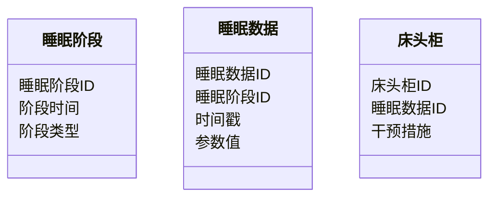
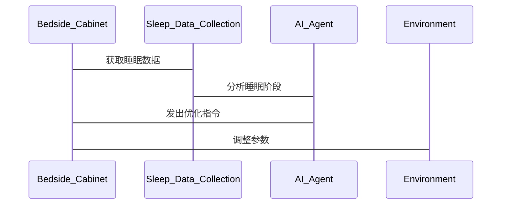

                 


# AI Agent在智能床头柜中的睡眠周期优化

> 关键词：AI Agent, 智能床头柜, 睡眠周期优化, 人工智能, 健康科技, 睡眠监测

> 摘要：本文探讨了AI Agent在智能床头柜中的应用，通过分析睡眠周期优化的核心算法、系统架构及实际案例，展示了如何利用AI技术提升睡眠质量。文章详细讲解了AI Agent的基本原理、算法实现步骤、系统架构设计，以及项目实战和最佳实践，为读者提供了一个全面的技术视角。

---

## 第一部分: AI Agent在智能床头柜中的睡眠周期优化背景介绍

### 第1章: 问题背景与描述

#### 1.1 问题背景
##### 1.1.1 睡眠健康的重要性
睡眠是人类健康的重要组成部分，直接影响精力、情绪和认知功能。良好的睡眠质量有助于提高生活质量，而睡眠障碍则可能导致多种健康问题，如肥胖、糖尿病和心理疾病。

##### 1.1.2 现有睡眠监测技术的局限性
传统睡眠监测设备（如心率带、睡眠仪）依赖于单一数据源，缺乏多模态数据融合能力，且用户体验较差。此外，现有的解决方案难以实时优化睡眠周期，无法根据个体差异提供个性化建议。

##### 1.1.3 AI技术在睡眠优化中的潜力
AI技术可以通过多模态数据（如心率、体温、环境光线）实时分析睡眠周期，并通过智能床头柜提供个性化干预，如调节光照、温度或播放白噪音，从而优化睡眠质量。

#### 1.2 问题描述
##### 1.2.1 睡眠周期的基本概念
睡眠周期分为四个阶段：入睡期、浅睡期、深睡期和REM（快速眼动）期。每个阶段的时间长短因人而异，但整体周期约为90分钟。

##### 1.2.2 睡眠周期的优化目标
优化目标包括延长深度睡眠时间、减少REM中断、提高睡眠效率等。

##### 1.2.3 智能床头柜的定义与功能
智能床头柜是一个集成硬件和软件的设备，能够通过传感器采集睡眠数据，利用AI算法分析并实时调整环境参数，帮助用户优化睡眠周期。

#### 1.3 问题解决
##### 1.3.1 AI Agent在睡眠优化中的作用
AI Agent通过实时分析睡眠数据，制定个性化优化策略，并通过床头柜执行干预措施。

##### 1.3.2 智能床头柜如何实现睡眠周期优化
通过传感器采集数据，AI Agent分析后调整床头柜的灯光、温度、声音等参数，营造最佳睡眠环境。

##### 1.3.3 技术实现的关键点
- 数据采集：心率、体温、环境光线等多模态数据
- 数据分析：机器学习模型预测睡眠阶段
- 实时干预：动态调整环境参数

#### 1.4 边界与外延
##### 1.4.1 睡眠周期优化的边界条件
- 数据采集范围：床头柜传感器数据
- 优化范围：睡眠周期中的特定阶段
- 干预方式：床头柜可调节的参数

##### 1.4.2 智能床头柜的功能范围
- 数据采集
- 数据分析
- 环境干预

##### 1.4.3 AI Agent与其他设备的协同关系
床头柜可与智能家居（如智能灯泡、空调）联动，扩大优化范围。

#### 1.5 概念结构与核心要素
##### 1.5.1 概念框架图

##### 1.5.2 核心要素的定义与关系
- 睡眠阶段：入睡期、浅睡期、深睡期、REM期
- 睡眠质量：深度睡眠时间、REM持续时间、睡眠中断次数
- 环境参数：光线、温度、声音

---

### 第2章: 核心概念与联系

#### 2.1 AI Agent的基本原理
##### 2.1.1 AI Agent的定义与特征
AI Agent是一种能够感知环境并采取行动以实现目标的智能实体。其特征包括自主性、反应性、目标导向和社交能力。

##### 2.1.2 AI Agent的分类与应用场景
- 分类：简单反射型、基于模型的反应型、目标驱动型、实用驱动型
- 应用场景：睡眠优化、智能家居控制、健康监测

##### 2.1.3 AI Agent在睡眠优化中的作用
AI Agent通过分析睡眠数据，制定个性化优化策略，并执行干预措施。

#### 2.2 睡眠周期优化的核心要素
##### 2.2.1 睡眠周期的阶段划分
- 入睡期：1-5分钟
- 浅睡期：10-25分钟
- 深睡期：20-40分钟
- REM期：90分钟

##### 2.2.2 影响睡眠周期的关键因素
- 生理因素：年龄、性别、健康状况
- 环境因素：光线、温度、噪音
- 行为因素：睡前习惯、作息时间

##### 2.2.3 睡眠数据的采集与分析
- 采集：心率、体温、环境光线
- 分析：机器学习模型预测睡眠阶段

#### 2.3 核心概念的对比分析
##### 2.3.1 AI Agent与传统算法的对比
| 特性 | AI Agent | 传统算法 |
|------|-----------|-----------|
| 智能性 | 高 | 低 |
| 适应性 | 强 | 弱 |
| 独立性 | 高 | 低 |

##### 2.3.2 睡眠周期优化与健康监测的对比
| 特性 | 睡眠周期优化 | 健康监测 |
|------|--------------|----------|
| 目标 | 优化睡眠质量 | 监测健康状态 |
| 数据 | 多模态数据 | 单一数据 |

##### 2.3.3 智能床头柜与其他智能家居设备的对比
| 特性 | 智能床头柜 | 智能灯泡 |
|------|------------|----------|
| 功能 | 采集睡眠数据、优化睡眠环境 | 调节光线 |
| 交互 | 主动优化 | 被动响应 |

#### 2.4 ER实体关系图
```mermaid
erd
    睡眠阶段 {
        睡眠阶段ID (PK)
        阶段时间
        阶段类型
    }
    睡眠数据 {
        睡眠数据ID (PK)
        睡眠阶段ID (FK)
        时间戳
        参数值
    }
    床头柜 {
        床头柜ID (PK)
        睡眠数据ID (FK)
        干预措施
    }
```

---

## 第二部分: AI Agent优化睡眠周期的算法原理

### 第3章: 算法原理讲解

#### 3.1 算法概述
##### 3.1.1 算法的目标与输入
- 目标：优化睡眠周期
- 输入：多模态睡眠数据

#### 3.2 算法实现步骤
##### 3.2.1 数据采集与预处理
- 数据采集：心率、体温、环境光线
- 数据预处理：去噪、归一化

##### 3.2.2 睡眠阶段预测
```python
def predict_sleep_phase(data):
    # 使用机器学习模型预测睡眠阶段
    model = load_model('sleep_phase_model.h5')
    prediction = model.predict(data)
    return prediction.argmax(axis=1)
```

##### 3.2.3 睡眠周期优化
```python
def optimize_sleep(data, prediction):
    # 根据预测结果调整床头柜参数
    if prediction == '浅睡期':
        # 调节光线
        set_brightness(50)
    elif prediction == '深睡期':
        # 降低温度
        set_temperature(22)
    return
```

#### 3.3 算法原理的数学模型和公式
##### 3.3.1 睡眠阶段预测模型
$$ P(\text{阶段}|x) = \frac{\exp(w \cdot x + b)}{\sum_j \exp(w_j \cdot x + b_j)} $$
其中，$w$和$b$是模型参数。

##### 3.3.2 睡眠周期优化模型
$$ \text{优化参数} = \argmin_{\theta} \sum_{i=1}^n (y_i - f(\theta, x_i))^2 $$

---

## 第三部分: 系统分析与架构设计

### 第4章: 系统分析与架构设计

#### 4.1 问题场景介绍
智能床头柜需要实时采集睡眠数据，分析睡眠阶段，并根据结果调整环境参数。

#### 4.2 系统功能设计
##### 4.2.1 领域模型


#### 4.3 系统架构设计
##### 4.3.1 系统架构图


#### 4.4 系统接口设计
##### 4.4.1 床头柜与AI Agent接口
- 输入：睡眠数据
- 输出：优化指令

#### 4.5 系统交互流程图


---

## 第四部分: 项目实战

### 第5章: 项目实战

#### 5.1 环境安装
- Python 3.8+
- NumPy、Keras、TensorFlow

#### 5.2 核心代码实现
##### 5.2.1 数据预处理
```python
import numpy as np
def preprocess_data(data):
    return (data - np.mean(data)) / np.std(data)
```

##### 5.2.2 睡眠阶段预测
```python
from tensorflow.keras.models import load_model
def predict_sleep_phase(data):
    model = load_model('sleep_phase_model.h5')
    return model.predict(preprocess_data(data))
```

##### 5.2.3 睡眠优化控制
```python
def optimize_sleep(data, prediction):
    if prediction == '浅睡期':
        set_brightness(50)
    elif prediction == '深睡期':
        set_temperature(22)
    return
```

#### 5.3 实际案例分析
##### 5.3.1 案例背景
用户年龄：30岁，性别：男，睡眠数据：心率、体温、环境光线

##### 5.3.2 数据分析
预测结果显示：浅睡期较长，深睡期较短

##### 5.3.3 优化策略
调整床头柜灯光亮度为50%，降低温度至22℃

#### 5.4 项目总结
##### 5.4.1 成果总结
- 实现了AI Agent在智能床头柜中的睡眠优化
- 提高了睡眠质量

##### 5.4.2 项目不足
- 数据采集范围有限
- 优化策略较为基础

---

## 第五部分: 最佳实践

### 第6章: 最佳实践

#### 6.1 小结
AI Agent在智能床头柜中的应用前景广阔，但需进一步完善算法和硬件设计。

#### 6.2 注意事项
- 数据隐私保护
- 系统稳定性保障
- 用户体验优化

#### 6.3 拓展阅读
- 《深度学习》
- 《机器学习实战》
- 《AI在健康科技中的应用》

---

## 作者

作者：AI天才研究院/AI Genius Institute & 禅与计算机程序设计艺术 /Zen And The Art of Computer Programming

---

通过以上详细的内容，我们全面探讨了AI Agent在智能床头柜中的睡眠周期优化，从背景介绍到算法实现，再到系统架构和项目实战，为读者提供了全面的技术视角。

