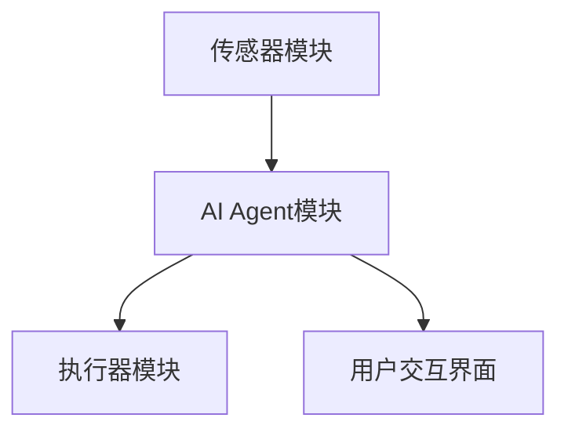
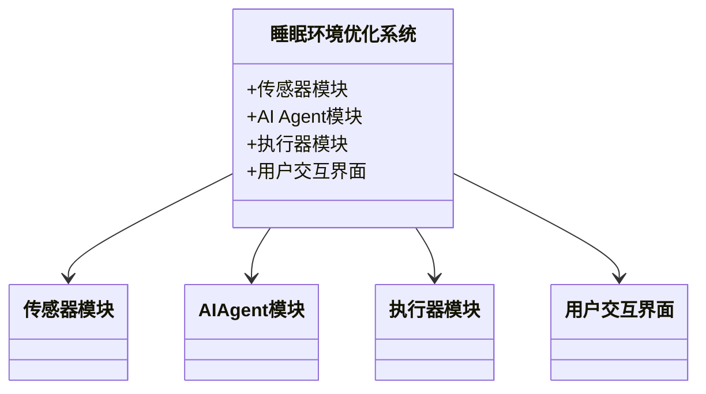
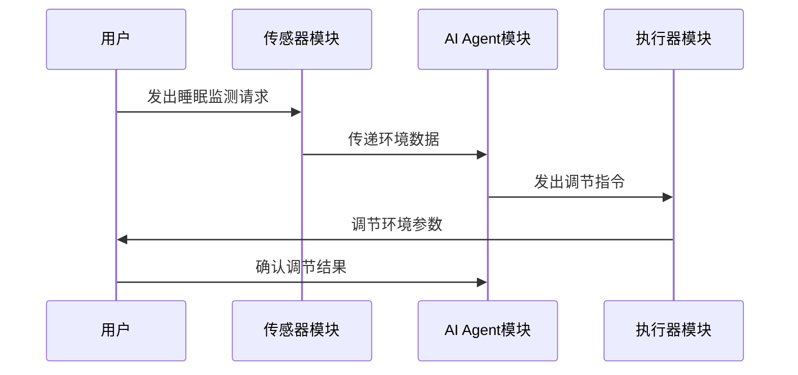

                 


# AI Agent在智能床头柜中的睡眠环境优化

> 关键词：AI Agent, 智能床头柜, 睡眠环境优化, 算法原理, 系统架构设计, 项目实战

> 摘要：本文详细探讨了AI Agent在智能床头柜中的应用，分析了其在睡眠环境优化中的核心作用，结合实际案例和系统设计，深入讲解了算法原理和系统架构，为读者提供了从理论到实践的全面指导。

---

# 第一部分: AI Agent在智能床头柜中的睡眠环境优化背景介绍

## 第1章: 睡眠健康与智能床头柜的发展

### 1.1 睡眠健康的重要性

#### 1.1.1 睡眠对身心健康的影响
睡眠是人体健康的重要组成部分，直接影响人的精力、情绪和免疫力。长期睡眠不足可能导致多种健康问题，如焦虑、抑郁、肥胖和心血管疾病等。AI Agent通过优化睡眠环境，帮助用户改善睡眠质量，从而提升整体健康水平。

#### 1.1.2 现代生活方式对睡眠质量的挑战
现代社会节奏快、压力大，许多人面临睡眠不足或睡眠质量差的问题。智能床头柜通过整合传感器和AI技术，能够实时监测睡眠环境，如温度、湿度、光线和噪音，并根据数据进行优化调整。

#### 1.1.3 智能床头柜在睡眠优化中的作用
智能床头柜通过AI Agent实现自动化调节，例如调整灯光亮度、控制空调温度、播放白噪音等，帮助用户快速入睡并保持深度睡眠状态。

### 1.2 智能床头柜的发展历程

#### 1.2.1 传统床头柜的功能局限
传统床头柜功能单一，仅作为放置物品的载体，无法满足现代人对智能化、个性化的需求。

#### 1.2.2 智能家居的发展趋势
随着物联网技术的发展，智能家居设备逐渐普及，床头柜作为卧室的重要组成部分，也开始向智能化方向发展。

#### 1.2.3 AI技术在智能家居中的应用
AI技术的快速发展，使得智能家居设备能够实现更复杂的功能，如语音控制、自动化调节和智能学习。AI Agent在智能床头柜中的应用，进一步提升了设备的智能化水平。

### 1.3 AI Agent的基本概念

#### 1.3.1 什么是AI Agent
AI Agent（人工智能代理）是一种能够感知环境、自主决策并执行任务的智能实体。它通过传感器获取环境信息，利用算法进行分析和决策，并通过执行器完成任务。

#### 1.3.2 AI Agent的核心特点
- **自主性**：能够在没有人工干预的情况下独立运行。
- **反应性**：能够实时感知环境变化并做出反应。
- **目标导向**：以实现特定目标为导向，优化决策过程。

#### 1.3.3 AI Agent与传统自动控制系统的区别
| 特性 | AI Agent | 传统控制系统 |
|------|-----------|---------------|
| 决策方式 | 基于机器学习和数据驱动 | 基于预设规则和逻辑 |
| 灵活性 | 高，能够适应复杂环境变化 | 较低，依赖固定规则 |
| 学习能力 | 具备学习能力，能够优化决策 | 无学习能力，无法优化 |

---

## 第2章: AI Agent在睡眠环境优化中的应用

### 2.1 睡眠环境优化的核心问题

#### 2.1.1 睡眠环境的多维度分析
睡眠环境涉及多个维度，如温度、湿度、光线、噪音和床铺舒适度等。AI Agent需要综合考虑这些因素，制定最优的调节方案。

#### 2.1.2 睡眠质量的影响因素
- **生理因素**：如年龄、性别、健康状况等。
- **环境因素**：如温度、湿度、噪音等。
- **行为因素**：如睡前习惯、作息时间等。

#### 2.1.3 AI Agent如何解决睡眠优化问题
AI Agent通过实时监测环境数据和用户行为，结合历史数据和机器学习模型，预测和优化睡眠环境，提升睡眠质量。

### 2.2 AI Agent在智能床头柜中的具体应用

#### 2.2.1 睡眠监测与数据分析
AI Agent通过内置的传感器收集睡眠数据，如心率、呼吸频率和体动频率等，分析用户的睡眠周期和质量，提供个性化建议。

#### 2.2.2 环境调节与个性化建议
根据分析结果，AI Agent调整床头柜的环境参数，如调节灯光亮度、控制空调温度、播放白噪音等，帮助用户进入深度睡眠状态。

#### 2.2.3 应急处理与异常情况预警
AI Agent能够实时监测环境数据，当检测到异常情况（如火灾、煤气泄漏）时，及时发出警报并启动应急措施。

---

## 第3章: AI Agent的核心原理

### 3.1 AI Agent的基本原理

#### 3.1.1 状态表示
状态表示是AI Agent感知环境的第一步，通常包括环境数据和用户数据。例如，环境数据包括温度、湿度和光线强度，用户数据包括用户的睡眠周期和健康状况。

#### 3.1.2 动作选择
AI Agent根据当前状态和目标，选择最优的动作。动作选择通常基于强化学习算法，通过不断试错优化决策策略。

#### 3.1.3 奖励机制
奖励机制用于评估AI Agent的动作效果。例如，当AI Agent成功帮助用户进入深度睡眠时，给予正向奖励；当睡眠质量未改善时，给予负向奖励。

### 3.2 AI Agent与智能床头柜的结合

#### 3.2.1 系统整体架构
智能床头柜的系统架构包括传感器模块、AI Agent模块、执行器模块和用户交互界面。AI Agent模块负责数据分析和决策，传感器模块负责收集环境数据，执行器模块负责执行调节动作。

#### 3.2.2 各模块的功能描述
- **传感器模块**：收集环境数据和用户行为数据。
- **AI Agent模块**：分析数据，制定调节方案。
- **执行器模块**：根据调节方案调整环境参数。
- **用户交互界面**：提供用户与系统交互的界面，如手机APP或语音助手。

#### 3.2.3 模块之间的交互关系


---

## 第4章: AI Agent的核心概念对比

### 4.1 AI Agent与传统自动控制系统的对比

#### 4.1.1 功能对比
| 功能 | AI Agent | 传统控制系统 |
|------|-----------|---------------|
| 决策方式 | 数据驱动，动态调整 | 固定规则，静态执行 |
| 学习能力 | 具备学习能力，能够优化决策 | 无学习能力，无法优化 |
| 灵活性 | 高，能够适应复杂环境变化 | 较低，依赖固定规则 |

---

## 第5章: AI Agent的算法原理

### 5.1 算法原理概述

#### 5.1.1 强化学习算法
强化学习是一种常用的AI Agent算法，通过试错和奖励机制优化决策策略。例如，Q-learning算法通过不断试错，更新Q值表，找到最优动作。

#### 5.1.2 Q-learning算法的数学模型
Q-learning算法的目标是找到最优的Q值，表示在状态s下执行动作a的奖励值。数学公式为：
$$ Q(s, a) = Q(s, a) + \alpha \left[r + \gamma \max Q(s', a') - Q(s, a)\right] $$
其中，$\alpha$是学习率，$\gamma$是折扣因子。

#### 5.1.3 算法实现步骤
1. 初始化Q值表为0。
2. 进入循环：
   - 选择当前状态s的动作a。
   - 执行动作a，获得奖励r。
   - 更新Q值表：$ Q(s, a) = Q(s, a) + \alpha (r + \gamma \max Q(s', a') - Q(s, a)) $。

### 5.2 算法实现案例

#### 5.2.1 Python代码实现
```python
import numpy as np

# 初始化Q值表
Q = np.zeros((状态数量, 动作数量))

# 超参数设置
alpha = 0.1
gamma = 0.9

# Q-learning算法
for episode in range(训练轮数):
    状态 = 初始化状态
    while not 终止条件:
        动作 = 选择动作(状态)
        新状态 = 执行动作并获得新状态
        奖励 = 获得奖励
        Q[状态, 动作] = Q[状态, 动作] + alpha * (奖励 + gamma * max(Q[新状态, :]) - Q[状态, 动作])
        状态 = 新状态
```

---

## 第6章: 系统分析与架构设计方案

### 6.1 问题场景介绍

#### 6.1.1 睡眠环境优化的场景
用户希望在智能床头柜的帮助下，获得更好的睡眠质量。通过AI Agent调节环境参数，如温度、湿度和光线，优化睡眠环境。

### 6.2 项目介绍

#### 6.2.1 项目目标
开发一个基于AI Agent的智能床头柜系统，实现睡眠环境的自动化调节和优化。

### 6.3 系统功能设计

#### 6.3.1 领域模型设计


### 6.4 系统架构设计

#### 6.4.1 系统架构图


### 6.5 系统接口设计

#### 6.5.1 系统接口描述
- **传感器接口**：接收环境数据和用户行为数据。
- **执行器接口**：控制床头柜的环境调节设备，如空调和灯光。
- **用户交互接口**：提供用户与系统交互的界面，如手机APP或语音助手。

### 6.6 系统交互设计

#### 6.6.1 系统交互流程


---

## 第7章: 项目实战

### 7.1 环境安装

#### 7.1.1 安装Python环境
```bash
python --version
pip install numpy
pip install matplotlib
```

### 7.2 核心实现

#### 7.2.1 AI Agent核心代码
```python
import numpy as np

# 初始化Q值表
Q = np.zeros((4, 3))

# 超参数设置
alpha = 0.1
gamma = 0.9

# Q-learning算法
for episode in range(1000):
    状态 = 0
    while True:
        动作 = np.argmax(Q[状态])
        新状态 = (动作 + 1) % 3
        奖励 = 1 if 新状态 == 1 else 0
        Q[状态, 动作] += alpha * (奖励 + gamma * max(Q[新状态, :]) - Q[状态, 动作])
        状态 = 新状态
        if 状态 == 1:
            break
```

### 7.3 代码应用解读与分析

#### 7.3.1 代码功能分析
上述代码实现了Q-learning算法，用于优化AI Agent的决策策略。通过不断试错，AI Agent能够找到最优的动作序列，从而优化睡眠环境。

### 7.4 实际案例分析

#### 7.4.1 应用场景
用户在睡前设置目标为“改善睡眠质量”，AI Agent通过监测环境数据和用户行为，调整床头柜的环境参数，帮助用户进入深度睡眠状态。

### 7.5 项目小结

#### 7.5.1 项目总结
通过AI Agent和强化学习算法，智能床头柜能够实现睡眠环境的自动化调节，提升用户的睡眠质量。

---

## 第8章: 总结与展望

### 8.1 总结

#### 8.1.1 核心要点回顾
本文详细介绍了AI Agent在智能床头柜中的应用，分析了其在睡眠环境优化中的核心作用，结合实际案例和系统设计，深入讲解了算法原理和系统架构。

### 8.2 最佳实践 tips

#### 8.2.1 实践建议
- 在开发AI Agent系统时，建议选择合适的算法和框架，确保系统的稳定性和高效性。
- 在实际应用中，要注意数据隐私和安全问题，确保用户数据的安全。

### 8.3 注意事项

#### 8.3.1 开发注意事项
- 确保传感器和执行器的精度和灵敏度，以提高系统的准确性。
- 在设计系统架构时，要考虑系统的可扩展性和可维护性。

### 8.4 拓展阅读

#### 8.4.1 推荐书籍和资源
- 《强化学习导论》
- 《人工智能：现代方法》
- 《机器学习实战》

---

作者：AI天才研究院/AI Genius Institute & 禅与计算机程序设计艺术 /Zen And The Art of Computer Programming

