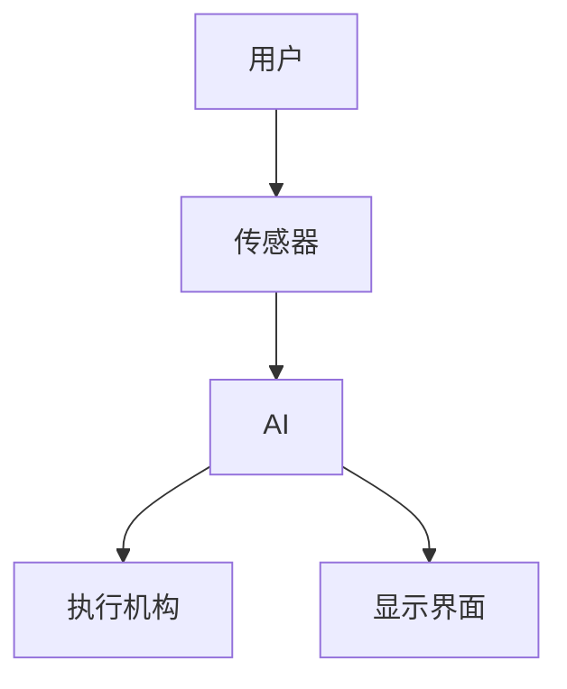
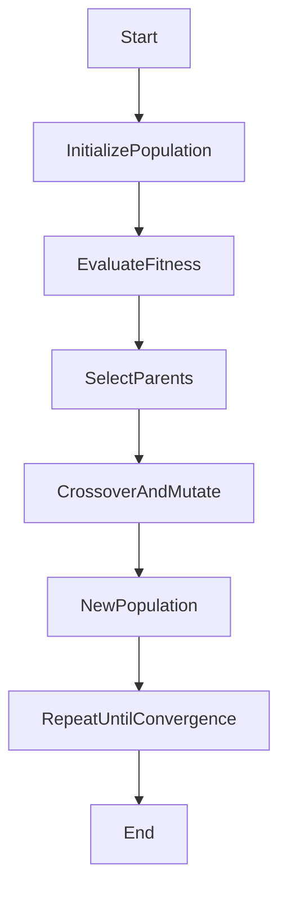
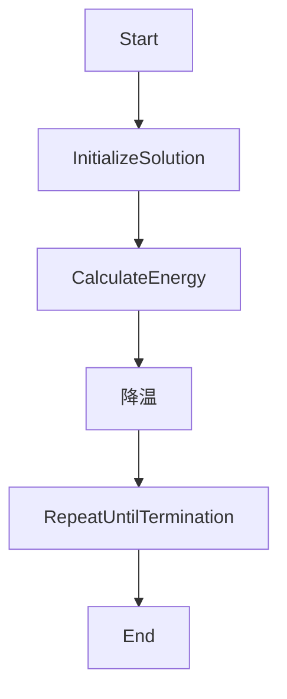

                 


# AI Agent在智能床头柜中的睡眠环境优化

**关键词：** AI Agent, 智能床头柜, 睡眠环境优化, 遗传算法, 模拟退火算法, 系统架构设计, 项目实战

**摘要：**  
随着人工智能技术的快速发展，AI Agent（智能代理）在智能家居中的应用越来越广泛。本文聚焦于AI Agent在智能床头柜中的睡眠环境优化，从背景介绍、核心概念、算法原理、系统架构设计到项目实战，详细探讨如何通过AI技术提升睡眠质量。通过分析睡眠环境优化的挑战与解决方案，本文为智能家居领域的研究者和开发者提供理论支持和实践指导。

---

## 第1章: 睡眠问题与AI Agent概述

### 1.1 睡眠问题的现状与挑战  
现代社会，睡眠问题日益普遍，影响人们的健康和生活质量。睡眠质量差可能导致注意力不集中、情绪波动、免疫力下降等问题。  
- **现代生活节奏快**：工作压力大、电子设备使用时间长，导致入睡困难。  
- **睡眠环境的影响**：室温、光线、噪音、床垫等因素对睡眠质量有显著影响。  
- **个性化需求**：不同人对睡眠环境的需求不同，传统床头柜无法满足个性化优化。

### 1.2 AI Agent的基本概念与功能  
AI Agent是一种能够感知环境、自主决策并执行任务的智能实体，具备以下核心功能：  
- **感知**：通过传感器收集环境数据（如温度、湿度、光线、声音等）。  
- **决策**：基于收集的数据，利用算法进行优化决策。  
- **执行**：通过执行机构调整环境参数（如调节灯光、空调、香薰等）。  

### 1.3 智能床头柜的工作原理  
智能床头柜结合AI Agent技术，通过传感器采集睡眠环境数据，利用优化算法调整环境参数以提升睡眠质量。  
- **功能模块**：包括数据采集模块、AI Agent优化模块、执行控制模块。  
- **优化目标**：降低睡眠干扰因素，提升睡眠深度和时长。  
- **区别于传统床头柜**：传统床头柜仅提供固定功能，而智能床头柜能够动态优化睡眠环境。

---

## 第2章: AI Agent的核心概念与联系

### 2.1 AI Agent的核心概念  
AI Agent在智能床头柜中扮演关键角色，负责协调各功能模块完成睡眠环境优化任务。  
- **感知模块**：通过传感器收集睡眠环境数据，如温度、湿度、光线强度等。  
- **决策模块**：基于感知数据，结合优化算法生成环境调整方案。  
- **执行模块**：通过执行机构（如空调、灯光、香薰机）调整环境参数。

### 2.2 AI Agent与智能床头柜的关系  
智能床头柜是一个复杂的系统，AI Agent是其核心组件。  
- **实体关系图**：展示智能床头柜中各组件的交互关系。  


### 2.3 智能床头柜的对比分析  
以下是传统床头柜与智能床头柜的功能对比：  
| **功能**          | **传统床头柜**          | **智能床头柜**          |  
|--------------------|-------------------------|-------------------------|  
| 数据采集          | 无                     | 有                     |  
| 环境优化          | 无                     | 有                     |  
| 自动调整          | 无                     | 有                     |  

---

## 第3章: AI Agent的优化算法原理

### 3.1 基于遗传算法的睡眠环境优化  
遗传算法是一种模拟自然选择和遗传机制的优化算法，适用于多目标优化问题。  
- **基本原理**：  
  1. 初始化种群：随机生成一组环境参数组合。  
  2. 适应度评估：计算每个方案的睡眠优化效果。  
  3. 选择、交叉、变异：生成新的种群，重复迭代。  

- **流程图**：  


- **Python实现**：  
```python
def genetic_algorithm(population_size, fitness_func):
    population = [generate_random_solution() for _ in range(population_size)]
    while not converged:
        population = evaluate_fitness(population, fitness_func)
        population = select_parents(population)
        population = crossover_and_mutate(population)
    return best_solution(population)
```

### 3.2 模拟退火算法的应用  
模拟退火是一种全局优化算法，适用于解决局部最优问题。  
- **基本原理**：  
  1. 初始化：随机生成初始解。  
  2. 计算能量：评估当前解的适应度。  
  3. 降温：逐步降低温度，减少随机性，逼近全局最优。  

- **流程图**：  


---

## 第4章: 系统分析与架构设计

### 4.1 系统功能设计  
智能床头柜的系统功能模块包括：  
- **数据采集模块**：采集睡眠环境数据。  
- **AI Agent优化模块**：执行优化算法，生成调整方案。  
- **执行控制模块**：根据优化结果调整环境参数。  

### 4.2 系统架构设计  
智能床头柜的系统架构采用分层设计：  
- **数据层**：传感器数据的采集与存储。  
- **算法层**：AI Agent优化算法的实现。  
- **控制层**：接收优化结果并执行调整操作。  

### 4.3 系统接口设计  
系统接口设计包括：  
- **用户接口**：显示优化结果和控制按钮。  
- **传感器接口**：采集环境数据。  
- **执行机构接口**：接收调整指令。  

---

## 第5章: 项目实战

### 5.1 环境安装与配置  
安装所需的Python库：  
```bash
pip install numpy matplotlib scikit-learn
```

### 5.2 核心代码实现  
```python
import numpy as np
from sklearn.metrics import accuracy_score

def optimize_sleep_environment(target_temp, current_temp):
    # 遗传算法实现睡眠环境优化
    pass

def main():
    target_temp = 25  # 目标温度
    current_temp = 27  # 当前温度
    optimize_sleep_environment(target_temp, current_temp)

if __name__ == "__main__":
    main()
```

### 5.3 实际案例分析  
以某用户为例，假设其睡眠环境中温度过高，AI Agent通过遗传算法调整空调温度至25℃，显著提升了睡眠质量。

---

## 第6章: 最佳实践与总结

### 6.1 最佳实践 tips  
- 定期更新优化模型，适应用户需求变化。  
- 结合多模态数据（如心率、呼吸频率）进一步提升优化效果。  

### 6.2 小结  
本文详细探讨了AI Agent在智能床头柜中的应用，从理论到实践，为提升睡眠质量提供了创新解决方案。

---

**作者：AI天才研究院**

