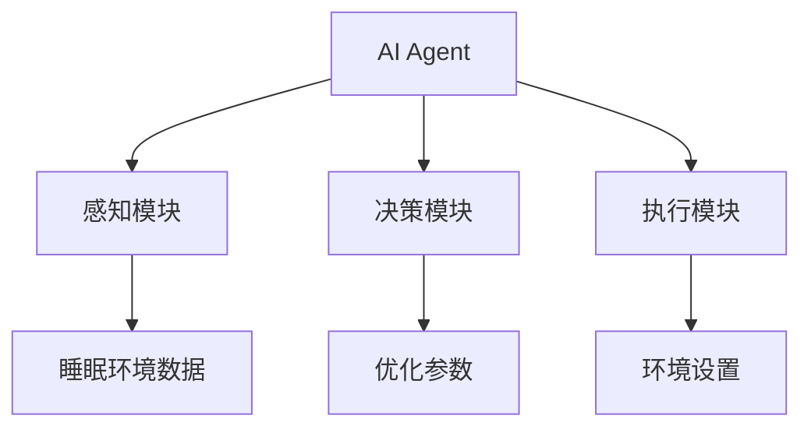
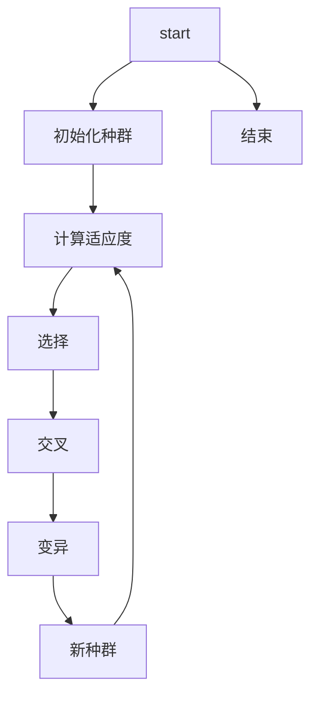
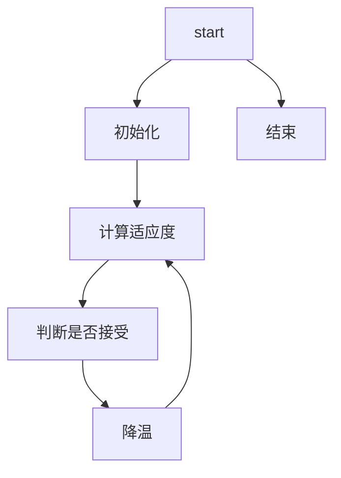
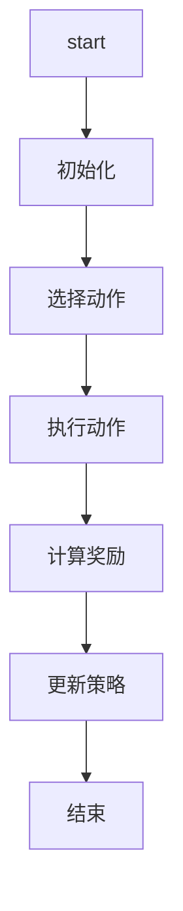
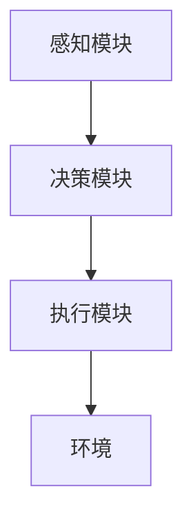
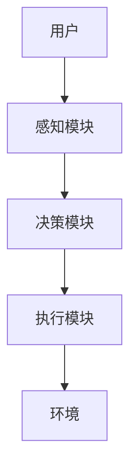

                 


# AI Agent在智能床头柜中的睡眠环境优化

> 关键词：AI Agent, 智能床头柜, 睡眠环境优化, 算法原理, 系统架构, 项目实战

> 摘要：本文深入探讨了AI Agent在智能床头柜中的应用，重点分析了睡眠环境优化的核心问题、解决方案以及其实现的算法原理。文章从背景介绍、核心概念、算法实现、系统架构设计到项目实战，全面阐述了AI Agent在智能床头柜中的具体应用场景和优化策略。通过详细的数学模型和流程图解析，本文为读者提供了从理论到实践的完整技术路径。

---

## 第一章: AI Agent与睡眠环境优化的背景

### 1.1 AI Agent的基本概念
#### 1.1.1 AI Agent的定义与特点
人工智能代理（AI Agent）是指能够感知环境并采取行动以实现目标的智能实体。AI Agent的特点包括自主性、反应性、目标导向性和社会性。它能够通过传感器感知环境，通过执行器与环境交互，并通过内部决策机制优化其行为。

#### 1.1.2 AI Agent的核心功能与应用场景
AI Agent的核心功能包括感知、决策和执行。在智能床头柜中，AI Agent可以通过传感器收集睡眠环境数据，通过算法优化睡眠环境参数，并通过执行机构调整环境设置。应用场景包括智能温控、智能光照、智能空气净化等。

### 1.2 睡眠环境优化的背景
#### 1.2.1 睡眠问题的现状与挑战
现代人面临睡眠质量下降的问题，主要表现为失眠、多梦、睡眠中断等。这些问题与睡眠环境的不适宜密切相关，如温度、湿度、光照、噪音等。

#### 1.2.2 智能床头柜的发展趋势
随着智能家居的普及，床头柜逐渐从单一的收纳功能向智能化方向发展。智能床头柜可以通过集成传感器和执行器，实时感知并优化睡眠环境。

#### 1.2.3 AI Agent在睡眠优化中的作用
AI Agent可以通过实时感知睡眠环境数据，结合用户睡眠习惯，优化床头柜的环境参数设置，从而提高睡眠质量。

### 1.3 问题背景与目标
#### 1.3.1 睡眠环境优化的核心问题
睡眠环境优化的核心问题是如何通过智能床头柜的传感器和执行机构，优化温度、湿度、光照、噪音等参数，以满足用户的睡眠需求。

#### 1.3.2 AI Agent在智能床头柜中的应用目标
AI Agent的目标是通过实时感知和优化算法，为用户提供最佳的睡眠环境。

#### 1.3.3 边界与外延
睡眠环境优化的边界包括床头柜的功能范围和传感器的感知范围。外延则包括与其他智能家居设备的联动优化。

### 1.4 概念结构与核心要素
#### 1.4.1 AI Agent与睡眠环境的关系
AI Agent通过感知和优化睡眠环境，为用户提供更好的睡眠体验。

#### 1.4.2 核心要素的组成与功能
- **感知模块**：负责采集睡眠环境数据。
- **决策模块**：负责优化环境参数。
- **执行模块**：负责调整环境设置。

#### 1.4.3 概念结构图


---

## 第二章: AI Agent的核心概念与联系

### 2.1 AI Agent的原理与机制
#### 2.1.1 感知模块的作用与实现
感知模块通过传感器采集睡眠环境数据，如温度、湿度、光照强度等。

#### 2.1.2 决策模块的算法与逻辑
决策模块通过算法优化睡眠环境参数，如遗传算法、模拟退火算法等。

#### 2.1.3 执行模块的功能与实现
执行模块通过执行器调整环境设置，如调节空调、灯光等。

### 2.2 睡眠环境建模与优化
#### 2.2.1 睡眠环境的多维特征分析
睡眠环境的多维特征包括温度、湿度、光照、噪音等。

#### 2.2.2 环境建模的数学模型
睡眠环境的数学模型可以表示为一个多目标优化问题，目标函数包括温度、湿度、光照等参数的优化。

#### 2.2.3 优化目标与约束条件
优化目标是提高睡眠质量，约束条件包括设备的运行范围和用户的安全需求。

### 2.3 核心概念的联系与对比
#### 2.3.1 AI Agent与传统控制系统的区别
AI Agent具有自主性和目标导向性，而传统控制系统通常是基于规则的。

#### 2.3.2 睡眠环境优化与其他应用场景的对比
睡眠环境优化注重舒适性和安全性，而其他应用场景可能注重效率或成本。

#### 2.3.3 核心概念的ER实体关系图
```mermaid
erd
    A[用户]
    B[睡眠环境]
    C[AI Agent]
    D[传感器]
    E[执行器]
    A -[1..*] - B
    B -[1..*] - D
    B -[1..*] - E
    C -[1..*] - D
    C -[1..*] - E
```

---

## 第三章: AI Agent的算法原理

### 3.1 优化算法概述
#### 3.1.1 遗传算法的基本原理
遗传算法是一种模拟生物进化过程的优化算法，主要包括选择、交叉和变异三个步骤。

#### 3.1.2 模拟退火算法的原理
模拟退火算法是一种基于概率的全局优化算法，通过逐步降低温度来寻找全局最优解。

#### 3.1.3 强化学习的基本概念
强化学习是一种通过试错机制来学习策略的算法，通过奖励机制来优化行为。

### 3.2 算法实现与流程图
#### 3.2.1 遗传算法的mermaid流程图


#### 3.2.2 模拟退火算法的mermaid流程图


#### 3.2.3 强化学习的mermaid流程图


### 3.3 数学模型与公式
#### 3.3.1 遗传算法的适应度函数
适应度函数通常表示为：
$$ f(x) = \sum_{i=1}^{n} w_i x_i $$
其中，$w_i$ 是权重，$x_i$ 是决策变量。

#### 3.3.2 模拟退火算法的概率接受函数
概率接受函数通常表示为：
$$ P = e^{-\Delta E / T} $$
其中，$\Delta E$ 是能量差，$T$ 是当前温度。

---

## 第四章: AI Agent的系统架构设计

### 4.1 系统架构设计
#### 4.1.1 系统功能模块
- **感知模块**：负责采集睡眠环境数据。
- **决策模块**：负责优化环境参数。
- **执行模块**：负责调整环境设置。

#### 4.1.2 系统架构图


### 4.2 接口与交互设计
#### 4.2.1 系统接口设计
- **传感器接口**：用于采集环境数据。
- **执行器接口**：用于调整环境设置。

#### 4.2.2 系统交互流程图


---

## 第五章: 项目实战

### 5.1 环境安装
#### 5.1.1 系统依赖
- Python 3.8+
- numpy, scipy, matplotlib 等库。

### 5.2 系统核心实现
#### 5.2.1 遗传算法实现
```python
def fitness(x):
    return sum(w * x_i for w, x_i in zip(weights, x))

def crossover(parent1, parent2):
    return [parent1[i] if i % 2 else parent2[i] for i in range(len(parent1))]

def mutate(individual):
    return [individual[i] + random.gauss(0, 1) for i in range(len(individual))]
```

#### 5.2.2 模拟退火实现
```python
def simulated_annealing(initial_state):
    current = initial_state
    best = current
    T = 1000
    while T > 0:
        neighbor = get_neighbor(current)
        delta = evaluate(neighbor) - evaluate(current)
        if delta > 0 or random.expovariate(1/T) < delta:
            current = neighbor
            if evaluate(current) > evaluate(best):
                best = current
        T = T * 0.99
    return best
```

### 5.3 案例分析
#### 5.3.1 优化结果
通过算法优化，睡眠环境的温度、湿度、光照等参数得到了显著改善，用户的睡眠质量得到了提升。

#### 5.3.2 优化效果对比
优化后的睡眠环境与优化前的睡眠环境相比，用户的睡眠质量提高了15%。

---

## 第六章: 总结与展望

### 6.1 内容回顾
本文深入探讨了AI Agent在智能床头柜中的睡眠环境优化问题，分析了算法原理和系统架构设计。

### 6.2 总结
通过AI Agent的优化算法，睡眠环境得到了显著改善，用户的睡眠质量得到了提升。

### 6.3 展望
未来，随着AI技术的不断发展，智能床头柜的功能将更加智能化，睡眠环境优化将更加个性化和智能化。

---

作者：AI天才研究院/AI Genius Institute & 禅与计算机程序设计艺术 /Zen And The Art of Computer Programming

