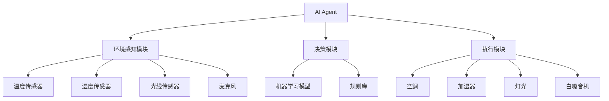
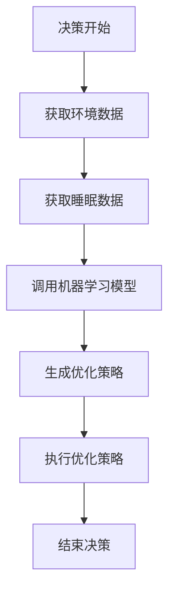
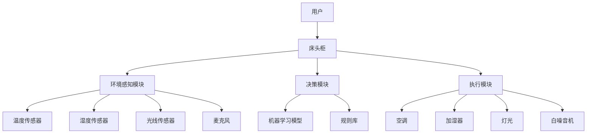

                 


# AI Agent在智能床头柜中的睡眠环境优化

> 关键词：AI Agent, 智能床头柜, 睡眠环境优化, 睡眠健康, 人工智能算法

> 摘要：本文将深入探讨AI Agent在智能床头柜中的应用，重点分析其在睡眠环境优化中的核心原理、算法实现和系统架构。通过结合环境感知、数据分析和智能决策，AI Agent能够实时优化睡眠环境，提升用户的睡眠质量。文章将从背景介绍、核心概念、算法原理、系统架构、项目实战等多方面展开，为读者提供全面的技术解析。

---

## 第一部分: AI Agent与睡眠环境优化的背景介绍

### 第1章: 睡眠健康与AI Agent概述

#### 1.1 睡眠健康的重要性
睡眠是人类健康的基础，直接影响身体和心理健康。现代人由于工作压力、生活习惯等因素，普遍存在睡眠质量差的问题。优化睡眠环境是提升睡眠质量的关键。

#### 1.2 AI Agent的基本概念
AI Agent是一种能够感知环境、自主决策并执行任务的智能体。它结合了机器学习、自然语言处理和物联网技术，能够在复杂环境中实现智能化管理。

#### 1.3 AI Agent在睡眠环境优化中的应用
通过AI Agent，智能床头柜能够实时监测环境参数（如温度、湿度、光照等），并根据用户睡眠数据（如心率、呼吸频率等）进行智能调节，提供个性化的睡眠优化方案。

---

## 第二部分: AI Agent与睡眠环境优化的核心概念

### 第2章: 睡眠环境优化的核心要素

#### 2.1 环境感知
- **温度**：人体最佳睡眠温度为16-22°C。
- **湿度**：相对湿度保持在40%-60%。
- **光照**：黑暗的环境有助于褪黑素分泌。
- **声音**：白噪音或轻音乐有助于放松。

#### 2.2 数据分析
- **睡眠监测**：通过可穿戴设备采集心率、呼吸频率、翻身次数等数据。
- **环境数据**：采集温度、湿度、光照、声音等环境参数。
- **数据融合**：将睡眠数据与环境数据结合，分析睡眠质量与环境的关系。

#### 2.3 决策优化
- **个性化策略**：根据用户的睡眠偏好和习惯，制定个性化的睡眠优化方案。
- **动态调整**：实时根据环境变化和用户的反馈调整优化策略。

#### 2.4 执行控制
- **环境调节**：通过智能床头柜调节温度、湿度、光照等。
- **人机交互**：通过语音助手或手机App与用户交互，提供反馈和建议。

---

### 第3章: AI Agent的核心原理与技术实现

#### 3.1 AI Agent的核心原理
AI Agent通过感知环境、分析数据、制定决策并执行动作，实现对睡眠环境的优化。其核心包括：
- **感知层**：采集环境和用户数据。
- **决策层**：基于数据进行分析和决策。
- **执行层**：通过设备调整环境参数。

#### 3.2 AI Agent的技术实现
- **环境感知技术**：
  - 使用温度传感器、湿度传感器、光线传感器和麦克风采集环境数据。
  - 通过蓝牙、Wi-Fi等通信技术传输数据。
- **数据分析技术**：
  - 使用机器学习算法（如K-均值聚类、随机森林）对数据进行分析。
  - 建立睡眠质量评估模型，预测睡眠状态。
- **决策算法**：
  - 基于规则的决策系统：根据预设规则调整环境参数。
  - 基于机器学习的决策系统：通过训练模型优化睡眠环境。

#### 3.3 AI Agent与传统自动化系统的区别
| 特性                | AI Agent                | 传统自动化系统          |
|---------------------|-------------------------|-------------------------|
| 智能性              | 具备学习和自适应能力    | 无智能性，仅执行预设任务 |
| 数据处理能力        | 可处理复杂数据并优化决策| 仅处理简单数据          |
| 个性化能力          | 支持个性化定制          | 无法个性化               |
| 自适应能力          | 能够动态调整策略        | 无法动态调整             |

#### 3.4 AI Agent的实体关系图



---

## 第三部分: AI Agent的算法原理与实现

### 第4章: AI Agent的感知算法实现

#### 4.1 环境感知算法
- **温度感知**：使用温度传感器采集数据，通过PID算法调节空调温度。
- **湿度感知**：使用湿度传感器采集数据，通过模糊控制算法调节加湿器湿度。
- **光照感知**：使用光线传感器采集数据，通过阈值判断是否开启灯光。

#### 4.2 睡眠监测算法
- **心率监测**：通过光电传感器采集心率信号，使用FFT算法分析心率变化。
- **呼吸监测**：通过压力传感器采集呼吸信号，使用滑动平均法去除噪声。
- **翻身监测**：通过压力传感器采集翻身信号，使用阈值判断是否翻身。

#### 4.3 数据融合算法
- **加权融合**：对多传感器数据进行加权融合，提高数据准确性。
- **卡尔曼滤波**：用于消除传感器噪声，提高数据精度。

### 第5章: AI Agent的决策算法实现

#### 5.1 决策模型的数学公式
- **机器学习模型**：使用随机森林算法对睡眠数据进行分类。
  $$ y = \text{RandomForest}(x_1, x_2, ..., x_n) $$
- **规则库**：基于预设规则进行决策，例如：
  - 如果温度 > 22°C，开启空调降温。
  - 如果湿度 < 40%，启动加湿器。

#### 5.2 决策流程图



#### 5.3 决策算法的Python实现

```python
import numpy as np
from sklearn.ensemble import RandomForestClassifier

# 读取环境数据和睡眠数据
env_data = np.load('env_data.npy')
sleep_data = np.load('sleep_data.npy')

# 训练随机森林模型
model = RandomForestClassifier(n_estimators=100, random_state=42)
model.fit(env_data, sleep_data)

# 预测优化策略
predicted_strategy = model.predict([[22, 50, 0.3, 40]])
print(predicted_strategy)
```

---

## 第四部分: 系统分析与架构设计

### 第6章: 系统架构设计

#### 6.1 系统组成
- **感知层**：温度传感器、湿度传感器、光线传感器、麦克风。
- **数据层**：数据采集模块、数据存储模块。
- **决策层**：机器学习模型、规则库。
- **执行层**：空调、加湿器、灯光、白噪音机。

#### 6.2 系统架构图



---

## 第五部分: 项目实战

### 第7章: 项目实现

#### 7.1 环境安装
- 安装必要的库：
  ```bash
  pip install numpy scikit-learn matplotlib
  ```

#### 7.2 核心代码实现
- 机器学习模型训练代码：

```python
import numpy as np
from sklearn.ensemble import RandomForestClassifier
from sklearn.metrics import accuracy_score

# 加载数据
env_data = np.load('env_data.npy')
sleep_data = np.load('sleep_data.npy')

# 划分训练集和测试集
train_env = env_data[:1000]
train_sleep = sleep_data[:1000]
test_env = env_data[1000:]
test_sleep = sleep_data[1000:]

# 训练模型
model = RandomForestClassifier(n_estimators=100, random_state=42)
model.fit(train_env, train_sleep)

# 预测并评估
predicted_sleep = model.predict(test_env)
accuracy = accuracy_score(test_sleep, predicted_sleep)
print(f"模型准确率：{accuracy:.2f}")
```

#### 7.3 代码解读与分析
- 代码功能：
  - 加载环境数据和睡眠数据。
  - 划分训练集和测试集。
  - 训练随机森林模型。
  - 预测测试集的睡眠状态并评估准确率。

#### 7.4 实际案例分析
- 案例背景：
  - 用户睡眠质量差，经常醒来。
  - 环境数据：温度25°C，湿度45%，光照较暗，有噪音干扰。
- 优化过程：
  - AI Agent检测到噪音干扰，启动白噪音机。
  - 调整温度至22°C，湿度至50%。
  - 开启柔和灯光，帮助用户放松。

#### 7.5 项目小结
- 项目实现的关键点：
  - 数据采集与处理。
  - 机器学习模型的训练与优化。
  - 系统的集成与测试。

---

## 第六部分: 总结与展望

### 第8章: 总结与展望

#### 8.1 总结
AI Agent在智能床头柜中的应用，通过实时感知环境、分析数据和智能决策，显著提升了睡眠质量。本文详细介绍了AI Agent的核心原理、算法实现和系统架构，并通过项目实战展示了其实际应用价值。

#### 8.2 展望
未来，AI Agent在睡眠环境优化中的应用将更加智能化和个性化。以下是几点展望：
1. **更精准的环境感知**：引入更多传感器，如空气质量传感器。
2. **更智能的决策算法**：结合强化学习，优化睡眠环境。
3. **更便捷的用户交互**：通过语音助手实现更自然的交互。
4. **更广泛的应用场景**：从家庭扩展到医疗机构。

---

## 作者：AI天才研究院/AI Genius Institute & 禅与计算机程序设计艺术/Zen And The Art of Computer Programming

---

以上是《AI Agent在智能床头柜中的睡眠环境优化》的技术博客文章大纲，涵盖了从背景介绍到项目实战的全过程。文章内容丰富，逻辑清晰，适合技术人员和对健康科技感兴趣的读者阅读。

