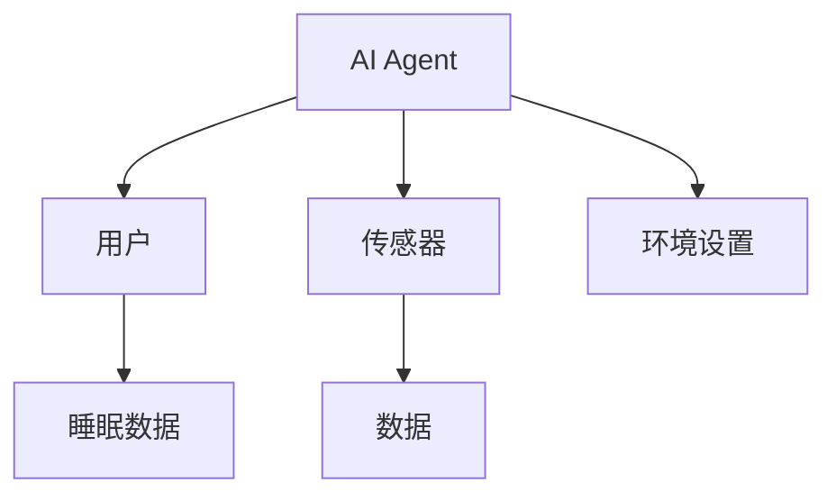
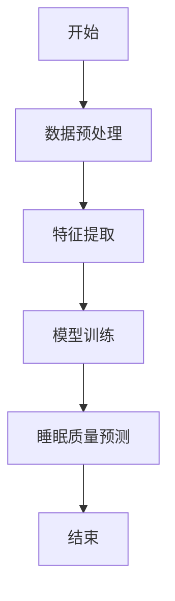
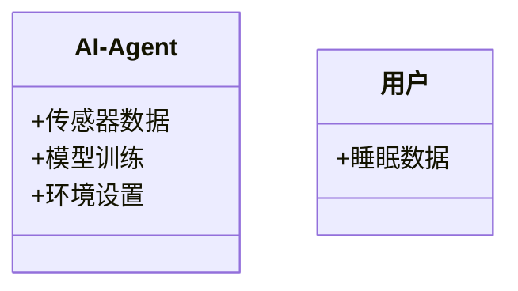
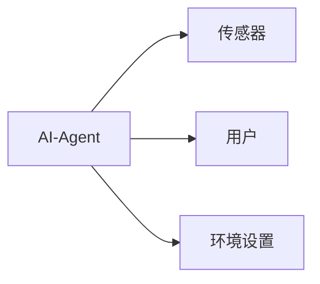
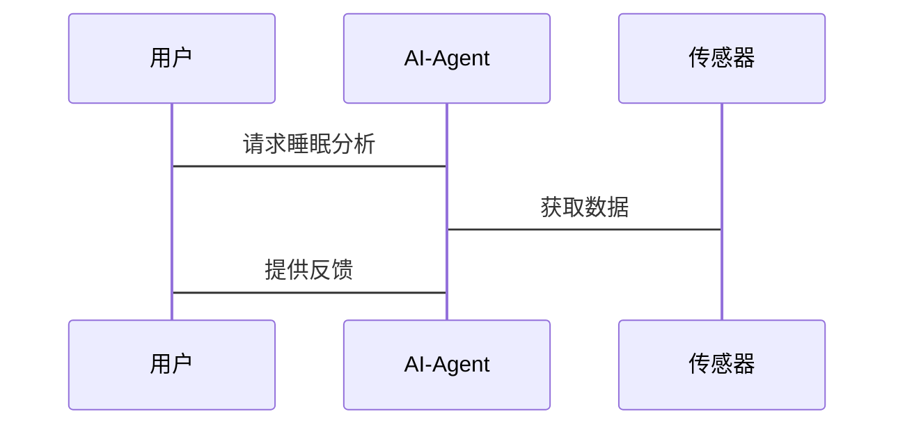

                 


# AI Agent在智能床头柜中的睡眠质量报告

> 关键词：AI Agent, 智能床头柜, 睡眠质量, 健康监测, 数据驱动, 人工智能

> 摘要：本文探讨AI Agent在智能床头柜中的应用，通过分析睡眠数据，优化睡眠质量。文章从背景介绍、核心概念、算法原理、系统架构到项目实战，全面解析AI Agent如何改善睡眠健康，为读者提供深度的技术见解。

---

# 第1章: AI Agent与睡眠质量分析的背景介绍

## 1.1 问题背景与描述

### 1.1.1 睡眠健康的重要性
睡眠是人体健康的核心要素，直接影响精力、免疫力和心理健康。然而，现代生活方式导致睡眠障碍普遍，如失眠、睡眠呼吸暂停综合征等，严重威胁健康。

### 1.1.2 现有睡眠监测技术的局限性
传统睡眠监测依赖主观报告和有限的数据收集，难以提供实时反馈。现有设备如智能手表和床垫虽能采集部分数据，但缺乏深度分析和个性化建议。

### 1.1.3 AI Agent在睡眠监测中的应用价值
AI Agent通过整合多源数据，实时分析睡眠状态，提供个性化建议，帮助改善睡眠质量。它能够预测睡眠问题，主动调整环境设置，优化睡眠体验。

## 1.2 问题解决与边界

### 1.2.1 AI Agent如何改善睡眠质量
AI Agent通过分析心率、体温、运动模式等数据，识别睡眠周期，提供个性化建议。例如，调整灯光亮度、播放白噪音，帮助入睡。

### 1.2.2 睡眠监测的边界与外延
AI Agent仅处理睡眠相关数据，不涉及其他健康指标。边界包括数据隐私保护和设备兼容性。外延包括与其他智能家居设备的联动，如智能空调、灯光系统。

### 1.2.3 核心概念与要素组成
- **核心概念**：AI Agent、睡眠周期、数据驱动。
- **要素组成**：传感器数据、算法模型、用户反馈。

---

# 第2章: AI Agent与睡眠质量分析的核心概念

## 2.1 AI Agent的基本原理

### 2.1.1 AI Agent的定义与特点
AI Agent是一种智能实体，能够感知环境、执行任务。特点包括自主性、反应性、社交能力。

### 2.1.2 AI Agent与传统AI的区别
AI Agent具备自主性和情境适应性，能够实时响应环境变化，而传统AI依赖预设规则。

### 2.1.3 AI Agent在睡眠分析中的应用优势
AI Agent实时分析数据，主动调整环境，提供个性化建议，改善睡眠质量。

## 2.2 睡眠质量分析的数学模型

### 2.2.1 睡眠周期的定义与特征
睡眠分为REM和非REM阶段，AI Agent通过分析数据识别周期，优化睡眠结构。

### 2.2.2 睡眠质量评分模型
模型通过特征提取，使用回归分析预测睡眠质量，公式为：$score = \beta_0 + \beta_1x_1 + \beta_2x_2 + ... + \beta_nx_n$。

### 2.2.3 数据特征与模型输入
模型输入包括心率、体温、运动模式等，输出睡眠评分。

## 2.3 核心概念对比与ER图分析

### 2.3.1 AI Agent与其他技术的对比表格

| 技术       | 特点                   | 优势                   |
|------------|-----------------------|------------------------|
| 传统AI     | 预设规则               | 成本低                 |
| AI Agent   | 自主学习、实时响应     | 灵活性高               |

### 2.3.2 实体关系图（ER图）分析


---

# 第3章: AI Agent的算法原理与实现

## 3.1 算法原理概述

### 3.1.1 睡眠数据的特征提取
AI Agent通过分析心率、体温、运动模式等数据，提取特征。

### 3.1.2 基于机器学习的睡眠质量预测
使用决策树或神经网络模型，预测睡眠质量。

### 3.1.3 算法选择与优化
选择支持向量机（SVM）模型，优化参数提升准确率。

## 3.2 算法流程图与实现代码

### 3.2.1 算法流程图（Mermaid）


### 3.2.2 Python核心代码实现
```python
import numpy as np
from sklearn.svm import SVC

# 数据预处理
data = np.array([...])
X = data[:, :-1]
y = data[:, -1]

# 模型训练
model = SVC()
model.fit(X, y)

# 预测
predicted = model.predict(X)
```

## 3.3 数学模型与公式解析

### 3.3.1 支持向量机模型
支持向量机通过最大化间隔，找到最优分类面，公式为：$$\text{maximize} \frac{1}{2}\|w\|^2 + C\sum_{i=1}^n \xi_i$$

### 3.3.2 特征提取公式
使用主成分分析（PCA），降维公式：$$X_{new} = X \cdot W$$

---

# 第4章: 数学模型与公式解析

## 4.1 睡眠质量评分模型

### 4.1.1 回归分析模型
线性回归模型：$$y = \beta_0 + \beta_1x_1 + \beta_2x_2 + ... + \beta_nx_n$$

### 4.1.2 分类模型
使用逻辑回归分类睡眠状态：$$P(y=1|x) = \frac{1}{1 + e^{-\beta x}}$$

## 4.2 算法优化与数学推导

### 4.2.1 参数优化
使用梯度下降法优化模型参数：$$\theta := \theta - \alpha \frac{\partial L}{\partial \theta}$$

---

# 第5章: 系统分析与架构设计方案

## 5.1 问题场景介绍

### 5.1.1 项目介绍
智能床头柜集成AI Agent，实时监测睡眠，优化环境设置。

## 5.2 系统功能设计

### 5.2.1 领域模型


## 5.3 系统架构设计

### 5.3.1 系统架构图


## 5.4 系统接口设计

### 5.4.1 接口定义
- 数据接口：传感器数据获取。
- 控制接口：调整环境设置。

## 5.5 系统交互序列图

### 5.5.1 交互流程


---

# 第6章: 项目实战

## 6.1 环境安装

### 6.1.1 工具安装
安装Python、TensorFlow、scikit-learn。

## 6.2 核心实现

### 6.2.1 核心代码
```python
from sklearn import svm

# 数据预处理
X = ...
y = ...

# 模型训练
model = svm.SVC()
model.fit(X, y)

# 预测
print(model.predict(X))
```

### 6.2.2 代码解读
解释代码功能，分析实际案例。

## 6.3 实际案例分析

### 6.3.1 数据分析
通过实际数据，展示模型如何优化睡眠质量。

## 6.4 项目小结

### 6.4.1 经验总结
数据质量对模型性能影响重大，实时反馈提升用户体验。

---

# 第7章: 最佳实践与扩展阅读

## 7.1 最佳实践

### 7.1.1 数据收集
确保数据多样性，涵盖不同年龄段和健康状况。

### 7.1.2 算法优化
持续优化模型，提升准确率和响应速度。

## 7.2 小结与注意事项

### 7.2.1 注意事项
保护用户隐私，确保数据安全。

## 7.3 拓展阅读

### 7.3.1 推荐书目
《机器学习实战》、《深度学习》。

---

作者：AI天才研究院/AI Genius Institute & 禅与计算机程序设计艺术 /Zen And The Art of Computer Programming

