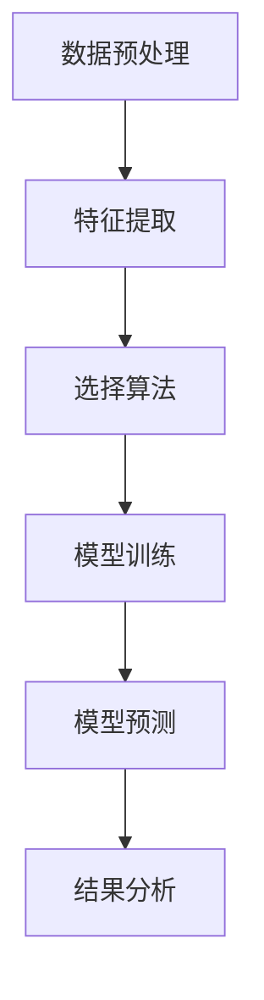
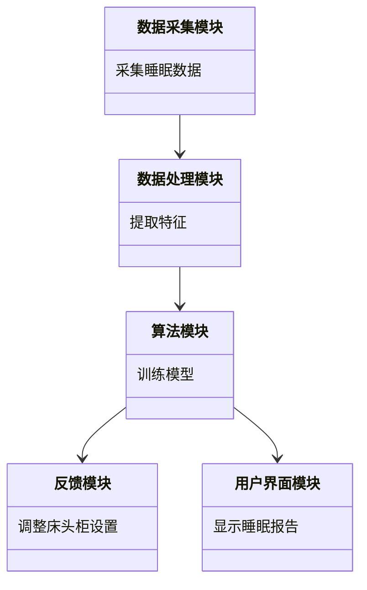
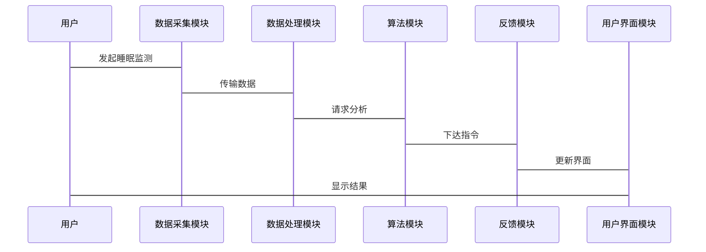

                 

# AI Agent在智能床头柜中的睡眠辅助功能

## 关键词：AI Agent，智能床头柜，睡眠辅助，算法原理，系统架构

## 摘要：本文探讨AI Agent在智能床头柜中的睡眠辅助功能，涵盖背景介绍、核心概念、算法原理、系统架构、项目实战和总结展望，详细介绍AI Agent如何通过感知、决策和执行模块实现睡眠监测与辅助。

---

## 第一章：AI Agent与智能床头柜概述

### 1.1 AI Agent的基本概念
#### 1.1.1 AI Agent的定义与特点
AI Agent是一种智能体，具备感知、决策、执行能力，能与环境交互并完成任务。特点包括主动性、反应性、学习能力和社会性。

#### 1.1.2 AI Agent的核心功能与应用场景
核心功能：感知环境、分析数据、制定策略、执行操作。应用场景广泛，如智能家居、健康监测、机器人控制等。

#### 1.1.3 智能床头柜的发展趋势
智能床头柜正向智能化、个性化和联网化发展，AI Agent的引入使其具备更多智能功能。

### 1.2 睡眠辅助功能的背景与需求
#### 1.2.1 睡眠健康的重要性
睡眠对身体健康至关重要，影响精神状态和免疫功能。

#### 1.2.2 现有睡眠辅助工具的局限性
传统睡眠辅助工具功能单一，缺乏智能化和个性化。

#### 1.2.3 AI Agent在睡眠辅助中的优势
AI Agent具备智能分析和自主决策能力，能提供个性化和精准的睡眠辅助。

### 1.3 本章小结
本章介绍了AI Agent的基本概念和智能床头柜的发展趋势，阐述了睡眠辅助的需求和AI Agent的优势。

---

## 第二章：AI Agent的核心概念与睡眠监测技术

### 2.1 AI Agent的基本原理
#### 2.1.1 感知模块：数据采集与处理
通过传感器采集睡眠数据，如心率、呼吸频率和体动频率。

#### 2.1.2 决策模块：算法与规则
使用机器学习算法分析数据，制定改善睡眠的策略。

#### 2.1.3 执行模块：反馈与优化
根据决策模块的指令，调整床头柜功能，优化睡眠环境。

### 2.2 睡眠监测技术
#### 2.2.1 睡眠监测的传感器技术
使用心率传感器、呼吸传感器和体动传感器采集数据。

#### 2.2.2 数据分析与特征提取
通过特征提取技术，识别睡眠分期和质量评估指标。

#### 2.2.3 睡眠分期与质量评估
利用AI算法对睡眠数据进行分析，评估睡眠质量并提供改进建议。

### 2.3 AI Agent与睡眠监测的结合
#### 2.3.1 数据流与信息处理流程
从数据采集到特征提取，再到模型训练和结果输出的流程。

#### 2.3.2 AI算法在睡眠辅助中的应用
使用机器学习算法对睡眠数据进行分类和预测。

#### 2.3.3 系统架构与功能模块
详细描述AI Agent在睡眠辅助中的系统架构和功能模块。

### 2.4 本章小结
本章详细介绍了AI Agent的核心概念和睡眠监测技术，解释了AI Agent如何通过感知、决策和执行模块实现睡眠辅助。

---

## 第三章：睡眠辅助算法原理

### 3.1 支持向量机（SVM）在睡眠分期中的应用
#### 3.1.1 SVM算法原理
SVM是一种监督学习算法，用于分类和回归问题。

#### 3.1.2 睡眠分期的特征提取与分类
提取睡眠数据中的特征，使用SVM进行睡眠分期分类。

#### 3.1.3 SVM模型的训练与优化
通过训练数据优化SVM模型，提高分类准确率。

#### 3.1.4 实例分析
通过实际数据训练SVM模型，展示其在睡眠分期中的应用。

### 3.2 随机森林在睡眠质量评估中的应用
#### 3.2.1 随机森林算法原理
随机森林是一种基于决策树的集成学习算法，用于分类和回归。

#### 3.2.2 睡眠质量评估的数据特征
提取影响睡眠质量的相关特征。

#### 3.2.3 随机森林模型的训练与预测
使用训练数据训练随机森林模型，并预测睡眠质量。

#### 3.2.4 模型评估与优化
评估模型性能，优化参数以提高预测准确性。

### 3.3 算法流程图

### 3.4 本章小结
本章详细介绍了SVM和随机森林在睡眠辅助中的应用，展示了如何通过这些算法实现睡眠分期和质量评估。

---

## 第四章：系统架构设计与实现

### 4.1 系统架构设计
#### 4.1.1 系统功能模块
包括数据采集模块、数据处理模块、算法模块、反馈模块和用户界面模块。

#### 4.1.2 系统架构图

### 4.2 接口设计与交互流程
#### 4.2.1 系统接口设计
定义数据采集模块与数据处理模块的接口，确保数据传输的准确性。

#### 4.2.2 交互流程
用户与床头柜交互，床头柜采集数据，处理数据并反馈结果。

#### 4.2.3 交互序列图

### 4.3 系统实现
#### 4.3.1 系统实现概述
详细描述系统的实现步骤和各模块的实现细节。

#### 4.3.2 核心代码实现
提供关键代码示例，解释其功能和作用。

### 4.4 本章小结
本章详细描述了系统架构设计，接口设计和交互流程，展示了如何实现一个完整的睡眠辅助系统。

---

## 第五章：项目实战与案例分析

### 5.1 项目实战
#### 5.1.1 环境搭建
介绍开发环境的搭建，包括硬件和软件的配置。

#### 5.1.2 代码实现
提供关键代码，解释其功能和实现细节。

#### 5.1.3 功能测试
详细描述测试过程和结果，验证系统的有效性。

### 5.2 案例分析
#### 5.2.1 实际案例
分析一个实际案例，展示系统在实际中的应用效果。

#### 5.2.2 案例分析与优化
根据案例分析结果，提出优化建议。

### 5.3 本章小结
本章通过项目实战和案例分析，展示了AI Agent在智能床头柜中的实际应用和效果。

---

## 第六章：总结与展望

### 6.1 总结
总结全文内容，重申AI Agent在睡眠辅助中的重要性和应用价值。

### 6.2 未来展望
展望未来，AI Agent在智能床头柜中的应用将更加智能化和个性化，技术将更加先进。

---

## 作者：AI天才研究院 & 禅与计算机程序设计艺术

---

通过以上内容，文章详细介绍了AI Agent在智能床头柜中的睡眠辅助功能，涵盖背景、核心概念、算法原理、系统架构、项目实战和总结展望，为读者提供了全面的技术解读和实践指导。

