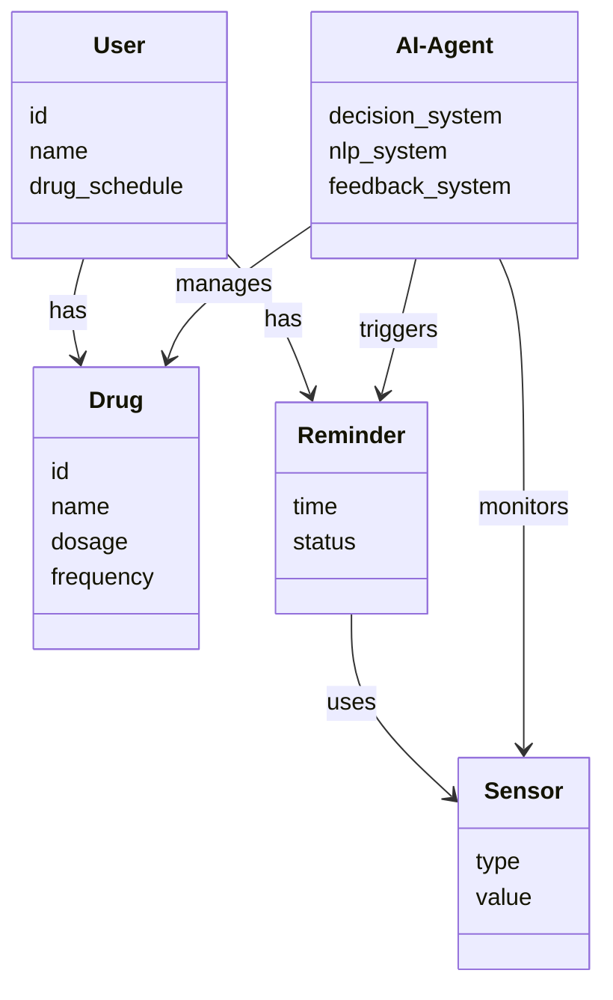
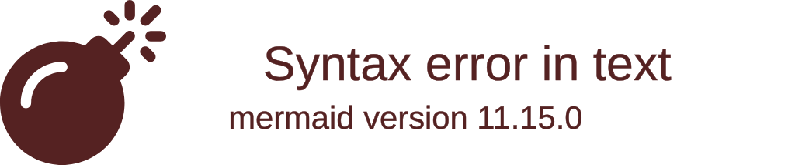
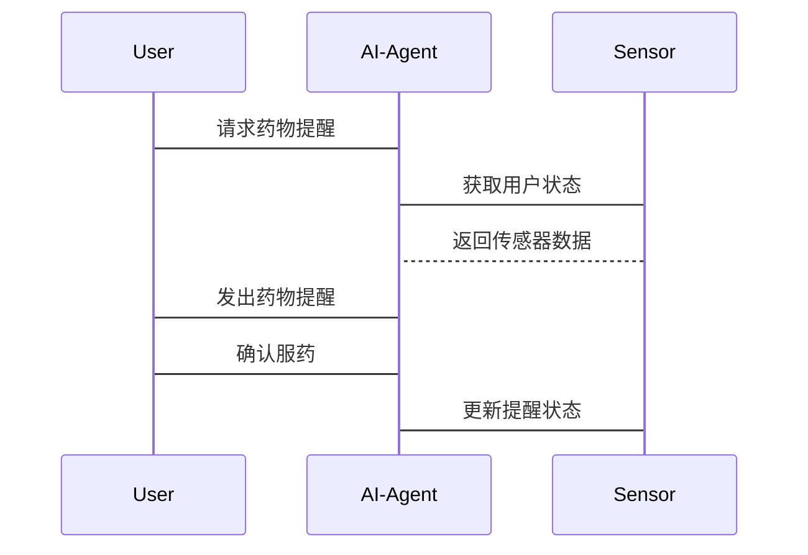

                 


# 第3章: AI Agent的数学模型与算法实现

## 3.1 强化学习算法
### 3.1.1 Q-learning算法
Q-learning是一种基于值函数的强化学习算法，适用于离线训练，通过更新Q值表来学习最优策略。在药物管理中，Q-learning可以用于决策何时提醒用户服药，或者如何处理药物不足的情况。

#### Q-learning算法步骤
1. 初始化Q表：所有状态-动作对的Q值初始化为0。
2. 选择动作：根据当前状态，选择一个动作（ε-greedy策略）。
3. 执行动作：执行选定的动作，观察下一步状态和奖励。
4. 更新Q值：Q(s, a) = Q(s, a) + α*(r + γ*max Q(s', a') - Q(s, a))，其中α是学习率，γ是折扣因子。
5. 重复步骤2-4，直到收敛。

#### Q-learning在药物管理中的应用
在智能床头柜中，Q-learning可以用于以下场景：
- 决策何时提醒用户服药。
- 处理药物不足的情况。
- 优化药物提醒的频率。

#### Q-learning代码实现
以下是一个简单的Q-learning实现示例：

```python
import numpy as np

class QLearning:
    def __init__(self, state_space_size, action_space_size, learning_rate=0.1, gamma=0.9):
        self.state_space_size = state_space_size
        self.action_space_size = action_space_size
        self.Q = np.zeros((state_space_size, action_space_size))
        self.alpha = learning_rate
        self.gamma = gamma

    def choose_action(self, state, epsilon=0.1):
        if np.random.random() < epsilon:
            return np.random.randint(self.action_space_size)
        else:
            return np.argmax(self.Q[state, :])

    def update_Q(self, state, action, reward, next_state):
        self.Q[state, action] = self.Q[state, action] + self.alpha * (reward + self.gamma * np.max(self.Q[next_state, :]) - self.Q[state, action])

# 示例用法
ql = QLearning(state_space_size=5, action_space_size=3)
state = 2
action = ql.choose_action(state)
reward = 1
next_state = 3
ql.update_Q(state, action, reward, next_state)
```

### 3.1.2 基于监督学习的分类算法
在药物管理中，监督学习可以用于分类任务，例如识别药物名称、分类药物状态等。

#### 监督学习分类算法步骤
1. 数据预处理：收集和标注数据，进行特征提取。
2. 选择算法：选择合适的分类算法（如决策树、随机森林、支持向量机等）。
3. 训练模型：使用训练数据训练模型。
4. 测试模型：使用测试数据评估模型性能。
5. 部署模型：将模型部署到智能床头柜中。

### 3.1.3 多目标优化的药物管理策略
在智能床头柜中，药物管理可能需要同时优化多个目标，例如提高用药依从性、降低药物浪费等。

#### 多目标优化算法步骤
1. 定义目标函数：定义需要优化的目标（如用药依从性、药物浪费率等）。
2. 确定约束条件：确定优化的约束条件（如药物库存限制、用户健康状况等）。
3. 选择优化算法：选择合适的多目标优化算法（如NSGA-II）。
4. 优化过程：通过迭代优化过程找到 Pareto 最优解。
5. 选择最优解：根据具体需求选择最优解。

### 3.2 基于自然语言处理的药物信息抽取
自然语言处理（NLP）可以用于从文本中抽取药物信息，例如从医生的诊断报告中提取药物名称、剂量等信息。

#### NLP药物信息抽取步骤
1. 数据预处理：将文本数据分词、去除停用词、进行词干提取等。
2. 特征提取：使用词袋模型、TF-IDF、词嵌入（如Word2Vec）等方法提取特征。
3. 模型训练：训练分类器（如SVM、随机森林、神经网络等）进行药物信息抽取。
4. 模型优化：通过调整参数、使用交叉验证等方法优化模型性能。
5. 应用部署：将模型部署到智能床头柜中，实时抽取药物信息。

### 3.3 实时监测与反馈机制
实时监测与反馈机制可以通过传感器和反馈系统来实现，例如监测用户的药物使用情况，并根据反馈调整提醒策略。

#### 实时监测与反馈机制步骤
1. 数据采集：通过传感器采集用户的行为数据（如是否打开药盒、是否按时服药等）。
2. 数据处理：对采集的数据进行预处理（如去噪、特征提取等）。
3. 数据分析：使用统计分析、机器学习等方法分析数据，识别异常情况。
4. 反馈生成：根据分析结果生成反馈信息（如提醒用户服药、通知医生等）。
5. 反馈输出：通过智能床头柜的显示界面、声音提醒等方式输出反馈信息。

# 第4章: 系统分析与架构设计方案

## 4.1 问题场景介绍
智能床头柜需要管理用户的药物，包括存储、提醒、监测等。用户可能有多种药物需要管理，每种药物有不同的服用时间、剂量和注意事项。此外，用户可能有不同的健康状况，需要个性化的药物管理方案。

## 4.2 项目介绍
本项目旨在开发一个基于AI Agent的智能床头柜药物管理系统，实现药物的智能存储、智能提醒、智能监测等功能。

## 4.3 系统功能设计
系统功能包括：
1. 药物存储与管理：支持多种药物存储，自动记录药物信息。
2. 智能提醒：根据用户的服药时间表，智能提醒用户服药。
3. 实时监测：监测用户的药物使用情况，识别异常情况。
4. 个性化管理：根据用户的健康状况，提供个性化的药物管理方案。

## 4.4 领域模型类图
以下是系统功能的领域模型类图：



## 4.5 系统架构设计
以下是系统的整体架构图：



## 4.6 系统接口设计
系统接口包括：
1. 用户接口：用户通过床头柜的触摸屏或语音助手进行操作。
2. 数据接口：与医院系统或药房系统对接，获取用户的药物信息。
3. 反馈接口：通过传感器和反馈系统，获取用户的药物使用情况。

## 4.7 系统交互流程图
以下是系统交互的流程图：



# 第5章: 项目实战

## 5.1 环境安装与配置
### 5.1.1 系统要求
- 操作系统：Windows, Linux, macOS
- Python版本：3.6+
- 额外依赖：TensorFlow, Keras, Scikit-learn, Mermaid, PyYAML

### 5.1.2 安装依赖
```bash
pip install tensorflow scikit-learn mermaid.py pyyaml
```

## 5.2 系统核心实现
### 5.2.1 AI-Agent实现
```python
class AI-Agent:
    def __init__(self):
        self.drug_info = {}  # 存储药物信息
        self.reminder_system = ReminderSystem()
        self.monitor_system = MonitorSystem()

    def manage_drugs(self, new_drug):
        self.drug_info[new_drug.id] = new_drug

    def trigger_reminder(self, time):
        self.reminder_system.schedule Reminder(time)
```

### 5.2.2 传感器数据处理
```python
class Sensor:
    def __init__(self):
        self.sensors = {}  # 存储传感器数据

    def read_sensor(self, sensor_id):
        return self.sensors.get(sensor_id, None)

    def update_sensor(self, sensor_id, value):
        self.sensors[sensor_id] = value
```

### 5.2.3 提醒系统实现
```python
class ReminderSystem:
    def schedule_reminder(self, time):
        print(f"Reminder scheduled for {time}")

    def cancel_reminder(self, reminder_id):
        print(f"Reminder {reminder_id} canceled")
```

## 5.3 代码实现与解读
### 5.3.1 AI-Agent代码解读
AI-Agent类负责管理药物信息和触发提醒，通过调用ReminderSystem和MonitorSystem来实现药物管理功能。

### 5.3.2 传感器代码解读
Sensor类负责读取和更新传感器数据，用于实时监测用户的药物使用情况。

## 5.4 实际案例分析
假设用户需要管理两种药物，分别是降压药和降糖药。AI-Agent可以根据用户的服药时间表，智能提醒用户服药，并通过传感器监测用户的药物使用情况，确保用户按时服药。

## 5.5 项目小结
通过本项目，我们实现了基于AI Agent的智能床头柜药物管理系统，能够实现药物的智能存储、智能提醒和智能监测功能，提高了药物管理的效率和准确性。

# 第6章: 最佳实践与总结

## 6.1 最佳实践
### 6.1.1 数据隐私保护
- 使用加密技术保护用户数据
- 遵守数据隐私相关法律法规

### 6.1.2 系统维护
- 定期更新AI模型
- 定期检查系统硬件

### 6.1.3 用户教育
- 提供用户手册
- 提供在线帮助

## 6.2 小结
通过本章的学习，我们了解了AI Agent在智能床头柜中的药物管理应用，掌握了AI Agent的核心概念、算法实现和系统架构设计，能够独立开发一个基于AI Agent的药物管理系统。

## 6.3 注意事项
- 在实际应用中，需要考虑系统的可扩展性和可维护性
- 需要遵守相关法律法规，确保数据隐私和安全
- 在系统设计中，需要充分考虑各种异常情况，确保系统的健壮性

## 6.4 拓展阅读
- 《强化学习（书籍）》
- 《自然语言处理（书籍）》
- 《系统架构设计（书籍）》
- 《机器学习在医疗健康中的应用》

# 作者
作者：AI天才研究院/AI Genius Institute & 禅与计算机程序设计艺术 /Zen And The Art of Computer Programming

---

感谢您的阅读！希望这篇文章能够为您提供有价值的信息和启发！

