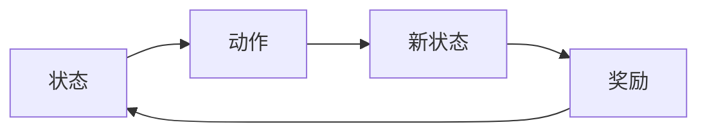
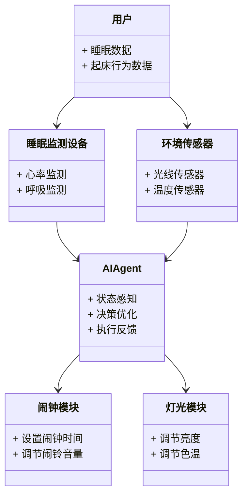
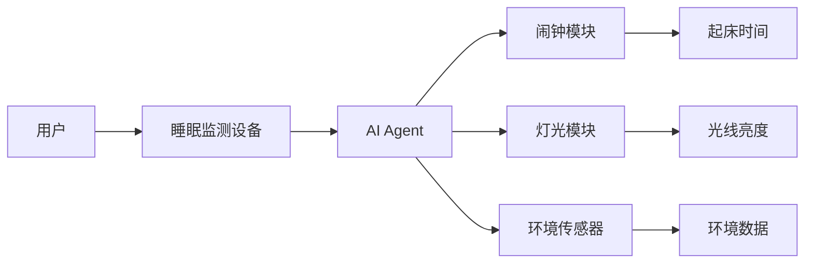
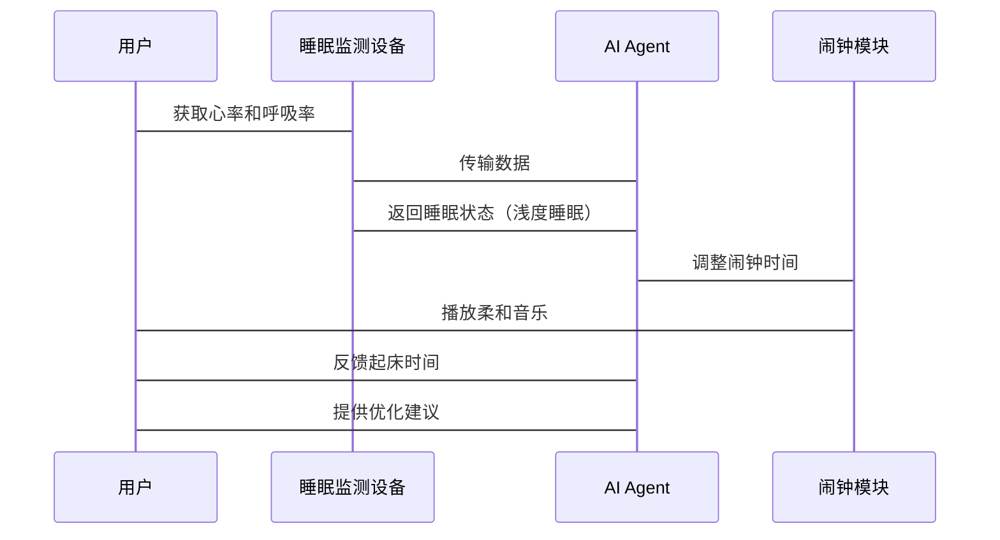

                 


# AI Agent在智能床头柜中的起床优化系统

## 关键词
AI Agent, 智能床头柜, 起床优化, 强化学习, 系统架构, 多模态数据, 个性化方案

## 摘要
本文详细探讨了AI Agent在智能床头柜中的起床优化系统的实现与应用。通过分析起床优化的核心问题，结合AI Agent的技术原理，提出了一种基于强化学习的起床优化方案。文章从系统架构、算法原理、项目实现等多个方面进行了深入分析，并通过实际案例展示了该系统的有效性与优势。本文旨在为智能床头柜的设计者和研究者提供理论支持与实践指导。

---

# 第一部分: 背景介绍

## 第1章: 问题背景

### 1.1 现代人起床困难的现状
现代社会节奏加快，许多人面临起床困难的问题。传统依靠闹钟的方式往往无法有效解决这一问题，尤其是对于习惯赖床的人群。起床困难不仅影响个人效率，还可能导致迟到、工作失误等问题。

### 1.2 传统起床方式的不足
传统起床方式主要依赖闹钟，但这种方式存在以下问题：
1. **单一性**：闹钟只能设置固定的唤醒时间，无法根据个人状态进行调整。
2. **强制性**：突然的闹铃声可能引起情绪上的不适，影响起床后的状态。
3. **缺乏反馈**：无法根据用户的起床行为提供实时反馈和优化建议。

### 1.3 AI Agent在起床优化中的潜力
AI Agent（人工智能代理）是一种能够感知环境、自主决策并执行任务的智能系统。通过结合多模态数据（如睡眠监测、环境感知、用户行为等），AI Agent可以为用户提供个性化的起床优化方案，显著提升起床效率和舒适度。

---

## 第2章: 问题描述

### 2.1 核心目标
本系统的核心目标是通过AI Agent优化用户的起床流程，使其更加高效、舒适和个性化。具体目标包括：
1. 提供个性化的唤醒策略。
2. 实现实时反馈与调整。
3. 提供起床行为的长期优化建议。

### 2.2 用户需求分析
用户在起床优化方面的需求可以分为以下几类：
1. **即时需求**：快速、舒适地起床。
2. **长期需求**：改善睡眠质量，优化起床习惯。
3. **个性化需求**：根据个人习惯调整起床方案。

### 2.3 系统边界与外延
本系统主要关注起床优化，边界包括：
1. 输入：用户的睡眠数据、环境数据、起床行为数据。
2. 输出：个性化唤醒策略、实时反馈、优化建议。

### 2.4 核心概念与系统架构
AI Agent在本系统中的作用如下：
1. **感知层**：采集多模态数据（如睡眠监测、环境传感器数据）。
2. **决策层**：基于强化学习算法优化唤醒策略。
3. **执行层**：通过床头柜的执行机构（如闹钟、灯光、温度调节等）实现优化。

---

# 第二部分: AI Agent的核心概念与原理

## 第3章: 核心概念原理

### 3.1 状态感知
AI Agent需要实时感知用户的睡眠状态和环境状态。这包括：
1. **睡眠状态**：通过睡眠监测设备（如心率、呼吸频率）获取用户的睡眠阶段。
2. **环境状态**：通过环境传感器（如光线、温度、声音）获取卧室的环境数据。

### 3.2 决策优化
基于强化学习算法，AI Agent会根据当前状态选择最优的唤醒策略。具体步骤如下：
1. **状态输入**：感知层获取的状态数据输入到强化学习模型。
2. **决策输出**：模型输出唤醒动作（如调整闹钟时间、调节光线亮度等）。
3. **反馈机制**：根据用户的起床行为调整模型参数。

### 3.3 执行反馈
AI Agent通过床头柜的执行机构（如闹钟、灯光、空调等）执行唤醒动作，并实时反馈用户的起床行为数据（如起床时间、起床速度等）。

---

## 第4章: 算法原理

### 4.1 强化学习算法
强化学习是一种通过试错方法来优化决策的算法。在本系统中，我们采用Q-learning算法，具体流程如下：



### 4.2 算法实现
以下是Q-learning算法的Python实现示例：

```python
import numpy as np

class QLearning:
    def __init__(self, state_space, action_space):
        self.q_table = np.zeros((state_space, action_space))
    
    def choose_action(self, state, epsilon=0.1):
        if np.random.random() < epsilon:
            action = np.random.randint(action_space)
        else:
            action = np.argmax(self.q_table[state])
        return action
    
    def update_q_table(self, state, action, reward, next_state, alpha=0.1):
        self.q_table[state][action] = (1 - alpha) * self.q_table[state][action] + alpha * (reward + np.max(self.q_table[next_state]))
```

### 4.3 数学模型
强化学习的核心数学模型是Q值更新公式：

$$ Q(s, a) = Q(s, a) + \alpha (r + \max Q(s', a') - Q(s, a)) $$

其中：
- \( s \)：当前状态
- \( a \)：动作
- \( r \)：奖励
- \( \alpha \)：学习率
- \( s' \)：新状态

---

# 第三部分: 系统分析与架构设计方案

## 第5章: 系统架构设计

### 5.1 领域模型
以下是系统的领域模型：



### 5.2 系统架构
以下是系统的架构图：



---

## 第6章: 项目实战

### 6.1 环境安装
要运行本系统，需要以下环境：
1. Python 3.8+
2. NumPy库
3. Mermaid工具（可选）

### 6.2 核心实现
以下是AI Agent的核心实现代码：

```python
import numpy as np

class SleepOptimizer:
    def __init__(self, states, actions):
        self.states = states
        self.actions = actions
        self.q_table = np.zeros((states, actions))
    
    def get_state(self, heart_rate, breathing_rate):
        # 根据心率和呼吸率计算睡眠状态
        if heart_rate < 60 and breathing_rate < 10:
            return 0  # 深度睡眠
        elif heart_rate < 70 and breathing_rate < 15:
            return 1  # 浅度睡眠
        else:
            return 2  # 清醒状态
    
    def choose_action(self, state, epsilon=0.1):
        if np.random.random() < epsilon:
            return np.random.randint(self.actions)
        else:
            return np.argmax(self.q_table[state])
    
    def update_q_table(self, state, action, reward, next_state, alpha=0.1):
        self.q_table[state][action] = (1 - alpha) * self.q_table[state][action] + alpha * (reward + np.max(self.q_table[next_state]))
```

### 6.3 案例分析
假设用户心率和呼吸率分别为65和12，AI Agent会选择最适合的唤醒策略，例如：



---

## 第7章: 最佳实践与注意事项

### 7.1 实践建议
1. **数据收集**：确保收集足够的睡眠数据和起床行为数据。
2. **系统维护**：定期更新模型参数，确保优化效果。
3. **隐私保护**：严格保护用户的隐私数据。

### 7.2 小结
本文详细介绍了AI Agent在智能床头柜中的起床优化系统，从理论到实践，为读者提供了全面的解决方案。

---

# 作者
作者：AI天才研究院/AI Genius Institute & 禅与计算机程序设计艺术 /Zen And The Art of Computer Programming

