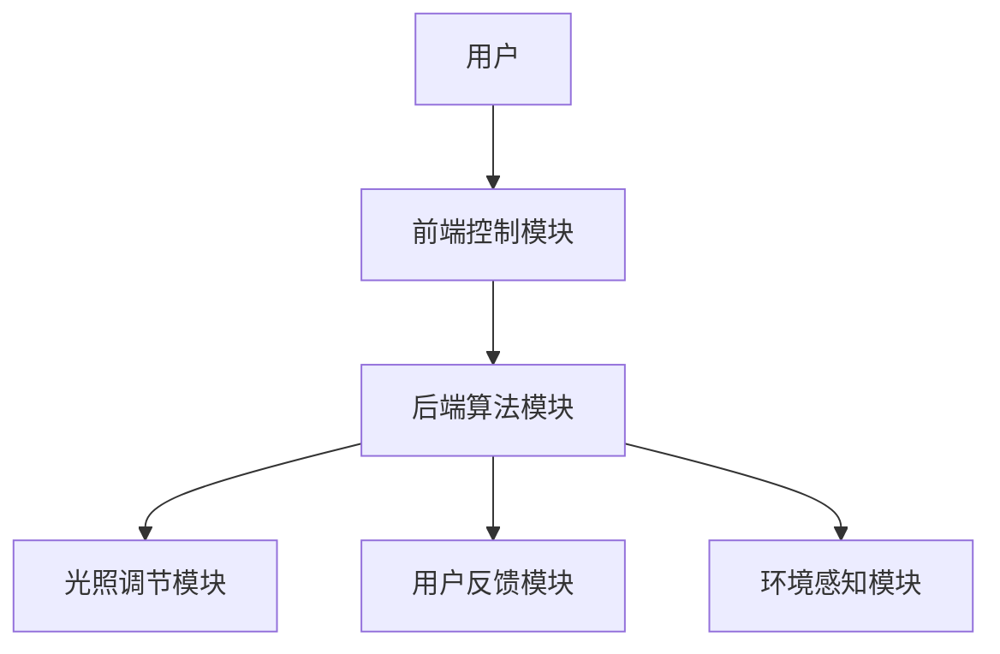
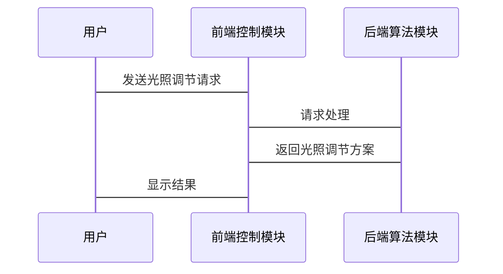

                 


# AI Agent在智能床头灯中的光疗功能

---

## 关键词：AI Agent，智能床头灯，光疗功能，生物钟调节，健康科技

---

## 摘要：  
本文探讨了AI Agent在智能床头灯光疗功能中的应用，分析了其在调节用户生物钟、改善睡眠质量及提升健康水平方面的潜力。文章详细阐述了AI Agent的核心概念、工作原理、算法实现、系统架构设计以及实际应用案例，为读者提供了全面的技术解析与实践指导。

---

# 第一部分：AI Agent与智能床头灯光疗功能的背景与概念

## 第1章：AI Agent的基本概念与应用场景

### 1.1 AI Agent的定义与特征  
AI Agent（人工智能代理）是一种能够感知环境、自主决策并执行任务的智能实体。它具备以下核心特征：  
- **自主性**：无需外部干预，自主完成任务。  
- **反应性**：能够实时感知环境变化并做出响应。  
- **目标导向**：基于预设目标优化决策。  

### 1.2 AI Agent在智能床头灯中的应用  
AI Agent通过实时感知用户行为、环境光线变化及时间信息，动态调节床头灯的光照强度、色温和开关时间，以实现以下功能：  
- 根据用户生物钟调节光照，优化睡眠质量。  
- 智能补偿环境光线不足，营造舒适睡眠环境。  
- 根据用户反馈自适应调整光疗方案。

---

## 第2章：光疗功能的原理与应用场景

### 2.1 光疗的基本原理  
光疗通过调节光照强度和色温，影响人体的生物钟。早晨使用高色温的蓝光可以帮助唤醒身体，晚上则使用低色温的暖光促进褪黑素分泌，帮助入睡。

### 2.2 AI Agent在光疗功能中的作用  
AI Agent通过以下方式实现智能化光疗：  
- **实时感知**：采集用户的行为数据、环境光线和时间信息。  
- **智能决策**：基于感知数据，调整光照参数以优化用户体验。  
- **自适应学习**：根据用户反馈不断优化光疗方案。

---

# 第二部分：AI Agent的算法原理与实现

## 第3章：基于强化学习的光疗调节算法

### 3.1 强化学习的基本原理  
强化学习是一种通过试错机制优化决策的算法。AI Agent通过与环境交互，学习最优动作序列以最大化累积奖励。

#### 算法实现步骤：
1. **状态定义**：用户当前的生物钟状态（如清醒或疲劳）。  
2. **动作选择**：调整光照强度或色温。  
3. **奖励机制**：根据用户反馈（如睡眠改善）给予奖励。  

#### 代码示例：
```python
# 强化学习算法实现
import numpy as np

class LightAgent:
    def __init__(self, learning_rate=0.1):
        self.Q = {}  # Q值存储
        self.lr = learning_rate

    def get_Q(self, state):
        return self.Q.get(state, 0)

    def update_Q(self, state, reward):
        self.Q[state] = self.Q.get(state, 0) * (1 - self.lr) + reward * self.lr

    def choose_action(self, state):
        # 简单的策略：随机选择动作
        actions = ['bright', 'dim']
        return np.random.choice(actions)
```

### 3.2 算法收敛性与稳定性分析  
通过数学模型分析，强化学习算法在多次迭代后能够收敛到最优解，确保光疗效果的稳定性。

---

## 第4章：基于监督学习的用户行为预测

### 4.1 监督学习的基本原理  
监督学习通过训练数据预测目标变量。AI Agent利用用户行为数据，预测用户的光疗需求。

#### 用户行为特征提取：
| 特征名称      | 描述               |
|---------------|--------------------|
| 入睡时间      | 用户通常的入睡时间 |
| 起床时间      | 用户通常的起床时间 |
| 睡眠质量评分  | 用户对睡眠质量的评分 |

---

# 第三部分：系统分析与架构设计

## 第5章：系统功能设计与架构

### 5.1 系统功能模块划分  
- **光照调节模块**：根据用户需求调整光照参数。  
- **用户反馈模块**：收集用户的睡眠质量和偏好反馈。  
- **环境感知模块**：采集环境光线和时间信息。

### 5.2 系统架构设计  
系统架构采用分层设计，包括前端控制模块和后端算法模块。前端模块负责用户交互，后端模块负责AI算法处理。

#### 系统架构图：


---

## 第6章：系统接口与交互设计

### 6.1 系统接口设计  
- **API接口**：提供RESTful API用于前后端通信。  
- **数据格式**：采用JSON格式传输数据。

#### 交互流程图：


---

# 第四部分：项目实战与实现

## 第7章：项目实战

### 7.1 环境安装与配置  
- **安装Python与相关库**：`pip install numpy tensorflow flask`  
- **安装床头灯控制模块**：连接硬件并配置API接口。

#### 核心代码实现：
```python
# 光疗调节核心代码
from flask import Flask, request, jsonify

app = Flask(__name__)

@app.route('/api/set_light', methods=['POST'])
def set_light():
    data = request.json
    intensity = data['intensity']
    color_temp = data['color_temp']
    # 执行光照调节
    return jsonify({'status': 'success'})

if __name__ == '__main__':
    app.run(debug=True)
```

### 7.2 光疗调节算法实现  
- **训练模型**：使用用户数据训练强化学习模型。  
- **用户反馈处理**：根据反馈调整模型参数。

---

## 第8章：系统测试与优化

### 8.1 系统测试  
- **功能测试**：验证光照调节功能是否正常。  
- **性能测试**：评估系统的响应速度和稳定性。

### 8.2 用户反馈分析  
- **数据收集**：记录用户的睡眠质量和反馈意见。  
- **模型优化**：根据反馈优化光疗调节算法。

---

# 第五部分：总结与展望

## 第9章：总结与展望

### 9.1 核心内容总结  
AI Agent通过实时感知和智能决策，显著提升了智能床头灯的光疗功能，帮助用户改善睡眠质量。

### 9.2 未来展望  
- **多设备联动**：与其他健康设备联动，提供更全面的健康解决方案。  
- **边缘计算应用**：在边缘设备上部署AI算法，提升响应速度和隐私保护。

---

# 作者：AI天才研究院 & 禅与计算机程序设计艺术

---

通过以上步骤，您可以逐步构建出一篇完整的、专业的技术博客文章，涵盖AI Agent在智能床头灯光疗功能中的各个方面。

