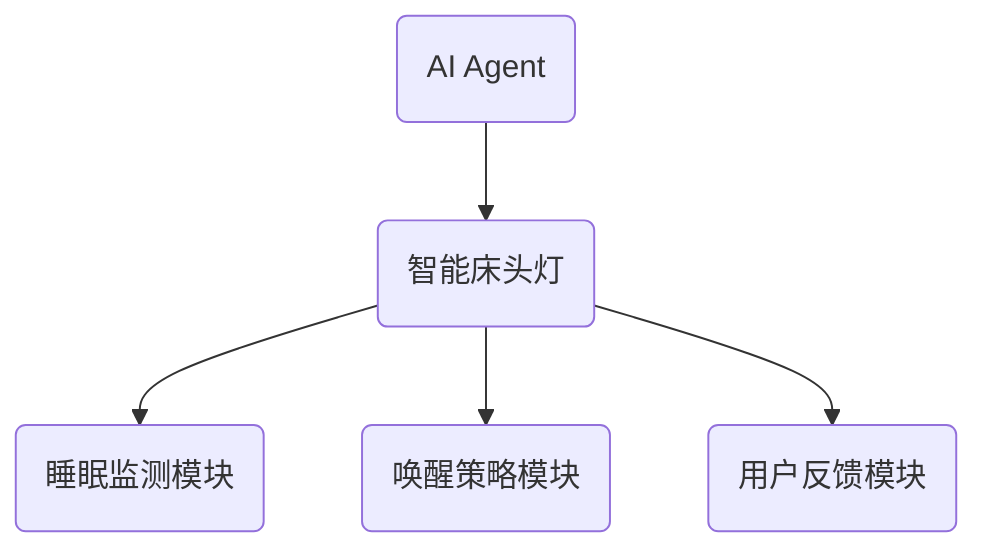

                 


# AI Agent在智能床头灯中的智能唤醒系统

## 关键词：AI Agent, 智能床头灯, 智能唤醒系统, 时间序列分析, 强化学习, 睡眠健康

## 摘要：  
本文详细探讨了AI Agent在智能床头灯中的智能唤醒系统的实现与应用。文章首先介绍了智能床头灯与AI Agent的核心概念，分析了智能唤醒系统的背景、目标与核心要素。接着，深入讲解了AI Agent的感知与决策算法，包括睡眠监测数据的处理、唤醒时间预测模型的建立以及基于强化学习的唤醒策略优化。随后，从系统架构设计、接口设计与交互流程三个方面详细阐述了智能唤醒系统的实现方案。最后，通过实际案例分析了项目的实现过程，并总结了系统的优化建议与未来发展方向。

---

## 第一部分: AI Agent在智能床头灯中的智能唤醒系统背景介绍

### 第1章: 智能床头灯与AI Agent概述

#### 1.1 问题背景与描述
##### 1.1.1 睡眠健康的重要性
睡眠是人体健康的重要组成部分，直接影响人的精力、情绪和工作效率。然而，现代人普遍存在睡眠质量差、难以规律起床等问题，传统闹钟的单一功能已无法满足人们对智能化、个性化的睡眠管理需求。

##### 1.1.2 智能床头灯的功能需求
智能床头灯作为一种智能家居设备，除了基本的照明功能，还可以集成睡眠监测、智能唤醒、环境调节等功能。用户希望床头灯能够根据个人的睡眠状态，智能化地调整唤醒方式，以达到最佳的起床体验。

##### 1.1.3 AI Agent在智能床头灯中的作用
AI Agent（智能代理）是一种能够感知环境、自主决策并执行任务的智能系统。在智能床头灯中，AI Agent可以实时监测用户的睡眠数据，分析用户的睡眠状态，并根据数据动态调整唤醒策略，从而实现智能化的睡眠管理。

#### 1.2 智能唤醒系统的定义与目标
##### 1.2.1 智能唤醒系统的定义
智能唤醒系统是指通过AI技术，结合用户的睡眠数据和行为习惯，智能判断最佳唤醒时间，并通过床头灯的灯光、声音等方式，以最舒适的方式将用户唤醒的系统。

##### 1.2.2 系统的目标与边界
智能唤醒系统的目标是帮助用户改善睡眠质量，提高起床效率。其边界包括：  
- 数据采集范围：睡眠监测数据（如心率、呼吸频率、体动次数等）、环境数据（如光线、温度、湿度等）。  
- 功能范围：睡眠监测、唤醒策略优化、用户反馈收集与分析。  
- 交互方式：通过床头灯的灯光、声音等实现与用户的互动。

##### 1.2.3 核心要素与组成结构
智能唤醒系统的核心要素包括：  
- **睡眠监测模块**：采集用户的睡眠数据。  
- **AI Agent**：分析数据，制定唤醒策略。  
- **执行模块**：通过床头灯执行唤醒操作。  
- **用户反馈模块**：收集用户对唤醒效果的反馈，优化系统。

---

### 第2章: AI Agent与智能床头灯的核心概念

#### 2.1 AI Agent的基本原理
##### 2.1.1 AI Agent的定义与特点
AI Agent是一种能够感知环境、自主决策并执行任务的智能系统。其特点包括：  
- **自主性**：能够自主决策，无需人工干预。  
- **反应性**：能够实时感知环境变化并做出反应。  
- **学习能力**：能够通过数据学习优化自己的行为。

##### 2.1.2 AI Agent的核心算法
AI Agent的核心算法包括：  
- **感知算法**：如时间序列分析、特征提取等。  
- **决策算法**：如强化学习、分类算法等。  
- **执行算法**：如动作规划、信号生成等。

##### 2.1.3 AI Agent与智能设备的交互方式
AI Agent与智能床头灯的交互方式包括：  
- 通过传感器采集数据。  
- 通过床头灯的灯光、声音等方式输出指令。  
- 通过用户反馈优化AI Agent的行为。

#### 2.2 智能床头灯的功能模块
##### 2.2.1 睡眠监测模块
睡眠监测模块通过传感器采集用户的睡眠数据，包括：  
- 心率  
- 呼吸频率  
- 体动次数  
- 睡眠周期（REM、NREM等）

##### 2.2.2 唤醒策略模块
唤醒策略模块根据用户的睡眠数据和行为习惯，制定个性化的唤醒策略，包括：  
- 唤醒时间的预测  
- 唤醒方式的选择（如柔和的灯光、渐增的声音）  
- 唤醒强度的调整

##### 2.2.3 用户反馈模块
用户反馈模块收集用户对唤醒效果的反馈，包括：  
- 唤醒是否成功  
- 用户的感受（如是否感到疲惫）  
- 用户的偏好（如喜欢哪种唤醒方式）

#### 2.3 AI Agent与智能床头灯的实体关系图


---

## 第三部分: AI Agent在智能唤醒系统中的算法原理

### 第3章: AI Agent的感知与决策算法

#### 3.1 感知层算法
##### 3.1.1 睡眠监测数据的采集与处理
睡眠监测数据的采集与处理流程如下：  
1. 通过传感器采集用户的睡眠数据（如心率、呼吸频率）。  
2. 对数据进行预处理（如去除噪声、归一化）。  
3. 提取特征（如睡眠周期、体动频率）。

##### 3.1.2 基于时间序列的睡眠数据分析
时间序列分析是一种常用的睡眠数据分析方法。例如，使用ARIMA模型预测用户的睡眠周期。

##### 3.1.3 数据预处理与特征提取
数据预处理包括：  
- 去除噪声（如滤波）。  
- 数据归一化（如将数据缩放到0-1范围）。  
特征提取包括：  
- 提取睡眠周期特征（如REM、NREM）。  
- 提取体动频率特征。

#### 3.2 决策层算法
##### 3.2.1 唤醒时间的预测模型
基于时间序列的唤醒时间预测模型可以表示为：  
$$y_t = \alpha y_{t-1} + \beta x_t + \epsilon_t$$  
其中，$y_t$表示预测的唤醒时间，$x_t$表示输入特征，$\alpha$和$\beta$为模型参数，$\epsilon_t$为误差项。

##### 3.2.2 基于强化学习的唤醒策略优化
强化学习是一种常用的唤醒策略优化方法。例如，使用Q-learning算法优化唤醒阈值。

##### 3.2.3 唤醒阈值的动态调整算法
动态调整唤醒阈值的算法如下：  
1. 根据用户的睡眠数据，计算当前的睡眠深度。  
2. 根据睡眠深度调整唤醒阈值。  
3. 通过用户反馈优化阈值。

#### 3.3 执行层算法
##### 3.3.1 唤醒信号的生成与播放
唤醒信号的生成包括：  
- 调制灯光（如渐亮的灯光）。  
- 调制声音（如渐增的音乐）。  

##### 3.3.2 用户反馈的实时响应
用户反馈的实时响应包括：  
- 根据用户的反馈调整唤醒策略。  
- 更新用户的睡眠数据。

##### 3.3.3 系统自适应优化算法
系统自适应优化算法包括：  
- 根据用户反馈优化AI Agent的行为。  
- 根据新的睡眠数据更新模型参数。

---

### 第4章: 唤醒策略优化的数学模型

#### 4.1 唤醒时间预测模型
##### 4.1.1 时间序列预测模型
时间序列预测模型可以表示为：  
$$y_t = \alpha y_{t-1} + \beta x_t + \epsilon_t$$  
其中，$y_t$表示预测的唤醒时间，$x_t$表示输入特征，$\alpha$和$\beta$为模型参数，$\epsilon_t$为误差项。

##### 4.1.2 唤醒时间的优化
通过强化学习优化唤醒时间，例如，使用Q-learning算法。

#### 4.2 唤醒阈值动态调整模型
##### 4.2.1 唤醒阈值的动态调整
动态调整唤醒阈值的算法如下：  
1. 根据用户的睡眠数据，计算当前的睡眠深度。  
2. 根据睡眠深度调整唤醒阈值。  
3. 通过用户反馈优化阈值。

##### 4.2.2 基于强化学习的阈值优化
通过强化学习优化阈值，例如，使用Q-learning算法。

---

## 第四部分: 智能唤醒系统的系统分析与架构设计

### 第5章: 智能唤醒系统的设计与实现

#### 5.1 项目背景
智能唤醒系统的开发背景包括：  
- 睡眠健康的重要性。  
- AI技术在智能家居中的广泛应用。  
- 智能床头灯的市场需求。

#### 5.2 系统功能设计
##### 5.2.1 功能模块设计
功能模块设计包括：  
- 睡眠监测模块。  
- 唤醒策略模块。  
- 用户反馈模块。

##### 5.2.2 功能需求分析
功能需求分析包括：  
- 实时监测用户的睡眠数据。  
- 根据睡眠数据优化唤醒策略。  
- 收集用户的反馈并优化系统。

#### 5.3 系统架构设计
##### 5.3.1 系统架构图


##### 5.3.2 感知层架构
感知层包括：  
- 传感器数据采集。  
- 数据预处理与特征提取。

##### 5.3.3 决策层架构
决策层包括：  
- 唤醒时间预测模型。  
- 唤醒策略优化算法。

##### 5.3.4 执行层架构
执行层包括：  
- 唤醒信号生成。  
- 用户反馈处理。

#### 5.4 接口设计与交互流程
##### 5.4.1 系统接口设计
系统接口包括：  
- 传感器接口。  
- 用户反馈接口。

##### 5.4.2 交互流程
交互流程包括：  
1. 采集用户的睡眠数据。  
2. 分析数据，制定唤醒策略。  
3. 执行唤醒操作。  
4. 收集用户反馈并优化系统。

---

## 第五部分: 项目实战

### 第6章: 项目实现与案例分析

#### 6.1 环境安装
##### 6.1.1 开发环境
开发环境包括：  
- Python 3.8及以上版本。  
- 基础库（如numpy、pandas）。  
- 机器学习库（如scikit-learn、tensorflow）。  

#### 6.2 系统核心实现源代码
##### 6.2.1 睡眠监测模块
```python
import numpy as np
import pandas as pd

# 读取睡眠数据
data = pd.read_csv('sleep_data.csv')

# 数据预处理
data = data.dropna()
data = (data - data.mean()) / data.std()
```

##### 6.2.2 唤醒策略模块
```python
from sklearn.metrics import accuracy_score
from tensorflow.keras import layers, Model

# 构建时间序列预测模型
def build_model(input_shape):
    inputs = layers.Input(shape=input_shape)
    lstm_layer = layers.LSTM(64)(inputs)
    dense_layer = layers.Dense(1)(lstm_layer)
    model = Model(inputs=inputs, outputs=dense_layer)
    model.compile(optimizer='adam', loss='mse')
    return model

# 训练模型
model = build_model((None, 32))
model.fit(X_train, y_train, epochs=10, batch_size=32)
```

##### 6.2.3 用户反馈模块
```python
import numpy as np

# 收集用户反馈
feedback = []
while True:
    response = input("请输入反馈（输入'结束'退出）：")
    if response == '结束':
        break
    feedback.append(response)

# 分析反馈
from collections import Counter
count = Counter(feedback)
print("反馈结果：", count)
```

#### 6.3 案例分析与代码解读
##### 6.3.1 案例分析
案例分析包括：  
- 数据采集与预处理。  
- 模型训练与优化。  
- 用户反馈收集与分析。

##### 6.3.2 代码解读
代码解读包括：  
- 数据预处理代码。  
- 模型构建与训练代码。  
- 用户反馈收集代码。

#### 6.4 项目小结
项目小结包括：  
- 项目的实现成果。  
- 系统的优缺点。  
- 未来优化方向。

---

## 第六部分: 最佳实践与总结

### 第7章: 最佳实践与总结

#### 7.1 最佳实践
##### 7.1.1 开发建议
开发建议包括：  
- 确保数据质量。  
- 选择合适的算法。  
- 定期优化系统。

##### 7.1.2 注意事项
注意事项包括：  
- 数据隐私保护。  
- 系统稳定性保障。  
- 用户体验优化。

#### 7.2 项目小结
项目小结包括：  
- 项目的整体成果。  
- 系统的创新点。  
- 未来发展方向。

---

## 作者：AI天才研究院/AI Genius Institute & 禅与计算机程序设计艺术 /Zen And The Art of Computer Programming

---

本文通过详细分析AI Agent在智能床头灯中的智能唤醒系统的实现与应用，展示了如何利用AI技术优化睡眠健康管理。从算法原理到系统架构，再到项目实战，本文为读者提供了一个全面的技术视角。未来，随着AI技术的不断发展，智能床头灯的功能将更加智能化、个性化，为人们带来更好的睡眠体验。

