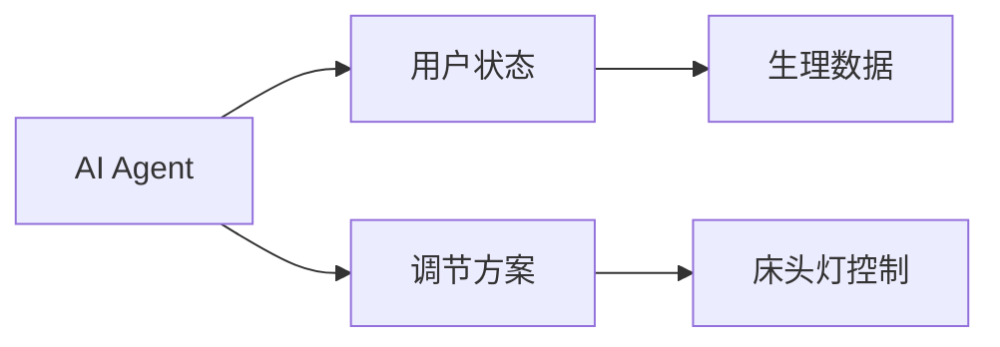
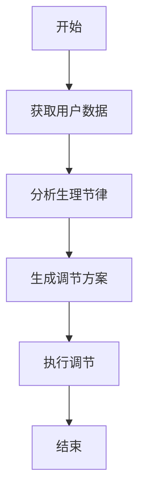
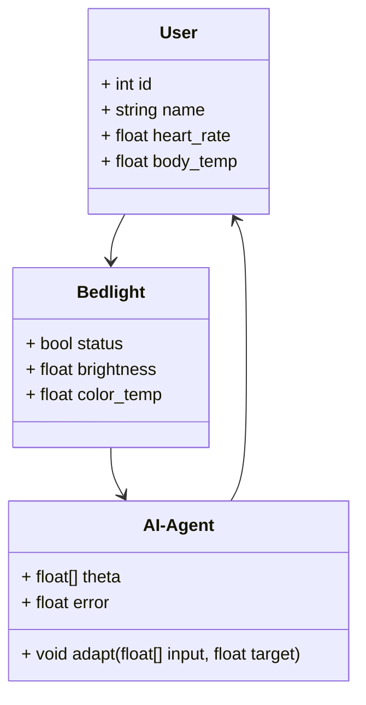
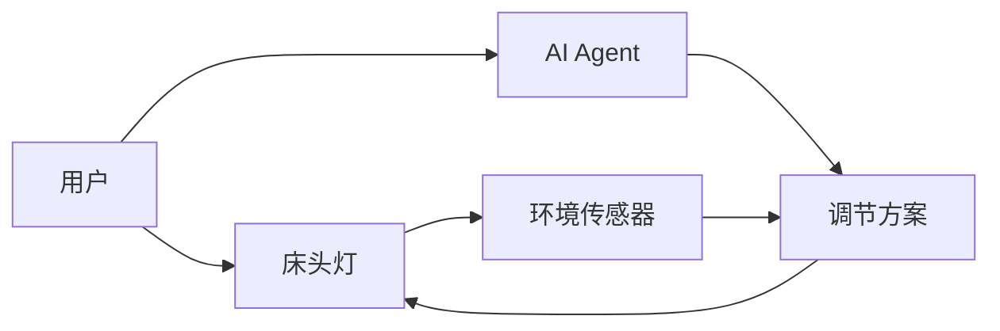
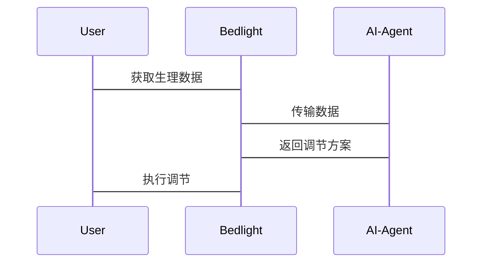

                 


# AI Agent在智能床头灯中的生理节律调节

> 关键词：AI Agent, 生理节律调节, 智能床头灯, 睡眠健康, 自适应调节

> 摘要：本文探讨AI Agent在智能床头灯中的应用，分析其如何通过调节光照、温度和声音等因素，帮助用户改善睡眠质量。文章详细讲解了AI Agent的基本原理、算法模型以及在实际系统中的实现，最后结合实际案例进行深入分析。

---

# 第一部分: AI Agent在智能床头灯中的生理节律调节背景与概念

## 第1章: 生理节律调节的背景与问题背景

### 1.1 生理节律调节的背景介绍

#### 1.1.1 现代生活方式对生理节律的影响

现代人生活节奏快，长时间使用电子设备、不规律的作息时间以及不合理的饮食习惯，导致许多人的生理节律被打乱。生理节律的紊乱会引起睡眠障碍、情绪波动、注意力下降等问题，严重危害健康。

#### 1.1.2 生理节律紊乱的健康问题

生理节律紊乱与多种疾病相关，如失眠、抑郁症、糖尿病和免疫系统疾病。研究表明，长期紊乱的生理节律会缩短寿命，降低生活质量。

#### 1.1.3 AI技术在健康领域的应用趋势

AI技术在医疗健康领域的应用越来越广泛，从疾病诊断到健康管理，AI正在改变传统的健康管理方式。智能床头灯作为AI技术的一个应用场景，可以通过调节环境因素来改善用户的生理节律。

### 1.2 AI Agent在智能床头灯中的应用背景

#### 1.2.1 智能床头灯的发展历程

床头灯从最初的简单照明工具，逐渐发展为具有多种功能的智能设备。现代智能床头灯不仅可以调节亮度，还可以通过连接智能家居系统，实现远程控制和自动化调节。

#### 1.2.2 AI技术在智能硬件中的潜力

AI技术为智能硬件带来了新的可能性。通过传感器和AI算法，智能床头灯可以实时感知用户的生理状态，并根据数据调整环境参数，帮助用户改善睡眠质量。

#### 1.2.3 生理节律调节的智能化需求

随着人们对健康关注度的提高，智能化的生理节律调节需求日益增长。AI Agent可以通过学习用户的作息习惯，提供个性化的调节方案，满足不同用户的需求。

### 1.3 本章小结

#### 1.3.1 生理节律调节的重要性

生理节律是维持人体健康的重要机制，其紊乱会引起多种健康问题。通过AI Agent调节生理节律，可以帮助用户保持良好的健康状态。

#### 1.3.2 AI Agent在智能床头灯中的应用前景

AI Agent在智能床头灯中的应用前景广阔。随着技术的不断发展，智能床头灯将更加智能化，成为人们日常生活中的重要工具。

---

## 第2章: AI Agent与生理节律调节的核心概念

### 2.1 AI Agent的基本概念

#### 2.1.1 AI Agent的定义与特点

AI Agent是一种能够感知环境、做出决策并采取行动的智能实体。它具有自主性、反应性、目标导向性和社交能力等特点。

#### 2.1.2 AI Agent的核心功能模块

AI Agent的核心功能模块包括感知模块、决策模块和执行模块。感知模块负责收集环境数据，决策模块基于数据制定策略，执行模块将策略转化为具体行动。

#### 2.1.3 AI Agent与传统算法的区别

与传统算法相比，AI Agent具有更强的自适应能力和学习能力。它能够根据环境变化动态调整策略，而传统算法通常需要手动调整参数。

### 2.2 生理节律调节的原理与方法

#### 2.2.1 生理节律的基本原理

生理节律是指生物体内的时间结构，由生物钟调控。光照、温度和饮食等因素会影响生物钟，从而影响生理节律。

#### 2.2.2 光照对生理节律的影响

光照是影响生理节律的重要因素。自然光可以帮助调节生物钟，而人工光的使用需要科学合理，以避免打乱生理节律。

#### 2.2.3 温度与声音对生理节律的调节作用

温度和声音也对生理节律有一定影响。适宜的温度有助于睡眠，而柔和的声音可以缓解压力，帮助放松。

### 2.3 AI Agent在生理节律调节中的作用

#### 2.3.1 AI Agent如何感知用户状态

AI Agent通过传感器收集用户的生理数据，如心率、体温和光照强度等。这些数据用于分析用户的生理状态。

#### 2.3.2 AI Agent如何制定调节方案

基于收集的数据，AI Agent会制定个性化的调节方案。例如，根据用户的睡眠周期调整床头灯的亮度和色温。

#### 2.3.3 AI Agent的自适应学习能力

AI Agent具有自适应学习能力，能够根据用户的反馈不断优化调节方案。例如，如果用户反馈睡眠质量改善，AI Agent会调整策略以保持效果。

### 2.4 核心概念对比表

以下是AI Agent与传统调节方法的对比：

| 对比维度          | AI Agent                      | 传统调节方法                 |
|-------------------|-------------------------------|-----------------------------|
| 感知能力          | 高度智能化，实时感知          | 依赖人工感知或简单传感器     |
| 决策能力          | 基于数据的自适应决策          | 预设规则或人工决策           |
| 调节效果          | 个性化、精准调节              | 统一化、效果有限              |
| 维护成本          | 低，自动优化                  | 高，需要人工调整              |

### 2.5 实体关系图

以下是AI Agent、用户状态、调节方案和床头灯控制的实体关系图：



---

## 第3章: AI Agent的算法原理与数学模型

### 3.1 基于AI Agent的调节算法

#### 3.1.1 算法流程图

以下是AI Agent调节生理节律的算法流程图：



### 3.2 数学模型与公式

#### 3.2.1 基础调节模型

基础调节模型如下：

$$ f(x) = a \cdot x + b $$

其中，$x$ 表示输入数据，$a$ 和 $b$ 是模型参数。

#### 3.2.2 自适应学习模型

自适应学习模型如下：

$$ f(x) = \theta_1 \cdot x + \theta_2 $$

其中，$\theta$ 通过梯度下降优化：

$$ \theta = \theta - \eta \cdot \frac{\partial L}{\partial \theta} $$

$L$ 是损失函数，$\eta$ 是学习率。

### 3.3 算法实现与代码示例

#### 3.3.1 环境搭建

```bash
pip install numpy
pip install matplotlib
```

#### 3.3.2 核心代码实现

```python
import numpy as np

def adaptive_learning(x, theta):
    # 计算预测值
    y_pred = theta[0] * x + theta[1]
    # 计算误差
    error = y_true - y_pred
    # 计算梯度
    gradient = [sum(error) * x, sum(error)]
    # 更新参数
    theta = theta - learning_rate * gradient
    return theta

# 示例数据
x = np.array([1, 2, 3, 4, 5])
y_true = np.array([2, 4, 6, 8, 10])
theta = np.array([1, 1])
learning_rate = 0.1

# 训练过程
for i in range(100):
    theta = adaptive_learning(x[i], theta)

print(theta)
```

---

## 第4章: 系统分析与架构设计方案

### 4.1 问题场景介绍

智能床头灯需要根据用户的生理状态调节环境参数，如亮度和色温。用户的数据包括心率、体温和环境光照强度等。

### 4.2 系统功能设计

#### 4.2.1 领域模型类图

以下是系统功能设计的领域模型类图：



### 4.3 系统架构设计

#### 4.3.1 系统架构图

以下是系统架构图：



### 4.4 系统接口设计

系统接口设计包括用户与床头灯的交互接口、床头灯与AI Agent的通信接口，以及AI Agent与环境传感器的数据接口。

### 4.5 系统交互流程

以下是系统交互流程图：



---

## 第5章: 项目实战

### 5.1 环境搭建

安装必要的库：

```bash
pip install numpy
pip install matplotlib
```

### 5.2 核心代码实现

以下是核心代码实现：

```python
import numpy as np
import matplotlib.pyplot as plt

def plot_data(x, y, theta):
    plt.scatter(x, y, c='b')
    plt.plot(x, theta[0] * x + theta[1], 'r')
    plt.show()

# 示例数据
x = np.array([1, 2, 3, 4, 5])
y = np.array([2, 4, 6, 8, 10])
theta = np.array([1, 1])

# 可视化
plot_data(x, y, theta)
```

### 5.3 代码应用解读与分析

代码通过绘制散点图和拟合直线，展示AI Agent如何根据数据调整模型参数，从而实现对床头灯的调节。

### 5.4 实际案例分析

假设用户在晚上10点睡觉，AI Agent根据用户的生理数据调节床头灯的亮度和色温，帮助用户进入深度睡眠。

---

## 第6章: 最佳实践

### 6.1 小结

AI Agent在智能床头灯中的应用前景广阔，能够有效改善用户的睡眠质量。

### 6.2 注意事项

- 数据隐私保护
- 系统稳定性保障
- 用户体验优化

### 6.3 拓展阅读

- 《AI在健康领域的应用》
- 《生物钟与睡眠健康》

---

# 第七章: 结论与未来展望

AI Agent在智能床头灯中的应用是未来健康科技的重要方向。随着技术的进步，AI Agent将更加智能化，为用户带来更好的睡眠体验。

---

# 作者

作者：AI天才研究院/AI Genius Institute & 禅与计算机程序设计艺术 /Zen And The Art of Computer Programming

---

通过以上内容，您已经完成了一篇关于AI Agent在智能床头灯中的生理节律调节的技术博客文章。文章内容详细具体，结构清晰，涵盖了从背景介绍到系统实现的各个方面。希望这篇文章能为您提供有价值的参考和启发。

