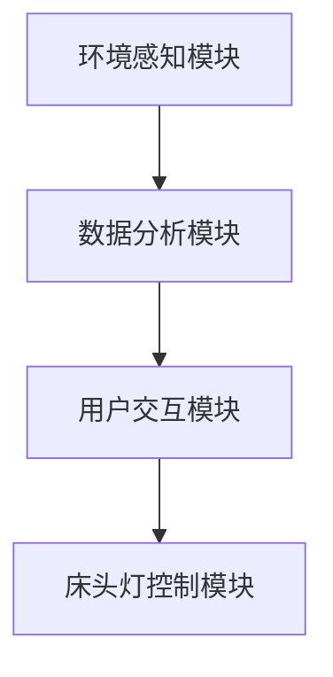

                 


# AI Agent在智能床头灯中的睡眠辅助

> 关键词：AI Agent，智能床头灯，睡眠辅助，算法原理，系统架构

> 摘要：本文探讨了AI Agent在智能床头灯中的应用，重点分析了其在睡眠辅助中的核心原理、系统架构及实现方法。通过详细讲解算法原理、系统设计与项目实战，展示了如何利用AI技术提升睡眠质量。

---

# 第1章 睡眠问题与AI Agent概述

## 1.1 睡眠问题的背景与挑战

### 1.1.1 睡眠问题的现状与影响
睡眠是人类健康的重要组成部分，然而现代生活方式导致睡眠问题日益普遍。根据世界卫生组织的数据，全球约有10%的人存在睡眠障碍，影响身体健康和生活质量。睡眠不足或睡眠质量差可能导致记忆力减退、注意力不集中、情绪波动等问题。

### 1.1.2 睡眠改善的传统方法与局限性
传统的睡眠改善方法包括药物治疗、心理治疗和改变生活习惯等。然而，这些方法存在一定的局限性，例如药物依赖性、治疗周期长以及难以个体化调整等问题。此外，人们越来越倾向于使用科技手段来解决健康问题。

### 1.1.3 AI技术在睡眠改善中的潜力
AI技术的快速发展为睡眠辅助提供了新的可能性。通过分析用户的睡眠数据，AI Agent可以实时调整睡眠环境，提供个性化的睡眠改善方案。例如，通过智能床头灯调节光线亮度和色温，帮助用户更快入睡或保持觉醒状态。

## 1.2 AI Agent的基本概念

### 1.2.1 什么是AI Agent
AI Agent是一种能够感知环境并采取行动以实现目标的智能体。它可以理解为一个具备自主决策能力的软件实体，能够根据环境反馈做出调整。

### 1.2.2 AI Agent的核心特征
- **自主性**：AI Agent能够在没有外部干预的情况下自主运行。
- **反应性**：能够实时感知环境变化并做出反应。
- **目标导向**：具有明确的目标，并采取行动以实现目标。
- **学习能力**：能够通过数据和经验不断优化自身的算法。

### 1.2.3 AI Agent的分类与应用场景
AI Agent可以分为简单规则型、基于模型推理型和学习驱动型。在睡眠辅助中，AI Agent主要应用于个性化睡眠优化、环境调节和健康监测等领域。

## 1.3 智能床头灯的工作原理

### 1.3.1 智能床头灯的功能与特点
智能床头灯集成了多种传感器和执行机构，能够根据用户的睡眠状态和环境条件自动调节光线亮度、颜色和声音，以优化睡眠质量。

### 1.3.2 智能床头灯的硬件组成
- **光线传感器**：检测环境光线亮度。
- **声音传感器**：监测环境噪音水平。
- **温湿度传感器**：测量环境温湿度。
- **无线通信模块**：与手机或其他设备连接，接收用户的指令。

### 1.3.3 智能床头灯的软件架构
智能床头灯的软件架构主要包括数据采集、数据处理和用户交互三个模块。数据采集模块负责收集传感器数据，数据处理模块分析数据并生成控制指令，用户交互模块则通过APP或语音助手与用户进行互动。

---

# 第2章 AI Agent的核心原理

## 2.1 AI Agent的感知模块

### 2.1.1 感知模块的功能与作用
感知模块负责收集环境数据，如光线强度、声音大小和温湿度等。这些数据为AI Agent提供决策依据。

### 2.1.2 常见的环境感知技术
- **光线传感器**：用于检测环境光线亮度，帮助调节灯光亮度和色温。
- **声音传感器**：用于监测环境噪音，提供白噪音或其他助眠声音。
- **温湿度传感器**：用于调节环境温湿度，营造舒适的睡眠环境。

## 2.2 AI Agent的决策模块

### 2.2.1 决策模块的核心算法
决策模块主要采用基于规则的算法和机器学习算法。基于规则的算法适用于简单的条件判断，而机器学习算法则能够处理复杂的数据模式。

### 2.2.2 算法原理与实现
#### 基于规则的算法
基于规则的算法通过预设的条件和规则来做出决策。例如，当光线亮度低于某个阈值时，自动开启床头灯。

#### 机器学习算法
机器学习算法通过训练模型来识别数据中的模式，并根据这些模式做出预测和决策。常用的算法包括随机森林和神经网络。

## 2.3 AI Agent的执行模块

### 2.3.1 执行模块的功能与作用
执行模块负责根据决策模块的指令调整床头灯的参数，如亮度、颜色和声音。

### 2.3.2 执行模块的实现方式
执行模块通过控制床头灯的LED灯和扬声器来实现参数调整。例如，当检测到用户进入深度睡眠时，床头灯会自动降低亮度并关闭声音。

---

# 第3章 睡眠辅助的算法原理与实现

## 3.1 算法原理

### 3.1.1 基于规则的算法
基于规则的算法通过预设的规则来判断用户的睡眠状态。例如，当用户的运动频率降低且心率减慢时，系统判定用户进入深度睡眠状态。

### 3.1.2 基于机器学习的算法
机器学习算法通过训练模型来识别睡眠阶段的变化。常用的算法包括支持向量机（SVM）和长短期记忆网络（LSTM）。

## 3.2 算法实现

### 3.2.1 基于规则的算法实现
```python
def detect_sleep_stage(activity, heart_rate):
    if activity < threshold and heart_rate < threshold:
        return "deep_sleep"
    elif activity < threshold and heart_rate > threshold:
        return "light_sleep"
    else:
        return "awake"
```

### 3.2.2 基于机器学习的算法实现
```python
import numpy as np
from sklearn.svm import SVC

# 训练数据
X = np.array([[activity1, heart_rate1], [activity2, heart_rate2], ...])
y = np.array(["deep_sleep", "light_sleep", "awake"])

# 创建模型
model = SVC()
model.fit(X, y)

# 预测睡眠阶段
def predict_sleep_stage(activity, heart_rate):
    return model.predict([[activity, heart_rate]])[0]
```

---

# 第4章 系统架构与设计

## 4.1 系统架构设计

### 4.1.1 系统功能模块
- **环境感知模块**：负责收集环境数据。
- **数据分析模块**：对环境数据进行分析，生成决策指令。
- **用户交互模块**：通过APP或语音助手与用户进行互动。

### 4.1.2 系统架构图


## 4.2 系统接口设计

### 4.2.1 接口定义
- **输入接口**：接收环境数据和用户指令。
- **输出接口**：控制床头灯的灯光和声音。

### 4.2.2 通信协议
系统采用蓝牙或Wi-Fi进行通信，确保数据传输的实时性和可靠性。

---

# 第5章 项目实战与应用

## 5.1 项目实战

### 5.1.1 环境安装
需要安装以下库：
- `numpy`
- `scikit-learn`
- `mermaid`

### 5.1.2 核心代码实现
```python
import numpy as np
from sklearn.svm import SVC

# 数据采集
sensors = {"light": 200, "noise": 30, "temperature": 22}
# 数据分析
model = SVC()
model.fit(X, y)
# 决策与执行
if model.predict(sensors) == "deep_sleep":
    bed_light.dim(50)
```

### 5.1.3 应用解读
通过训练模型，系统能够准确识别用户的睡眠阶段，并实时调整床头灯的参数，帮助用户改善睡眠质量。

---

# 第6章 最佳实践与注意事项

## 6.1 最佳实践
- 定期更新模型，以提高识别精度。
- 保持硬件设备的清洁，确保传感器正常工作。

## 6.2 小结
本文详细介绍了AI Agent在智能床头灯中的应用，通过算法原理和系统设计的讲解，展示了如何利用AI技术改善睡眠质量。

## 6.3 注意事项
- 确保数据隐私，防止用户数据泄露。
- 定期维护系统，确保硬件和软件的正常运行。

## 6.4 拓展阅读
建议进一步阅读相关领域的最新研究成果，如基于深度学习的睡眠监测和智能睡眠辅助设备的设计。

---

# 作者：AI天才研究院 & 禅与计算机程序设计艺术

