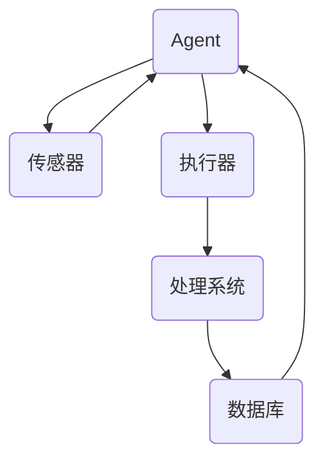
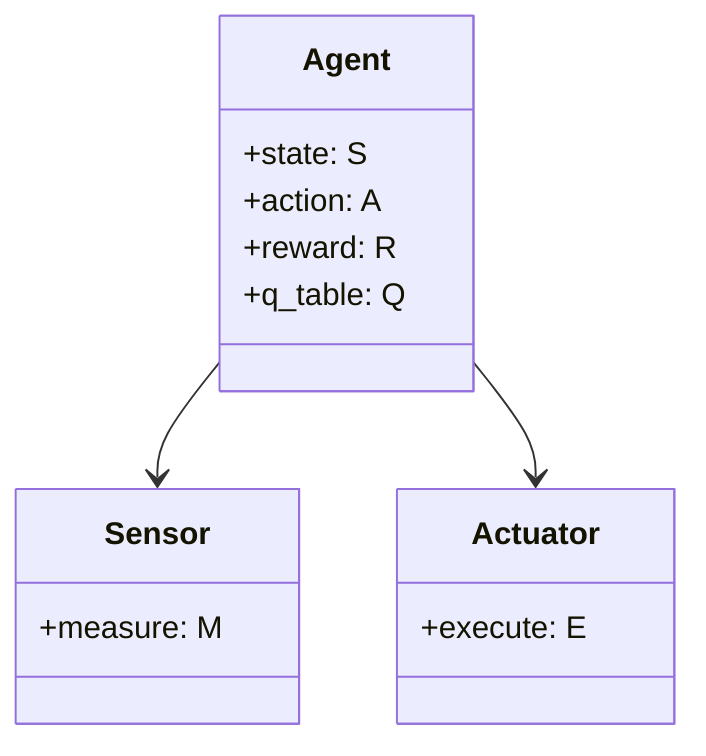
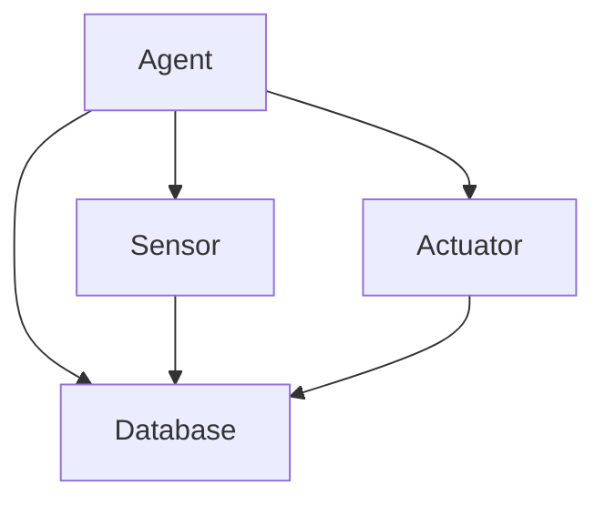
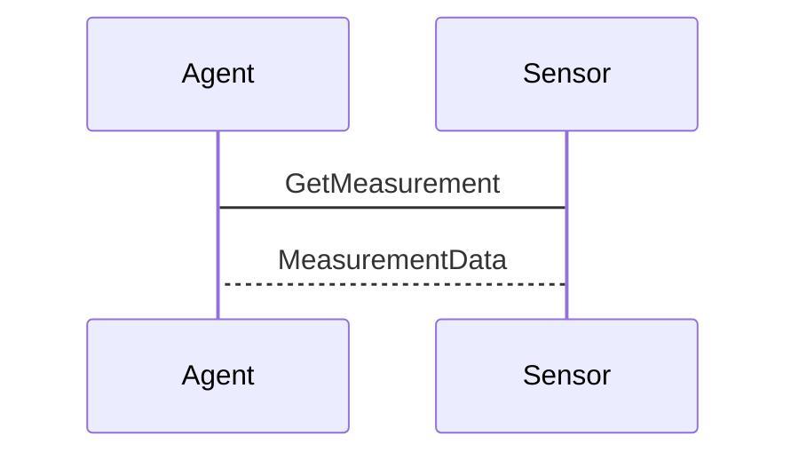
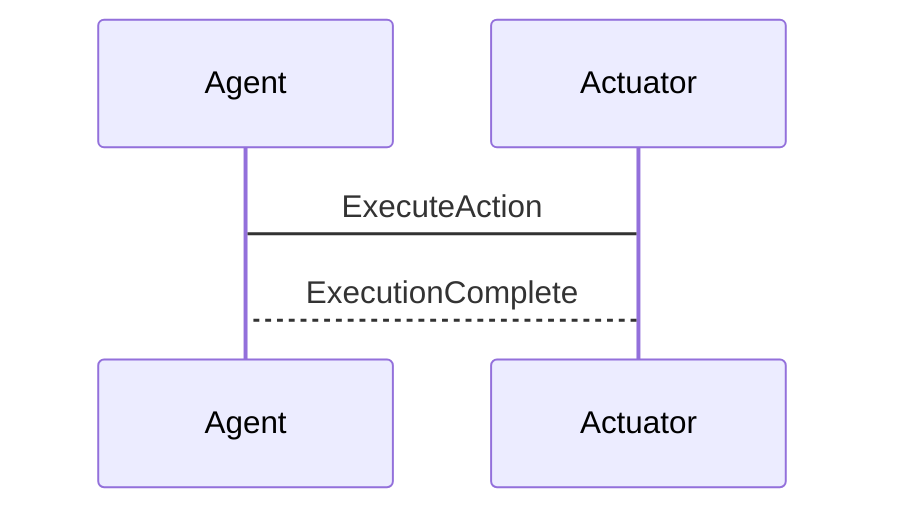

                 


# AI Agent在智能废水处理控制中的实践

> 关键词：AI Agent、智能废水处理、机器学习、废水控制、环境监测

> 摘要：本文探讨了AI Agent在智能废水处理控制中的应用，分析了其核心概念、算法原理、系统架构及实际案例。通过强化学习算法实现废水处理的智能化控制，提升处理效率和环保效果。

---

# 第一部分: AI Agent在智能废水处理控制中的背景与概述

## 第1章: AI Agent与智能废水处理概述

### 1.1 AI Agent的基本概念

#### 1.1.1 AI Agent的定义
AI Agent（人工智能代理）是指能够感知环境并采取行动以实现目标的智能实体。它通过传感器获取信息，利用算法做出决策，并通过执行器与环境交互。

#### 1.1.2 AI Agent的核心特点
- **自主性**：能够在没有外部干预的情况下运行。
- **反应性**：能够实时感知环境并做出响应。
- **目标导向性**：基于目标驱动行为。

#### 1.1.3 AI Agent与传统控制系统的区别
| 特性       | AI Agent                | 传统控制系统          |
|------------|-------------------------|-----------------------|
| 决策方式   | 基于学习和优化          | 基于固定规则          |
| 灵活性     | 高                     | 较低                 |
| 处理复杂性 | 善于处理非线性问题      | 适用于线性问题        |

### 1.2 智能废水处理的背景与挑战

#### 1.2.1 废水处理的现状与问题
- **传统处理方法**：化学、物理、生物处理，效率低，成本高。
- **环境问题**：废水排放导致水体污染，影响生态平衡。
- **效率低下**：处理过程能耗高，资源浪费。

#### 1.2.2 智能化废水处理的必要性
- 提高处理效率，降低成本。
- 实现资源回收，减少污染。
- 实时监控，确保排放达标。

#### 1.2.3 AI Agent在废水处理中的应用前景
- 通过强化学习优化处理流程。
- 实现多目标优化，兼顾效率与环保。

### 1.3 本章小结
本章介绍了AI Agent的基本概念及其在废水处理中的应用价值，为后续分析奠定了基础。

---

# 第二部分: AI Agent的核心概念与技术原理

## 第2章: AI Agent的核心概念与系统架构

### 2.1 AI Agent的核心概念

#### 2.1.1 状态空间
状态空间是指系统在某一时刻的所有可能状态的集合。在废水处理中，状态可能包括pH值、温度、污染物浓度等。

#### 2.1.2 行动空间
行动空间是指AI Agent可以采取的所有可能行动。例如，调节曝气量、改变搅拌速度等。

#### 2.1.3 环境模型
环境模型是对废水处理系统及其运行环境的数学描述，用于模拟系统的动态行为。

### 2.2 AI Agent与废水处理系统的联系

#### 2.2.1 废水处理系统的实体关系图


### 2.3 AI Agent的算法原理

#### 2.3.1 强化学习算法
强化学习是一种通过试错机制来优化决策的算法。AI Agent通过与环境交互，不断学习最优策略。

#### 2.3.2 算法流程图
```mermaid
graph TD
    Start --> Initialize Q表
    Initialize Q表 --> 选择动作
    选择动作 --> 执行动作
    执行动作 --> 获取奖励
    获取奖励 --> 更新Q表
    更新Q表 --> 判断是否结束
    判断是否结束 --> 结束或继续循环
```

### 2.4 本章小结
本章详细介绍了AI Agent的核心概念及其在废水处理系统中的应用，为后续的算法实现奠定了基础。

---

# 第三部分: AI Agent的算法原理与数学模型

## 第3章: AI Agent的算法原理

### 3.1 强化学习算法

#### 3.1.1 Q-learning算法
Q-learning是一种经典的强化学习算法，通过更新Q表来学习最优策略。

#### 3.1.2 算法流程图
```mermaid
graph TD
    Start --> Initialize Q表
    Initialize Q表 --> 选择动作
    选择动作 --> 执行动作
    执行动作 --> 获取奖励
    获取奖励 --> 更新Q表
    更新Q表 --> 判断是否结束
    判断是否结束 --> 结束或继续循环
```

#### 3.1.3 Q-learning公式
$$ Q(s,a) = Q(s,a) + \alpha (r + \gamma \max Q(s',a') - Q(s,a)) $$

### 3.2 数学模型与公式

#### 3.2.1 状态转移模型
$$ P(s' | s, a) $$

#### 3.2.2 奖励函数
$$ R(s, a, s') $$

---

# 第四部分: 系统分析与架构设计方案

## 第4章: 系统分析与架构设计

### 4.1 问题场景介绍
废水处理系统需要实时监测pH值、温度、污染物浓度等参数，并根据这些参数调整处理流程。

### 4.2 系统功能设计

#### 4.2.1 领域模型


### 4.3 系统架构设计

#### 4.3.1 系统架构图


### 4.4 系统接口设计

#### 4.4.1 传感器接口


#### 4.4.2 执行器接口


---

# 第五部分: 项目实战

## 第5章: 项目实战

### 5.1 环境安装

#### 5.1.1 安装Python
```bash
python --version
pip install --upgrade pip
```

#### 5.1.2 安装依赖库
```bash
pip install numpy
pip install gym
pip install matplotlib
```

### 5.2 系统核心实现源代码

#### 5.2.1 强化学习实现
```python
import numpy as np
import gym
import matplotlib.pyplot as plt

class QLearningAgent:
    def __init__(self, state_space, action_space, learning_rate=0.1, gamma=0.9):
        self.state_space = state_space
        self.action_space = action_space
        self.lr = learning_rate
        self.gamma = gamma
        self.q_table = np.zeros((state_space, action_space))

    def choose_action(self, state):
        return np.argmax(self.q_table[state])

    def update_q_table(self, state, action, reward, next_state):
        self.q_table[state][action] = self.q_table[state][action] + self.lr * (reward + self.gamma * np.max(self.q_table[next_state]) - self.q_table[state][action])

# 初始化环境
env = gym.make('CustomWasteTreatmentEnv-v0')
state_space = env.observation_space.shape[0]
action_space = env.action_space.n
agent = QLearningAgent(state_space, action_space)

# 训练过程
for episode in range(1000):
    state = env.reset()
    total_reward = 0
    while True:
        action = agent.choose_action(state)
        next_state, reward, done, _ = env.step(action)
        agent.update_q_table(state, action, reward, next_state)
        total_reward += reward
        state = next_state
        if done:
            break
    print(f'Episode {episode}, Total Reward: {total_reward}')

# 可视化结果
plt.plot(agent.q_table)
plt.xlabel('State')
plt.ylabel('Q Value')
plt.show()
```

---

# 第六部分: 最佳实践与总结

## 第6章: 最佳实践与总结

### 6.1 最佳实践

#### 6.1.1 数据质量
确保传感器数据的准确性和实时性，数据预处理至关重要。

#### 6.1.2 模型调优
根据实际需求调整学习率和折扣因子，平衡探索与利用。

### 6.2 小结

#### 6.2.1 项目总结
通过强化学习算法实现了智能废水处理控制，提升了处理效率和环保效果。

#### 6.2.2 经验与教训
- 数据预处理的重要性。
- 模型调优的复杂性。

#### 6.2.3 注意事项
- 确保系统的稳定性。
- 定期更新模型以适应变化。

### 6.3 拓展阅读

#### 6.3.1 推荐书籍
- 《深度学习》—— Ian Goodfellow
- 《强化学习》—— Richard S. Sutton

#### 6.3.2 在线资源
- OpenAI Gym
- TensorFlow官方文档

---

# 作者：AI天才研究院 & 禅与计算机程序设计艺术

