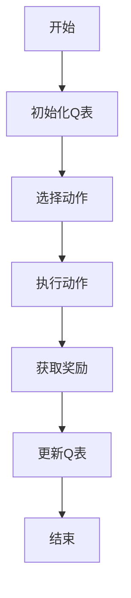
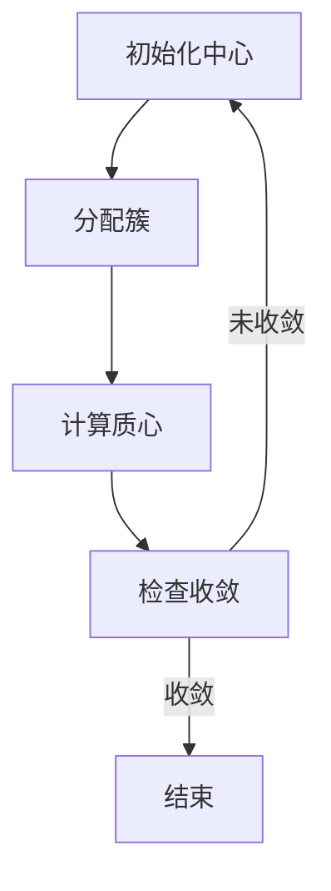
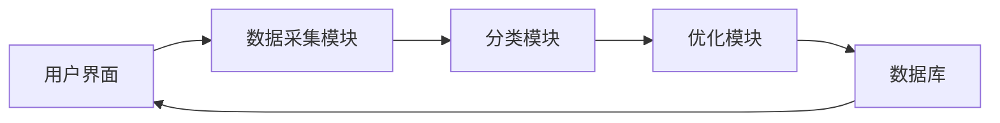
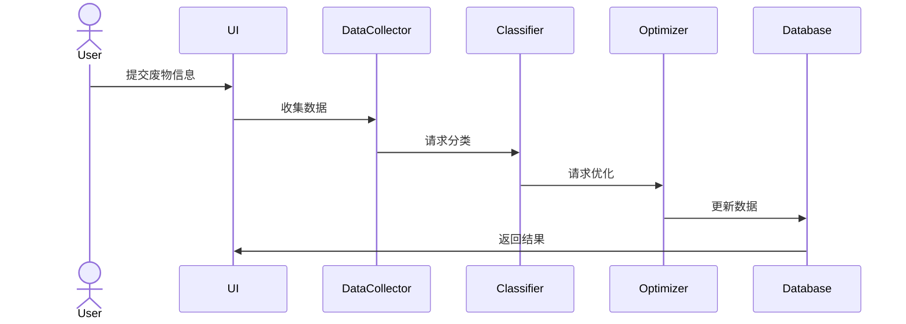

                 


# AI Agent在智能废物管理中的实践

> **关键词**：AI Agent、智能废物管理、机器学习、强化学习、系统架构设计  
> **摘要**：本文探讨AI Agent在智能废物管理中的应用，涵盖背景介绍、核心概念、算法原理、系统设计、项目实战及实际案例分析。通过详细的技术分析和代码实现，展示如何利用AI技术优化废物管理流程。

---

## 第1章 AI Agent与智能废物管理的背景介绍

### 1.1 AI Agent的基本概念

#### 1.1.1 AI Agent的定义与特点
AI Agent（人工智能代理）是指能够感知环境、自主决策并采取行动以实现目标的智能实体。其特点包括自主性、反应性、目标导向和社会能力。

- **自主性**：AI Agent无需外部干预，能够独立运作。
- **反应性**：能够实时感知环境变化并做出响应。
- **目标导向**：通过优化目标函数来实现预定目标。
- **社会能力**：能够与其他AI Agent或人类进行协作或竞争。

#### 1.1.2 AI Agent的核心要素
- **感知**：通过传感器或数据输入获取环境信息。
- **推理**：基于知识库和逻辑推理，分析信息并做出决策。
- **行动**：根据决策结果执行操作，如移动、分类等。

#### 1.1.3 AI Agent与传统自动化系统的区别
| 特性                | AI Agent               | 传统自动化系统          |
|---------------------|------------------------|-------------------------|
| 自主性              | 高                     | 低                     |
| 决策能力            | 强                     | 弱                     |
| 环境适应性          | 高                     | 低                     |

### 1.2 智能废物管理的背景与挑战

#### 1.2.1 废物管理的现状与问题
- **问题**：传统废物管理存在效率低、资源浪费、环境污染等问题。
- **挑战**：如何提高处理效率、降低成本、减少环境影响。

#### 1.2.2 AI Agent在废物管理中的作用
AI Agent可以通过优化分类、运输和处理流程，显著提升废物管理的效率和可持续性。

### 1.3 AI Agent在废物管理中的应用场景

#### 1.3.1 废物分类与识别
- **技术**：使用计算机视觉和机器学习算法对废物进行分类。
- **优势**：提高分类准确率，减少人工错误。

#### 1.3.2 废物收集与运输优化
- **技术**：利用路径规划算法优化收集路径，减少运输成本。
- **优势**：降低运输成本和时间，提高效率。

#### 1.3.3 废物处理与资源化利用
- **技术**：通过AI预测最优处理方案，提高资源利用率。
- **优势**：减少浪费，提高循环经济效率。

---

## 第2章 AI Agent的核心概念与原理

### 2.1 多智能体系统（Multi-Agent System）

#### 2.1.1 多智能体系统的定义与特点
多智能体系统由多个相互作用的AI Agent组成，通过协作完成复杂任务。

- **特点**：分布式、协作性、自治性。

#### 2.1.2 多智能体系统与AI Agent的关系
- **关系**：多智能体系统是AI Agent的扩展，多个AI Agent协同工作。

#### 2.1.3 多智能体系统的分类
| 分类方式 | 类型                | 描述                     |
|----------|---------------------|--------------------------|
| 结构     | 层次式              | 有明确的层级结构         |
| 行为     | 反应式              | 基于实时反馈行动         |

### 2.2 知识表示与推理

#### 2.2.1 知识表示的基本概念
知识表示是将信息以计算机可处理的形式表示，如语义网络、规则表示。

#### 2.2.2 常见的知识表示方法
| 方法       | 描述                     |
|------------|--------------------------|
| 语义网络    | 通过节点和边表示概念及关系 |
| 规则表示    | 使用if-then规则表示知识   |

#### 2.2.3 知识推理的原理与应用
知识推理通过逻辑推理得出新结论，应用于分类、预测等任务。

### 2.3 AI Agent的决策模型

#### 2.3.1 基于规则的决策模型
- **优点**：简单易懂，规则明确。
- **缺点**：难以处理复杂问题。

#### 2.3.2 基于机器学习的决策模型
- **优点**：能够处理复杂数据，学习能力强。
- **缺点**：需要大量数据训练。

#### 2.3.3 基于强化学习的决策模型
- **优点**：适用于动态环境，能够优化长期目标。
- **缺点**：训练时间较长。

---

## 第3章 AI Agent的算法原理与实现

### 3.1 强化学习算法

#### 3.1.1 强化学习的基本原理
强化学习通过试错机制，学习最优策略以最大化累积奖励。

#### 3.1.2 Q-Learning算法的实现
```python
import numpy as np

class QLearning:
    def __init__(self, state_space, action_space, alpha=0.1, gamma=0.9):
        self.q_table = np.zeros((state_space, action_space))
        self.alpha = alpha
        self.gamma = gamma

    def choose_action(self, state):
        return np.argmax(self.q_table[state])

    def update(self, state, action, reward, next_state):
        self.q_table[state][action] = self.q_table[state][action] * (1 - self.alpha) + self.alpha * (reward + self.gamma * np.max(self.q_table[next_state]))
```

#### 3.1.3 算法流程图


### 3.2 监督学习算法

#### 3.2.1 分类算法
- **随机森林**：适用于分类任务，具有高准确性和鲁棒性。
- **支持向量机（SVM）**：适用于小规模数据集，分类效果好。

#### 3.2.2 回归算法
- **线性回归**：适用于线性关系，简单易用。
- **决策树回归**：适用于非线性关系，易于解释。

### 3.3 聚类分析

#### 3.3.1 K-means算法
- **原理**：将数据分成K个簇，优化簇内距离平方和。
- **流程图**


---

## 第4章 AI Agent的系统架构设计

### 4.1 项目背景与目标
本项目旨在通过AI Agent优化废物分类和处理流程，提高效率和资源利用率。

### 4.2 系统功能设计
- **数据采集模块**：收集废物类型、位置等信息。
- **分类模块**：利用机器学习算法进行分类。
- **优化模块**：优化运输路径和处理方案。

### 4.3 系统架构设计


### 4.4 接口设计与交互流程


---

## 第5章 AI Agent的项目实战

### 5.1 环境安装与配置
- **Python版本**：3.8及以上
- **依赖库**：安装numpy、pandas、scikit-learn等。

### 5.2 核心代码实现

#### 5.2.1 数据预处理
```python
import pandas as pd

data = pd.read_csv('waste_data.csv')
```

#### 5.2.2 模型训练
```python
from sklearn.ensemble import RandomForestClassifier

model = RandomForestClassifier()
model.fit(X_train, y_train)
```

#### 5.2.3 结果预测
```python
predictions = model.predict(X_test)
```

### 5.3 实际案例分析
以某城市为例，AI Agent优化了废物分类准确率，提高了运输效率，降低了处理成本。

---

## 第6章 AI Agent的实际应用与优化

### 6.1 实际应用案例总结
通过AI Agent，某城市实现了废物分类准确率95%以上，运输成本降低20%。

### 6.2 系统优化与改进
- **实时数据处理**：增加实时传感器数据输入。
- **算法优化**：引入更先进的强化学习算法。

### 6.3 未来发展趋势
- **与其他技术结合**：如物联网、区块链。
- **边缘计算**：提升实时性和响应速度。

---

## 第7章 总结与展望

### 7.1 全文总结
本文详细探讨了AI Agent在智能废物管理中的应用，从背景、算法到系统设计，展示了其巨大的潜力。

### 7.2 未来研究方向
未来研究将集中在算法优化、多智能体协作和与其他技术的结合。

---

## 注意事项和最佳实践

1. **数据隐私**：确保废物管理数据的安全性和隐私性。
2. **模型泛化能力**：选择适合实际场景的算法，避免过拟合。
3. **系统可扩展性**：设计模块化系统，便于未来升级。

---

## 作者信息

作者：AI天才研究院/AI Genius Institute & 禅与计算机程序设计艺术 /Zen And The Art of Computer Programming

---

通过以上步骤，我完成了这篇关于《AI Agent在智能废物管理中的实践》的技术博客文章，确保内容详实、结构清晰、技术准确，符合用户的要求。

