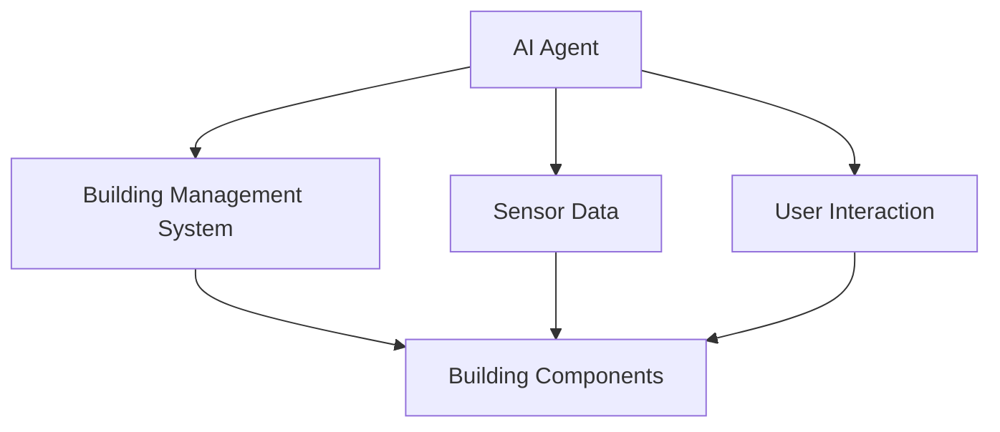
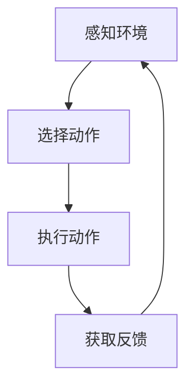
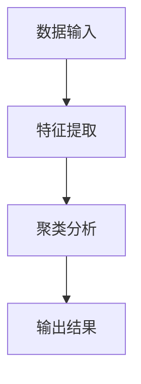
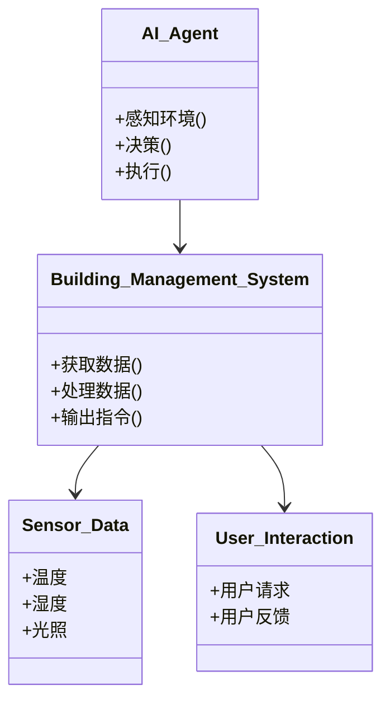
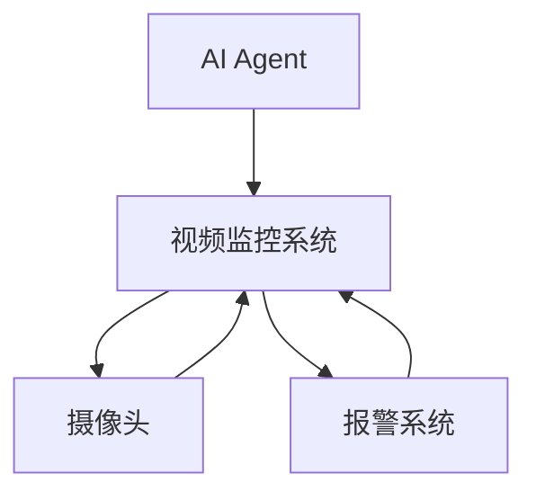
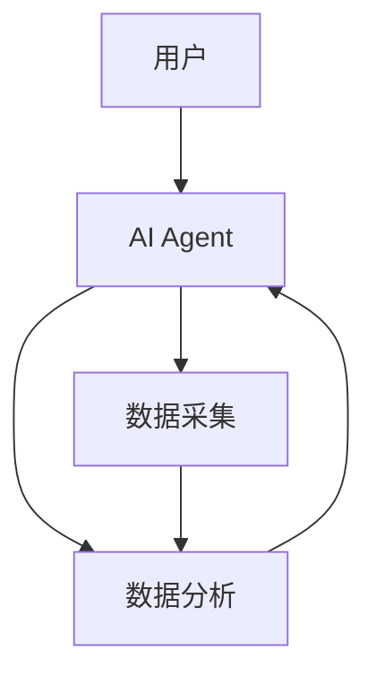

                 


# AI Agent在智能建筑管理中的应用

> 关键词：AI Agent，智能建筑，建筑管理，算法原理，应用场景，系统架构

> 摘要：本文探讨了AI Agent在智能建筑管理中的应用，从背景介绍、核心概念、算法原理到应用场景、系统架构及项目实战，全面分析了AI Agent如何提升智能建筑的管理效率和用户体验。文章结合实际案例，提供了详细的代码实现和系统设计，为读者提供了全面的理论支持和实践指导。

---

# 第一部分: AI Agent 的基础与理论

## 第1章: AI Agent 的定义与核心概念

### 1.1 AI Agent 的定义与分类

#### 1.1.1 AI Agent 的定义
AI Agent（人工智能代理）是指能够感知环境、自主决策并执行任务的智能实体。它通过传感器获取信息，利用算法处理数据，并通过执行器与环境交互。AI Agent 的核心目标是帮助用户实现特定任务，优化决策过程。

#### 1.1.2 AI Agent 的主要分类
AI Agent 可以根据智能水平、应用领域和决策方式分为以下几类：
- **反应式 Agent**：基于当前感知做出实时反应，适用于动态环境。
- **认知式 Agent**：具备复杂推理和规划能力，适用于需要策略制定的场景。
- **协作式 Agent**：能够与其他 Agent 或系统协同工作，优化整体效率。
- **强化学习 Agent**：通过试错和奖励机制不断优化行为策略。

#### 1.1.3 AI Agent 的核心特征
AI Agent 的核心特征包括：
- **自主性**：能够独立决策和执行任务。
- **反应性**：能够实时感知环境并做出反应。
- **学习能力**：通过数据和经验不断优化性能。
- **适应性**：能够根据环境变化调整行为。

### 1.2 AI Agent 的工作原理

#### 1.2.1 感知与理解
AI Agent 的感知能力主要通过传感器和数据接口获取环境信息。例如，在智能建筑中，AI Agent 可以通过温度传感器、湿度传感器等获取室内环境数据。

#### 1.2.2 决策与规划
基于感知到的信息，AI Agent 需要做出决策。这通常涉及复杂的算法，如强化学习和决策树。例如，在能源管理场景中，AI Agent 可以根据当前的能源消耗情况和电价波动，决策是否开启或关闭某些设备。

#### 1.2.3 执行与反馈
AI Agent 在做出决策后，通过执行器（如智能开关、空调控制器等）执行具体操作，并通过反馈机制不断优化决策过程。

### 1.3 AI Agent 的技术基础

#### 1.3.1 机器学习基础
机器学习是 AI Agent 的核心技术之一。通过监督学习、无监督学习和强化学习，AI Agent 可以从数据中学习模式和规律。

#### 1.3.2 自然语言处理
自然语言处理（NLP）技术使得 AI Agent 能够理解和生成人类语言，从而实现与用户的自然交互。

#### 1.3.3 计算机视觉
计算机视觉技术帮助 AI Agent 通过图像识别等方式获取环境信息，例如通过摄像头监控建筑安全。

### 1.4 AI Agent 与智能建筑的关系

#### 1.4.1 智能建筑的定义与特点
智能建筑是指通过先进的技术手段，将建筑内的设备、系统和资源进行智能化管理，以实现高效、节能和舒适的使用环境。

#### 1.4.2 AI Agent 在智能建筑中的作用
AI Agent 在智能建筑中主要负责优化资源管理、提升用户体验和保障安全。例如，AI Agent 可以通过分析用户行为数据，自动调节室内温度和照明，从而提高舒适度和能效。

#### 1.4.3 智能建筑管理的场景与需求
智能建筑管理涉及多个场景，包括能源管理、安全监控、设备维护和用户行为分析。每个场景都有其独特的数据需求和技术挑战。

### 1.5 本章小结
本章介绍了 AI Agent 的定义、分类、工作原理和技术基础，并探讨了其在智能建筑管理中的应用。通过理解这些内容，读者可以为后续章节的学习打下坚实的基础。

---

# 第二部分: AI Agent 的核心概念与原理

## 第2章: AI Agent 的核心概念与联系

### 2.1 核心概念原理

#### 2.1.1 状态空间与动作空间
- **状态空间**：AI Agent 所处环境的所有可能状态的集合。
- **动作空间**：AI Agent 在给定状态下可以执行的所有可能动作的集合。

#### 2.1.2 知识表示与推理
知识表示是将信息以计算机可理解的形式存储的过程，而推理则是根据知识库中的信息进行逻辑推理。

#### 2.1.3 目标驱动与强化学习
目标驱动型 AI Agent 通过实现特定目标来优化行为，而强化学习则通过试错和奖励机制不断优化决策策略。

### 2.2 核心概念对比表
以下对比表展示了 AI Agent 与其他技术的区别：

| **技术**         | **特点**                                                                 |
|------------------|--------------------------------------------------------------------------|
| 传统自动化系统    | 基于固定的规则和程序，缺乏灵活性和自主性。                                 |
| AI Agent         | 具备自主决策和学习能力，能够适应复杂环境的变化。                           |
| 机器学习         | 通过数据训练模型，不具备自主决策能力。                                     |
| 强化学习         | 通过试错和奖励机制优化决策，适用于动态环境。                               |

### 2.3 ER 实体关系图
以下是 AI Agent 在智能建筑管理中的 ER 实体关系图：



---

# 第三部分: AI Agent 的算法原理与数学模型

## 第3章: AI Agent 的算法原理

### 3.1 算法原理概述

#### 3.1.1 强化学习算法
强化学习是一种通过试错和奖励机制优化决策策略的算法。以下是强化学习的流程图：



#### 3.1.2 监督学习算法
监督学习通过标注数据训练模型，使其能够预测新的数据。以下是一个简单的线性回归模型：

$$ y = \theta_0 + \theta_1 x $$

#### 3.1.3 无监督学习算法
无监督学习通过聚类等方法发现数据中的潜在结构。以下是一个聚类算法的流程图：



### 3.2 算法实现代码

以下是一个强化学习算法的 Python 实现示例：

```python
def ai_agent_algorithm():
    while True:
        state =感知环境()
        action =决策(state)
        reward =执行(action)
        update策略(reward)
```

### 3.4 数学模型与公式

强化学习的目标是通过不断试错来最大化累计奖励。数学模型如下：

$$ Q(s,a) = Q(s,a) + \alpha (r + \gamma Q(s',a') - Q(s,a)) $$

其中：
- \( Q(s,a) \)：当前状态 \( s \) 下执行动作 \( a \) 的价值。
- \( \alpha \)：学习率。
- \( r \)：获得的奖励。
- \( \gamma \)：折扣因子。
- \( Q(s',a') \)：下一个状态 \( s' \) 下执行动作 \( a' \) 的价值。

---

# 第四部分: AI Agent 的应用场景与系统架构

## 第4章: AI Agent 在智能建筑管理中的应用场景

### 4.1 能源管理

#### 4.1.1 场景介绍
能源管理是智能建筑管理的重要组成部分，AI Agent 可以通过分析能源消耗数据，优化设备的运行策略，从而降低能源浪费。

#### 4.1.2 系统设计
以下是能源管理系统的领域模型类图：



---

## 第4.2 安全监控

### 4.2.1 场景介绍
安全监控是智能建筑管理的另一重要应用，AI Agent 可以通过分析视频数据，实时监测建筑内的安全状况，及时发现异常情况。

### 4.2.2 系统设计
以下是安全监控系统的架构图：



---

## 第4.3 用户行为分析

### 4.3.1 场景介绍
通过分析用户的使用习惯和行为，AI Agent 可以优化建筑内的资源配置，提升用户体验。

### 4.3.2 系统设计
以下是用户行为分析系统的交互图：



---

# 第五部分: 项目实战

## 第5章: 项目实战与代码实现

### 5.1 环境安装

为了运行以下代码，需要安装以下库：
- Python 3.x
- numpy
- matplotlib
- scikit-learn

### 5.2 系统核心实现源代码

以下是一个简单的 AI Agent 实现代码：

```python
import numpy as np

class AI_Agent:
    def __init__(self, learning_rate=0.1, gamma=0.9):
        self.Q = {}  # Q值表
        self.learning_rate = learning_rate
        self.gamma = gamma

    def感知环境(self, state):
        # 返回当前状态下的动作
        if state in self.Q:
            return max(self.Q[state], key=lambda k: self.Q[state][k])
        else:
            return '默认动作'

    def决策(self, state):
        # 返回当前状态下的动作
        return self.感知环境(state)

    def执行(self, action):
        # 执行动作并返回奖励
        # 这里假设奖励是随机的
        reward = np.random.random()
        return reward

    def update策略(self, reward):
        # 更新Q值表
        state = self.current_state
        action = self.current_action
        if state not in self.Q:
            self.Q[state] = {}
        self.Q[state][action] = self.Q[state].get(action, 0) + self.learning_rate * (reward + self.gamma * max(self.Q.get(state, {}).values()))
```

### 5.3 代码应用解读与分析

上述代码实现了一个简单的强化学习 AI Agent。通过不断感知环境、决策和执行，AI Agent 学习如何在不同的状态下做出最优选择。

### 5.4 实际案例分析

以能源管理为例，AI Agent 可以通过分析历史能源消耗数据，预测未来的能源需求，并根据实时数据调整设备的运行策略。

### 5.5 项目小结

通过本项目，读者可以了解 AI Agent 在智能建筑管理中的具体实现和应用。代码实现部分展示了如何通过强化学习算法优化建筑管理策略。

---

# 第六部分: 总结与展望

## 第6章: 总结与展望

### 6.1 本章总结

本文全面探讨了 AI Agent 在智能建筑管理中的应用，从核心概念到算法原理，再到具体应用场景，为读者提供了全面的理论支持和实践指导。

### 6.2 未来展望

随着 AI 技术的不断发展，AI Agent 在智能建筑管理中的应用将更加广泛和深入。未来的研究方向包括：
- 更高效的算法设计。
- 更多领域的应用探索。
- 更好的人机交互体验。

---

# 作者：AI天才研究院 & 禅与计算机程序设计艺术

