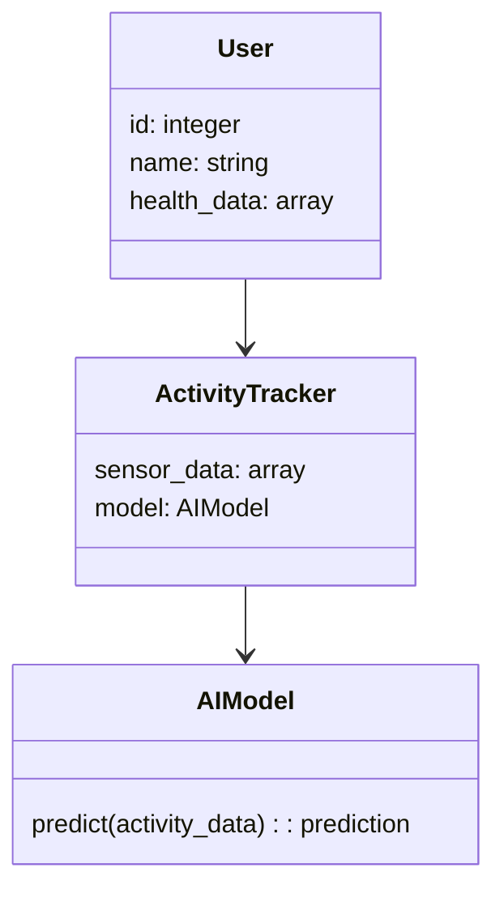
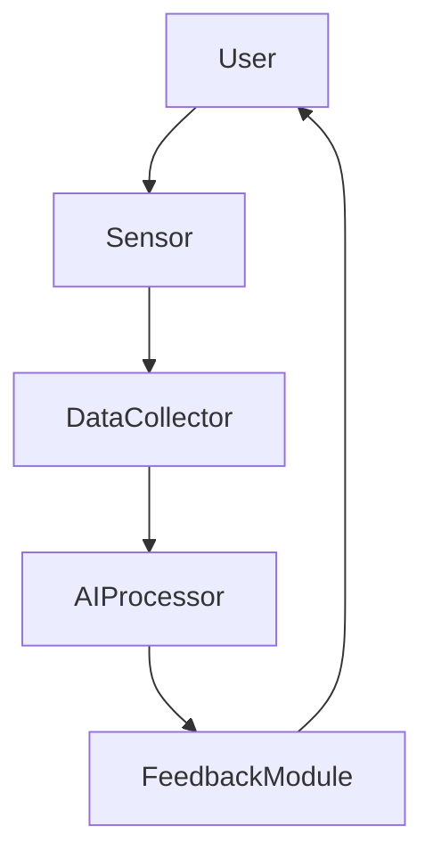
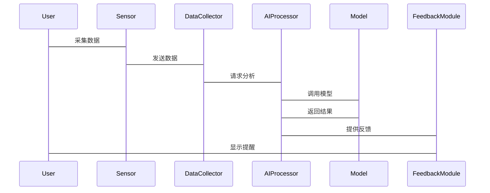

                 


# AI Agent在智能戒指中的日常活动追踪

**关键词：AI Agent, 智能戒指, 日常活动追踪, 数据分析, 人工智能**

**摘要**：本文深入探讨了AI Agent在智能戒指中的应用，重点分析了其在日常活动追踪中的作用。通过背景介绍、核心概念、算法原理、系统设计、项目实战等多维度的详细阐述，本文为读者提供了全面的技术视角，展示了如何利用AI技术优化智能戒指的功能，提升用户体验。

---

## 第1章 AI Agent与智能戒指的背景介绍

### 1.1 AI Agent的基本概念

#### 1.1.1 AI Agent的定义与特征
AI Agent（人工智能代理）是指能够感知环境、自主决策并执行任务的智能实体。其核心特征包括：
- **自主性**：能够在无需外部干预的情况下执行任务。
- **反应性**：能够实时感知环境变化并做出反应。
- **学习性**：能够通过数据学习和优化自身行为。
- **社交能力**：能够与其他系统或用户进行交互。

#### 1.1.2 智能戒指的技术背景
智能戒指是一种 wearable device，能够通过传感器采集用户的生理数据和行为数据。其核心技术包括：
- **传感器技术**：如加速度计、心率监测器等。
- **无线通信**：如蓝牙、Wi-Fi等。
- **数据处理**：通过AI技术对数据进行分析和反馈。

#### 1.1.3 AI Agent在智能戒指中的作用
AI Agent在智能戒指中主要负责数据的采集、分析和反馈，帮助用户优化日常活动。例如：
- **健康监测**：实时监测用户的健康数据，如心率、运动量等。
- **行为分析**：分析用户的日常习惯，提供建议。
- **智能提醒**：根据用户的行为数据，主动提供健康提醒或优化建议。

### 1.2 日常活动追踪的必要性

#### 1.2.1 日常活动追踪的定义
日常活动追踪是指通过技术手段记录和分析用户的日常生活习惯，如运动、饮食、睡眠等，从而提供健康建议或行为优化方案。

#### 1.2.2 智能戒指在日常活动追踪中的优势
智能戒指的优势在于其便捷性和实时性：
- **便捷性**：用户无需额外佩戴其他设备，戒指本身即可完成数据采集。
- **实时性**：能够实时监测用户的健康数据，及时反馈。

#### 1.2.3 用户隐私与数据安全的平衡
在日常活动追踪中，用户隐私和数据安全是重要问题。智能戒指需要通过加密技术、匿名化处理等手段，确保用户数据的安全性。

### 1.3 AI Agent与智能戒指的结合

#### 1.3.1 AI Agent在智能戒指中的应用场景
AI Agent在智能戒指中的应用场景包括：
- **健康监测**：实时监测用户的健康数据。
- **行为分析**：分析用户的日常行为习惯。
- **智能提醒**：根据数据提供健康建议或提醒。

#### 1.3.2 AI Agent如何实现日常活动追踪
AI Agent通过以下步骤实现日常活动追踪：
1. **数据采集**：通过传感器采集用户的生理数据和行为数据。
2. **数据处理**：对数据进行清洗、特征提取和建模分析。
3. **反馈优化**：根据分析结果，提供优化建议或智能提醒。

#### 1.3.3 智能戒指与AI Agent的协同工作模式
智能戒指与AI Agent的协同工作模式如下：
- **数据采集**：智能戒指通过传感器采集数据。
- **数据传输**：数据传输到AI Agent进行处理。
- **分析与反馈**：AI Agent分析数据并生成反馈。
- **用户交互**：用户通过智能戒指接收反馈。

## 第2章 AI Agent的核心概念与原理

### 2.1 AI Agent的核心原理

#### 2.1.1 AI Agent的基本工作流程
AI Agent的基本工作流程包括：
1. **感知环境**：通过传感器或接口获取环境数据。
2. **决策制定**：基于感知数据，通过算法做出决策。
3. **执行任务**：根据决策结果执行任务，如发出提醒或调整设置。

#### 2.1.2 AI Agent的感知、决策与执行机制
- **感知机制**：通过传感器获取数据，如加速度计、心率监测器等。
- **决策机制**：基于机器学习算法，如监督学习、无监督学习等。
- **执行机制**：通过智能戒指的反馈模块，如震动提醒、LED指示灯等。

#### 2.1.3 AI Agent的自我学习与优化能力
AI Agent通过机器学习算法实现自我优化：
- **监督学习**：通过标注数据进行训练，优化预测模型。
- **无监督学习**：通过聚类分析发现数据中的隐藏模式。
- **强化学习**：通过奖励机制优化决策策略。

### 2.2 智能戒指的数据采集与处理

#### 2.2.1 数据采集的多模态融合
智能戒指的数据采集包括多模态数据：
- **生理数据**：心率、血氧、体温等。
- **行为数据**：运动、静坐、手势识别等。
- **环境数据**：温度、湿度、光照等。

#### 2.2.2 数据预处理与特征提取
数据预处理步骤：
1. **数据清洗**：去除噪声数据，处理缺失值。
2. **特征提取**：提取关键特征，如心率变异、运动频率等。

#### 2.2.3 数据存储与管理
数据存储采用分布式数据库，支持高效查询和管理。

### 2.3 AI Agent的算法选择与优化

#### 2.3.1 常见AI Agent算法的对比分析
常见AI Agent算法对比：

| 算法类型     | 优点                     | 缺点                     |
|--------------|--------------------------|--------------------------|
| 监督学习     | 数据标签明确，结果准确   | 数据标注成本高           |
| 无监督学习   | 无需标注，发现隐藏模式   | 结果解释性差             |
| 强化学习     | 适用于动态环境，实时反馈 | 训练时间长，收敛困难       |

#### 2.3.2 算法优化的关键点
- **参数调优**：通过网格搜索或随机搜索优化算法参数。
- **模型融合**：结合多种算法提升性能。
- **在线学习**：支持实时数据流的在线学习。

#### 2.3.3 算法实现的数学模型
**监督学习模型**：
$$
y = \theta_0 + \theta_1 x + \epsilon
$$
其中，$\theta$为模型参数，$x$为输入，$y$为输出。

**神经网络模型**：
$$
y = \sigma(w_1 x + b_1)
$$
其中，$\sigma$为激活函数，$w$为权重，$b$为偏置。

### 2.4 本章小结
本章详细介绍了AI Agent的核心原理，包括感知、决策和执行机制，并讨论了智能戒指的数据采集与处理方法，以及算法选择与优化的关键点。

---

## 第3章 AI Agent的算法原理与数学模型

### 3.1 AI Agent的核心算法

#### 3.1.1 监督学习算法
监督学习算法包括：
- **线性回归**：用于回归任务，如预测用户的健康指标。
- **支持向量机（SVM）**：用于分类任务，如区分用户的运动状态。

#### 3.1.2 无监督学习算法
无监督学习算法包括：
- **聚类分析**：如K-means，用于发现用户行为模式。
- **主成分分析（PCA）**：用于降维和特征提取。

#### 3.1.3 强化学习算法
强化学习算法包括：
- **Q-Learning**：用于优化决策策略。
- **深度强化学习**：如Deep Q-Networks，用于复杂环境中的决策。

### 3.2 算法实现的数学模型

#### 3.2.1 线性回归模型
线性回归模型：
$$
y = \theta_0 + \theta_1 x + \epsilon
$$
其中，$\theta_0$为截距，$\theta_1$为斜率，$\epsilon$为误差项。

#### 3.2.2 支持向量机模型
支持向量机的目标函数：
$$
\text{minimize } \frac{1}{2}||\theta||^2 + C \sum_{i=1}^n \xi_i
$$
其中，$C$为惩罚参数，$\xi_i$为松弛变量。

#### 3.2.3 神经网络模型
神经网络模型的前向传播：
$$
a^{(l+1)} = \sigma(w^{(l)} a^{(l)} + b^{(l)})
$$
其中，$a^{(l)}$为第$l$层的激活值，$w^{(l)}$为权重矩阵，$b^{(l)}$为偏置向量，$\sigma$为激活函数。

### 3.3 算法的优化与调优

#### 3.3.1 参数调整与超参数优化
参数调整包括学习率、批量大小、 epochs 等。

#### 3.3.2 模型评估与验证
模型评估指标包括准确率、召回率、F1分数等。

#### 3.3.3 模型的可解释性与鲁棒性
模型的可解释性通过特征重要性分析实现，鲁棒性通过数据增强和交叉验证提升。

### 3.4 本章小结
本章详细介绍了AI Agent的核心算法，包括监督学习、无监督学习和强化学习，并通过数学模型和算法流程图展示了算法实现的细节。

---

## 第4章 系统分析与架构设计方案

### 4.1 问题场景介绍
智能戒指的日常活动追踪系统需要解决以下问题：
- **数据采集**：多模态数据的采集与融合。
- **数据处理**：实时数据处理与分析。
- **用户反馈**：基于分析结果提供个性化建议。

### 4.2 项目介绍
本项目旨在通过AI Agent实现智能戒指的日常活动追踪功能，具体目标包括：
- 实现实时健康监测。
- 提供行为分析与优化建议。
- 保障用户数据隐私与安全。

### 4.3 系统功能设计

#### 4.3.1 领域模型
领域模型类图如下：



#### 4.3.2 系统架构设计
系统架构图如下：



### 4.4 系统接口设计
系统接口包括：
- **数据采集接口**：提供传感器数据的采集功能。
- **数据处理接口**：提供数据清洗和特征提取功能。
- **模型接口**：提供AI模型的调用和预测功能。
- **反馈接口**：提供用户反馈和提醒功能。

### 4.5 系统交互设计
系统交互流程图如下：



### 4.6 本章小结
本章通过系统分析和架构设计，详细描述了智能戒指日常活动追踪系统的实现方案，包括功能设计、系统架构和交互流程。

---

## 第5章 项目实战

### 5.1 环境安装

#### 5.1.1 安装Python环境
```bash
python --version
pip install numpy scikit-learn tensorflow
```

#### 5.1.2 安装智能戒指SDK
```bash
pip install smart-ring-sdk
```

### 5.2 系统核心实现

#### 5.2.1 数据采集代码
```python
import numpy as np
from smart_ring_sdk import Sensor

class ActivityTracker:
    def __init__(self):
        self.sensor = Sensor()
    
    def collect_data(self):
        return self.sensor.get_data()
```

#### 5.2.2 数据处理代码
```python
from sklearn.model_selection import train_test_split
from sklearn.linear_model import LinearRegression

def process_data(data):
    X = data['acceleration']
    y = data['heart_rate']
    X_train, X_test, y_train, y_test = train_test_split(X, y, test_size=0.2)
    model = LinearRegression()
    model.fit(X_train, y_train)
    return model
```

#### 5.2.3 模型预测代码
```python
def predict_activity(model, new_data):
    prediction = model.predict(new_data)
    return prediction
```

### 5.3 代码应用解读与分析
- **数据采集**：通过智能戒指SDK采集用户的生理数据和行为数据。
- **数据处理**：使用scikit-learn库对数据进行清洗和建模。
- **模型预测**：基于训练好的模型，对新数据进行预测。

### 5.4 实际案例分析
以心率监测为例：
```python
data = {'acceleration': [10, 20, 30, 40], 'heart_rate': [70, 75, 80, 85]}
model = process_data(data)
new_data = {'acceleration': [25]}
prediction = predict_activity(model, new_data)
print(prediction)  # 输出预测结果
```

### 5.5 项目小结
本章通过项目实战，详细展示了智能戒指日常活动追踪系统的实现过程，包括环境搭建、代码实现和案例分析。

---

## 第6章 最佳实践与总结

### 6.1 最佳实践 tips
- **数据隐私**：确保用户数据的加密存储和传输。
- **模型优化**：通过交叉验证和超参数调优提升模型性能。
- **用户体验**：提供直观的反馈和个性化的建议。

### 6.2 本章总结
本文详细探讨了AI Agent在智能戒指中的应用，从背景介绍到项目实战，全面分析了日常活动追踪的技术实现。通过本文的讲解，读者可以深入了解AI Agent的核心原理和系统设计，为智能戒指的未来发展提供参考。

### 6.3 注意事项
- **数据安全**：防止数据泄露和滥用。
- **模型鲁棒性**：确保模型在不同环境下的稳定性。
- **用户反馈**：及时收集用户反馈，优化系统功能。

### 6.4 拓展阅读
- 探索AI Agent在其他 wearable devices中的应用。
- 研究更先进的AI算法，如图神经网络和生成对抗网络。

---

## 作者信息

作者：AI天才研究院/AI Genius Institute & 禅与计算机程序设计艺术 /Zen And The Art of Computer Programming

