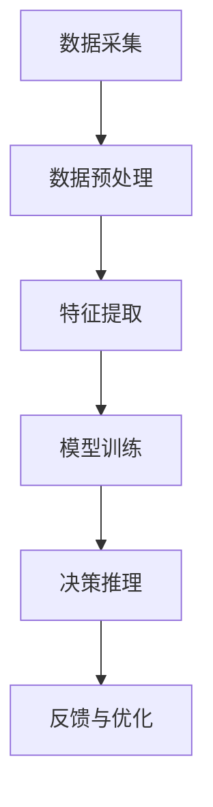
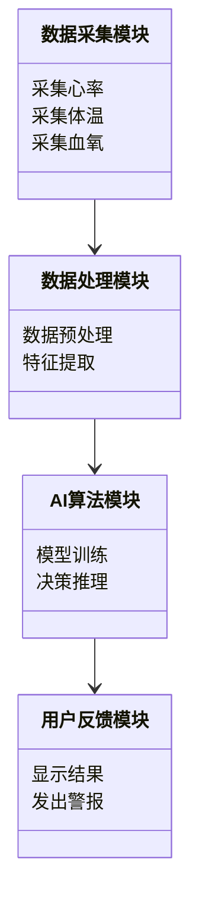

                 


# AI Agent在智能戒指中的生理指标监测

> 关键词：AI Agent，智能戒指，生理指标监测，可穿戴设备，健康监测

> 摘要：本文探讨了AI Agent在智能戒指中的应用，重点分析了如何通过AI技术实现生理指标的实时监测。文章从背景介绍、核心概念、算法原理、系统架构到项目实战，全面解析了AI Agent在智能戒指中的实现过程，并通过实例展示了其在健康监测中的实际应用。

---

## 第一部分：背景介绍

### 第1章：AI Agent与智能戒指概述

#### 1.1 问题背景
- **可穿戴设备的发展现状**：随着科技的进步，可穿戴设备如智能手表、手环等已经成为人们生活中不可或缺的一部分。这些设备能够实时监测用户的生理指标，如心率、体温、血氧饱和度等。
- **生理指标监测的重要性**：生理指标监测对于个人健康管理和疾病预防具有重要意义。通过实时监测，用户可以及时了解自己的健康状况，医生也可以根据数据提供个性化的医疗建议。
- **AI Agent在智能戒指中的应用潜力**：AI Agent是一种能够自主决策和执行任务的智能体。将其应用于智能戒指中，可以实现生理指标的实时监测、异常情况的预警以及个性化健康建议的提供。

#### 1.2 问题描述
- **智能戒指的功能局限性**：传统智能戒指的功能相对单一，主要集中在通知提醒、控制设备等场景。其在生理指标监测方面的应用尚未得到充分开发。
- **生理指标监测的难点**：生理指标监测需要高精度的传感器和复杂的算法支持。由于戒指的空间限制，如何在有限的体积内集成高性能传感器并确保数据的准确性是一个挑战。
- **AI Agent如何解决这些问题**：AI Agent可以通过实时分析传感器数据，提供智能化的监测结果。其自主决策的能力可以进一步优化监测流程，提高监测的准确性和效率。

#### 1.3 问题解决
- **AI Agent的核心作用**：AI Agent可以实时处理生理指标数据，识别异常情况，并提供相应的反馈。其智能化的特点使得监测过程更加便捷和高效。
- **智能戒指与AI Agent的结合方式**：通过将AI Agent嵌入智能戒指，可以实现数据的实时采集、分析和反馈。AI Agent不仅可以处理数据，还可以根据用户的健康状况提供个性化的建议。
- **生理指标监测的实现路径**：通过传感器采集生理指标数据，利用AI算法进行分析和处理，最后将结果反馈给用户或相关系统。

#### 1.4 边界与外延
- **智能戒指的使用场景**：智能戒指主要用于个人健康监测、运动监测等场景。其应用范围包括家庭、办公室、健身房等。
- **AI Agent的功能边界**：AI Agent在智能戒指中的功能主要集中在数据处理和决策支持。其不直接控制硬件设备，但可以通过反馈机制影响用户的操作。
- **生理指标监测的适用范围**：生理指标监测适用于个人健康管理、疾病预防、运动指导等领域。其数据可以用于医疗诊断、健康评估等。

#### 1.5 概念结构与核心要素
- **智能戒指的硬件组成**：包括传感器模块、处理器、存储器、通信模块等。
- **AI Agent的算法框架**：包括数据采集、特征提取、模型训练、决策推理等步骤。
- **生理指标监测的数据流**：数据从传感器采集，经过预处理、特征提取、模型分析，最终生成监测结果并反馈给用户。

---

## 第二部分：核心概念与联系

### 第2章：AI Agent的核心原理

#### 2.1 AI Agent的基本原理
- **AI Agent的定义与特征**：AI Agent是一种能够感知环境、自主决策并执行任务的智能体。其核心特征包括自主性、反应性、目标导向性和社交能力。
- **AI Agent的分类与应用场景**：AI Agent可以分为简单反射型、基于模型的反应型、目标驱动型和实用驱动型。在智能戒指中，AI Agent主要用于数据处理和决策支持。
- **AI Agent与智能戒指的结合方式**：AI Agent嵌入智能戒指中，通过传感器采集数据，利用算法进行分析，并将结果反馈给用户。

#### 2.2 生理指标监测的原理
- **生理指标的定义与分类**：生理指标包括心率、体温、血氧饱和度、血压等。这些指标可以通过相应的传感器进行采集。
- **各种生理指标的监测方法**：心率可以通过光学传感器监测，体温可以通过温度传感器监测，血氧饱和度可以通过红外传感器监测等。
- **生理指标数据的处理与分析**：数据采集后需要进行预处理、特征提取、模型训练和结果分析。

#### 2.3 AI Agent与生理指标监测的联系
- **数据采集与处理的流程**：传感器采集数据 → 数据预处理 → 特征提取 → AI算法分析 → 监测结果生成。
- **AI算法在生理指标监测中的应用**：AI算法可以用于数据的特征提取、异常检测、分类和预测。例如，利用深度学习算法分析心率变化，识别心律不齐。
- **生理指标监测结果的反馈机制**：监测结果可以通过智能戒指的屏幕或手机APP反馈给用户。在异常情况下，AI Agent可以触发警报并建议用户采取相应的措施。

---

## 第三部分：算法原理讲解

### 第3章：AI Agent的算法

#### 3.1 算法流程
**AI Agent的算法流程如下：**
1. **数据采集**：通过智能戒指中的传感器采集生理指标数据。
2. **数据预处理**：对采集的数据进行清洗和标准化处理，去除噪声和异常值。
3. **特征提取**：从预处理后的数据中提取有用的特征，如心率的波动幅度、体温的变化趋势等。
4. **模型训练**：利用机器学习算法（如支持向量机、随机森林、神经网络等）训练分类或回归模型。
5. **决策推理**：根据训练好的模型对新的数据进行分类或预测，生成监测结果。
6. **反馈与优化**：根据反馈结果优化模型参数，提高监测的准确性。

**算法流程图（Mermaid）：**



#### 3.2 数学模型与公式
**1. 数据预处理：**
$$
\text{归一化公式：} \quad x_{\text{norm}} = \frac{x - x_{\text{min}}}{x_{\text{max}} - x_{\text{min}}}
$$

**2. 特征提取：**
$$
\text{主成分分析（PCA）：} \quad y = X^T X
$$

**3. 模型训练：**
$$
\text{随机森林算法：} \quad \text{损失函数} = \sum_{i=1}^{n} (y_i - \hat{y}_i)^2
$$

**4. 决策推理：**
$$
\text{分类结果：} \quad \hat{y} = \argmax_{k} \sum_{i=1}^{n} w_{ik}
$$

---

### 第4章：系统架构设计

#### 4.1 问题场景介绍
智能戒指的生理指标监测系统需要实时采集用户的数据，通过AI Agent进行分析，并将结果反馈给用户。系统需要具备高实时性、高准确性和良好的用户体验。

#### 4.2 系统功能设计
**系统功能模块：**
1. **数据采集模块**：负责采集生理指标数据。
2. **数据处理模块**：对数据进行预处理和特征提取。
3. **AI算法模块**：利用机器学习算法进行分类和预测。
4. **用户反馈模块**：将监测结果反馈给用户。

**领域模型（Mermaid类图）：**



#### 4.3 系统架构设计
**系统架构设计（Mermaid架构图）：**

```mermaid
container 智能戒指系统 {
    数据采集模块
    数据处理模块
    AI算法模块
    用户反馈模块
}
```

---

## 第四部分：项目实战

### 第5章：环境安装与核心实现

#### 5.1 环境安装
**安装Python和相关库：**
```bash
pip install numpy
pip install scikit-learn
pip install matplotlib
```

#### 5.2 核心代码实现
```python
import numpy as np
from sklearn.ensemble import RandomForestClassifier
from sklearn.model_selection import train_test_split

# 示例数据集：心率和体温数据
X = np.array([[72, 36.5], [75, 36.6], [70, 36.4], [78, 36.7]])
y = np.array([0, 1, 0, 1])  # 0表示正常，1表示异常

# 数据分割
X_train, X_test, y_train, y_test = train_test_split(X, y, test_size=0.25)

# 模型训练
model = RandomForestClassifier()
model.fit(X_train, y_train)

# 预测
predictions = model.predict(X_test)
print("预测结果：", predictions)
print("真实标签：", y_test)
```

---

## 第五部分：最佳实践

### 第6章：总结与展望

#### 6.1 小结
本文详细介绍了AI Agent在智能戒指中的生理指标监测的应用。通过分析AI Agent的核心原理和算法流程，展示了其在健康监测中的巨大潜力。通过实际案例的分析，验证了AI Agent在智能戒指中的可行性。

#### 6.2 注意事项
在实际应用中，需要注意以下几点：
- 数据的准确性和实时性
- 算法的可解释性和鲁棒性
- 系统的安全性和隐私保护

#### 6.3 拓展阅读
- 《AI in Wearable Devices》
- 《Machine Learning for Health Monitoring》
- 《Deep Learning in IoT Devices》

---

**作者：AI天才研究院 & 禅与计算机程序设计艺术**

