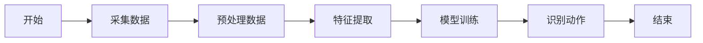
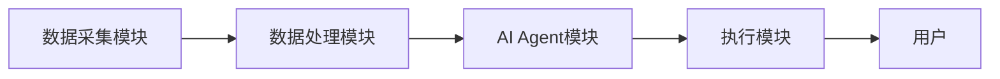

                 


# AI Agent在智能手套中的手部康复训练

> 关键词：AI Agent, 智能手套, 手部康复, 运动捕捉, 机器学习

> 摘要：本文探讨AI Agent在智能手套中的应用，分析其在手部康复训练中的技术原理、算法实现和系统架构。通过详细的技术分析和案例研究，揭示AI Agent如何提升康复效果，为康复医学提供新的解决方案。

---

## 第一部分: AI Agent在智能手套中的手部康复训练概述

### 第1章: AI Agent与智能手套概述

#### 1.1 AI Agent的基本概念

- **1.1.1 人工智能代理的定义**
  AI Agent是一种智能实体，能够感知环境、自主决策并执行任务，以实现特定目标。它具备自主性、反应性、目标导向性和社交能力。

- **1.1.2 AI Agent的核心特征**
  - 自主性：无需外部干预，自主完成任务。
  - 反应性：实时感知环境并调整行为。
  - 目标导向性：根据目标优化决策。
  - 社交能力：与人类或其他系统有效交互。

- **1.1.3 AI Agent与传统算法的区别**
  AI Agent不仅仅是算法，它具备自主性和适应性，能够动态调整策略以应对环境变化。

#### 1.2 智能手套的基本原理

- **1.2.1 智能手套的组成结构**
  智能手套通常由传感器、数据处理单元、执行机构和人机交互界面组成。传感器负责采集手部数据，数据处理单元分析数据并生成指令，执行机构根据指令调整手套，提供反馈。

- **1.2.2 智能手套的核心传感器技术**
  - 加速度计：测量手部运动的加速度。
  - 角度传感器：测量关节角度。
  - 肌电信号传感器：捕捉肌肉活动，分析手部动作。

- **1.2.3 智能手套的交互方式**
  通过触觉反馈、声音反馈和视觉反馈与用户互动，提供实时指导和反馈，增强用户体验。

#### 1.3 手部康复训练的背景与需求

- **1.3.1 手部康复训练的基本概念**
  手部康复训练旨在通过特定的运动帮助患者恢复手部功能，常见于中风、创伤或神经损伤后的康复。

- **1.3.2 手部康复训练的主要挑战**
  - 个性化需求：每个患者的康复计划不同。
  - 实时反馈：需要及时调整训练强度。
  - 持续性：患者需要长期坚持训练。

- **1.3.3 智能手套在康复训练中的优势**
  智能手套通过AI Agent提供个性化训练计划、实时反馈和持续监测，显著提高康复效果。

---

### 第2章: AI Agent在手部康复中的应用背景

#### 2.1 康复医学的发展历程

- **2.1.1 传统康复医学的局限性**
  传统康复依赖人工操作，缺乏个性化和实时反馈，难以满足复杂康复需求。

- **2.1.2 现代康复医学的技术进步**
  引入AI、传感器和机器人技术，推动康复医学向智能化、个性化方向发展。

- **2.1.3 AI技术在康复医学中的应用潜力**
  AI Agent能够实时分析数据，动态调整康复计划，提升康复效率。

#### 2.2 手部康复训练的核心问题

- **2.2.1 手部运动的生物力学分析**
  手部运动涉及多个关节和肌肉群，复杂性高，需要精确的运动捕捉和分析。

- **2.2.2 康复训练的个性化需求**
  每个患者的损伤程度不同，康复计划需个性化定制。

- **2.2.3 康复训练的效果评估**
  通过量化指标评估康复效果，确保训练的有效性。

#### 2.3 AI Agent在康复训练中的作用

- **2.3.1 AI Agent在个性化康复方案中的应用**
  根据患者数据生成个性化训练计划，确保训练的针对性。

- **2.3.2 AI Agent在实时反馈中的作用**
  实时监测训练数据，提供即时反馈，帮助患者调整动作。

- **2.3.3 AI Agent在康复效果评估中的价值**
  分析长期数据，评估康复进展，优化康复策略。

---

### 第3章: AI Agent与智能手套的核心概念

#### 3.1 AI Agent的基本原理

- **3.1.1 AI Agent的感知模块**
  通过传感器和数据采集技术获取环境信息，如手部运动数据和肌电信号。

- **3.1.2 AI Agent的决策模块**
  利用机器学习算法分析数据，生成决策，如调整训练强度或纠正动作。

- **3.1.3 AI Agent的执行模块**
  根据决策指令，通过执行机构调整手套，提供反馈或辅助训练。

#### 3.2 智能手套的核心技术

- **3.2.1 传感器技术**
  使用多种传感器（如加速度计、角度传感器、肌电信号传感器）采集手部数据。

- **3.2.2 数据采集与处理技术**
  采集数据后进行预处理，去除噪声，提取特征，为后续分析提供高质量数据。

- **3.2.3 人机交互技术**
  通过触觉、听觉和视觉反馈与用户互动，提供实时指导和反馈。

#### 3.3 AI Agent与智能手套的结合

- **3.3.1 AI Agent在智能手套中的角色**
  作为智能系统的核心，AI Agent负责数据处理、决策和反馈生成。

- **3.3.2 智能手套对AI Agent的支持**
  提供丰富的传感器数据和实时反馈机制，支持AI Agent的高效运行。

- **3.3.3 两者的协同工作模式**
  AI Agent与智能手套协同，实时分析手部数据，动态调整训练计划，提供个性化反馈。

#### 3.4 核心概念对比表

**表3.1: AI Agent与传统算法的对比**

| 对比维度      | AI Agent                          | 传统算法                        |
|---------------|-----------------------------------|---------------------------------|
| 自主性         | 高                                 | 低                               |
| 适应性         | 高                                 | 低                               |
| 决策能力       | 强                                 | 弱                               |
| 反馈机制       | 实时反馈                           | 延时反馈或无反馈                 |

**表3.2: 智能手套与传统康复设备的对比**

| 对比维度      | 智能手套                          | 传统康复设备                    |
|---------------|-----------------------------------|---------------------------------|
| 个性化         | 高                                 | 低                               |
| 实时反馈       | 高                                 | 低                               |
| 可扩展性       | 高                                 | 低                               |
| 交互方式       | 多感官反馈                         | 单一反馈                         |

---

### 第4章: AI Agent在手部康复训练中的算法原理

#### 4.1 基于传感器数据的运动捕捉算法

- **4.1.1 数据采集与预处理**
  使用多种传感器采集手部数据，去除噪声，提取关键特征。

- **4.1.2 基于深度学习的运动识别**
  使用卷积神经网络（CNN）或长短期记忆网络（LSTM）进行手部动作识别。

- **4.1.3 算法流程图（Mermaid）**



---

**核心代码实现（Python）**

```python
import numpy as np
from sklearn.model_selection import train_test_split
from tensorflow.keras.models import Sequential
from tensorflow.keras.layers import LSTM, Dense, Dropout

# 假设X是特征向量，y是标签
X_train, X_test, y_train, y_test = train_test_split(features, labels, test_size=0.2)

model = Sequential()
model.add(LSTM(64, input_shape=(timesteps, features)))
model.add(Dropout(0.5))
model.add(Dense(10, activation='softmax'))

model.compile(loss='sparse_categorical_crossentropy', optimizer='adam', metrics=['accuracy'])
model.fit(X_train, y_train, epochs=10, batch_size=32)
```

#### 4.2 基于肌电信号的手部动作识别

- **4.2.1 肌电信号采集与处理**
  使用肌电信号传感器采集肌肉活动，通过滤波和特征提取处理信号。

- **4.2.2 基于机器学习的动作分类**
  使用支持向量机（SVM）或随机森林（Random Forest）进行分类。

- **4.2.3 算法实现代码（Python）**

```python
from sklearn.svm import SVC
from sklearn.preprocessing import StandardScaler

# 数据预处理
scaler = StandardScaler()
X_scaled = scaler.fit_transform(X)

# 模型训练
model = SVC(C=1.0, kernel='rbf', gamma='auto')
model.fit(X_scaled, y)

# 预测
y_pred = model.predict(X_scaled)
```

#### 4.3 康复训练计划生成算法

- **4.3.1 基于用户数据的个性化训练计划**
  根据患者的历史数据和当前状态，生成个性化康复计划。

- **4.3.2 基于反馈的动态调整算法**
  根据实时反馈动态调整训练强度和内容。

- **4.3.3 算法数学模型（Latex公式）**

$$
\text{训练强度} = f(\text{当前状态}, \text{历史数据}, \text{目标})
$$

---

**系统架构与设计方案**

### 第5章: 系统架构与设计方案

#### 5.1 系统总体架构

- **系统模块划分**
  - 数据采集模块：采集手部数据。
  - 数据处理模块：预处理和特征提取。
  - AI Agent模块：分析数据，生成决策。
  - 执行模块：根据决策调整手套。

- **系统架构图（Mermaid）**



#### 5.2 项目实战

- **环境安装**
  - 安装必要的库：numpy、scikit-learn、tensorflow、mermaid。

- **系统核心实现源代码**

```python
# 初始化AI Agent
class AI-Agent:
    def __init__(self, sensors):
        self.sensors = sensors
        self.model = self.load_model()

    def process_data(self, data):
        # 数据处理逻辑
        pass

    def generate_feedback(self, data):
        # 生成反馈
        pass

# 实例化并运行
agent = AI-Agent(sensors)
agent.process_data(data)
feedback = agent.generate_feedback(data)
```

---

### 第6章: 最佳实践与总结

#### 6.1 最佳实践

- **数据质量**
  确保传感器数据的准确性和完整性，定期校准设备。

- **用户体验**
  提供直观的反馈和友好的交互界面，提升用户体验。

- **持续优化**
  定期更新模型，结合用户反馈持续优化算法。

#### 6.2 小结

AI Agent在智能手套中的应用显著提升了手部康复训练的效果，通过实时反馈和个性化训练计划，帮助患者更快恢复手部功能。然而，仍需进一步研究如何提高系统的稳定性和适应性。

#### 6.3 注意事项

- 确保系统的安全性，避免因设备故障导致意外。
- 定期维护设备，确保传感器和执行机构正常工作。
- 保护患者数据隐私，遵守相关法律法规。

#### 6.4 拓展阅读

- 探索更先进的AI算法，如强化学习，进一步提升康复效果。
- 研究多模态传感器数据的融合技术，提高系统的感知能力。

---

**作者：AI天才研究院 & 禅与计算机程序设计艺术**

---

通过以上详细的技术分析和案例研究，我们可以看到AI Agent在智能手套中的应用潜力巨大。未来，随着技术的进步，AI Agent将为手部康复训练提供更高效、个性化的解决方案，帮助更多患者恢复手部功能，提升生活质量。

