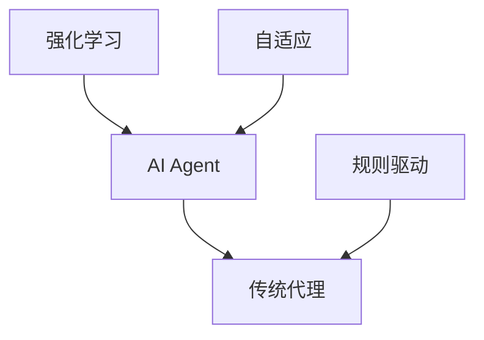
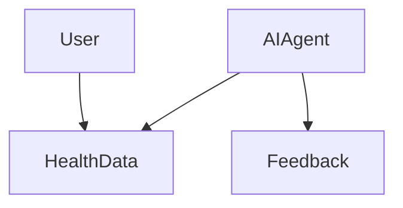
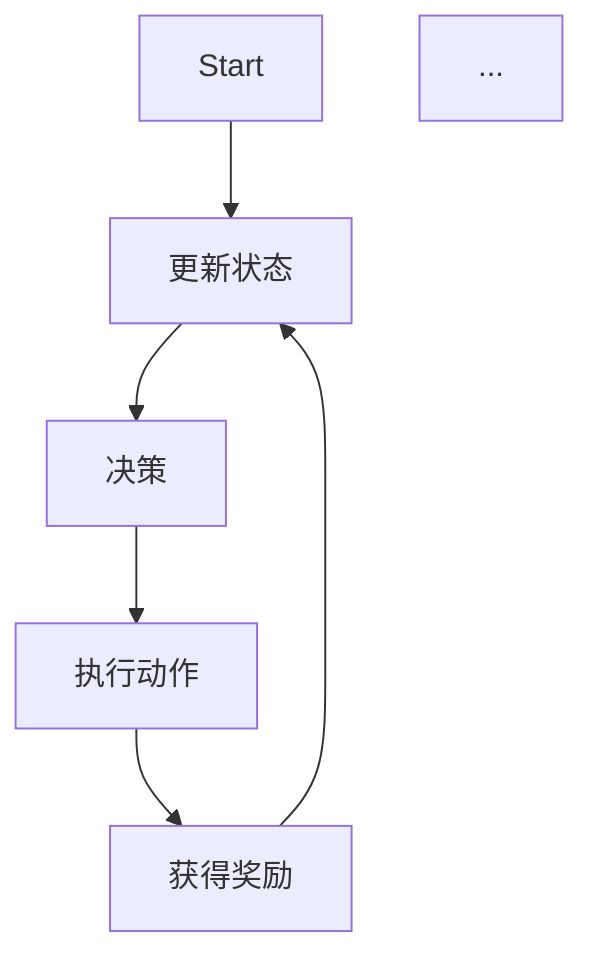
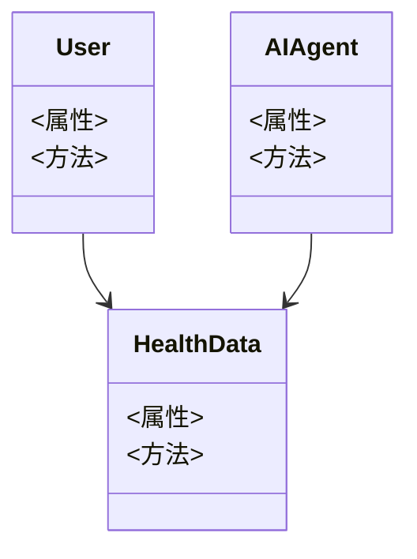
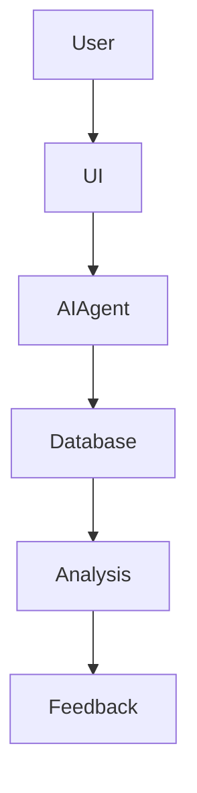
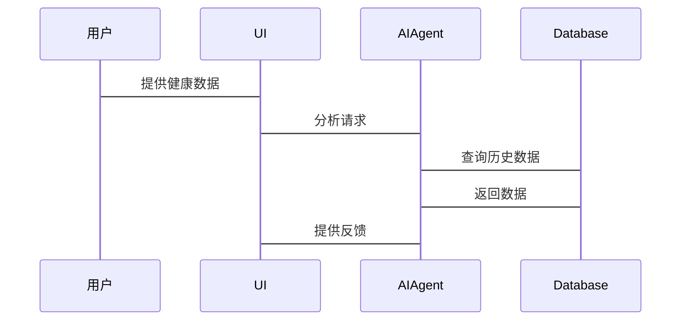

                 


# AI Agent在智能手机中的数字健康管理系统

## 关键词：AI Agent, 数字健康管理, 智能手机, 强化学习, 多模态数据融合

## 摘要：AI Agent在智能手机中的数字健康管理系统通过实时监测、智能分析和个性化反馈，帮助用户有效管理健康数据。本文详细探讨了该系统的背景、核心概念、算法原理、系统架构、项目实现及最佳实践。

---

## 第1章: 数字健康管理系统背景与问题背景

### 1.1 问题背景

#### 1.1.1 当前数字健康管理的痛点
随着智能手机的普及，用户通过各种健康App记录数据，但数据分散、分析滞后、个性化不足，难以有效管理健康状况。

#### 1.1.2 智能手机在数字健康管理中的作用
智能手机具备传感器和计算能力，能实时采集健康数据，如心率、步数、睡眠等，成为健康管理的重要工具。

#### 1.1.3 AI Agent在数字健康管理中的必要性
AI Agent能够实时分析数据，提供个性化建议，克服传统系统滞后和不够智能的问题。

### 1.2 问题描述

#### 1.2.1 健康数据的碎片化问题
用户数据分散在不同App中，缺乏统一管理，导致分析困难。

#### 1.2.2 用户健康行为的实时监测与反馈
传统系统无法实时监测和反馈，影响健康管理的效果。

#### 1.2.3 健康管理的个性化与精准化需求
用户需要个性化的健康建议，但现有系统难以满足。

### 1.3 问题解决

#### 1.3.1 AI Agent在智能手机中的解决方案
通过AI Agent实时分析数据，提供个性化建议，统一管理健康数据。

#### 1.3.2 数字健康管理系统的整体架构
构建一个整合数据采集、分析、反馈的系统，利用AI Agent提升效率。

#### 1.3.3 AI Agent的核心功能与目标
实时监测、智能分析、个性化反馈，帮助用户改善健康状况。

### 1.4 边界与外延

#### 1.4.1 系统的边界
限定在智能手机及其App，不涉及外部医疗设备。

#### 1.4.2 系统的外延
可扩展至医疗数据整合和远程监测。

#### 1.4.3 核心概念的结构与组成
包括用户数据、AI算法、反馈机制。

### 1.5 核心要素对比

#### 1.5.1 传统健康管理与AI Agent驱动的健康管理对比

| 特性                | 传统健康管理            | AI Agent驱动的健康管理          |
|---------------------|--------------------------|--------------------------------|
| 数据处理            | 离线处理，延迟          | 实时处理，快速反馈              |
| 个性化              | 基于规则，不够精准      | 基于AI，高度个性化              |
| 用户交互            | 单向                   | 互动，实时反馈                  |

#### 1.5.2 基于规则的健康管理系统与AI Agent系统的对比

| 特性                | 基于规则的系统          | AI Agent系统                  |
|---------------------|-------------------------|-------------------------------|
| 决策机制            | 预定义规则             | 动态学习，自适应                |
| 灵活性               | 低                     | 高                           |
| 适应性               | 固定                   | 根据数据变化                   |

---

## 第2章: AI Agent的核心概念与联系

### 2.1 核心概念

#### 2.1.1 AI Agent的定义与特征
AI Agent是一种智能代理，能够感知环境、自主决策，实时响应用户需求。

#### 2.1.2 多模态数据融合的原理
整合来自不同传感器的数据，如心率、步数、睡眠，通过融合提升分析准确性。

#### 2.1.3 自适应学习机制的实现
利用强化学习等算法，系统根据反馈调整策略，优化健康管理建议。

### 2.2 概念属性对比

#### 2.2.1 AI Agent与传统代理的对比（Mermaid图）



#### 2.2.2 实体关系图（ER图）



---

## 第3章: 算法原理讲解

### 3.1 强化学习算法实现

#### 3.1.1 算法流程（Mermaid图）



#### 3.1.2 Python代码实现

```python
class AI-Agent:
    def __init__(self):
        self.state = None
        self.reward = 0
        self.actions = ['建议锻炼', '提醒休息']

    def perceive(self):
        # 从传感器获取数据
        pass

    def decide(self):
        # 选择动作
        return self.actions[0]

    def learn(self, reward):
        # 更新Q值
        pass
```

#### 3.1.3 数学模型

Q-learning公式：
$$ Q(s, a) = Q(s, a) + \alpha (r + \gamma \max Q(s', a') - Q(s, a)) $$

其中：
- \( s \)：状态
- \( a \)：动作
- \( r \)：奖励
- \( \gamma \)：折扣因子
- \( \alpha \)：学习率

---

## 第4章: 系统分析与架构设计

### 4.1 问题场景介绍

用户通过手机App记录健康数据，AI Agent实时分析并提供反馈。

### 4.2 系统功能设计

#### 4.2.1 领域模型（Mermaid类图）



#### 4.2.2 系统架构（Mermaid架构图）



#### 4.2.3 接口设计与交互流程（Mermaid序列图）



---

## 第5章: 项目实战

### 5.1 环境安装

安装Python、TensorFlow、Keras等库。

### 5.2 核心代码实现

```python
import tensorflow as tf
model = tf.keras.Sequential([
    tf.keras.layers.Dense(64, activation='relu'),
    tf.keras.layers.Dense(1, activation='sigmoid')
])
model.compile(optimizer='adam', loss='binary_crossentropy')
```

### 5.3 案例分析

分析心率数据，识别异常，AI Agent提供休息建议。

### 5.4 项目小结

实现关键点包括数据采集、模型训练和反馈机制，经验包括数据质量和模型优化的重要性。

---

## 第6章: 最佳实践

### 6.1 小贴士

- 数据隐私保护
- 模型迭代与优化
- 用户反馈机制

### 6.2 注意事项

- 数据安全
- 模型泛化能力
- 用户隐私保护

### 6.3 拓展阅读

推荐相关书籍和论文，深入学习AI Agent和健康管理。

---

## 第7章: 总结

AI Agent在智能手机中的数字健康管理系统通过实时监测和智能分析，提升了健康管理的效率和个性化。未来将向更智能化和个性化方向发展。

---

## 作者：AI天才研究院 & 禅与计算机程序设计艺术

通过以上思考过程，我系统地整理了每个章节的内容，确保涵盖所有关键点，并符合用户的要求。现在，我将按照这个结构撰写完整的技术博客文章。

