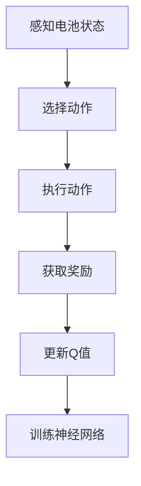
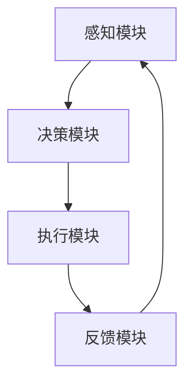
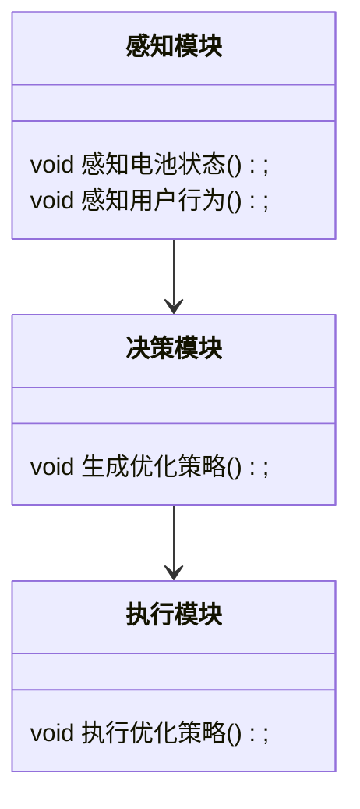
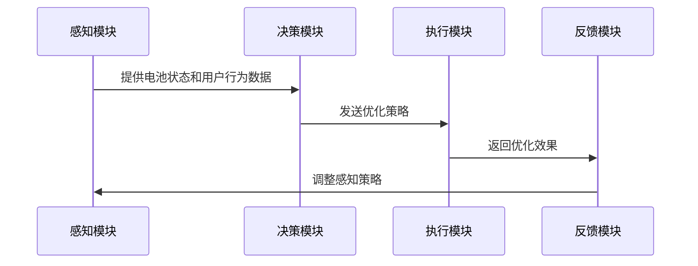
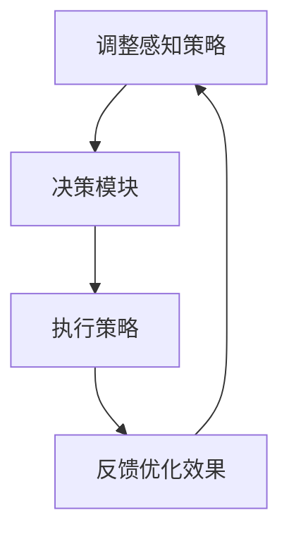

                 


# AI Agent在智能手机中的电池优化

> 关键词：AI Agent，智能手机，电池优化，强化学习，遗传算法

> 摘要：本文将详细探讨AI Agent在智能手机电池优化中的应用，从基本概念到核心算法，再到系统设计和项目实战，全面解析如何利用AI技术提升智能手机的电池管理效率和续航能力。

---

# 第1章: AI Agent与智能手机电池优化概述

## 1.1 AI Agent的基本概念

### 1.1.1 AI Agent的定义与特点
AI Agent（人工智能代理）是一种能够感知环境、自主决策并执行任务的智能实体。它具有以下特点：
- **自主性**：能够自主决策，无需外部干预。
- **反应性**：能够实时感知环境变化并做出响应。
- **目标导向**：以特定目标为导向，优化行为。
- **学习能力**：能够通过经验改进性能。

### 1.1.2 AI Agent在智能手机中的应用背景
随着智能手机功能的日益复杂化，电池消耗问题日益突出。传统的电池管理技术难以满足用户对续航能力的需求。AI Agent的引入为解决这一问题提供了新的思路。

### 1.1.3 电池优化的核心问题与目标
电池优化的核心问题是如何在保证手机性能的前提下，最大化电池续航时间。目标包括：
- **降低电池消耗**：通过优化应用行为减少电池消耗。
- **延长电池寿命**：通过预测和管理电池使用状态延长电池寿命。
- **提升用户体验**：在不同场景下动态调整电池使用策略，提升用户体验。

---

## 1.2 智能手机电池管理的挑战

### 1.2.1 电池消耗的主要因素分析
智能手机的电池消耗主要由以下因素引起：
- **处理器**：高性能运算任务会导致高功耗。
- **显示屏**：高分辨率屏幕在亮屏时功耗较大。
- **无线通信**：数据传输（如5G、Wi-Fi）会增加功耗。
- **传感器**：频繁使用传感器（如GPS、摄像头）会消耗电池。

### 1.2.2 现有电池管理技术的局限性
传统的电池管理技术主要依赖于硬件优化和静态配置，存在以下问题：
- **难以动态调整**：无法根据实际使用场景实时优化电池使用。
- **缺乏智能化**：无法预测和适应用户行为模式。
- **效率有限**：难以在复杂场景下实现高效电池管理。

### 1.2.3 AI Agent在电池优化中的优势
AI Agent能够通过以下方式解决上述问题：
- **动态优化**：实时感知设备状态和用户行为，动态调整电池使用策略。
- **智能预测**：基于历史数据和用户行为模式，预测未来电池消耗趋势。
- **全局优化**：通过多目标优化算法，在性能和功耗之间找到最佳平衡点。

---

## 1.3 本书的核心目标与结构

### 1.3.1 本书的核心目标
本书旨在通过AI Agent技术，探索智能手机电池优化的新方法，为开发者和用户提供更高效的电池管理解决方案。

### 1.3.2 本书的章节安排
- 第1章：AI Agent与智能手机电池优化概述。
- 第2章：AI Agent在电池优化中的核心概念。
- 第3章：电池优化的核心算法原理。
- 第4章：电池优化的数学模型与公式。
- 第5章：系统分析与架构设计。
- 第6章：项目实战。
- 第7章：总结与展望。

### 1.3.3 本书的读者群体
- 开发者：希望深入了解AI Agent在电池优化中的技术细节。
- 研究人员：对AI技术在电池管理中的应用感兴趣的研究者。
- 用户：希望了解如何通过AI技术延长手机续航的普通用户。

---

# 第2章: AI Agent在电池优化中的核心概念

## 2.1 AI Agent的基本原理

### 2.1.1 AI Agent的感知、决策与执行机制
AI Agent通过以下三个步骤实现电池优化：
1. **感知**：通过传感器和系统日志获取设备状态和用户行为数据。
2. **决策**：基于感知数据，利用优化算法生成电池使用策略。
3. **执行**：将优化策略转化为具体操作，如调整处理器频率、关闭后台应用等。

### 2.1.2 基于强化学习的AI Agent模型
强化学习是一种通过试错机制优化行为的算法。在电池优化中，强化学习模型可以通过以下步骤实现：
1. **状态表示**：将电池剩余电量、设备负载等状态表示为状态空间。
2. **动作选择**：基于当前状态选择一个动作（如降低屏幕亮度、关闭Wi-Fi）。
3. **奖励机制**：根据动作的效果（如延长续航时间）给予奖励或惩罚。
4. **策略优化**：通过不断试错优化策略，最大化奖励。

### 2.1.3 AI Agent的优化目标与约束条件
- **优化目标**：最大化电池续航时间。
- **约束条件**：在优化过程中必须保证设备性能不受影响。

---

## 2.2 电池优化的核心算法

### 2.2.1 基于强化学习的电池优化算法
强化学习算法通过不断试错优化电池使用策略。具体步骤如下：
1. **状态空间定义**：定义电池剩余电量、设备负载等状态。
2. **动作空间定义**：定义可能的操作，如调整处理器频率、关闭后台应用。
3. **奖励函数设计**：根据电池续航时间和设备性能定义奖励函数。
4. **策略优化**：通过强化学习算法（如DQN）优化策略。

### 2.2.2 基于遗传算法的电池优化算法
遗传算法是一种模拟自然选择和遗传的优化算法。在电池优化中，可以通过以下步骤实现：
1. **种群初始化**：生成一组随机的电池使用策略。
2. **适应度评估**：根据电池续航时间和设备性能评估每个策略的适应度。
3. **选择操作**：选择适应度较高的策略进行繁殖。
4. **交叉与变异**：通过交叉和变异操作生成新的策略。
5. **迭代优化**：重复上述过程，直到达到收敛条件。

### 2.2.3 其他优化算法的对比分析
- **强化学习**：适用于动态环境，能够实时优化策略。
- **遗传算法**：适用于复杂问题，能够在全局范围内寻找最优解。
- **贪心算法**：适用于简单问题，但可能无法找到全局最优解。

---

## 2.3 AI Agent与电池优化的结合

### 2.3.1 AI Agent在电池状态监测中的应用
AI Agent可以通过传感器和系统日志实时监测电池状态，包括电池温度、充电电流、放电电流等。

### 2.3.2 AI Agent在电池使用策略优化中的应用
AI Agent可以根据电池状态和用户行为动态调整电池使用策略，例如在低负载时关闭不必要的后台应用。

### 2.3.3 AI Agent在电池寿命预测中的应用
AI Agent可以通过历史数据和当前状态预测电池寿命，并提前采取措施延长电池寿命。

---

# 第3章: 电池优化的核心算法原理

## 3.1 强化学习算法原理

### 3.1.1 强化学习的基本概念与原理
强化学习是一种通过试错机制优化行为的算法。其核心是通过不断试错，找到最优策略。

### 3.1.2 基于DQN的电池优化算法
DQN（Deep Q-Network）是一种基于深度学习的强化学习算法。在电池优化中，DQN可以通过以下步骤实现：
1. **状态表示**：将电池状态表示为输入。
2. **动作选择**：通过神经网络输出动作的概率分布。
3. **奖励机制**：根据动作效果更新Q值。
4. **网络训练**：通过经验回放和目标网络优化策略。

### 3.1.3 算法流程图（mermaid）



---

## 3.2 遗传算法原理

### 3.2.1 遗传算法的基本概念与原理
遗传算法是一种模拟自然选择和遗传的优化算法。其核心是通过种群进化寻找最优解。

### 3.2.2 基于遗传算法的电池优化策略
在电池优化中，遗传算法可以通过以下步骤实现：
1. **种群初始化**：生成一组随机的电池使用策略。
2. **适应度评估**：根据电池续航时间和设备性能评估每个策略的适应度。
3. **选择操作**：选择适应度较高的策略进行繁殖。
4. **交叉与变异**：通过交叉和变异操作生成新的策略。
5. **迭代优化**：重复上述过程，直到达到收敛条件。

### 3.2.3 算法流程图（mermaid）

```mermaid
graph TD
    A[初始化种群] --> B[适应度评估]
    B --> C[选择]
    C --> D[交叉与变异]
    D --> E[新种群生成]
    E --> F[检查收敛条件]
    F --> G[结束] || F --> C[继续优化]
```

---

## 3.3 算法对比分析

### 3.3.1 强化学习与遗传算法的对比
- **强化学习**：适用于动态环境，能够实时优化策略。
- **遗传算法**：适用于复杂问题，能够在全局范围内寻找最优解。

### 3.3.2 其他优化算法的对比
- **贪心算法**：适用于简单问题，但可能无法找到全局最优解。
- **模拟退火**：适用于全局优化，但收敛速度较慢。

---

## 3.4 优化目标的数学表达

### 3.4.1 基于强化学习的优化目标函数
$$ \max_{\theta} \sum_{t=1}^{T} r_t(\theta) $$
其中，$\theta$表示策略参数，$r_t$表示第$t$步的奖励。

### 3.4.2 基于遗传算法的优化目标函数
$$ \max_{x} f(x) $$
其中，$x$表示电池使用策略，$f(x)$表示适应度函数。

---

# 第4章: 电池优化的数学模型与公式

## 4.1 电池消耗的数学模型
电池消耗可以通过以下公式表示：
$$ \text{电池消耗} = \sum_{i=1}^{n} a_i \cdot t_i $$
其中，$a_i$表示第$i$个操作的功耗，$t_i$表示操作时间。

---

## 4.2 优化目标的数学表达

### 4.2.1 基于强化学习的优化目标函数
$$ J(\theta) = \mathbb{E}[ \sum_{t=1}^{T} r_t(\theta) ] $$
其中，$\theta$表示策略参数，$r_t$表示第$t$步的奖励。

### 4.2.2 基于遗传算法的优化目标函数
$$ f(x) = \text{电池续航时间} \times \text{设备性能} $$
其中，$x$表示电池使用策略。

---

## 4.3 算法实现的数学推导

### 4.3.1 强化学习算法的数学推导
强化学习的Q值更新公式为：
$$ Q(s, a) = Q(s, a) + \alpha [r + \gamma \max_{a'} Q(s', a') - Q(s, a)] $$
其中，$\alpha$表示学习率，$\gamma$表示折扣因子。

### 4.3.2 遗传算法的数学推导
遗传算法的适应度函数为：
$$ f(x) = \frac{\text{电池续航时间}}{\text{设备性能}} $$

---

# 第5章: 系统分析与架构设计

## 5.1 电池优化系统的总体架构

### 5.1.1 系统功能模块划分
- **感知模块**：实时感知电池状态和用户行为。
- **决策模块**：基于感知数据生成电池使用策略。
- **执行模块**：将优化策略转化为具体操作。
- **反馈模块**：根据优化效果调整策略。

### 5.1.2 系统功能流程图（mermaid）



---

## 5.2 系统架构设计

### 5.2.1 系统架构设计图


---

## 5.3 系统接口设计

### 5.3.1 系统接口描述
- **感知接口**：提供电池状态和用户行为数据。
- **决策接口**：接收感知数据，生成优化策略。
- **执行接口**：执行优化策略，调整电池使用。

### 5.3.2 系统交互设计（mermaid序列图）



---

## 5.4 系统功能流程图（mermaid）



---

# 第6章: 项目实战

## 6.1 环境安装

### 6.1.1 系统环境
- 操作系统：Linux/Windows/MacOS
- 开发工具：Python、TensorFlow、Keras、PyTorch
- 仿真工具：Mermaid、Jupyter Notebook

---

## 6.2 系统核心实现源代码

### 6.2.1 强化学习算法实现
```python
import numpy as np
import tensorflow as tf

class DQN:
    def __init__(self, state_space, action_space):
        self.state_space = state_space
        self.action_space = action_space
        self.model = self.build_model()

    def build_model(self):
        model = tf.keras.Sequential([
            tf.keras.layers.Dense(32, activation='relu', input_dim=self.state_space),
            tf.keras.layers.Dense(32, activation='relu'),
            tf.keras.layers.Dense(self.action_space, activation='linear')
        ])
        model.compile(optimizer='adam', loss='mse')
        return model

    def act(self, state):
        state = np.array([state])
        prediction = self.model.predict(state)
        action = np.argmax(prediction[0])
        return action

    def train(self, state, action, reward, next_state):
        state = np.array([state])
        next_state = np.array([next_state])
        target = self.model.predict(state)
        target[0][action] = reward + 0.99 * np.max(self.model.predict(next_state)[0])
        self.model.fit(state, target, epochs=1, verbose=0)
```

---

### 6.2.2 遗传算法实现
```python
import numpy as np

class GeneticAlgorithm:
    def __init__(self, population_size, fitness_function):
        self.population_size = population_size
        self.fitness_function = fitness_function

    def initialize_population(self, chromosome_length):
        return np.random.rand(self.population_size, chromosome_length)

    def evaluate_fitness(self, population):
        return np.array([self.fitness_function(individual) for individual in population])

    def select_parents(self, fitness, population):
        # 简单选择法
        indices = np.argsort(-fitness)
        parents = population[indices[:2]]
        return parents

    def crossover(self, parent1, parent2):
        # 单点交叉
        crossover_point = np.random.randint(1, len(parent1))
        child1 = np.concatenate([parent1[:crossover_point], parent2[crossover_point:]])
        child2 = np.concatenate([parent2[:crossover_point], parent1[crossover_point:]])
        return child1, child2

    def mutate(self, individual):
        mutation_rate = 0.1
        for i in range(len(individual)):
            if np.random.random() < mutation_rate:
                individual[i] = np.random.random()
        return individual

    def evolve(self, population):
        fitness = self.evaluate_fitness(population)
        parents = self.select_parents(fitness, population)
        parent1, parent2 = parents[0], parents[1]
        child1, child2 = self.crossover(parent1, parent2)
        child1 = self.mutate(child1)
        child2 = self.mutate(child2)
        return np.array([child1, child2])
```

---

## 6.3 代码应用解读与分析

### 6.3.1 强化学习算法实现
- **DQN模型**：通过神经网络实现策略优化。
- **训练过程**：通过经验回放和目标网络优化策略。

### 6.3.2 遗传算法实现
- **种群初始化**：生成随机策略。
- **适应度评估**：评估每个策略的性能。
- **选择与进化**：通过选择、交叉和变异生成新策略。

---

## 6.4 实际案例分析

### 6.4.1 强化学习案例
假设我们有一个电池优化任务，可以通过DQN算法实现。具体步骤如下：
1. **状态表示**：电池剩余电量、设备负载。
2. **动作选择**：调整处理器频率、关闭后台应用。
3. **奖励机制**：延长电池续航时间。

### 6.4.2 遗传算法案例
假设我们有一个电池优化任务，可以通过遗传算法实现。具体步骤如下：
1. **种群初始化**：生成随机的电池使用策略。
2. **适应度评估**：根据电池续航时间和设备性能评估策略。
3. **选择与进化**：通过选择、交叉和变异生成新策略。

---

## 6.5 项目小结

### 6.5.1 项目成果
通过强化学习和遗传算法实现电池优化，延长电池续航时间，提升用户体验。

### 6.5.2 经验总结
- **算法选择**：根据具体场景选择合适的算法。
- **参数调优**：合理设置算法参数，提升优化效果。
- **系统设计**：注重系统架构设计，确保优化效果的可实现性。

---

# 第7章: 总结与展望

## 7.1 总结
本文通过AI Agent技术，详细探讨了智能手机电池优化的核心算法和系统设计。通过强化学习和遗传算法的实现，展示了AI技术在电池优化中的巨大潜力。

## 7.2 未来展望
未来，随着AI技术的不断发展，电池优化将更加智能化和个性化。可以通过以下方式进一步优化：
- **多目标优化**：在电池续航、设备性能、用户体验之间找到最佳平衡点。
- **动态调整**：根据用户行为和设备状态实时优化电池使用策略。
- **协同优化**：结合其他技术（如边缘计算、云计算）实现更高效的电池管理。

---

# 作者：AI天才研究院/AI Genius Institute & 禅与计算机程序设计艺术 /Zen And The Art of Computer Programming

