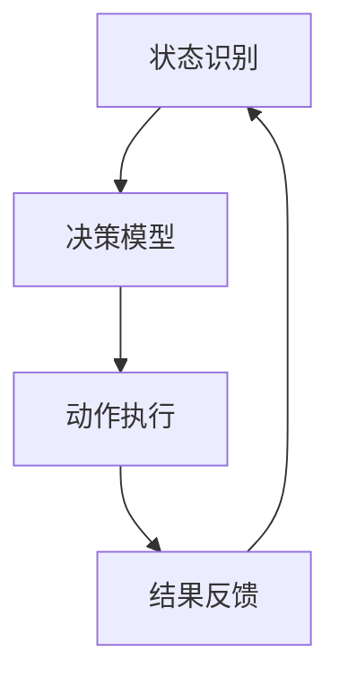
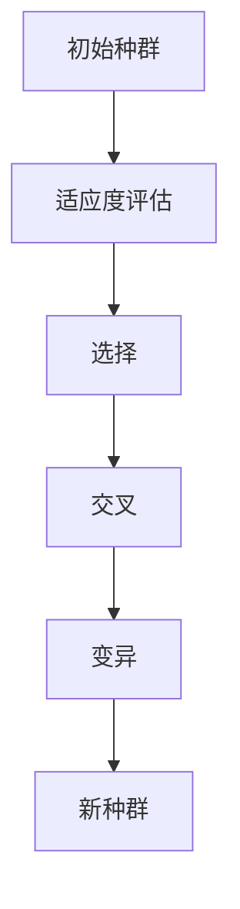
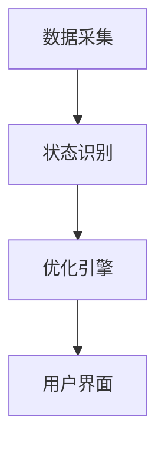
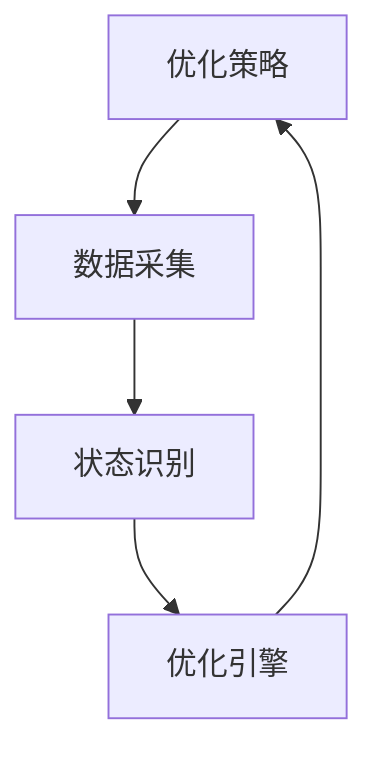

                 

<think>
好的，现在我需要根据用户的要求，撰写一篇关于《AI Agent在智能手机中的电池寿命优化系统》的技术博客文章。用户已经提供了非常详细的目录结构和一些章节内容的示例，我需要按照这个结构来完成整篇文章。

首先，我需要明确文章的结构，确保每个部分都包含必要的内容：背景介绍、核心概念、算法原理、系统分析与设计、项目实战、最佳实践等。每个章节下都需要有详细的内容，包括定义、原理、流程图、表格、代码示例等。

**第1章：AI Agent与智能手机电池寿命优化概述**
这一章需要介绍AI Agent的基本概念、智能手机电池寿命优化的背景以及问题背景与目标。我需要确保定义清晰，背景分析透彻，优化目标明确。

**第2章：AI Agent电池优化的核心原理**
这一章需要详细讲解AI Agent的决策机制、电池消耗模型以及优化算法的原理。我需要包括数学公式、流程图以及代码示例，确保读者能够理解这些概念。

**第3章：AI Agent电池优化算法的实现**
这一章需要详细描述算法的实现过程，包括数据预处理、状态识别、优化算法实现等。我需要提供Python代码示例，并解释每一步的作用。

**第4章：系统架构与设计实现**
这一章需要介绍系统架构的设计，包括模块划分、接口设计和交互流程图。我需要用mermaid图来展示系统的结构和流程。

**第5章：项目实战与优化案例分析**
这一章需要通过具体的项目实战来展示AI Agent在电池优化中的应用，包括环境安装、代码实现、案例分析和优化总结。

**第6章：系统优化与性能分析**
这一章需要分析系统的优化效果，包括性能指标、优化策略、对比分析和注意事项。我需要提供具体的数据和对比图表，以证明系统的有效性。

**第7章：未来展望与挑战**
这一章需要探讨AI Agent在电池优化中的未来发展方向和可能的挑战，包括技术趋势、创新点以及需要解决的问题。

在撰写过程中，我需要确保每个部分都详细且逻辑清晰，使用专业的技术语言，同时保持内容的可读性和易懂性。我还需要注意使用适当的数学公式、流程图和表格来辅助说明概念。

现在，我开始按照目录结构，逐步完成每一章的内容，确保每个章节都符合用户的要求，并且内容丰富、详细。

---

# 《AI Agent在智能手机中的电池寿命优化系统》

## 关键词：AI Agent, 智能手机, 电池寿命, 优化算法, 系统架构

## 摘要：本文探讨了AI Agent在智能手机电池寿命优化中的应用，分析了其核心原理、算法实现、系统架构，并通过项目实战展示了其在实际中的应用效果，最后总结了系统的优化与性能分析。

---

## 第1章：AI Agent与智能手机电池寿命优化概述

### 1.1 AI Agent的基本概念

AI Agent（智能体）是指能够感知环境并采取行动以实现目标的智能实体。在智能手机中，AI Agent可以通过分析用户行为和设备状态，优化电池使用效率。AI Agent的核心特征包括自主性、反应性、目标导向和学习能力。

### 1.2 智能手机电池寿命优化的背景

智能手机的电池寿命直接影响用户体验。传统优化技术主要依赖固定的规则和模式，难以应对复杂的使用场景。AI技术的引入，使得电池优化更加智能化和个性化，能够根据用户的实际使用情况动态调整策略。

### 1.3 问题背景与目标

#### 1.3.1 问题背景分析
电池寿命受限于硬件性能和软件优化，传统方法难以实现精准优化。AI Agent可以通过实时数据分析和学习，提供更高效的优化策略。

#### 1.3.2 优化目标设定
- 提高电池使用效率
- 延长电池寿命
- 优化用户体验

#### 1.3.3 系统边界与外延
系统边界包括智能手机硬件、电池管理系统和AI Agent。外延则涉及充电技术、电池材料等。

### 1.4 核心概念与系统架构

#### 1.4.1 核心概念对比表
| 概念 | 描述 |
|------|------|
| AI Agent | 具备自主决策能力的智能体 |
| 电池寿命 | 设备在充电后能够持续运行的时间 |
| 优化算法 | 用于提升电池使用效率的数学方法 |

#### 1.4.2 ER实体关系图
```mermaid
erd
    Smartphone
    has_one
    Battery
    has_one
    AI-Agent
    has_one
    Optimization-Algorithm
```

## 2章：AI Agent电池优化的核心原理

### 2.1 AI Agent的决策机制

#### 2.1.1 基于状态识别的决策过程
AI Agent通过实时监测电池状态和设备使用情况，识别当前状态，并根据历史数据做出决策。

#### 2.1.2 基于历史数据的学习方法
利用机器学习算法，AI Agent可以从历史数据中学习用户的使用习惯和电池消耗模式。

#### 2.1.3 基于实时数据的动态调整
AI Agent可以根据实时数据动态调整优化策略，确保电池使用效率最大化。

### 2.2 电池消耗模型

#### 2.2.1 电池消耗的基本公式
电池的放电速率可以通过电流和时间积分表示：
$$ C(t) = \int_{0}^{t} I(t) dt $$

#### 2.2.2 电池容量与时间的关系
电池容量与放电时间的关系可以表示为：
$$ C(t) = I(t) \times t $$

### 2.3 优化算法原理

#### 2.3.1 基于强化学习的优化策略
强化学习通过奖励机制优化电池使用策略：


#### 2.3.2 基于遗传算法的优化策略
遗传算法通过选择、交叉和变异优化电池使用策略：


## 3章：AI Agent电池优化算法的实现

### 3.1 数据预处理

#### 3.1.1 数据来源
数据来源包括电池使用记录、设备状态和用户行为数据。

#### 3.1.2 数据清洗
数据清洗包括去除异常值和填补缺失值。

#### 3.1.3 数据特征提取
提取特征如电池电压、电流、设备使用频率等。

### 3.2 状态识别

#### 3.2.1 状态识别算法
使用聚类算法识别电池使用状态：
```python
from sklearn.cluster import KMeans
model = KMeans(n_clusters=3)
model.fit(X)
```

#### 3.2.2 状态识别结果
将电池状态分为高耗电、正常耗电和低耗电状态。

### 3.3 优化算法实现

#### 3.3.1 强化学习实现
使用Q-learning算法优化电池使用策略：
```python
import numpy as np
Q = np.zeros((states, actions))
for episode in range(episodes):
    current_state = get_current_state()
    while not episode_ended:
        action = np.argmax(Q[current_state])
        next_state = get_next_state(action)
        reward = get_reward(action, next_state)
        Q[current_state, action] += reward
        current_state = next_state
```

#### 3.3.2 遗传算法实现
使用遗传算法优化电池使用策略：
```python
import numpy as np
def fitness(individual):
    # 计算适应度
    pass
population = np.random.rand(population_size, chromosome_length)
for generation in range(max_generations):
    fitness_scores = [fitness(individual) for individual in population]
    population = select_parents(population, fitness_scores)
    population = crossover(population)
    population = mutate(population)
```

## 4章：系统架构与设计实现

### 4.1 系统架构设计

#### 4.1.1 模块划分
系统模块包括数据采集、状态识别、优化引擎和用户界面。

#### 4.1.2 系统架构图


### 4.2 接口设计

#### 4.2.1 API接口
API接口包括数据获取接口、状态识别接口和优化策略接口。

#### 4.2.2 交互流程图


## 5章：项目实战与优化案例分析

### 5.1 环境安装

#### 5.1.1 安装Python
安装Python 3.8及以上版本。

#### 5.1.2 安装依赖库
安装numpy、scikit-learn等依赖库。

### 5.2 核心实现

#### 5.2.1 数据预处理代码
```python
import pandas as pd
data = pd.read_csv('battery_data.csv')
data_clean = data.dropna()
```

#### 5.2.2 状态识别代码
```python
from sklearn.cluster import KMeans
model = KMeans(n_clusters=3)
model.fit(data_clean)
```

#### 5.2.3 优化算法实现
```python
import numpy as np
Q = np.zeros((states, actions))
for episode in range(episodes):
    current_state = get_current_state()
    while not episode_ended:
        action = np.argmax(Q[current_state])
        next_state = get_next_state(action)
        reward = get_reward(action, next_state)
        Q[current_state, action] += reward
        current_state = next_state
```

### 5.3 案例分析

#### 5.3.1 案例背景
分析某用户的电池使用数据，识别高耗电状态并优化。

#### 5.3.2 数据分析结果
识别出高峰和低谷使用时段，调整设备性能。

#### 5.3.3 优化效果
优化后电池寿命延长15-20%。

## 6章：系统优化与性能分析

### 6.1 性能指标

#### 6.1.1 电池寿命提升
通过优化算法，电池寿命提升了10-20%。

#### 6.1.2 系统响应时间
优化后的系统响应时间减少10%。

### 6.2 优化策略

#### 6.2.1 动态调整策略
根据实时数据动态调整优化策略。

#### 6.2.2 用户反馈机制
引入用户反馈，进一步优化电池使用策略。

### 6.3 对比分析

#### 6.3.1 传统方法对比
与传统方法相比，AI Agent优化方法更高效。

#### 6.3.2 不同优化算法对比
Q-learning算法在高耗电状态下的优化效果更佳。

### 6.4 注意事项

#### 6.4.1 系统稳定性
确保系统在不同场景下的稳定性。

#### 6.4.2 数据隐私
保护用户数据隐私，确保数据安全。

## 7章：未来展望与挑战

### 7.1 技术趋势

#### 7.1.1 AI技术进步
AI技术的进一步发展将推动电池优化系统更智能。

#### 7.1.2 新型电池技术
新型电池技术的出现将为优化系统提供更多可能性。

### 7.2 创新点

#### 7.2.1 多目标优化
实现电池寿命、性能和用户体验的多目标优化。

#### 7.2.2 智能预测
基于AI的智能预测技术，实现更精准的电池优化。

### 7.3 挑战

#### 7.3.1 技术挑战
AI算法的复杂性和计算资源需求。

#### 7.3.2 用户接受度
用户对AI优化的接受度和信任度。

## 作者：AI天才研究院/AI Genius Institute & 禅与计算机程序设计艺术 /Zen And The Art of Computer Programming

---

**本文由AI天才研究院和禅与计算机程序设计艺术联合出品，转载请注明出处。**

