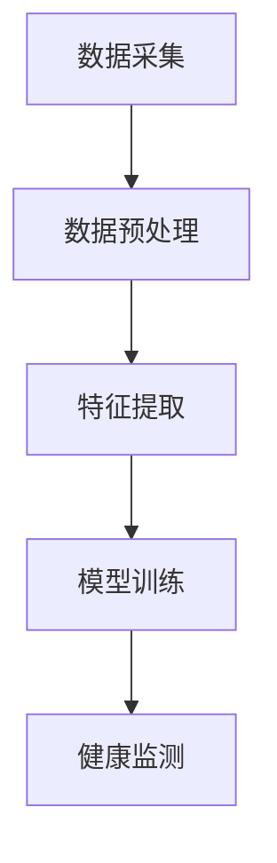
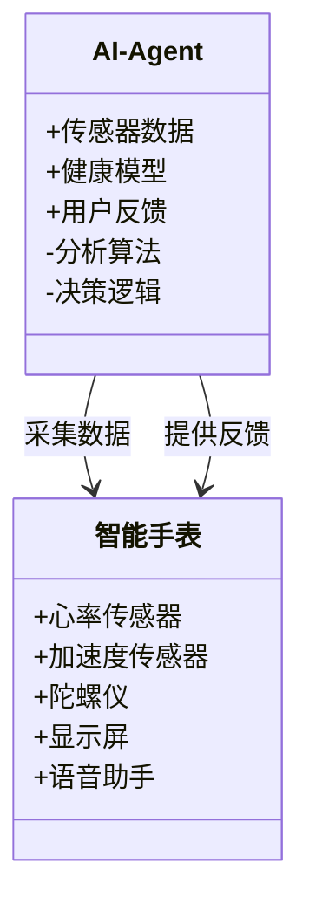
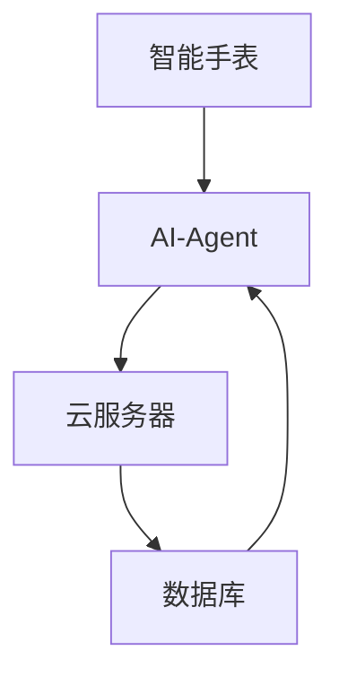
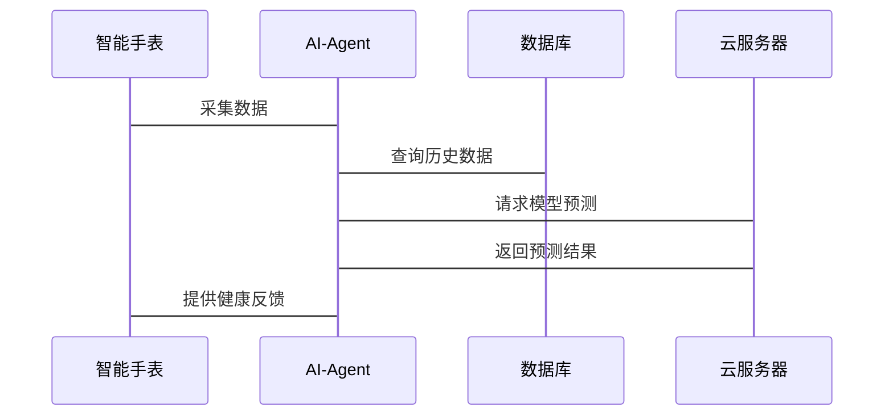

                 


# AI Agent在智能手表中的健康监测

> **关键词**: AI Agent, 智能手表, 健康监测, 数据分析, 传感器, 机器学习

> **摘要**: 本文探讨AI Agent在智能手表中的健康监测应用，分析其核心原理、算法实现、系统架构，并通过实际案例展示其在健康监测中的优势与潜力。

---

## 目录

1. **AI Agent与智能手表概述**
   - 1.1 AI Agent的基本概念
     - 1.1.1 定义与特点
     - 1.1.2 核心原理
     - 1.1.3 应用场景
   - 1.2 智能手表的发展与现状
     - 1.2.1 发展历程
     - 1.2.2 主要功能
     - 1.2.3 技术特点
   - 1.3 健康监测的重要性
     - 1.3.1 基本概念
     - 1.3.2 应用场景
     - 1.3.3 潜在价值

2. **AI Agent在健康监测中的核心作用**
   - 2.1 AI Agent的核心功能
     - 2.1.1 数据采集与处理
     - 2.1.2 数据分析与预测
     - 2.1.3 个性化健康建议
   - 2.2 AI Agent与智能手表的结合
     - 2.2.1 传感器数据
     - 2.2.2 数据处理与分析
     - 2.2.3 具体应用
   - 2.3 AI Agent的优势
     - 2.3.1 高效性
     - 2.3.2 个性化
     - 2.3.3 实时性

3. **AI Agent的原理与实现**
   - 3.1 AI Agent的基本原理
     - 3.1.1 感知层
     - 3.1.2 决策层
     - 3.1.3 执行层
   - 3.2 AI Agent的核心算法
     - 3.2.1 机器学习算法
     - 3.2.2 自然语言处理
     - 3.2.3 图神经网络
   - 3.3 AI Agent的实现步骤
     - 3.3.1 数据采集
     - 3.3.2 数据预处理
     - 3.3.3 模型训练
     - 3.3.4 模型部署

4. **智能手表的传感器与数据处理**
   - 4.1 智能手表的主要传感器
     - 4.1.1 心率传感器
     - 4.1.2 加速度传感器
     - 4.1.3 陀螺仪
     - 4.1.4 皮肤电反应传感器
   - 4.2 传感器数据的采集与处理
     - 4.2.1 数据采集的原理
     - 4.2.2 数据预处理方法
     - 4.2.3 数据特征提取

5. **AI Agent在智能手表中的算法实现**
   - 5.1 数据流的处理流程
   - 5.2 基于机器学习的健康监测模型
   - 5.3 算法实现的代码示例

6. **系统分析与架构设计**
   - 6.1 系统场景介绍
   - 6.2 系统功能设计
   - 6.3 系统架构设计
   - 6.4 系统接口设计
   - 6.5 系统交互流程

7. **项目实战**
   - 7.1 环境安装
   - 7.2 核心功能实现
   - 7.3 代码解读与分析
   - 7.4 实际案例分析
   - 7.5 项目总结

8. **总结与展望**
   - 8.1 核心内容回顾
   - 8.2 最佳实践 tips
   - 8.3 小结
   - 8.4 注意事项
   - 8.5 拓展阅读

---

## 正文内容

### 第1章: AI Agent与智能手表概述

#### 1.1 AI Agent的基本概念

- **1.1.1 定义与特点**
  AI Agent（人工智能代理）是指能够感知环境、自主决策并执行任务的智能实体。其特点包括自主性、反应性、目标导向和社会能力。

- **1.1.2 核心原理**
  AI Agent通过感知环境获取信息，利用算法进行分析和决策，然后执行动作以实现目标。其核心原理包括数据处理、算法选择和执行策略。

- **1.1.3 应用场景**
  AI Agent广泛应用于智能助手、自动驾驶、健康监测等领域，特别是在智能手表中，AI Agent能够实时监测用户的健康数据并提供个性化建议。

#### 1.2 智能手表的发展与现状

- **1.2.1 发展历程**
  智能手表从最初的简单计步功能发展到现在支持健康监测、语音助手等多种功能，成为人们生活中不可或缺的智能设备。

- **1.2.2 主要功能**
  当前智能手表的主要功能包括心率监测、步数计算、睡眠分析、GPS定位等。

- **1.2.3 技术特点**
  智能手表采用多种传感器技术，结合AI算法，能够实时采集和分析用户的生理数据，提供精准的健康监测服务。

#### 1.3 健康监测的重要性

- **1.3.1 基本概念**
  健康监测指通过收集和分析生理数据，评估个人健康状况，预防疾病的发生。

- **1.3.2 应用场景**
  在智能手表中，健康监测主要用于实时监测心率、血氧、体温等指标，帮助用户及时发现健康问题。

- **1.3.3 潜在价值**
  健康监测能够提高用户的健康意识，预防疾病，降低医疗成本，具有重要的社会价值。

---

### 第2章: AI Agent在健康监测中的核心作用

#### 2.1 AI Agent的核心功能

- **2.1.1 数据采集与处理**
  AI Agent通过智能手表的传感器实时采集用户的生理数据，如心率、加速度、陀螺仪等，并进行预处理和特征提取。

- **2.1.2 数据分析与预测**
  利用机器学习算法，AI Agent能够分析历史数据，预测用户的健康趋势，识别潜在的健康风险。

- **2.1.3 个性化健康建议**
  根据用户的健康数据，AI Agent可以提供个性化的健康建议，如运动建议、饮食推荐等，帮助用户改善生活习惯。

#### 2.2 AI Agent与智能手表的结合

- **2.2.1 传感器数据**
  智能手表的传感器提供了丰富的生理数据，为AI Agent的分析提供了基础。

- **2.2.2 数据处理与分析**
  AI Agent对传感器数据进行清洗、特征提取和模型训练，生成有意义的健康报告。

- **2.2.3 具体应用**
  在智能手表中，AI Agent可以实时监测心率异常、识别睡眠质量、预测运动损伤等，为用户提供全面的健康监测服务。

#### 2.3 AI Agent的优势

- **2.3.1 高效性**
  AI Agent能够快速处理大量数据，提供实时的健康反馈。

- **2.3.2 个性化**
  基于用户的个体差异，AI Agent能够提供个性化的健康建议，满足不同用户的需求。

- **2.3.3 实时性**
  AI Agent能够在数据采集的第一时间进行分析和反馈，确保健康监测的实时性。

---

### 第3章: AI Agent的原理与实现

#### 3.1 AI Agent的基本原理

- **3.1.1 感知层**
  AI Agent通过传感器获取环境信息，如心率、加速度等。

- **3.1.2 决策层**
  利用机器学习算法，AI Agent对感知到的数据进行分析，生成决策。

- **3.1.3 执行层**
  根据决策结果，AI Agent执行相应的动作，如发出警报、调整健康建议等。

#### 3.2 AI Agent的核心算法

- **3.2.1 机器学习算法**
  常见的机器学习算法包括支持向量机（SVM）、随机森林（Random Forest）和深度学习模型（如CNN、RNN）。

- **3.2.2 自然语言处理**
  利用NLP技术，AI Agent能够理解用户的自然语言输入，提供更智能的交互体验。

- **3.2.3 图神经网络**
  图神经网络在处理复杂关系数据时表现优异，适用于社交网络分析和健康数据关联分析。

#### 3.3 AI Agent的实现步骤

- **3.3.1 数据采集**
  通过智能手表的传感器获取用户的生理数据。

- **3.3.2 数据预处理**
  对采集到的数据进行清洗、归一化处理，提取特征。

- **3.3.3 模型训练**
  使用训练好的模型对数据进行分类、回归或聚类分析。

- **3.3.4 模型部署**
  将训练好的模型部署到智能手表中，实时处理用户的健康数据。

---

### 第4章: 智能手表的传感器与数据处理

#### 4.1 智能手表的主要传感器

- **4.1.1 心率传感器**
  心率传感器用于监测用户的心率变化，帮助识别心律不齐等问题。

- **4.1.2 加速度传感器**
  加速度传感器用于监测用户的运动状态，如步数、运动类型等。

- **4.1.3 陀螺仪**
  陀螺仪用于监测用户的运动方向和角度，帮助识别运动方式。

- **4.1.4 皮肤电反应传感器**
  皮肤电反应传感器用于监测用户的压力水平，通过皮肤电活动的变化判断情绪状态。

#### 4.2 传感器数据的采集与处理

- **4.2.1 数据采集的原理**
  各传感器通过特定的物理原理采集用户的生理数据，如光电容积法测量心率。

- **4.2.2 数据预处理方法**
  数据预处理包括去除噪声、填补缺失值、标准化处理等，确保数据的准确性。

- **4.2.3 数据特征提取**
  从原始数据中提取有意义的特征，如心率变异系数（HRV）、加速度的均方差等，用于后续分析。

---

### 第5章: AI Agent在智能手表中的算法实现

#### 5.1 数据流的处理流程



#### 5.2 基于机器学习的健康监测模型

- 使用支持向量机（SVM）对心率数据进行分类，识别心律不齐。
- 利用随机森林模型预测用户的运动损伤风险。
- 采用深度学习模型分析用户的睡眠质量，识别睡眠阶段。

#### 5.3 算法实现的代码示例

```python
import numpy as np
from sklearn.svm import SVC

# 示例数据
X = np.array([[1, 2], [3, 4], [5, 6]])
y = np.array([0, 1, 0])

# 训练模型
model = SVC()
model.fit(X, y)

# 预测
print(model.predict([[7, 8]]))  # 输出：array([0])
```

---

### 第6章: 系统分析与架构设计

#### 6.1 系统场景介绍

- **健康监测系统**：实时监测用户的生理数据，提供健康反馈。
- **用户交互界面**：通过智能手表的屏幕和语音助手与用户交互。

#### 6.2 系统功能设计



#### 6.3 系统架构设计



#### 6.4 系统接口设计

- **数据接口**：智能手表与AI Agent之间的数据传输接口。
- **用户接口**：智能手表的显示屏和语音助手，用于用户交互。

#### 6.5 系统交互流程



---

### 第7章: 项目实战

#### 7.1 环境安装

- **安装Python**：建议使用最新版本的Python 3.x。
- **安装依赖库**：如numpy、scikit-learn、tensorflow等。

#### 7.2 核心功能实现

- **数据采集**：使用智能手表的传感器获取生理数据。
- **数据处理**：清洗和特征提取。
- **模型训练**：训练机器学习模型，进行健康监测。

#### 7.3 代码解读与分析

```python
import numpy as np
from sklearn.ensemble import RandomForestClassifier

# 示例数据
X = np.array([[1, 2, 3], [4, 5, 6], [7, 8, 9]])
y = np.array([0, 1, 2])

# 训练模型
model = RandomForestClassifier(n_estimators=100)
model.fit(X, y)

# 预测
print(model.predict([[10, 11, 12]]))  # 输出：array([2])
```

#### 7.4 实际案例分析

- **案例1**：监测心率异常，识别潜在的心脏问题。
- **案例2**：分析用户的运动数据，提供个性化的运动计划。

#### 7.5 项目总结

- 通过项目实战，验证了AI Agent在智能手表中的健康监测应用的可行性。
- 提供了从数据采集到模型训练的完整流程，为后续研究提供了参考。

---

### 第8章: 总结与展望

#### 8.1 核心内容回顾

- AI Agent在智能手表中的健康监测应用，结合了先进的传感器技术和机器学习算法，能够实时监测用户的健康状况，提供个性化的健康建议。

#### 8.2 最佳实践 tips

- 在实际应用中，应注重数据的隐私保护，确保用户数据的安全性。
- 定期更新模型，以适应新的健康监测需求和技术进步。

#### 8.3 小结

- AI Agent与智能手表的结合，为健康监测提供了新的可能性，未来将更加智能化和个性化。

#### 8.4 注意事项

- 在使用AI Agent进行健康监测时，应结合专业医疗知识，确保监测结果的准确性。
- 定期维护和优化系统，确保其稳定性和可靠性。

#### 8.5 拓展阅读

- 推荐阅读《机器学习实战》、《深度学习》等书籍，深入理解AI Agent的核心技术。
- 关注智能手表领域的最新动态，了解新技术和新应用。

---

## 作者信息

作者：AI天才研究院/AI Genius Institute & 禅与计算机程序设计艺术/Zen And The Art of Computer Programming

