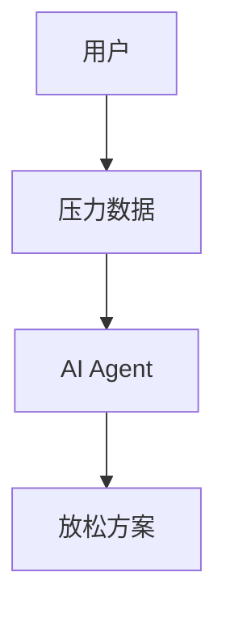
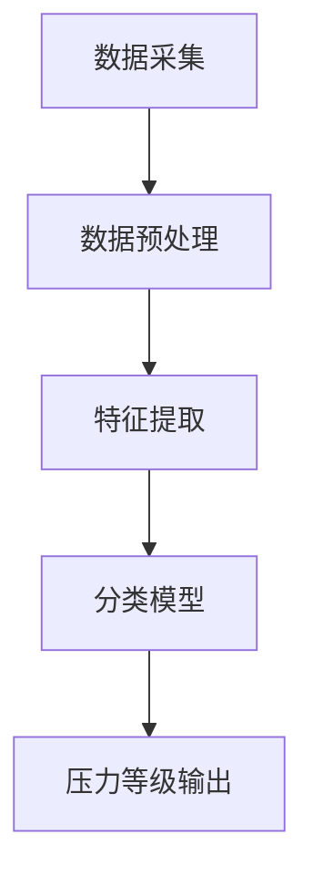
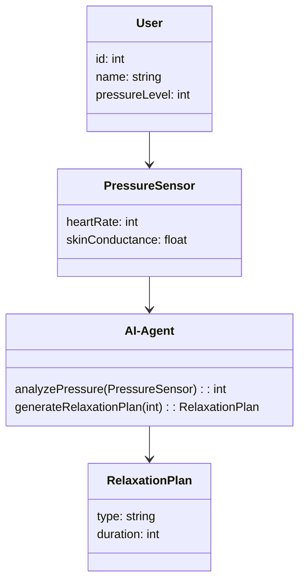
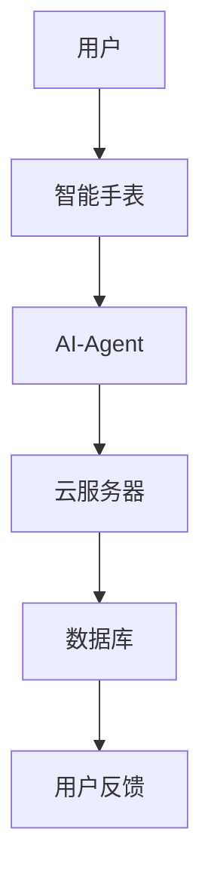

                 


# AI Agent在智能手表中的压力管理与放松指导

## 关键词：AI Agent, 智能手表, 压力管理, 放松指导, 个性化健康方案, 多模态数据融合

## 摘要：  
本文深入探讨AI Agent在智能手表中的应用，特别是在压力管理与放松指导方面。通过分析压力监测技术、AI算法、系统架构和实际应用场景，结合多模态数据融合与个性化方案设计，提出了一套完整的压力管理解决方案。文章从背景介绍、核心概念、算法原理、系统设计到项目实战，全面解析了AI Agent在智能手表中的潜力与实现路径。

---

# 第一部分: 背景介绍

## 第1章: 压力管理与AI Agent的背景介绍

### 1.1 问题背景与重要性  
现代社会节奏加快，压力问题日益严重，长期的压力会导致焦虑、失眠、免疫力下降等健康问题。压力管理成为现代人健康的重要组成部分。AI Agent作为一种智能代理，能够通过实时监测和数据分析，为用户提供个性化的压力管理方案，帮助用户更好地应对压力。  

#### 1.1.1 现代社会压力问题的现状  
- 现代人面临工作压力、家庭压力、经济压力等多种压力源。  
- 压力问题呈现年轻化趋势，越来越多的年轻人因压力过大而寻求心理健康帮助。  

#### 1.1.2 压力对健康的影响  
- 长期压力会导致身体免疫力下降、心血管疾病风险增加。  
- 压力还会引发焦虑症、抑郁症等心理问题。  

#### 1.1.3 压力管理的重要性  
- 压力管理能够帮助用户保持心理健康，提升生活质量。  
- 通过科学的方法管理压力，可以预防疾病的发生。  

### 1.2 AI Agent的概念与作用  
AI Agent是一种智能代理，能够通过传感器数据、用户行为数据等多模态数据，实时分析用户的状态，并提供个性化的反馈和建议。  

#### 1.2.1 AI Agent的基本定义  
AI Agent是指能够感知环境、做出决策并执行任务的智能系统。  
- **感知环境**：通过传感器、用户输入等获取数据。  
- **决策与执行**：基于数据进行分析，生成反馈或执行任务。  

#### 1.2.2 AI Agent在压力管理中的作用  
- **实时监测**：通过智能手表采集用户的心率、皮肤电活动等生理数据，识别压力状态。  
- **个性化建议**：根据用户的压力水平，推荐放松方法，如深呼吸、冥想等。  

#### 1.2.3 智能手表作为AI Agent的载体  
- 智能手表具备多种传感器，能够实时采集用户的生理数据。  
- AI Agent通过智能手表提供的数据，为用户提供个性化的压力管理服务。  

### 1.3 智能手表在压力管理中的优势  
- **实时监测**：智能手表可以24小时监测用户的压力状态，做到早发现、早干预。  
- **便携性**：用户可以随时随地使用智能手表进行压力管理，无需额外设备。  
- **用户接受度**：智能手表已经成为日常生活的一部分，用户更容易接受通过智能手表进行压力管理。  

### 1.4 应用场景与目标用户  
- **应用场景**：工作压力大的上班族、学生群体、需要心理健康管理的人群。  
- **目标用户**：需要压力管理的用户，尤其是长期处于高压环境中的职场人士。  

---

## 第2章: 核心概念与联系  

### 2.1 核心概念原理  
- **AI Agent的基本原理**：通过多模态数据融合，分析用户的压力状态，并提供个性化的反馈。  
- **压力监测技术**：通过心率、皮肤电活动等生理指标，判断用户的压力水平。  

#### 2.1.1 不同压力监测方法的对比表格  
| 监测方法         | 优点                     | 缺点                     |
|------------------|--------------------------|--------------------------|
| 心率监测         | 数据采集简单，成本低     | 易受运动干扰             |
| 皮肤电活动监测    | 对压力敏感度高           | 数据采集复杂             |
| 呼吸频率监测      | 反映压力状态准确          | 易受环境干扰             |

### 2.2 ER实体关系图  


---

# 第二部分: 算法原理讲解  

## 第3章: 压力监测算法  

### 3.1 算法原理  
- **多模态数据融合**：将心率、皮肤电活动等多模态数据进行融合，提高压力监测的准确性。  
- **数据预处理**：对传感器数据进行去噪、归一化处理，确保数据质量。  

#### 3.1.3 基于机器学习的压力分类模型  
- 使用支持向量机（SVM）或随机森林（Random Forest）等算法，对压力数据进行分类。  
- **数学模型**：  
  $$ y = \sum_{i=1}^{n} w_i x_i + b $$  
  其中，$w_i$ 是权重，$x_i$ 是输入特征，$b$ 是偏置。  

---

## 第4章: 个性化放松指导算法  

### 4.1 算法流程图  


---

# 第三部分: 系统分析与架构设计  

## 第5章: 系统分析与架构设计  

### 5.1 应用场景介绍  
- **应用场景**：用户在高压环境下使用智能手表进行压力监测，AI Agent根据监测结果提供放松建议。  

### 5.2 系统功能设计  

#### 5.2.1 领域模型（类图）  


### 5.3 系统架构设计  

#### 5.3.1 系统架构图  


---

## 第6章: 项目实战  

### 6.1 环境安装  
- **Python环境**：安装Python 3.8以上版本。  
- **依赖库安装**：使用pip安装numpy、scikit-learn、mermaid等库。  

### 6.2 核心代码实现  

#### 6.2.1 压力监测算法实现  
```python
import numpy as np
from sklearn.svm import SVC

# 示例数据
X = np.array([[50, 100], [60, 80], [70, 60]])
y = np.array([0, 1, 0])  # 0代表低压力，1代表高压力

# 训练模型
model = SVC()
model.fit(X, y)

# 预测
new_data = np.array([[65, 75]])
print(model.predict(new_data))
```

#### 6.2.2 放松方案生成  
```python
def generate_relaxation_plan(pressure_level):
    if pressure_level == 0:
        return "深呼吸练习，持续5分钟"
    elif pressure_level == 1:
        return "冥想练习，持续10分钟"
    else:
        return "散步放松，持续15分钟"

print(generate_relaxation_plan(1))
```

### 6.3 实际案例分析  
- **案例**：用户压力水平为1，AI Agent推荐进行冥想练习，持续10分钟。  

---

## 第7章: 最佳实践  

### 7.1 小结  
- AI Agent在智能手表中的应用潜力巨大，能够有效帮助用户管理压力。  

### 7.2 注意事项  
- 数据隐私保护：智能手表采集的健康数据需要严格加密，防止泄露。  
- 算法优化：不断提升算法的准确性，确保压力监测的可靠性。  

### 7.3 拓展阅读  
- 推荐阅读《机器学习实战》、《深度学习》等书籍，深入学习AI算法的实现与优化。  

---

# 结语  
AI Agent在智能手表中的压力管理与放松指导，不仅提升了用户的健康管理水平，也为智能健康管理领域带来了新的可能性。未来，随着AI技术的不断发展，智能手表在压力管理中的应用将更加智能化、个性化。

---

作者：AI天才研究院/AI Genius Institute & 禅与计算机程序设计艺术 /Zen And The Art of Computer Programming

