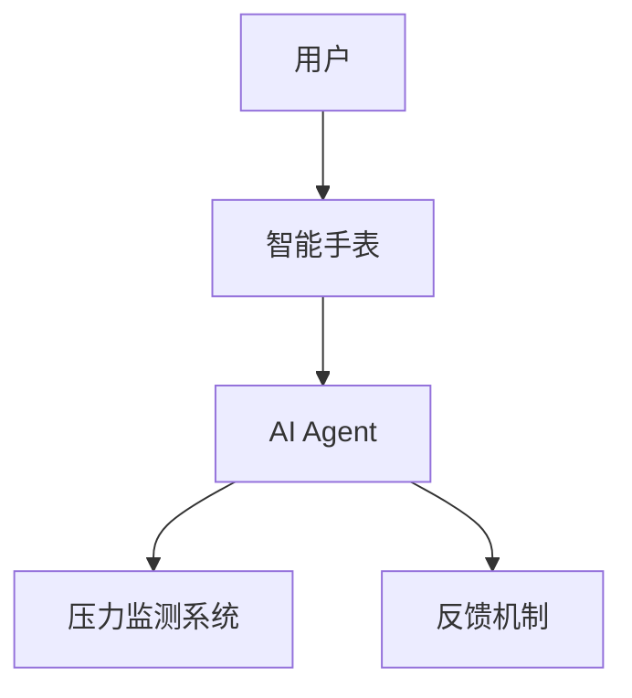
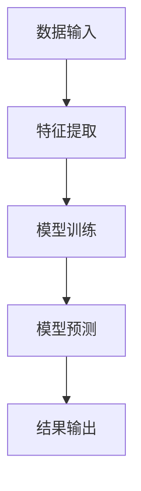
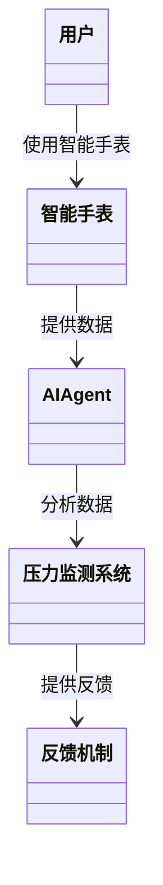
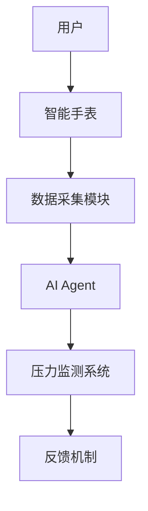
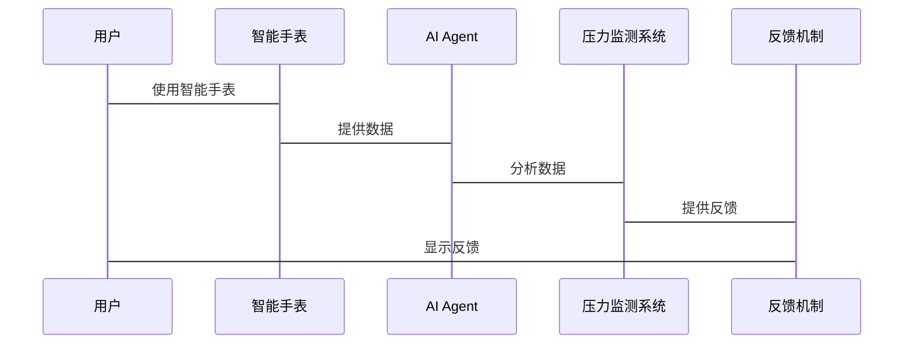

                 


# AI Agent在智能手表中的压力管理系统

**关键词**：AI Agent, 智能手表, 压力管理, 机器学习, 系统架构

**摘要**：  
本文探讨了AI Agent在智能手表中的压力管理系统的实现与应用。通过分析压力管理的重要性，AI Agent的核心原理，以及在智能手表中的具体实现，展示了如何利用AI技术帮助用户有效管理压力。文章从背景介绍、核心概念、算法原理、系统架构、项目实战到最佳实践，详细阐述了压力管理系统的各个方面，为开发者和用户提供了一个全面的技术指南。

---

# 第一部分: 背景与概述

## 第1章: 背景与概述

### 1.1 压力管理的重要性  
现代社会节奏加快，压力问题日益严重。长期的压力会导致多种健康问题，包括焦虑、抑郁、心血管疾病等。智能手表作为一种普及的可穿戴设备，具备监测生理数据和行为模式的能力，为压力管理提供了理想的平台。

#### 1.1.1 现代社会压力问题的现状  
- 压力已成为全球公共卫生问题之一。  
- 高压工作环境导致许多人出现压力相关症状。  
- 压力管理需求日益增长，尤其是在年轻人群中。  

#### 1.1.2 压力对健康的长期影响  
- 心理健康问题：焦虑、抑郁等。  
- 身体健康问题：心血管疾病、免疫系统失调。  
- 生活质量下降：影响工作效率和人际关系。  

#### 1.1.3 智能手表在健康监测中的潜力  
- 实时监测生理数据：心率、皮肤温度、运动量等。  
- 跟踪行为模式：睡眠质量、运动习惯、压力事件记录。  
- 提供个性化反馈：基于数据的健康建议和压力缓解策略。  

---

### 1.2 AI Agent的基本概念  
AI Agent是一种能够感知环境、自主决策并执行任务的智能实体。在智能手表中，AI Agent主要用于分析用户数据，提供实时反馈和建议。

#### 1.2.1 什么是AI Agent  
- AI Agent是人工智能的一种实现形式。  
- 具备感知、决策、执行三大功能。  
- 可以是基于规则的简单代理，也可以是复杂的深度学习模型。  

#### 1.2.2 AI Agent的核心功能与特点  
- **感知环境**：通过传感器获取数据。  
- **自主决策**：基于数据做出判断。  
- **执行任务**：通过智能手表的界面或功能提供反馈。  
- **学习能力**：通过机器学习不断优化性能。  

#### 1.2.3 AI Agent在智能手表中的应用前景  
- 健康监测：实时分析生理数据，提供健康建议。  
- 压力管理：基于数据预测压力状态，提出缓解方案。  
- 行为干预：通过反馈机制改善用户生活习惯。  

---

### 1.3 压力管理系统的需求与目标  
压力管理系统的开发需要满足用户的需求，同时具备可扩展性和实用性。

#### 1.3.1 用户需求分析  
- 实时监测压力状态。  
- 个性化压力缓解建议。  
- 长期压力管理记录与分析。  

#### 1.3.2 系统功能目标  
- 数据采集：心率、皮肤电活动（EDA）、加速度等。  
- 数据分析：基于AI模型预测压力状态。  
- 反馈机制：提供个性化建议和干预策略。  

#### 1.3.3 系统设计的边界与外延  
- 系统仅关注压力管理，不涉及其他健康问题。  
- 数据采集范围有限，专注于与压力相关的指标。  
- 系统需要与智能手表硬件无缝集成。  

---

### 1.4 本章小结  
本章介绍了压力管理的重要性，AI Agent的基本概念及其在智能手表中的应用前景，明确了压力管理系统的功能目标和设计边界。

---

# 第二部分: AI Agent与压力管理系统的核心概念

## 第2章: AI Agent的核心原理与实现  

### 2.1 AI Agent的基本原理  
AI Agent的工作原理分为感知、决策和执行三个阶段。

#### 2.1.1 基于规则的AI Agent  
- 基于预定义的规则进行决策。  
- 适用于简单场景，如基于心率判断是否处于高压状态。  

#### 2.1.2 基于机器学习的AI Agent  
- 通过训练数据学习压力状态的特征。  
- 使用分类算法（如决策树、随机森林）进行预测。  

#### 2.1.3 基于深度学习的AI Agent  
- 使用神经网络模型（如LSTM）进行时间序列分析。  
- 更适合处理复杂的时序数据，如心率变异性（HRV）。  

---

### 2.2 压力监测的核心方法  

#### 2.2.1 生物特征监测  
- **心率监测**：通过心率变异性（HRV）分析压力状态。  
- **皮肤电活动（EDA）**：反映自主神经系统的活动。  
- **皮质醇水平**：通过智能手表的集成传感器检测。  

#### 2.2.2 用户行为分析  
- **运动数据**：运动量与压力呈负相关关系。  
- **睡眠质量**：良好的睡眠有助于缓解压力。  
- **日常活动模式**：异常的行为模式可能反映压力状态。  

#### 2.2.3 用户自报告数据  
- **问卷调查**：通过用户自填问卷获取主观压力评分。  
- **日志记录**：记录用户的日常情绪变化。  

---

### 2.3 AI Agent与压力监测系统的结合  

#### 2.3.1 数据输入与特征提取  
- 数据来源：传感器数据、用户输入数据。  
- 特征提取：选择与压力相关的特征，如心率、EDA、运动数据等。  

#### 2.3.2 AI模型的训练与优化  
- 使用机器学习模型（如支持向量机、随机森林）进行训练。  
- 通过交叉验证优化模型参数。  

#### 2.3.3 系统输出与反馈机制  
- 提供实时压力状态反馈。  
- 基于AI模型预测结果提出缓解建议。  

---

### 2.4 核心概念对比分析  

#### 2.4.1 AI Agent与传统算法的对比  
| 特性               | 基于规则的AI Agent | 机器学习AI Agent | 深度学习AI Agent |
|--------------------|---------------------|-------------------|-------------------|
| 决策方式           | 预定义规则         | 数据驱动         | 数据驱动         |
| 复杂性             | 低                  | 中                | 高                |
| 适应性             | 低                  | 中                | 高                |

#### 2.4.2 压力监测系统的实体关系图  



---

### 2.5 本章小结  
本章详细介绍了AI Agent的基本原理，分析了压力监测的核心方法，并探讨了AI Agent与压力监测系统的结合方式。

---

# 第三部分: 算法原理与数学模型

## 第3章: AI Agent的算法实现  

### 3.1 基于机器学习的压力预测模型  

#### 3.1.1 算法选择与实现  



- **算法选择**：使用随机森林模型进行分类。  
- **实现步骤**：  
  1. 数据预处理：归一化特征。  
  2. 特征选择：使用特征重要性筛选关键特征。  
  3. 模型训练：在训练集上训练随机森林模型。  
  4. 模型评估：使用测试集评估模型性能。  

#### 3.1.2 算法的数学模型  

随机森林的分类模型如下：

$$
y = \text{ RandomForestClassifier}(X)
$$

其中，$y$ 是预测的压力状态，$X$ 是输入的特征向量。

---

### 3.2 基于深度学习的压力预测模型  

#### 3.2.1 LSTM网络的实现  

- **LSTM网络**：用于处理时间序列数据。  
- **网络结构**：  
  1. 输入层：接收时序数据。  
  2. LSTM层：捕捉时间序列中的长期依赖关系。  
  3. 全连接层：输出压力状态预测。  

#### 3.2.2 模型的数学表达  

LSTM的细胞状态更新公式为：

$$
f_t = \text{sigmoid}(W_f \cdot [h_{t-1}, x_t] + b_f)
$$

$$
i_t = \text{sigmoid}(W_i \cdot [h_{t-1}, x_t] + b_i)
$$

$$
o_t = \text{sigmoid}(W_o \cdot [h_{t-1}, x_t] + b_o)
$$

$$
c_t = f_t \cdot c_{t-1} + i_t \cdot \tilde{c}_t
$$

$$
h_t = o_t \cdot \text{tanh}(c_t)
$$

其中，$f_t$ 是遗忘门，$i_t$ 是输入门，$o_t$ 是输出门，$c_t$ 是细胞状态，$h_t$ 是隐藏状态。

---

### 3.3 算法实现的代码示例  

#### 3.3.1 使用随机森林模型  

```python
from sklearn.ensemble import RandomForestClassifier
from sklearn.metrics import accuracy_score
from sklearn.model_selection import train_test_split

# 数据预处理
X = df.drop('label', axis=1).values
y = df['label'].values

# 划分训练集和测试集
X_train, X_test, y_train, y_test = train_test_split(X, y, test_size=0.2, random_state=42)

# 模型训练
clf = RandomForestClassifier(n_estimators=100, random_state=42)
clf.fit(X_train, y_train)

# 模型预测
y_pred = clf.predict(X_test)

# 模型评估
print("Accuracy:", accuracy_score(y_test, y_pred))
```

#### 3.3.2 使用LSTM模型  

```python
from keras.models import Sequential
from keras.layers import LSTM, Dense, Dropout

# 模型定义
model = Sequential()
model.add(LSTM(50, return_sequences=True, input_shape=(timesteps, features)))
model.add(LSTM(50, return_sequences=False))
model.add(Dense(1, activation='sigmoid'))

# 模型编译
model.compile(loss='binary_crossentropy', optimizer='adam', metrics=['accuracy'])

# 模型训练
model.fit(X_train, y_train, epochs=10, batch_size=32, validation_data=(X_val, y_val))
```

---

### 3.4 本章小结  
本章详细介绍了基于机器学习和深度学习的压力预测模型，通过代码示例展示了模型的实现过程，并通过数学公式解释了算法的原理。

---

# 第四部分: 系统架构与设计

## 第4章: 系统架构与设计  

### 4.1 问题场景介绍  
本节将介绍智能手表压力管理系统的应用场景和功能需求。

#### 4.1.1 应用场景  
- 用户在日常生活中使用智能手表监测压力状态。  
- 系统根据监测数据提供实时反馈和压力缓解建议。  

#### 4.1.2 功能需求  
- 实时监测：心率、EDA、运动数据等。  
- 数据分析：AI模型预测压力状态。  
- 反馈机制：个性化建议和干预策略。  

---

### 4.2 项目介绍  

#### 4.2.1 项目目标  
开发一个基于AI Agent的智能手表压力管理系统，实现以下功能：  
1. 实时监测用户压力状态。  
2. 基于AI模型提供压力缓解建议。  
3. 提供长期压力管理记录与分析。  

#### 4.2.2 项目范围  
- 数据采集：心率、运动数据、睡眠数据。  
- 数据分析：基于AI模型的压力预测。  
- 反馈机制：压力缓解建议。  

---

### 4.3 系统功能设计  

#### 4.3.1 领域模型（mermaid类图）  



---

### 4.4 系统架构设计  

#### 4.4.1 系统架构（mermaid架构图）  



---

### 4.5 系统接口设计  

#### 4.5.1 接口定义  
- **数据采集接口**：智能手表采集生理数据并传送给AI Agent。  
- **模型调用接口**：AI Agent调用压力监测系统进行数据分析。  
- **反馈接口**：压力监测系统通过反馈机制向用户发送压力缓解建议。  

---

### 4.6 系统交互设计  

#### 4.6.1 交互流程（mermaid序列图）  



---

### 4.7 本章小结  
本章详细介绍了智能手表压力管理系统的架构设计，包括系统功能、架构图、接口设计和交互流程。

---

# 第五部分: 项目实战

## 第5章: 项目实战  

### 5.1 环境安装  

#### 5.1.1 系统要求  
- 操作系统：Windows/Mac/Linux  
- Python版本：3.6+  
- 额外依赖：TensorFlow、Scikit-learn、Keras  

#### 5.1.2 安装步骤  
1. 安装Python和pip。  
2. 安装所需库：`pip install numpy pandas scikit-learn tensorflow`  

---

### 5.2 系统核心实现  

#### 5.2.1 数据采集模块  

```python
import pandas as pd
import numpy as np

# 读取数据
data = pd.read_csv('pressure_data.csv')

# 数据预处理
data.dropna(inplace=True)
data = data[['heart_rate', 'eda', 'acceleration', 'label']]
```

#### 5.2.2 AI模型实现  

```python
from sklearn.ensemble import RandomForestClassifier
from sklearn.metrics import accuracy_score
from sklearn.model_selection import train_test_split

# 划分训练集和测试集
X = data.drop('label', axis=1).values
y = data['label'].values
X_train, X_test, y_train, y_test = train_test_split(X, y, test_size=0.2, random_state=42)

# 模型训练
clf = RandomForestClassifier(n_estimators=100, random_state=42)
clf.fit(X_train, y_train)

# 模型预测
y_pred = clf.predict(X_test)
print("Accuracy:", accuracy_score(y_test, y_pred))
```

#### 5.2.3 系统集成  

```python
from flask import Flask, jsonify
import joblib

app = Flask(__name__)
model = joblib.load('model.pkl')

@app.route('/predict', methods=['POST'])
def predict():
    data = request.json['data']
    prediction = model.predict([data])
    return jsonify({'prediction': int(prediction[0])})
```

---

### 5.3 代码应用解读与分析  

#### 5.3.1 数据采集模块解读  
- 数据采集模块负责从智能手表获取生理数据。  
- 数据预处理包括去除缺失值和特征选择。  

#### 5.3.2 AI模型实现解读  
- 使用随机森林模型进行分类。  
- 模型训练和测试过程展示分类性能。  

#### 5.3.3 系统集成解读  
- 使用Flask框架搭建API接口。  
- 模型加载并提供预测服务。  

---

### 5.4 实际案例分析  

#### 5.4.1 数据分析案例  
- 数据可视化：心率与压力状态的关系。  
- 模型性能评估：准确率、召回率、F1分数。  

#### 5.4.2 系统实现案例  
- 系统集成：API接口实现压力预测服务。  
- 系统测试：压力预测的实时反馈。  

---

### 5.5 本章小结  
本章通过实际案例展示了压力管理系统的实现过程，包括数据采集、模型训练和系统集成，为读者提供了实践指导。

---

# 第六部分: 最佳实践与小结

## 第6章: 最佳实践与小结  

### 6.1 最佳实践  

#### 6.1.1 数据采集与处理  
- 确保数据的完整性和准确性。  
- 数据预处理是模型性能的关键。  

#### 6.1.2 模型选择与优化  
- 根据数据特性选择合适的算法。  
- 使用交叉验证优化模型参数。  

#### 6.1.3 系统设计与实现  
- 系统架构设计要模块化。  
- 接口设计要清晰明确。  

---

### 6.2 小结与展望  

#### 6.2.1 本章小结  
本文详细介绍了AI Agent在智能手表中的压力管理系统的实现，包括背景、核心概念、算法原理、系统架构和项目实战。  

#### 6.2.2 未来展望  
- 结合更多传感器数据提高模型准确性。  
- 探索更复杂的AI模型，如Transformer架构。  
- 扩展系统的功能，如情绪识别、社交压力分析。  

---

## 作者信息  

作者：AI天才研究院/AI Genius Institute & 禅与计算机程序设计艺术/Zen And The Art of Computer Programming  

---

**全文小结**：  
本文系统地探讨了AI Agent在智能手表中的压力管理系统的实现与应用，从理论到实践，为开发者和用户提供了一个全面的技术指南。通过详细的章节内容，读者可以深入了解压力管理的重要性、AI Agent的核心原理、系统的架构设计以及实际的项目实现，为未来的开发和研究提供了宝贵的经验和参考。

