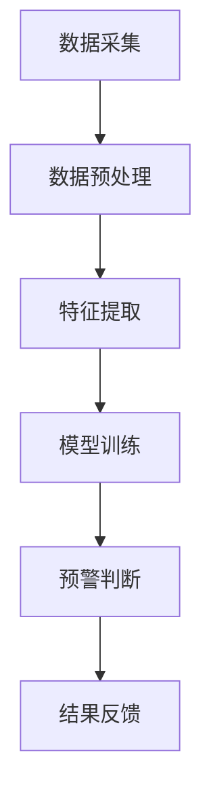
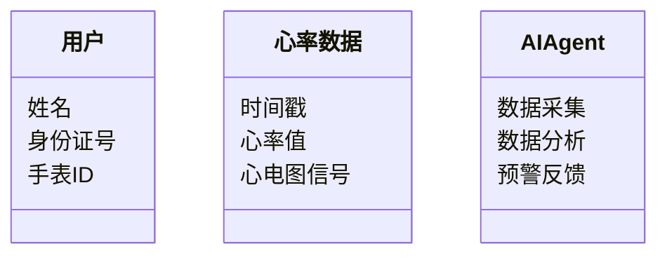
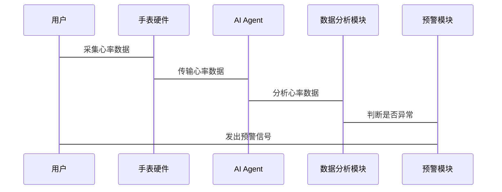

                 


# AI Agent在智能手表中的心律失常预警系统

> 关键词：AI Agent, 智能手表, 心律失常, 预警系统, 健康监测, 人工智能

> 摘要：本文详细探讨了AI Agent在智能手表中的心律失常预警系统的实现与应用。通过分析心律失常的基本概念、AI Agent的核心原理，以及系统架构设计，本文为读者提供了从理论到实践的全面解析。文章结合实际案例，深入浅出地展示了如何利用AI技术提升智能手表的健康监测能力，为用户提供更高效、更精准的医疗健康服务。

---

## 第1章 AI Agent与心律失常预警系统背景

### 1.1 AI Agent的基本概念

#### 1.1.1 AI Agent的定义与特点
AI Agent（人工智能代理）是指能够感知环境、自主决策并执行任务的智能实体。它具有以下特点：
- **自主性**：能够在没有外部干预的情况下自主运行。
- **反应性**：能够实时感知环境变化并做出响应。
- **目标导向**：具有明确的目标，能够根据目标优化行为。
- **学习能力**：通过数据和经验不断优化自身的算法和决策能力。

#### 1.1.2 AI Agent的核心技术与应用场景
AI Agent的核心技术包括自然语言处理、计算机视觉、机器学习和强化学习等。它广泛应用于智能助手、自动驾驶、智能安防等领域。

#### 1.1.3 AI Agent在医疗健康领域的潜力
在医疗健康领域，AI Agent可以用于疾病预测、健康监测、辅助诊断等场景。通过实时监测用户的健康数据，AI Agent能够及时发现异常情况并发出预警，从而提升医疗健康服务的效率和准确性。

### 1.2 心律失常的基本概念

#### 1.2.1 心律失常的定义与分类
心律失常是指心脏跳动的节律异常，常见类型包括心动过速、心动过缓、早搏等。心律失常可能引发严重的心脏疾病，甚至危及生命。

#### 1.2.2 心律失常的危害与预防
心律失常可能导致心悸、头晕、乏力等症状，严重时可能引发心绞痛、心肌梗死等疾病。预防心律失常的关键在于早期发现和及时治疗。

#### 1.2.3 智能手表在心律监测中的优势
智能手表通过集成心率传感器，能够实时监测用户的心律数据。结合AI技术，智能手表可以实现心律失常的早期预警，帮助用户及时采取措施。

### 1.3 AI Agent在智能手表中的应用前景

#### 1.3.1 智能手表的发展现状
智能手表作为一种可穿戴设备，已经成为人们日常生活的重要工具。它不仅可以监测心率、步数、睡眠质量等生理数据，还可以与手机、电脑等设备无缝连接。

#### 1.3.2 AI技术在智能手表中的创新应用
AI技术的应用使得智能手表的功能更加智能化。通过AI Agent，智能手表可以实现个性化的健康监测、智能提醒、运动辅助等功能。

#### 1.3.3 心律失常预警系统的社会价值
心律失常预警系统的应用可以显著降低心律失常引发的健康风险，尤其对老年人和心脏病患者具有重要意义。通过智能手表的普及，心律失常预警系统能够为用户提供便捷、高效的健康监测服务。

---

## 第2章 心律失常预警系统的核心概念与联系

### 2.1 心律失常预警系统的核心要素

#### 2.1.1 数据采集模块
数据采集模块负责采集用户的心率、心电图等生理数据。这些数据是后续分析的基础。

#### 2.1.2 数据分析模块
数据分析模块利用AI算法对采集到的数据进行分析，识别心律失常的特征和模式。

#### 2.1.3 预警反馈模块
预警反馈模块根据数据分析的结果，向用户发出预警信号，并提供相应的建议和指导。

### 2.2 AI Agent在系统中的角色与功能

#### 2.2.1 数据处理与分析
AI Agent负责对采集到的生理数据进行清洗、特征提取和分类分析，识别潜在的心律失常风险。

#### 2.2.2 预警算法的设计与实现
AI Agent通过机器学习算法训练预警模型，实现对心律失常的精准识别和预警。

#### 2.2.3 用户反馈与系统优化
AI Agent根据用户的反馈不断优化预警算法，提高系统的准确性和响应速度。

### 2.3 系统核心概念的ER实体关系图

```mermaid
er
actor: 用户
agent: AI Agent
system: 心律失常预警系统
```

---

## 第3章 心律失常预警系统的算法原理

### 3.1 心律监测数据的采集与预处理

#### 3.1.1 数据采集方法
心律监测数据主要通过光电容积法和电容式传感器采集。光电容积法通过测量血液流动的变化来计算心率，而电容式传感器通过测量皮肤电容的变化来检测心电信号。

#### 3.1.2 数据预处理技术
数据预处理包括去噪、基线 wander correction 和信号增强等步骤。通过预处理可以提高数据的质量，为后续分析提供准确的基础。

#### 3.1.3 数据特征提取
特征提取是将心电信号转换为易于分析的特征向量。常用的心电特征包括波形幅度、频率、周期等。

### 3.2 基于AI Agent的预警算法

#### 3.2.1 算法流程图



#### 3.2.2 算法实现的数学模型

$$ y = f(x) $$

其中，$x$ 表示输入数据，$y$ 表示输出结果。

### 3.3 算法的优化与改进

通过引入深度学习算法，如卷积神经网络（CNN）和长短期记忆网络（LSTM），可以显著提高心律失常预警系统的准确性和鲁棒性。

---

## 第4章 系统分析与架构设计

### 4.1 问题场景介绍

心律失常预警系统需要在智能手表上实时监测用户的心率数据，通过AI Agent进行分析和预警，帮助用户及时发现和处理心律异常。

### 4.2 系统功能设计

#### 4.2.1 领域模型类图



### 4.3 系统架构设计

#### 4.3.1 系统架构图


### 4.4 系统接口设计

系统接口主要分为数据采集接口、数据传输接口和用户反馈接口。通过标准化接口设计，可以确保系统的兼容性和可扩展性。

### 4.5 系统交互流程图



---

## 第5章 项目实战

### 5.1 环境安装与配置

#### 5.1.1 系统环境
- 操作系统：Windows 10 或更高版本
- 开发工具：Python 3.8 或更高版本，Jupyter Notebook
- 依赖库：TensorFlow、Keras、Scikit-learn、Matplotlib

#### 5.1.2 智能手表数据接口
智能手表需要支持心率数据的采集和传输，可以通过蓝牙或Wi-Fi与PC端连接。

### 5.2 系统核心实现

#### 5.2.1 数据采集代码

```python
import numpy as np
import matplotlib.pyplot as plt

# 采集心率数据
def get_heart_rate():
    # 模拟数据采集
    data = np.random.normal(75, 5, 100)
    return data

# 绘制心率数据图
def plot_data(data):
    plt.plot(data)
    plt.title('Heart Rate Data')
    plt.xlabel('Time')
    plt.ylabel('Heart Rate')
    plt.show()

# 调用数据采集和绘图
data = get_heart_rate()
plot_data(data)
```

#### 5.2.2 数据分析代码

```python
from sklearn import svm

# 训练分类器
def train_classifier(X_train, y_train):
    clf = svm.SVC()
    clf.fit(X_train, y_train)
    return clf

# 预测心律失常
def predict(arrhythmia):
    X_test = arrhythmia.reshape(1, -1)
    return clf.predict(X_test)
```

### 5.3 实际案例分析

#### 5.3.1 案例背景
假设一位用户的心率数据出现异常波动，AI Agent通过分析数据发现潜在的心律失常风险，并向用户发出预警。

#### 5.3.2 数据分析与结果解读
通过机器学习算法分析心率数据，识别出用户的心律失常类型，并提供相应的健康建议。

#### 5.3.3 系统优化建议
根据用户的反馈，不断优化AI Agent的算法和模型，提高系统的准确性和响应速度。

### 5.4 项目小结

通过本项目的实践，我们可以看到AI Agent在智能手表中的应用潜力。通过实时监测和智能分析，AI Agent能够显著提升心律失常预警系统的效率和准确性。

---

## 第6章 最佳实践

### 6.1 小结

AI Agent在智能手表中的心律失常预警系统是一种创新的健康监测方式。通过实时监测和智能分析，AI Agent能够帮助用户及时发现和处理心律异常，提升健康管理水平。

### 6.2 注意事项

- 数据隐私保护：在采集和传输心率数据时，必须确保用户数据的安全性和隐私性。
- 系统稳定性：确保AI Agent的算法和模型具有较高的稳定性和可靠性，避免误报和漏报。
- 用户教育：向用户普及心律失常的基本知识，帮助用户正确理解和使用预警系统。

### 6.3 拓展阅读

- 《深度学习》——Ian Goodfellow
- 《人工智能：一种现代方法》——斯蒂芬·拉塞尔
- 《可穿戴设备与医疗健康》——相关研究论文

---

## 作者信息

作者：AI天才研究院/AI Genius Institute & 禅与计算机程序设计艺术 /Zen And The Art of Computer Programming

---

通过以上目录和内容设计，我们可以看到《AI Agent在智能手表中的心律失常预警系统》这篇文章不仅涵盖了理论知识，还结合了实际应用和项目案例，为读者提供了一种全面而深入的技术视角。

