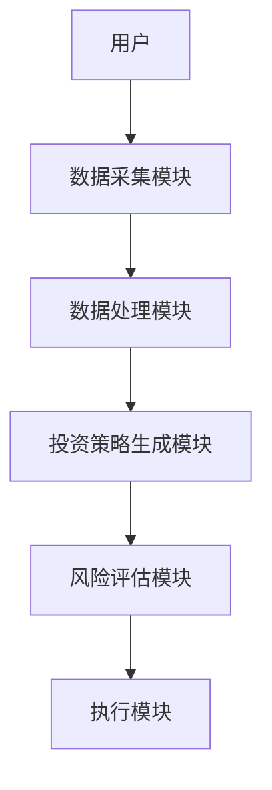

                 


# AI Agent在智能投资组合管理中的应用

> 关键词：AI Agent，智能投资组合管理，机器学习，强化学习，投资组合优化，风险管理

> 摘要：本文探讨AI Agent在投资组合管理中的应用，分析其如何通过机器学习和强化学习提高决策效率和优化资产配置，涵盖算法原理、系统架构设计和项目实战。

---

# 第1章: AI Agent的定义与核心概念

## 1.1 AI Agent的基本概念

### 1.1.1 AI Agent的定义

AI Agent（人工智能代理）是能够感知环境并采取行动以实现目标的智能体。它通过传感器获取信息，利用计算模型进行决策，并通过执行器与环境互动。

### 1.1.2 AI Agent的核心特征

- **自主性**：无需外部干预，自主决策。
- **反应性**：实时感知环境并调整行为。
- **目标导向**：基于目标优化行动。
- **学习能力**：通过数据和反馈不断优化。

### 1.1.3 AI Agent的分类与应用场景

- **简单反射型**：基于规则的反应，适用于重复性任务。
- **基于模型型**：利用内部模型进行决策，适用于复杂场景。
- **目标驱动型**：专注于实现特定目标，适合投资组合优化。

## 1.2 智能投资组合管理的背景与目标

### 1.2.1 投资组合管理的基本概念

投资组合管理是通过优化资产配置实现收益最大化和风险最小化的过程。传统方法依赖人工分析，效率低，且容易受主观因素影响。

### 1.2.2 智能投资组合管理的必要性

传统方法的局限性促使人们寻求更高效的解决方案。AI Agent能够处理大量数据，快速决策，提高投资效率。

### 1.2.3 投资组合管理的目标与挑战

- **目标**：最大化收益，最小化风险。
- **挑战**：市场波动、信息不全、决策复杂。

## 1.3 AI Agent在投资组合管理中的作用

### 1.3.1 提高决策效率

AI Agent通过自动化数据处理和分析，快速生成投资策略，节省时间。

### 1.3.2 优化资产配置

利用算法模型，AI Agent能找到最优资产组合，提升收益。

### 1.3.3 风险管理与预测

通过分析历史数据，AI Agent能预测市场趋势，提前规避风险。

---

# 第2章: AI Agent的核心算法原理

## 2.1 强化学习在AI Agent中的应用

### 2.1.1 强化学习的基本原理

强化学习通过奖励机制训练模型，使其在环境中做出最优决策。模型通过试错学习，不断优化策略。

### 2.1.2 在投资组合管理中的应用

AI Agent利用强化学习预测市场变化，动态调整投资组合，最大化收益。

### 2.1.3 算法实现步骤

1. 初始化策略参数。
2. 环境数据输入模型。
3. 生成投资策略。
4. 执行交易并观察结果。
5. 根据反馈更新参数。

**数学模型**：
$$
Q(s, a) = Q(s, a) + \alpha (r + \gamma \max Q(s', a') - Q(s, a))
$$
其中，\( Q \) 表示状态-动作值函数，\( \alpha \) 是学习率，\( r \) 是奖励，\( \gamma \) 是折扣因子。

### 2.2 机器学习在AI Agent中的应用

### 2.2.1 监督学习与无监督学习

- **监督学习**：使用带标签的数据训练模型，预测未来趋势。
- **无监督学习**：发现数据中的潜在结构，识别市场模式。

### 2.2.2 在投资组合管理中的应用

AI Agent利用机器学习分析市场数据，识别投资机会，优化资产配置。

### 2.2.3 算法实现步骤

1. 数据预处理。
2. 选择模型结构。
3. 训练模型。
4. 预测投资组合。
5. 持续优化模型。

**数学模型**：
$$
y = w_1x_1 + w_2x_2 + ... + w_nx_n + b
$$
其中，\( y \) 是预测值，\( w_i \) 是权重，\( x_i \) 是输入特征，\( b \) 是偏置。

### 2.3 算法原理的数学模型与公式

- **强化学习**：\( Q(s, a) = r + \gamma \max Q(s', a') \)
- **机器学习**：\( y = \sum w_i x_i + b \)

---

# 第3章: AI Agent在投资组合管理中的系统架构

## 3.1 系统功能模块设计

### 3.1.1 数据采集模块

负责收集市场数据，包括价格、成交量等。

### 3.1.2 数据处理模块

对数据进行清洗、转换，提取特征。

### 3.1.3 投资策略生成模块

根据算法生成最优投资策略。

### 3.1.4 风险评估模块

评估投资组合的风险，制定应对策略。

## 3.2 系统架构图



## 3.3 系统接口设计

### 3.3.1 数据接口

- **输入接口**：接收市场数据。
- **输出接口**：输出投资建议。

### 3.3.2 用户接口

- **输入接口**：用户输入投资目标。
- **输出接口**：显示投资组合。

### 3.3.3 第三方接口

与数据源、交易平台等第三方系统交互。

## 3.4 系统交互流程

### 3.4.1 用户请求处理流程

1. 用户输入投资目标。
2. 系统接收请求。
3. 数据采集模块获取数据。
4. 处理模块分析数据。
5. 生成投资策略。
6. 评估风险并优化。
7. 执行交易。

### 3.4.2 数据处理流程

1. 数据清洗。
2. 特征提取。
3. 模型训练。
4. 生成预测。
5. 输出结果。

### 3.4.3 投资策略生成流程

1. 分析市场数据。
2. 生成初步策略。
3. 优化策略。
4. 输出最终策略。

---

# 第4章: 项目实战

## 4.1 环境安装与配置

### 4.1.1 安装Python环境

安装Python 3.8及以上版本，建议使用Anaconda。

### 4.1.2 安装必要的库

安装numpy、pandas、scikit-learn、tensorflow等库。

### 4.1.3 数据源获取与处理

使用Yahoo Finance获取股票数据，清洗数据并提取特征。

## 4.2 核心代码实现

### 4.2.1 数据预处理代码

```python
import pandas as pd
import numpy as np

# 获取数据
data = pd.read_csv('stock_data.csv')

# 数据清洗
data.dropna()
data = data.iloc[-100:]
```

### 4.2.2 AI Agent算法实现

```python
import tensorflow as tf
from tensorflow.keras import layers

# 定义模型
model = tf.keras.Sequential([
    layers.Dense(64, activation='relu'),
    layers.Dense(1, activation='linear')
])

# 编译模型
model.compile(optimizer='adam', loss='mse')
```

### 4.2.3 投资组合管理实现

```python
# 训练模型
model.fit(X_train, y_train, epochs=100, batch_size=32)

# 预测
predictions = model.predict(X_test)
```

## 4.3 代码应用解读与分析

### 4.3.1 代码结构分

- **数据预处理**：清洗和格式化数据，提取特征。
- **模型训练**：构建和训练AI Agent模型。
- **投资组合生成**：根据模型预测生成投资策略。

---

# 作者

作者：AI天才研究院/AI Genius Institute & 禅与计算机程序设计艺术 /Zen And The Art of Computer Programming

---

本文通过详细讲解AI Agent在投资组合管理中的应用，从基础概念到算法原理，再到系统架构和项目实战，帮助读者全面理解其在智能投资中的作用。

