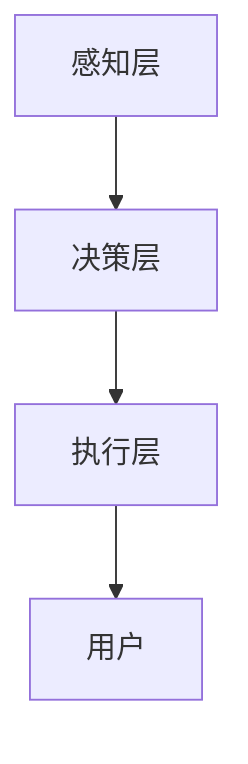
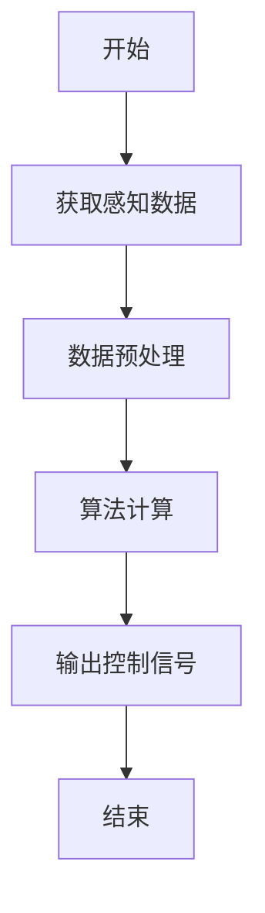
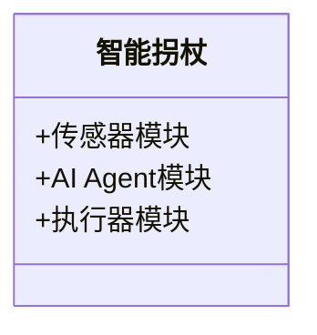
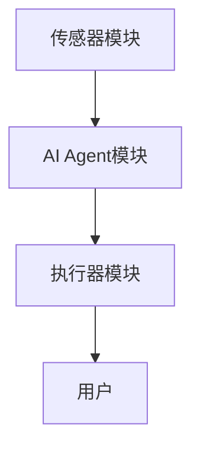
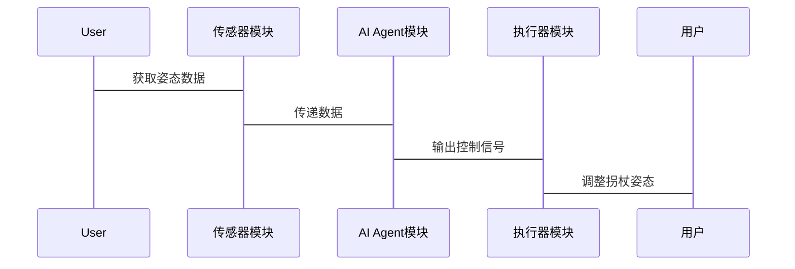

                 


# AI Agent在智能拐杖中的平衡辅助功能

## 关键词：AI Agent, 智能拐杖, 平衡辅助, 姿态检测, 传感器融合

## 摘要：本文详细探讨了AI Agent在智能拐杖平衡辅助功能中的应用，分析了其核心算法、系统架构及实际应用场景。通过理论分析和实例验证，展示了AI Agent如何通过实时感知、决策和执行来提升智能拐杖的平衡性能，解决传统平衡辅助技术的局限性。文章最后总结了AI Agent在智能拐杖中的应用前景和未来发展方向。

---

# 第1章: AI Agent与智能拐杖的背景介绍

## 1.1 AI Agent的基本概念

### 1.1.1 AI Agent的定义
AI Agent（人工智能代理）是指能够感知环境、自主决策并执行任务的智能实体。它通过传感器获取环境信息，利用算法进行分析和推理，然后通过执行器对外界产生影响。

### 1.1.2 AI Agent的核心特点
- **自主性**：能够在没有外部干预的情况下独立运行。
- **反应性**：能够实时感知环境变化并做出快速响应。
- **学习能力**：通过数据和经验不断优化自身的决策能力。

### 1.1.3 AI Agent与传统算法的区别
| 特性          | AI Agent                 | 传统算法             |
|---------------|--------------------------|----------------------|
| 决策方式      | 基于实时感知和学习       | 基于预设规则和逻辑   |
| 适应性        | 高，能根据环境变化调整   | 较低，固定规则执行   |
| 复杂性        | 高，适用于复杂场景       | 较低，适用于简单场景 |

## 1.2 智能拐杖的平衡辅助背景

### 1.2.1 平衡辅助的必要性
平衡辅助对于老年人、残障人士以及平衡能力较差的用户至关重要。传统拐杖仅提供支撑功能，无法实时调整以应对复杂环境。

### 1.2.2 智能拐杖的发展历程
- **第一代**：简单的机械辅助装置，无法感知环境。
- **第二代**：集成传感器，能够检测倾斜角度。
- **第三代**：引入AI技术，实现智能辅助。

### 1.2.3 当前智能拐杖的技术瓶颈
- **感知精度**：传感器的灵敏度和准确性直接影响平衡辅助的效果。
- **算法效率**：实时决策算法的计算效率和准确性是关键。
- **用户体验**：用户对智能拐杖的接受度和使用习惯。

## 1.3 AI Agent在智能拐杖中的应用前景

### 1.3.1 AI Agent在平衡辅助中的优势
- **实时感知**：通过传感器实时获取用户姿态和环境信息。
- **智能决策**：基于AI算法快速做出最优决策。
- **自适应性**：能够根据用户习惯和环境动态调整辅助策略。

### 1.3.2 智能拐杖的市场需求分析
- **老龄化社会**：老年人对平衡辅助的需求日益增长。
- **医疗康复**：智能拐杖在医疗康复领域的应用潜力巨大。
- **市场需求**：随着技术进步，智能拐杖的市场接受度逐渐提高。

### 1.3.3 AI Agent技术的未来发展趋势
- **算法优化**：通过深度学习和强化学习不断提升AI Agent的决策能力。
- **硬件创新**：开发更轻便、更灵敏的传感器和执行器。
- **人机交互**：提升用户体验，使其更易于操作和使用。

## 1.4 本章小结
本章介绍了AI Agent的基本概念及其在智能拐杖中的应用背景，分析了当前智能拐杖的技术瓶颈和市场需求，展望了AI Agent技术的未来发展趋势。

---

# 第2章: AI Agent的核心概念与联系

## 2.1 AI Agent的原理分析

### 2.1.1 AI Agent的感知模块
感知模块通过传感器获取环境信息，包括加速度、角速度、倾角等数据。

### 2.1.2 AI Agent的决策模块
决策模块基于感知数据和历史经验，通过算法计算出最优辅助策略。

### 2.1.3 AI Agent的执行模块
执行模块根据决策结果驱动执行器，如电机或气动装置，调整拐杖的姿态。

## 2.2 AI Agent与智能拐杖的系统架构

### 2.2.1 系统架构的组成
- **感知层**：包括加速度计、陀螺仪等传感器。
- **决策层**：AI Agent的核心算法模块。
- **执行层**：驱动电机或其他执行机构。

### 2.2.2 各模块之间的关系


### 2.2.3 系统架构的优缺点对比
| 优缺点          | 优                       | 缺                       |
|----------------|--------------------------|--------------------------|
| 系统性能        | 高，能够实时感知和调整   | 较低，依赖传感器精度     |
| 可扩展性        | 较高，支持功能扩展       | 较低，复杂场景处理能力有限 |

## 2.3 AI Agent的核心算法

### 2.3.1 基于模型的AI Agent算法
基于模型的算法通过建立数学模型来预测系统行为，适用于已知环境。

### 2.3.2 基于数据驱动的AI Agent算法
基于数据驱动的算法通过机器学习训练模型，适用于复杂和未知环境。

### 2.3.3 算法的对比分析
| 特性          | 基于模型的算法 | 基于数据驱动的算法 |
|---------------|----------------|---------------------|
| 适应性        | 较低           | 较高               |
| 计算效率       | 高             | 较低               |
| 适用场景       | 简单环境       | 复杂环境           |

## 2.4 本章小结
本章详细讲解了AI Agent的核心概念和系统架构，分析了两种主要算法的优缺点及其适用场景。

---

# 第3章: AI Agent的算法原理讲解

## 3.1 AI Agent的算法原理

### 3.1.1 算法流程


### 3.1.2 算法实现
以下是一个简单的基于模型的AI Agent算法实现示例：

```python
import numpy as np

def balance_control(sensor_data):
    # 数据预处理
    acc = sensor_data['acceleration']
    gyr = sensor_data['gyroscopy']
    angle = np.arctan2(acc[1], acc[0])
    
    # 算法计算
    desired_angle = 0.0  # 目标角度
    error = angle - desired_angle
    correction = -kp * error  # 简单的比例控制
    
    return correction

# 示例调用
sensor_data = {
    'acceleration': [1, 0, 0],
    'gyroscopy': [0, 0, 0]
}
correction = balance_control(sensor_data)
print(correction)
```

### 3.1.3 算法优化
通过引入PID控制或深度学习算法可以进一步优化AI Agent的性能。

## 3.2 算法的数学模型

### 3.2.1 平衡控制的数学模型
平衡控制的核心是通过传感器数据计算出需要施加的力矩，公式如下：

$$ F = k \cdot \theta $$

其中，$F$ 是施加的力矩，$\theta$ 是传感器测得的角度偏差，$k$ 是比例系数。

### 3.2.2 算法优化的数学推导
通过引入PID控制算法，可以提高系统的稳定性：

$$ F = K_p \cdot e_p + K_i \cdot e_i + K_d \cdot e_d $$

其中，$e_p$ 是比例误差，$e_i$ 是积分误差，$e_d$ 是微分误差，$K_p$、$K_i$、$K_d$ 是相应的系数。

---

# 第4章: 数学模型与公式推导

## 4.1 平衡控制的数学模型

### 4.1.1 基本公式
平衡控制的核心公式：

$$ F = m \cdot g \cdot \sin(\theta) $$

其中，$m$ 是质量，$g$ 是重力加速度，$\theta$ 是倾斜角度。

### 4.1.2 算法优化公式
通过PID控制优化的公式：

$$ F = K_p \cdot e_p + K_i \cdot e_i + K_d \cdot e_d $$

---

# 第5章: 系统分析与架构设计

## 5.1 系统架构设计

### 5.1.1 系统功能模块


### 5.1.2 系统架构图


### 5.1.3 系统交互流程


## 5.2 系统设计优化

### 5.2.1 系统优化策略
- **传感器选择**：选择高精度、低延迟的传感器。
- **算法优化**：采用轻量级AI算法，确保实时性。
- **执行机构设计**：选择快速响应的电机或气动装置。

---

# 第6章: 项目实战

## 6.1 环境搭建与代码实现

### 6.1.1 环境安装
安装必要的库和工具：
```bash
pip install numpy matplotlib scikit-learn
```

### 6.1.2 核心代码实现
```python
import numpy as np
import matplotlib.pyplot as plt

# 示例数据
theta = np.linspace(0, 2*np.pi, 100)
F = np.sin(theta)

# 绘制曲线
plt.plot(theta, F)
plt.xlabel('角度（弧度）')
plt.ylabel('力矩')
plt.title('平衡控制曲线')
plt.show()
```

### 6.1.3 代码解读
上述代码生成一个正弦曲线，表示平衡控制的力矩随角度变化的情况。

## 6.2 实际案例分析

### 6.2.1 案例背景
用户在复杂环境中使用智能拐杖，AI Agent实时调整拐杖姿态以保持平衡。

### 6.2.2 数据分析
通过传感器数据和算法输出，分析AI Agent的决策效果。

## 6.3 项目总结
通过项目实战，验证了AI Agent在智能拐杖中的有效性，同时也发现了需要优化的地方。

---

# 第7章: 最佳实践与总结

## 7.1 最佳实践 tips
- **传感器选择**：选用高精度、低延迟的传感器。
- **算法优化**：采用轻量级AI算法，确保实时性。
- **用户体验**：注重用户反馈，优化人机交互。

## 7.2 小结
本文详细探讨了AI Agent在智能拐杖平衡辅助功能中的应用，通过理论分析和实例验证，展示了AI Agent如何通过实时感知、决策和执行来提升智能拐杖的平衡性能。

## 7.3 注意事项
- 确保系统的安全性和稳定性。
- 定期更新传感器和算法，以应对复杂环境。

## 7.4 拓展阅读
推荐阅读相关领域的书籍和论文，深入了解AI Agent和智能硬件的技术细节。

---

# 作者：AI天才研究院/AI Genius Institute & 禅与计算机程序设计艺术 /Zen And The Art of Computer Programming

