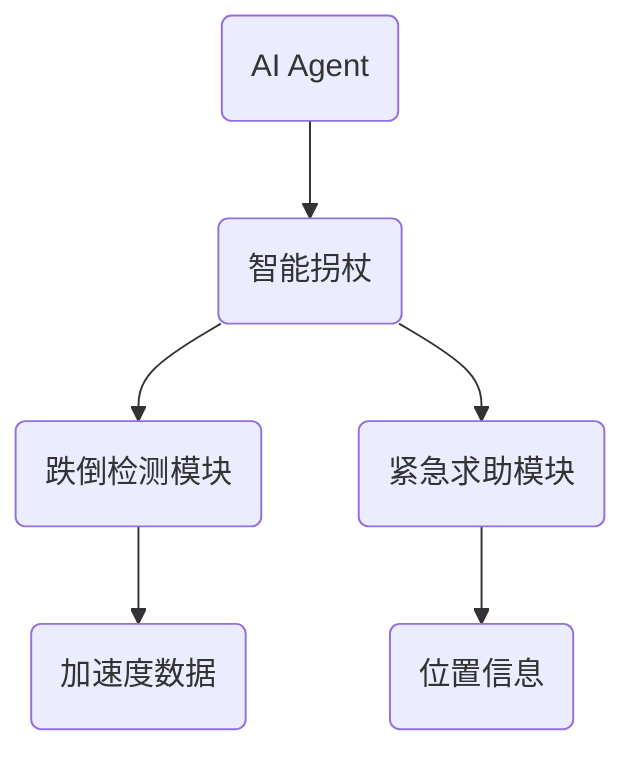
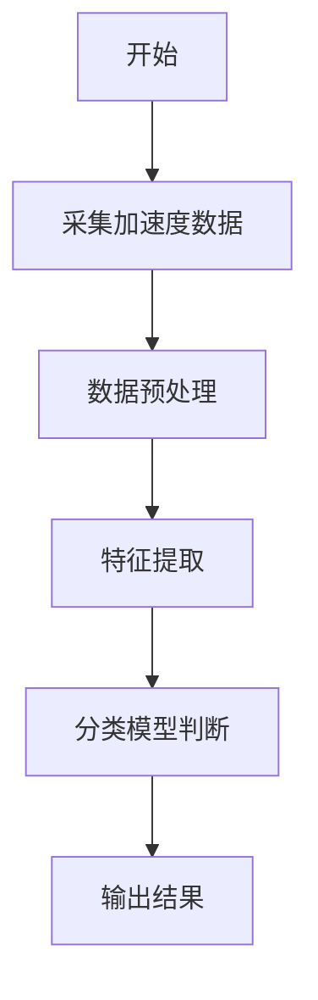
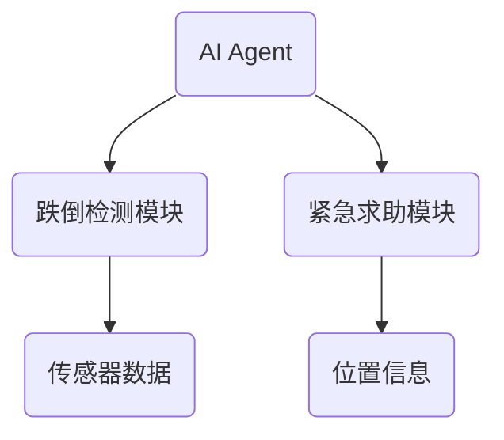
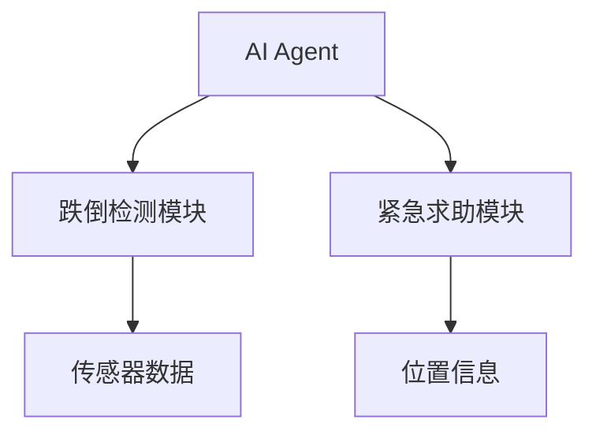

                 


# AI Agent在智能拐杖中的跌倒预防与紧急求助

> 关键词：AI Agent, 智能拐杖, 跌倒预防, 紧急求助, 老龄化社会, 健康监测, 人工智能

> 摘要：本文深入探讨AI Agent在智能拐杖中的应用，特别是在跌倒预防和紧急求助方面的技术实现。通过分析AI Agent的核心算法、智能拐杖的传感器技术以及系统的整体架构，本文提供了一种创新的解决方案，以帮助老年人提高安全性。文章详细介绍了算法原理、系统设计和项目实现，为相关领域的研究和应用提供了有价值的参考。

---

# 目录

## 第一部分: AI Agent在智能拐杖中的跌倒预防与紧急求助背景介绍

### 第1章: 跌倒预防与紧急求助的背景与挑战

#### 1.1 老龄化社会与跌倒问题

- 1.1.1 老龄化社会的现状
  - 全球老龄化趋势
  - 中国老龄化问题的加剧

- 1.1.2 跌倒对老年人的危害
  - 跌倒导致的骨折和长期健康问题
  - 跌倒对生活质量的影响

- 1.1.3 跌倒预防的重要性
  - 节省医疗资源
  - 提高老年人生活质量
  - 家庭和社会的双重需求

#### 1.2 智能拐杖的发展历程

- 1.2.1 传统拐杖的功能与局限
  - 传统拐杖的基本功能
  - 传统拐杖在使用中的不便

- 1.2.2 智能拐杖的出现与演变
  - 智能拐杖的概念
  - 智能拐杖的逐步进化

- 1.2.3 智能拐杖的市场现状
  - 市场规模
  - 主要技术特点

#### 1.3 AI Agent在智能拐杖中的应用前景

- 1.3.1 AI技术在医疗健康领域的应用
  - AI在疾病预防中的作用
  - AI在康复医疗中的应用

- 1.3.2 AI Agent在智能设备中的潜力
  - AI Agent的定义与特点
  - AI Agent在智能设备中的优势

- 1.3.3 智能拐杖结合AI Agent的优势
  - 提高跌倒预防能力
  - 实现紧急求助功能
  - 提供更智能的辅助功能

### 第2章: AI Agent与智能拐杖的核心概念

#### 2.1 AI Agent的基本原理

- 2.1.1 AI Agent的定义与分类
  - AI Agent的定义
  - AI Agent的分类及其特点

- 2.1.2 AI Agent的核心功能
  - 感知能力
  - 分析与决策能力
  - 执行能力

- 2.1.3 AI Agent与智能拐杖的结合
  - AI Agent在智能拐杖中的应用
  - 结合的具体方式与优势

#### 2.2 智能拐杖的功能模块

- 2.2.1 跌倒检测模块
  - 跌倒检测的基本原理
  - 跌倒检测的关键技术

- 2.2.2 紧急求助模块
  - 紧急求助的功能与实现
  - 求助流程的设计

- 2.2.3 其他辅助功能
  - 环境监测
  - 用户行为分析

#### 2.3 AI Agent在智能拐杖中的作用

- 2.3.1 数据采集与处理
  - 传感器数据的采集
  - 数据的预处理与分析

- 2.3.2 跌倒风险评估
  - 风险评估的模型与算法
  - 评估结果的应用

- 2.3.3 紧急求助流程
  - AI Agent在紧急情况下的决策流程
  - 求助信息的发送与处理

### 第3章: AI Agent与智能拐杖的核心概念与联系

#### 3.1 核心概念原理

- 3.1.1 AI Agent的核心算法
  - 基于机器学习的跌倒检测算法
  - 基于规则的紧急求助流程

- 3.1.2 智能拐杖的传感器技术
  - 加速度计
  - 陀螺仪
  - 其他传感器

- 3.1.3 数据分析与决策机制
  - 数据融合技术
  - 多模态数据的分析与处理

#### 3.2 核心概念属性特征对比表格

| 核心概念 | 属性 | 特征 |
|----------|------|------|
| AI Agent | 感知能力 | 多模态数据处理 |
| 智能拐杖 | 传感器类型 | 加速度计、陀螺仪 |
| 跌倒检测 | 算法类型 | 基于时间序列的分类模型 |

#### 3.3 ER实体关系图



### 第4章: AI Agent在跌倒预防中的算法原理

#### 4.1 跌倒检测算法

- 4.1.1 算法流程图



- 4.1.2 Python实现示例代码

```python
import numpy as np
from sklearn.svm import SVC

# 示例数据集
X = np.random.rand(100, 10)
y = np.random.randint(2, size=100)

# 分类模型
model = SVC()

# 模型训练
model.fit(X, y)

# 模型预测
print(model.predict(X))
```

#### 4.2 紧急求助流程

- 4.2.1 紧急情况下的AI Agent决策流程
  - 检测跌倒事件
  - 确认跌倒事件
  - 触发紧急求助

- 4.2.2 Python实现示例代码

```python
import time

def detect_fall():
    # 传感器数据采集
    pass

def send_help_request():
    # 发送求助信息
    pass

# 主循环
while True:
    if detect_fall():
        send_help_request()
    time.sleep(1)
```

### 第5章: AI Agent在跌倒预防中的数学模型与公式

#### 5.1 跌倒检测的数学模型

$$
P(\text{fall}|x) = \frac{P(x|\text{fall})P(\text{fall})}{P(x)}
$$

其中：
- $P(\text{fall}|x)$ 是在给定数据$x$的情况下发生跌倒的概率。
- $P(x|\text{fall})$ 是在跌倒情况下数据$x$出现的概率。
- $P(\text{fall})$ 是跌倒的先验概率。
- $P(x)$ 是数据$x$的全概率。

#### 5.2 紧急求助的决策模型

$$
D(x) = \begin{cases}
1 & \text{如果 } x \text{ 表示跌倒事件} \\
0 & \text{否则}
\end{cases}
$$

### 第6章: 系统分析与架构设计方案

#### 6.1 系统功能设计

- 6.1.1 功能模块划分
  - 跌倒检测模块
  - 紧急求助模块
  - 数据管理模块

- 6.1.2 功能流程图


#### 6.2 系统架构设计

- 6.2.1 架构图



#### 6.3 系统接口设计

- 6.3.1 接口定义
  - 数据采集接口
  - 数据处理接口
  - 求助请求接口

- 6.3.2 接口交互图



### 第7章: 项目实战

#### 7.1 环境安装

- 安装Python环境
- 安装必要的库（如numpy、scikit-learn）

#### 7.2 核心代码实现

- 跌倒检测模块代码

```python
import numpy as np
from sklearn.svm import SVC

# 示例数据集
X = np.random.rand(100, 10)
y = np.random.randint(2, size=100)

# 分类模型
model = SVC()

# 模型训练
model.fit(X, y)

# 模型预测
print(model.predict(X))
```

- 紧急求助模块代码

```python
import time

def detect_fall():
    # 传感器数据采集
    pass

def send_help_request():
    # 发送求助信息
    pass

# 主循环
while True:
    if detect_fall():
        send_help_request()
    time.sleep(1)
```

#### 7.3 实际案例分析

- 案例背景
- 数据采集与处理
- 模型训练与测试
- 结果分析

### 第8章: 最佳实践、小结与注意事项

#### 8.1 最佳实践

- 数据采集的质量控制
- 模型的持续优化
- 用户隐私保护

#### 8.2 小结

- 本文总结了AI Agent在智能拐杖中的应用
- 强调了跌倒预防和紧急求助的重要性
- 提供了实际的实现方案和技术细节

#### 8.3 注意事项

- 设备的易用性设计
- 系统的稳定性与可靠性
- 用户的接受度与反馈

### 第9章: 拓展阅读与未来展望

#### 9.1 拓展阅读

- AI在医疗健康领域的应用
- 智能设备的前沿技术
- 跌倒预防的其他解决方案

#### 9.2 未来展望

- 更先进的传感器技术
- 更智能的AI算法
- 更广泛的应用场景

---

# 作者：AI天才研究院/AI Genius Institute & 禅与计算机程序设计艺术 /Zen And The Art of Computer Programming

---

这篇目录大纲详细涵盖了AI Agent在智能拐杖中的跌倒预防与紧急求助的各个方面，从背景介绍到系统设计，再到项目实战，内容丰富且逻辑清晰。每个部分都包含了必要的技术细节和实际案例分析，确保读者能够全面理解并掌握相关知识。

