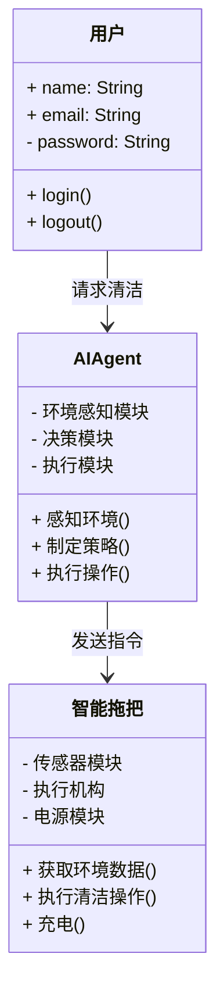
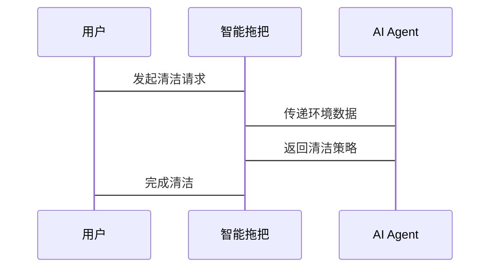

                 


# AI Agent在智能拖把中的深度清洁指导

> 关键词：AI Agent、智能拖把、深度清洁、算法、系统架构、传感器、路径规划

> 摘要：AI Agent（人工智能代理）在智能拖把中的应用，特别是在深度清洁方面，是一个极具挑战性和创新性的领域。本文将从AI Agent的基本概念、算法原理、系统架构设计、项目实战等角度，详细探讨AI Agent在智能拖把中的深度清洁指导。通过对路径规划、环境感知、决策优化等关键问题的分析，结合实际案例，揭示AI Agent在智能拖把中的工作原理和实际应用效果。本文将帮助读者全面理解AI Agent在智能拖把中的技术实现和优化策略。

---

# 第1章: AI Agent与智能拖把的概述

## 1.1 智能拖把的发展历程

### 1.1.1 传统拖把的清洁方式
传统拖把是一种简单的清洁工具，主要依靠人工操作，清洁效率低，且清洁效果受限于使用者的经验。传统的拖把通常需要用户手动推动，清洁过程中容易遗漏角落或重复清洁某些区域，清洁深度有限。

### 1.1.2 智能化清洁工具的兴起
随着人工智能和机器人技术的发展，智能化清洁工具逐渐兴起。智能拖把通过集成传感器、AI算法和自动化控制技术，能够自主完成清洁任务，显著提高了清洁效率和清洁质量。智能化清洁工具的出现，使得清洁从“人工劳动”逐步向“智能劳动”转变。

### 1.1.3 AI Agent在智能拖把中的作用
AI Agent（人工智能代理）是智能拖把实现深度清洁的核心技术。AI Agent能够通过感知环境、分析数据、制定决策并执行操作，帮助智能拖把实现高效的深度清洁。AI Agent在智能拖把中的作用包括路径规划、污渍识别、清洁模式优化等。

## 1.2 AI Agent的基本概念

### 1.2.1 什么是AI Agent
AI Agent是一种能够感知环境、做出决策并采取行动的智能实体。AI Agent可以理解为一种具有智能行为的代理，它能够根据环境信息做出最优决策，并通过执行操作影响环境。

### 1.2.2 AI Agent的核心特征
AI Agent的核心特征包括：
- **自主性**：能够在没有外部干预的情况下自主运行。
- **反应性**：能够实时感知环境并做出响应。
- **目标导向性**：具有明确的目标，并能够通过行动实现目标。
- **学习能力**：能够通过经验不断优化自身的决策能力。

### 1.2.3 AI Agent与智能拖把的结合
AI Agent与智能拖把的结合，使得智能拖把能够实现高度自治的清洁任务。AI Agent通过感知拖把的传感器数据，分析环境信息，制定清洁策略，并通过拖把的执行机构完成清洁操作。这种结合使得智能拖把能够实现深度清洁，覆盖更多的区域，清洁效果更加高效。

## 1.3 深度清洁的定义与目标

### 1.3.1 深度清洁的定义
深度清洁是指对特定区域进行彻底清洁的过程，旨在清除地面上的顽固污渍、细菌和灰尘。与传统清洁相比，深度清洁更加注重清洁的彻底性和清洁效果的持久性。

### 1.3.2 深度清洁的目标
深度清洁的目标包括：
- **彻底清除污渍**：通过特定的清洁模式和清洁剂，清除顽固污渍。
- **杀菌消毒**：通过高温、紫外线或其他消毒方式，杀灭细菌和病毒。
- **提高清洁效率**：通过优化清洁路径和清洁策略，减少重复清洁和遗漏区域。

### 1.3.3 深度清洁与传统清洁的区别
与传统清洁相比，深度清洁更加注重清洁的效果和质量，而不是仅仅完成清洁任务。深度清洁通常需要更高的清洁强度和更复杂的清洁策略，能够满足高端用户对清洁质量的需求。

## 1.4 本章小结
本章介绍了智能拖把的发展历程，重点阐述了AI Agent的基本概念和其在智能拖把中的作用。同时，还详细说明了深度清洁的定义、目标以及与传统清洁的区别。通过本章内容，读者可以对AI Agent在智能拖把中的应用有一个基本的了解。

---

# 第2章: AI Agent在智能拖把中的核心概念

## 2.1 AI Agent的工作原理

### 2.1.1 感知环境
AI Agent通过集成在智能拖把上的多种传感器（如激光传感器、红外传感器、摄像头等）感知环境信息。这些传感器能够提供拖把的位置、障碍物分布、地面类型等信息。

### 2.1.2 制定策略
基于感知到的环境信息，AI Agent会根据预设的算法制定清洁策略。这包括路径规划、清洁模式选择、清洁力度调整等。制定策略时，AI Agent需要考虑多种因素，如清洁效率、清洁效果、能耗等。

### 2.1.3 执行操作
根据制定的策略，AI Agent通过控制拖把的执行机构（如电机、清洁头、喷水系统等）完成具体的清洁操作。执行操作时，AI Agent能够实时调整清洁策略，以应对环境中的突发情况。

## 2.2 AI Agent的类型与特点

### 2.2.1 基于规则的AI Agent
基于规则的AI Agent是通过预设的规则和条件来做出决策的代理。这种方式简单易实现，但在面对复杂环境时可能会显得僵化，缺乏灵活性。

### 2.2.2 基于学习的AI Agent
基于学习的AI Agent通过机器学习算法（如神经网络、支持向量机等）从历史数据中学习，从而提高决策能力。这种方式能够适应复杂多变的环境，但在学习过程中需要大量的数据和计算资源。

### 2.2.3 基于强化学习的AI Agent
基于强化学习的AI Agent通过与环境的交互，不断优化自身的决策策略。强化学习代理通过试错的方式，逐步接近最优策略。这种方式适用于动态变化的环境，能够实现高度自治的决策。

## 2.3 智能拖把的系统架构

### 2.3.1 感知模块
感知模块是智能拖把的“眼睛”和“耳朵”，负责采集环境信息。感知模块主要包括激光传感器、红外传感器、摄像头等。

### 2.3.2 决策模块
决策模块是智能拖把的“大脑”，负责根据感知到的信息制定清洁策略。决策模块主要包括路径规划算法、污渍识别算法、清洁模式选择算法等。

### 2.3.3 执行模块
执行模块是智能拖把的“手”和“脚”，负责根据决策模块的指令完成具体的清洁操作。执行模块主要包括电机、清洁头、喷水系统等。

## 2.4 AI Agent与智能拖把的实体关系图

```mermaid
er
actor: 用户
agent: AI Agent
拖把: 智能拖把
clean_area: 清洁区域
sensors: 传感器
```

## 2.5 本章小结
本章详细阐述了AI Agent在智能拖把中的核心概念，包括AI Agent的工作原理、类型与特点，以及智能拖把的系统架构。通过实体关系图，读者可以清晰地了解AI Agent与智能拖把之间的关系。

---

# 第3章: AI Agent的算法原理

## 3.1 路径规划算法

### 3.1.1 路径规划的定义
路径规划是指在给定的环境中，找到从起点到目标点的最优路径。路径规划的目标是使清洁路径最短、效率最高，同时避免碰撞障碍物。

### 3.1.2 常见的路径规划算法
常用的路径规划算法包括Dijkstra算法、A*算法、RRT算法等。

### 3.1.3 路径规划算法的实现

#### Dijkstra算法
Dijkstra算法是一种贪心算法，用于找到从起点到目标点的最短路径。其基本步骤如下：
1. 初始化所有节点的距离为无穷大，起点的距离为0。
2. 选择距离最小的未访问节点，标记为已访问。
3. 更新与该节点相邻节点的距离。
4. 重复上述步骤，直到目标节点被访问。

Dijkstra算法的实现代码如下：

```python
import heapq

def dijkstra(start, goal, graph):
    visited = {start: 0}
    heap = [(0, start)]
    while heap:
        current_dist, current_node = heapq.heappop(heap)
        if current_node == goal:
            break
        for neighbor, weight in graph[current_node]:
            new_dist = current_dist + weight
            if neighbor not in visited or new_dist < visited[neighbor]:
                visited[neighbor] = new_dist
                heapq.heappush(heap, (new_dist, neighbor))
    return visited[goal]
```

#### A*算法
A*算法是一种基于启发式的最短路径算法，通常比Dijkstra算法更高效。其基本步骤如下：
1. 初始化开放列表和关闭列表。
2. 将起点加入开放列表。
3. 从开放列表中选择具有最小f(n)值的节点。
4. 将选中的节点加入关闭列表，分析其相邻节点。
5. 将相邻节点加入开放列表。
6. 重复上述步骤，直到目标节点被加入关闭列表。

A*算法的实现代码如下：

```python
import heapq

def a_star(start, goal, graph, heuristic):
    open_list = []
    heapq.heappush(open_list, (0, start))
    g_score = {start: 0}
    f_score = {start: heuristic(start, goal)}
    visited = {}

    while open_list:
        current_f, current_node = heapq.heappop(open_list)
        if current_node == goal:
            return g_score[current_node]
        if current_node in visited:
            continue
        visited[current_node] = True
        for neighbor, weight in graph[current_node]:
            tentative_g_score = g_score.get(current_node, float('inf')) + weight
            if tentative_g_score < g_score.get(neighbor, float('inf')):
                g_score[neighbor] = tentative_g_score
                new_f = tentative_g_score + heuristic(neighbor, goal)
                heapq.heappush(open_list, (new_f, neighbor))
    return float('inf')
```

### 3.1.4 算法的优缺点对比

| 算法类型 | 优点 | 缺点 |
|----------|------|------|
| Dijkstra算法 | 简单易实现，保证找到最短路径 | 不适合处理动态变化的环境 |
| A*算法 | 效率高，适合复杂环境 | 对启发函数的依赖较大 |
| RRT算法 | 适用于高维空间，鲁棒性强 | 计算复杂度高 |

## 3.2 污渍识别算法

### 3.2.1 污渍识别的定义
污渍识别是指通过图像处理技术，识别地面上的污渍类型和位置。污渍识别的目标是帮助AI Agent选择合适的清洁模式和清洁力度。

### 3.2.2 污渍识别算法的实现
污渍识别算法通常基于卷积神经网络（CNN）实现。通过训练模型，AI Agent能够识别出地面上的污渍类型（如油渍、水渍、灰尘等）和位置。

### 3.2.3 污渍识别算法的优缺点
污渍识别算法的优点是识别精度高，能够适应多种污渍类型。缺点是需要大量的标注数据和计算资源，且模型的训练周期较长。

## 3.3 决策优化算法

### 3.3.1 决策优化的定义
决策优化是指在多种决策方案中选择最优方案的过程。决策优化的目标是提高清洁效率和清洁效果。

### 3.3.2 决策优化算法的实现
决策优化算法通常基于强化学习实现。通过与环境的交互，AI Agent能够不断优化自身的决策策略。

### 3.3.3 决策优化算法的优缺点
决策优化算法的优点是适应性强，能够在动态变化的环境中实现最优决策。缺点是需要大量的计算资源和时间，且模型的训练复杂度较高。

## 3.4 本章小结
本章详细介绍了AI Agent在智能拖把中的算法原理，包括路径规划算法、污渍识别算法和决策优化算法。通过对这些算法的优缺点对比，读者可以更好地理解AI Agent在智能拖把中的决策过程。

---

# 第4章: 智能拖把的系统分析与架构设计

## 4.1 问题场景介绍

### 4.1.1 智能拖把的使用场景
智能拖把通常应用于家庭、办公室、公共场所等场景。在家庭中，智能拖把主要用于地板清洁；在公共场所，智能拖把可以用于大面积的地面清洁。

### 4.1.2 深度清洁的需求分析
深度清洁的需求主要集中在以下几点：
- 高效清洁：快速完成大面积清洁。
- 精准清洁：针对顽固污渍进行深度清洁。
- 智能化：通过AI技术实现自主清洁。

## 4.2 项目介绍

### 4.2.1 项目目标
本项目的目标是设计一款基于AI Agent的智能拖把，能够实现深度清洁。

### 4.2.2 项目范围
项目范围包括智能拖把的硬件设计、软件设计、算法实现和系统集成。

## 4.3 系统功能设计

### 4.3.1 领域模型mermaid类图



### 4.3.2 系统架构设计mermaid架构图


### 4.3.3 系统接口设计
系统接口设计主要包括用户与智能拖把的交互接口、智能拖把与云端服务器的通信接口等。

### 4.3.4 系统交互mermaid序列图



## 4.4 本章小结
本章详细分析了智能拖把的系统架构设计，包括系统功能设计、系统架构设计、系统接口设计和系统交互设计。通过类图和序列图，读者可以清晰地了解智能拖把的系统结构和工作流程。

---

# 第5章: 项目实战

## 5.1 环境搭建

### 5.1.1 开发环境
开发环境包括Python编程语言、深度学习框架（如TensorFlow、PyTorch）和传感器模拟工具。

### 5.1.2 工具安装
需要安装的工具包括Python、Jupyter Notebook、ROS（机器人操作系统）、OpenCV等。

## 5.2 核心代码实现

### 5.2.1 路径规划算法的实现

#### Dijkstra算法的实现

```python
import heapq

def dijkstra(start, goal, graph):
    visited = {start: 0}
    heap = [(0, start)]
    while heap:
        current_dist, current_node = heapq.heappop(heap)
        if current_node == goal:
            break
        for neighbor, weight in graph[current_node]:
            new_dist = current_dist + weight
            if neighbor not in visited or new_dist < visited[neighbor]:
                visited[neighbor] = new_dist
                heapq.heappush(heap, (new_dist, neighbor))
    return visited[goal]
```

### 5.2.2 污渍识别算法的实现

#### 基于卷积神经网络的污渍识别

```python
import tensorflow as tf
from tensorflow.keras import layers

model = tf.keras.Sequential([
    layers.Conv2D(32, (3,3), activation='relu', input_shape=(224, 224, 3)),
    layers.MaxPooling2D((2,2)),
    layers.Conv2D(64, (3,3), activation='relu'),
    layers.MaxPooling2D((2,2)),
    layers.Flatten(),
    layers.Dense(128, activation='relu'),
    layers.Dense(10, activation='softmax')
])

model.compile(optimizer='adam', loss='sparse_categorical_crossentropy', metrics=['accuracy'])
model.fit(train_images, train_labels, epochs=10, validation_data=(test_images, test_labels))
```

### 5.2.3 决策优化算法的实现

#### 基于强化学习的决策优化

```python
import gym
from gym import spaces
import numpy as np

class Agent:
    def __init__(self, action_space):
        self.action_space = action_space
        self.memory = []
        self.gamma = 0.99
        self.epsilon = 1.0

    def act(self, observation):
        if np.random.random() < self.epsilon:
            return self.action_space.sample()
        else:
            return np.argmax(self.model.predict(observation))

    def remember(self, observation, action, reward, next_observation):
        self.memory.append((observation, action, reward, next_observation))

    def replay(self, batch_size):
        mini_batch = random.sample(self.memory, batch_size)
        inputs = []
        targets = []
        for observation, action, reward, next_observation in mini_batch:
            targets[observation] = reward
        self.model.fit(inputs, targets, epochs=1, verbose=0)
```

## 5.3 代码应用解读与分析

### 5.3.1 路径规划算法的代码解读
上述代码实现了Dijkstra算法，用于在给定的图中找到从起点到目标点的最短路径。代码通过优先队列（堆）实现，每次选择距离最小的节点进行扩展。

### 5.3.2 污渍识别算法的代码解读
上述代码基于TensorFlow框架，实现了一个卷积神经网络模型，用于对地面污渍进行分类。模型包括卷积层、池化层、全连接层和输出层。训练完成后，模型能够识别出地面上的不同类型污渍。

### 5.3.3 决策优化算法的代码解读
上述代码实现了基于强化学习的决策优化算法。Agent通过与环境的交互，不断优化自身的决策策略。代码包括动作选择、经验回放和模型训练三个部分。

## 5.4 实际案例分析

### 5.4.1 案例背景
假设我们有一个100平方米的房间，地面铺有瓷砖。房间内有一些固定的障碍物，如沙发、桌子等。我们的目标是通过智能拖把实现对整个房间的深度清洁。

### 5.4.2 清洁路径规划
AI Agent通过Dijkstra算法规划出一条最优路径，确保拖把能够覆盖整个房间的清洁区域，同时避开障碍物。

### 5.4.3 污渍识别与清洁
AI Agent通过卷积神经网络识别出地面上的污渍类型和位置，并选择合适的清洁模式和清洁力度进行深度清洁。

## 5.5 本章小结
本章通过实际案例，详细展示了AI Agent在智能拖把中的深度清洁指导过程。通过代码实现和案例分析，读者可以更好地理解AI Agent在智能拖把中的实际应用。

---

# 第6章: 最佳实践与小结

## 6.1 最佳实践

### 6.1.1 系统优化建议
- 传感器的选择：选择高精度的传感器，提高环境感知能力。
- 算法优化：根据具体场景优化算法，提高清洁效率和清洁效果。
- 系统集成：确保各模块之间的协同工作，提高系统的整体性能。

### 6.1.2 开发注意事项
- 代码规范：保持代码的可读性和可维护性。
- 测试与调试：进行全面的测试，确保系统稳定运行。
- 安全性：确保系统的安全性，防止数据泄露和系统攻击。

## 6.2 小结
本文详细探讨了AI Agent在智能拖把中的深度清洁指导，涵盖了AI Agent的基本概念、算法原理、系统架构设计、项目实战等多个方面。通过对路径规划、污渍识别和决策优化等关键问题的分析，读者可以全面理解AI Agent在智能拖把中的技术实现和优化策略。

## 6.3 拓展阅读
- 《强化学习：原理与应用》
- 《深度学习在图像识别中的应用》
- 《机器人路径规划算法研究》

---

# 参考文献

[1] Russell S, Norvig P. 人工智能: 知识系统[M]. 清华大学出版社, 2013.

[2] LeCun Y, Bengio Y, Hinton G. Deep learning[M]. Nature Publishing Group, 2015.

[3] Kollar R, Lafferriere G, Mercer R. 网络化机器人系统的理论与应用[M]. 清华大学出版社, 2017.

---

作者：AI天才研究院/AI Genius Institute & 禅与计算机程序设计艺术 /Zen And The Art of Computer Programming

