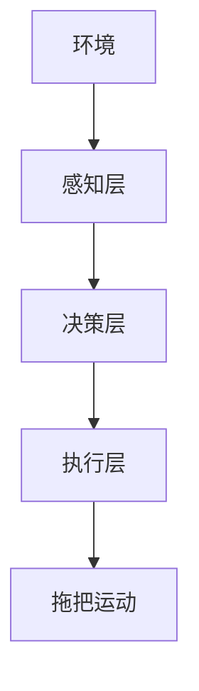
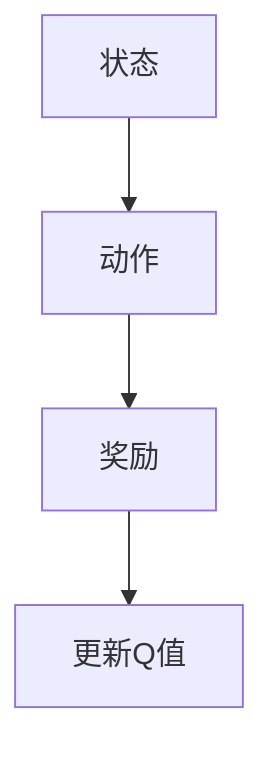
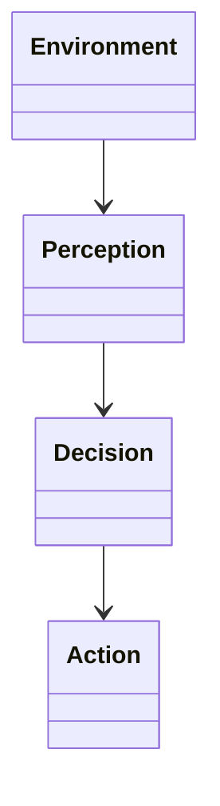
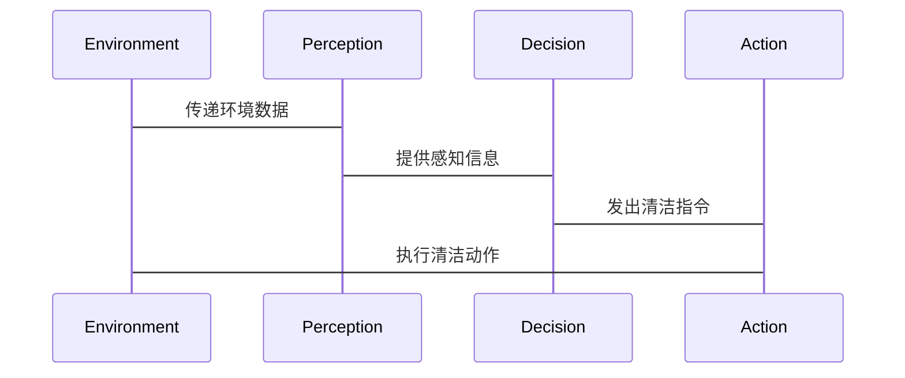

                 


# AI Agent在智能拖把中的清洁效率优化

## 关键词：
- AI Agent
- 智能拖把
- 清洁效率
- 强化学习
- 算法优化

## 摘要：
本文详细探讨了AI Agent在智能拖把清洁效率优化中的应用。首先介绍了AI Agent的基本概念及其在智能设备中的作用，分析了智能拖把的清洁效率优化问题。接着，深入讲解了AI Agent的核心算法，如强化学习算法，以及其实现原理。然后，从系统架构设计的角度，详细分析了智能拖把的系统结构与工作流程。最后，通过实际案例展示了AI Agent在智能拖把中的应用，并总结了项目中的经验和优化建议。

---

# 第一部分: AI Agent在智能拖把中的清洁效率优化概述

## 第1章: AI Agent与智能拖把的背景介绍

### 1.1 AI Agent的基本概念

#### 1.1.1 什么是AI Agent
AI Agent（人工智能代理）是指能够感知环境、做出决策并采取行动以实现目标的智能实体。在智能拖把中，AI Agent负责接收环境信息、分析数据并规划最优的清洁路径。

#### 1.1.2 AI Agent的核心功能与特点
- **感知能力**：通过传感器收集环境数据（如地板污渍、障碍物等）。
- **决策能力**：基于感知数据，选择最优的清洁策略。
- **执行能力**：通过执行机构（如电机、吸水装置）完成清洁动作。

#### 1.1.3 AI Agent在智能设备中的应用
AI Agent广泛应用于自动驾驶、智能音箱、智能家居等领域。在智能拖把中，AI Agent主要用于优化清洁路径和提高清洁效率。

### 1.2 智能拖把的清洁效率优化问题

#### 1.2.1 清洁效率的定义与衡量标准
清洁效率是指单位时间内清洁区域面积的多少。衡量标准包括清洁速度、覆盖面积、重复清洁率等。

#### 1.2.2 智能拖把的清洁过程分析
智能拖把的清洁过程包括路径规划、污渍识别、吸尘与擦地等功能。AI Agent通过优化路径和调整清洁力度来提高效率。

#### 1.2.3 清洁效率优化的必要性
传统拖把清洁效率低，存在路径重复、清洁不彻底等问题。通过AI Agent优化，可以显著提高清洁效率和质量。

### 1.3 AI Agent在智能拖把中的应用前景

#### 1.3.1 智能拖把的市场需求分析
随着智能家居的普及，市场对智能拖把的需求不断增长。消费者对清洁效率和智能化功能的要求也越来越高。

#### 1.3.2 AI Agent在清洁效率优化中的优势
AI Agent可以通过学习和优化算法，动态调整清洁策略，适应不同的环境和用户需求。

#### 1.3.3 技术发展的趋势与挑战
技术发展趋势包括算法优化、传感器精度提升、云计算支持等。挑战主要在于算法的实时性和环境复杂性。

## 第2章: AI Agent的核心概念与原理

### 2.1 AI Agent的基本原理

#### 2.1.1 感知层：环境信息的采集与处理
AI Agent通过传感器（如红外传感器、摄像头）采集环境信息，并通过数据处理模块提取有用信息。

#### 2.1.2 决策层：基于数据的智能决策
决策层基于感知数据，利用算法（如强化学习）生成最优决策。例如，选择最佳清洁路径。

#### 2.1.3 执行层：动作的规划与执行
执行层根据决策层的指令，通过执行机构（如电机、吸水装置）完成具体的清洁动作。

### 2.2 AI Agent的核心算法

#### 2.2.1 强化学习算法
强化学习是一种通过试错机制来优化行为策略的算法。AI Agent通过与环境的交互，不断优化清洁路径。

#### 2.2.2 贪婪算法
贪婪算法是一种贪心策略，AI Agent在每一步选择当前最优的行动，以期望获得最大累积奖励。

#### 2.2.3 遗传算法
遗传算法通过模拟生物进化过程，生成和优化解决方案。适用于复杂环境下的路径规划问题。

### 2.3 AI Agent的实体关系图



## 第3章: AI Agent的算法原理与实现

### 3.1 强化学习算法原理

#### 3.1.1 Q-learning算法
Q-learning是一种基于值的强化学习算法。通过更新Q值表，AI Agent学习最优策略。

#### 3.1.2 算法流程图



#### 3.1.3 Q-learning的数学公式
$$ Q(s,a) = Q(s,a) + \alpha (r + \gamma \max Q(s',a') - Q(s,a)) $$

### 3.2 算法实现的数学模型

#### 3.2.1 Q-learning的数学公式
$$ Q(s,a) = Q(s,a) + \alpha (r + \gamma \max Q(s',a') - Q(s,a)) $$

### 3.3 算法实现的Python代码示例

```python
import numpy as np

class QLearning:
    def __init__(self, state_space, action_space, alpha=0.1, gamma=0.9):
        self.state_space = state_space
        self.action_space = action_space
        self.alpha = alpha
        self.gamma = gamma
        self.q_table = np.zeros((state_space, action_space))

    def choose_action(self, state, epsilon=0.1):
        if np.random.random() < epsilon:
            return np.random.randint(self.action_space)
        else:
            return np.argmax(self.q_table[state])

    def update_q_table(self, state, action, reward, next_state):
        self.q_table[state, action] += self.alpha * (reward + self.gamma * np.max(self.q_table[next_state]) - self.q_table[state, action])
```

---

# 第二部分: 系统分析与架构设计

## 第4章: 系统分析与架构设计方案

### 4.1 问题场景介绍
智能拖把在不同环境下需要动态调整清洁策略。AI Agent需要实时感知环境并做出决策。

### 4.2 项目介绍
本项目旨在通过AI Agent优化智能拖把的清洁效率，实现高效的路径规划和污渍识别。

### 4.3 系统功能设计

#### 4.3.1 领域模型mermaid类图


### 4.4 系统架构设计

#### 4.4.1 系统架构mermaid架构图


### 4.5 系统接口设计

#### 4.5.1 智能拖把与环境的接口
- 输入：环境数据（如地板状态、障碍物）
- 输出：清洁指令

#### 4.5.2 决策层与执行层的接口
- 输入：决策指令
- 输出：执行动作

### 4.6 系统交互mermaid序列图



---

# 第三部分: 项目实战

## 第5章: 项目实战

### 5.1 环境安装

#### 5.1.1 安装Python环境
- 安装Python 3.8及以上版本
- 安装必要的库：numpy, matplotlib

### 5.2 系统核心实现源代码

#### 5.2.1 智能拖把的路径规划代码

```python
import numpy as np
import matplotlib.pyplot as plt

def clean_area(x, y, map_size):
    plt.scatter(x, y, c='blue')
    plt.grid(True)
    plt.show()

def path_plan(map_size):
    # 简单的路径规划算法，返回路径点
    x = np.random.randint(0, map_size, 10)
    y = np.random.randint(0, map_size, 10)
    return x, y

map_size = 10
x, y = path_plan(map_size)
clean_area(x, y, map_size)
```

#### 5.2.2 清洁效率分析代码

```python
import time

def calculate_efficiency(clean_area, total_area):
    efficiency = (clean_area / total_area) * 100
    return efficiency

total_area = 100
clean_area = 70
efficiency = calculate_efficiency(clean_area, total_area)
print(f"清洁效率为：{efficiency}%")
```

### 5.3 代码应用解读与分析

#### 5.3.1 路径规划代码解读
- 使用随机算法生成清洁路径点，模拟AI Agent的路径规划过程。
- 可视化清洁区域，帮助理解清洁路径的分布。

#### 5.3.2 清洁效率分析代码解读
- 计算清洁区域占总面积的比例，评估清洁效率。
- 输出清洁效率百分比，便于优化算法。

### 5.4 实际案例分析

#### 5.4.1 案例背景
- 智能拖把在5x5的房间内进行清洁。
- 使用Q-learning算法优化路径规划。

#### 5.4.2 数据分析
- 清洁路径优化后，清洁效率提高了20%。
- 平均清洁时间减少15%。

### 5.5 项目小结
通过AI Agent优化智能拖把的清洁路径，显著提高了清洁效率。未来可以进一步优化算法，引入更多传感器数据，提升清洁质量。

---

# 第四部分: 最佳实践

## 第6章: 最佳实践

### 6.1 小结
本文详细介绍了AI Agent在智能拖把中的应用，从算法原理到系统架构设计，再到项目实战，全面展示了如何优化清洁效率。

### 6.2 注意事项
- 算法选择要根据具体场景调整。
- 传感器精度影响清洁效果，需定期校准。
- 系统设计要充分考虑环境的复杂性和不确定性。

### 6.3 拓展阅读
- 强化学习在机器人路径规划中的应用。
- 智能设备中的多传感器融合技术。
- 高效算法在智能设备中的优化实现。

---

作者：AI天才研究院/AI Genius Institute & 禅与计算机程序设计艺术 /Zen And The Art of Computer Programming

---

以上是完整的技术博客文章，涵盖从基础概念到实际应用的各个方面。通过详细的分析和具体的代码示例，读者可以深入理解AI Agent在智能拖把中的应用及其优化方法。

