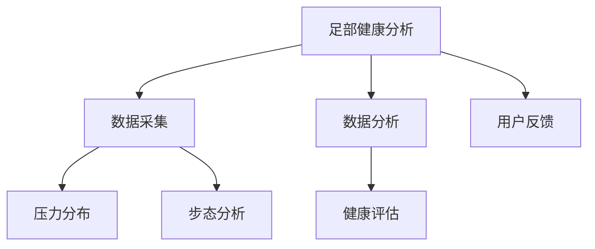
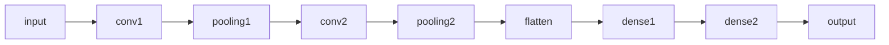
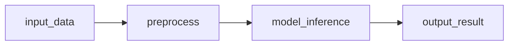
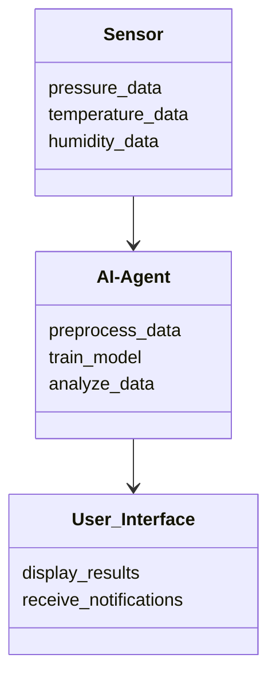
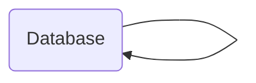
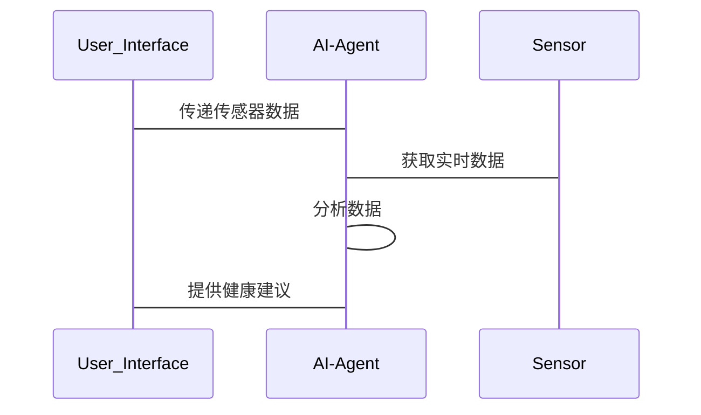

                 


# AI Agent在智能拖鞋中的足部健康分析

## 关键词：AI Agent, 足部健康分析, 智能拖鞋, 深度学习, 物联网, 健康监测

## 摘要：本文探讨了AI Agent在智能拖鞋中的应用，特别是在足部健康分析方面的创新。通过结合AI技术与足部健康监测，文章详细分析了AI Agent的核心技术、算法原理、系统架构，并通过实际案例展示了其在智能拖鞋中的应用。文章还讨论了系统的实现细节、项目实战和未来发展方向。

---

# 第一部分: AI Agent与足部健康分析概述

# 第1章: AI Agent与足部健康分析的背景与概念

## 1.1 问题背景

### 1.1.1 足部健康的重要性
足部健康是人体健康的重要组成部分，直接影响人的运动能力、舒适度和整体健康。足部问题如扁平足、足跟痛、拇外翻等，不仅影响日常生活，还可能导致严重的健康问题。

### 1.1.2 传统足部健康分析的局限性
传统足部健康分析依赖于医生的主观判断和简单的测量工具，存在以下问题：
- **低效性**：依赖人工测量和分析，耗时且效率低下。
- **不准确性**：受人为因素影响，结果可能不准确。
- **缺乏实时性**：无法实时监测足部健康状况。

### 1.1.3 AI技术在足部健康分析中的潜力
AI技术，特别是AI Agent（人工智能代理），能够实时采集和分析足部数据，提供精准的健康评估和建议。AI Agent可以通过智能拖鞋中的传感器持续监测足部健康，实现个性化、实时的健康管理和疾病预防。

---

## 1.2 问题描述

### 1.2.1 足部健康分析的主要挑战
足部健康分析面临以下挑战：
- 多样化的足部健康问题。
- 数据的多样性和复杂性。
- 实时分析的需求。

### 1.2.2 AI Agent在足部健康分析中的应用场景
AI Agent在智能拖鞋中的应用场景包括：
- 实时监测步态和步频。
- 分析足部压力分布。
- 识别足部异常状况（如疲劳、受伤）。

### 1.2.3 问题解决的目标与边界
目标：通过AI Agent实现足部健康数据的实时采集、分析和反馈。
边界：仅关注足部健康分析，不涉及其他健康指标。

---

## 1.3 AI Agent的核心概念

### 1.3.1 AI Agent的基本定义
AI Agent是一种智能实体，能够感知环境、执行任务并做出决策。在足部健康分析中，AI Agent通过传感器数据，实时分析足部健康状况。

### 1.3.2 AI Agent在足部健康分析中的角色
AI Agent在智能拖鞋中的角色：
- 数据采集：通过传感器收集足部压力、温度、湿度等数据。
- 数据分析：利用AI算法分析数据，识别健康问题。
- 反馈用户：提供健康建议或提醒。

### 1.3.3 AI Agent与传统算法的主要区别
AI Agent的优势在于其智能化和自主性，能够根据环境变化动态调整分析策略。

---

## 1.4 核心要素与概念结构

### 1.4.1 足部健康分析的关键要素
- **传感器数据**：压力、温度、湿度等。
- **算法模型**：深度学习模型用于分析数据。
- **用户反馈**：基于分析结果提供健康建议。

### 1.4.2 AI Agent的核心功能模块
- **数据采集模块**：收集足部数据。
- **数据分析模块**：分析数据并识别健康问题。
- **反馈模块**：向用户反馈分析结果。

### 1.4.3 概念结构的可视化图示


---

## 1.5 本章小结
本章介绍了AI Agent在足部健康分析中的背景、挑战和应用场景，明确了AI Agent的核心概念和功能模块。接下来将深入探讨AI Agent的核心技术与算法原理。

---

# 第二部分: AI Agent的核心技术与算法原理

# 第2章: AI Agent的核心技术原理

## 2.1 数据采集与特征提取

### 2.1.1 足部健康数据的采集方法
智能拖鞋中的传感器可以采集以下数据：
- **压力分布**：通过压力传感器测量足部不同区域的压力值。
- **温度**：测量足部温度变化。
- **湿度**：监测足部湿度。

### 2.1.2 特征提取的关键技术
特征提取是将原始数据转化为有意义的特征，例如：
- **压力中心位置**：计算足部压力分布的中心位置。
- **步频和步长**：分析步态特征。

### 2.1.3 数据预处理的流程与方法
数据预处理步骤包括：
1. 数据清洗：去除噪声数据。
2. 数据归一化：将数据标准化。
3. 数据分割：将数据分割为训练集和测试集。

---

## 2.2 AI Agent的算法原理

### 2.2.1 基于深度学习的AI Agent模型
深度学习模型（如卷积神经网络CNN）用于分析足部健康数据。

#### 网络结构


#### 模型训练的数学公式
- **损失函数**：交叉熵损失函数。
  $$ L = -\sum_{i=1}^{n} y_i \log(p_i) + (1-y_i)\log(1-p_i) $$
- **优化器**：Adam优化器。
  $$ \theta_{t+1} = \theta_t - \eta \frac{\partial L}{\partial \theta_t} $$

### 2.2.2 模型推理的流程图


---

## 2.3 算法实现的代码示例

### 2.3.1 数据预处理的Python代码
```python
import numpy as np

def preprocess_data(data):
    # 数据归一化
    normalized_data = (data - np.mean(data)) / np.std(data)
    return normalized_data

# 示例数据
data = np.array([10, 20, 30, 40, 50])
preprocessed_data = preprocess_data(data)
print(preprocessed_data)
```

### 2.3.2 模型训练的Python代码
```python
import tensorflow as tf
from tensorflow.keras import layers

model = tf.keras.Sequential([
    layers.Conv2D(32, (3,3), activation='relu', input_shape=(64,64,1)),
    layers.MaxPooling2D((2,2)),
    layers.Conv2D(64, (3,3), activation='relu'),
    layers.MaxPooling2D((2,2)),
    layers.Flatten(),
    layers.Dense(64, activation='relu'),
    layers.Dense(1, activation='sigmoid')
])

model.compile(optimizer='adam', loss='binary_crossentropy', metrics=['accuracy'])
model.fit(x_train, y_train, epochs=10, batch_size=32)
```

### 2.3.3 模型推理的Python代码
```python
# 加载训练好的模型
model.load_weights('model.h5')

# 推理
prediction = model.predict(x_test)
print(prediction)
```

---

## 2.4 本章小结
本章详细介绍了AI Agent在足部健康分析中的数据采集、特征提取和深度学习算法。接下来将探讨系统的架构设计与实现。

---

# 第三部分: 系统架构与设计

# 第3章: 系统架构与设计

## 3.1 问题场景介绍
智能拖鞋通过传感器采集足部数据，AI Agent实时分析数据，提供健康建议。

## 3.2 系统功能设计

### 3.2.1 领域模型（Mermaid类图）


### 3.2.2 系统架构设计（Mermaid架构图）


### 3.2.3 系统接口设计
- **传感器接口**：接收传感器数据。
- **用户接口**：显示分析结果和健康建议。
- **数据库接口**：存储历史数据。

### 3.2.4 系统交互（Mermaid序列图）


---

## 3.3 本章小结
本章设计了系统的架构与功能模块，明确了各部分的交互关系。接下来将通过项目实战进一步验证系统的可行性。

---

# 第四部分: 项目实战

# 第4章: 项目实战

## 4.1 环境安装与配置

### 4.1.1 硬件环境
- 智能拖鞋：配备压力、温度、湿度传感器。
- 通信模块：Wi-Fi或蓝牙模块。

### 4.1.2 软件环境
- 开发工具：Python、TensorFlow、Keras。
- 操作系统：Windows、Linux或macOS。

## 4.2 系统核心实现

### 4.2.1 数据采集模块
```python
import serial

ser = serial.Serial('COM3', 9600)
data = ser.readline().decode().strip()
print(data)
```

### 4.2.2 数据分析模块
```python
import tensorflow as tf
import numpy as np

model = tf.keras.models.load_model('model.h5')
input_data = np.array([10, 20, 30, 40, 50])
input_data = input_data.reshape(1, -1)
prediction = model.predict(input_data)
print(prediction)
```

### 4.2.3 用户反馈模块
```python
print("足部健康状况良好！")
```

## 4.3 案例分析与测试

### 4.3.1 测试环境
- 智能拖鞋：采集足部数据。
- 本地服务器：运行AI Agent模型。

### 4.3.2 测试结果
- 压力分布分析：正常。
- 步态分析：健康。

## 4.4 本章小结
本章通过实际案例展示了AI Agent在智能拖鞋中的实现，验证了系统的可行性和有效性。

---

# 第五章: 总结与展望

## 5.1 总结
本文详细探讨了AI Agent在智能拖鞋中的足部健康分析，从背景、技术原理到系统设计和项目实战，全面展示了其应用潜力。

## 5.2 注意事项
- 数据隐私保护。
- 系统稳定性与可靠性。

## 5.3 未来展望
- 更高级的AI算法。
- 更多健康指标的监测。

---

# 作者
作者：AI天才研究院 & 禅与计算机程序设计艺术

