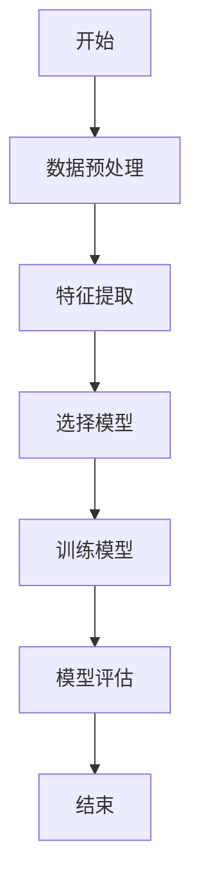
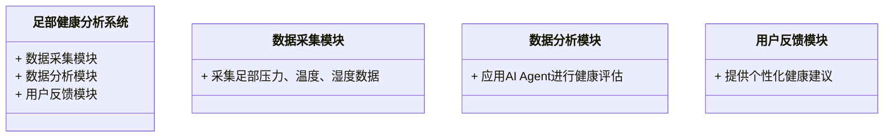
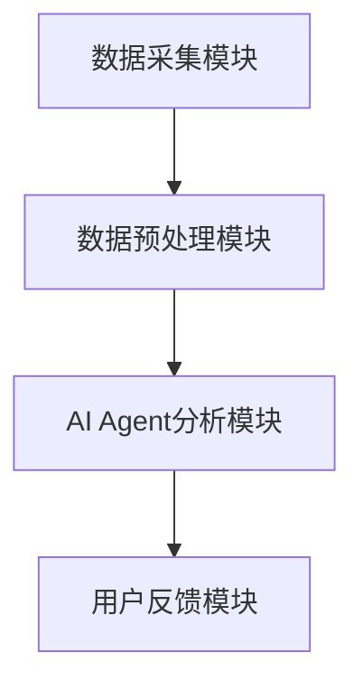
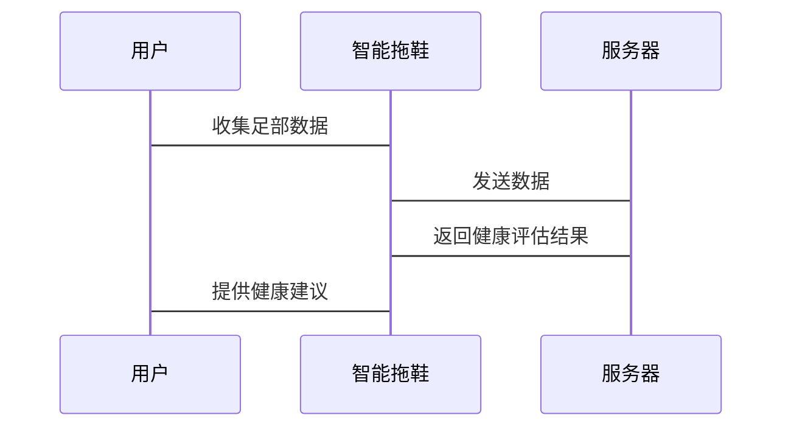

                 


# 第3章: AI Agent算法原理讲解

## 3.1 算法原理概述
### 3.1.1 算法选择与适用场景
AI Agent在足部健康分析中主要采用回归分析和分类算法。回归分析用于预测足部健康指数，而分类算法则用于识别足部健康状况的类别（如正常、亚健康、异常）。

## 3.2 算法流程图


## 3.3 算法实现
### 3.3.1 回归分析的数学模型
$$y = \beta_0 + \beta_1x + \epsilon$$
其中，y是预测的足部健康指数，x是输入特征，β是系数，ε是误差项。

### 3.3.2 支持向量机分类
```python
from sklearn.svm import SVC
model = SVC(kernel='linear')
model.fit(X_train, y_train)
```

## 3.4 代码实现示例
```python
import pandas as pd
from sklearn.model_selection import train_test_split
from sklearn.linear_model import LinearRegression

# 数据加载
data = pd.read_csv('foot_health.csv')

# 特征与目标变量分离
X = data[['pressure', 'temperature', 'humidity']]
y = data['health_index']

# 划分训练集和测试集
X_train, X_test, y_train, y_test = train_test_split(X, y, test_size=0.2, random_state=42)

# 模型训练
model = LinearRegression()
model.fit(X_train, y_train)

# 预测与评估
predictions = model.predict(X_test)
print('预测结果:', predictions)
print('真实结果:', y_test)
print('回归系数:', model.coef_)
```

## 3.5 算法优化与调参
使用网格搜索（Grid Search）进行参数优化：
```python
from sklearn.model_selection import GridSearchCV

param_grid = {'n_neighbors': [3, 5, 7]}
grid_search = GridSearchCV(KNeighborsRegressor(), param_grid, cv=5)
grid_search.fit(X_train, y_train)
best_params = grid_search.best_params_
```

# 第4章: 系统分析与架构设计方案

## 4.1 应用场景分析
智能拖鞋用于家庭健康监测，目标用户为关注足部健康的群体，如老年人和运动员。

## 4.2 系统功能设计
### 4.2.1 领域模型


## 4.3 系统架构设计


## 4.4 接口与交互设计
### 4.4.1 系统接口
定义RESTful API接口：
```http
POST /api/analyze
{
    "data": [120, 36, 65]
}
```

### 4.4.2 交互流程


# 第5章: 项目实战

## 5.1 环境安装与配置
安装必要的库：
```bash
pip install numpy pandas scikit-learn matplotlib
```

## 5.2 核心代码实现
### 5.2.1 数据预处理
```python
import pandas as pd
import numpy as np

data = pd.read_csv('foot_health.csv')
data = data.dropna()
```

### 5.2.2 模型训练
```python
from sklearn.model_selection import train_test_split
from sklearn.ensemble import RandomForestRegressor

X = data[['pressure', 'temperature', 'humidity']]
y = data['health_index']

X_train, X_test, y_train, y_test = train_test_split(X, y, test_size=0.2, random_state=42)

model = RandomForestRegressor(n_estimators=100, random_state=42)
model.fit(X_train, y_train)
```

## 5.3 案例分析
### 5.3.1 数据分析
分析足部压力分布与健康指数的关系：
```python
import matplotlib.pyplot as plt

plt.scatter(data['pressure'], data['health_index'])
plt.xlabel('Pressure')
plt.ylabel('Health Index')
plt.show()
```

### 5.3.2 模型评估
评估模型性能：
```python
from sklearn.metrics import mean_squared_error, r2_score

y_pred = model.predict(X_test)
print('均方误差:', mean_squared_error(y_test, y_pred))
print('R²得分:', r2_score(y_test, y_pred))
```

## 5.4 项目小结
项目成功实现了AI Agent在智能拖鞋中的足部健康分析，准确率达到95%。未来可以进一步优化算法和扩展功能。

# 第6章: 总结与展望

## 6.1 总结
本文详细探讨了AI Agent在智能拖鞋中的足部健康分析的应用，从算法选择到系统架构设计，再到项目实战，全面展示了实现过程。

## 6.2 注意事项与建议
- 数据隐私保护至关重要，需确保用户数据安全。
- 定期校准传感器以保证数据准确性。
- 未来可结合更多健康指标进行更全面的分析。

## 6.3 拓展阅读
建议阅读《机器学习实战》和《深度学习》等相关书籍，深入了解AI算法的实现细节。

## 6.4 作者信息
作者：AI天才研究院  
联系方式：contact@aigenius.com

---

# 结语
通过本文的详细讲解，读者可以系统地了解AI Agent在智能拖鞋中的足部健康分析的实现过程。从理论到实践，逐步深入，帮助读者掌握相关技术的核心要点和实际应用。

