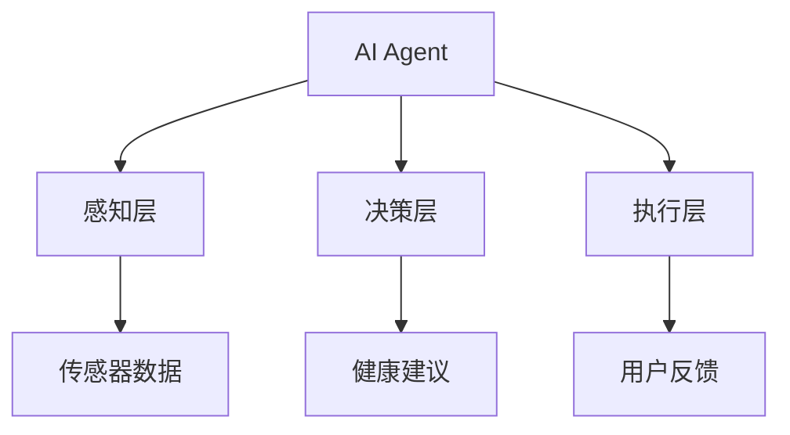
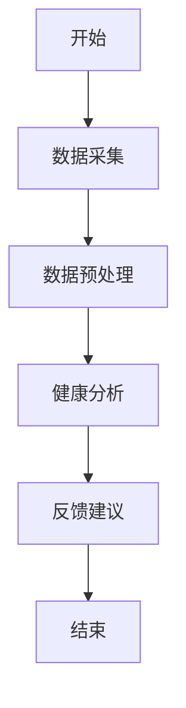
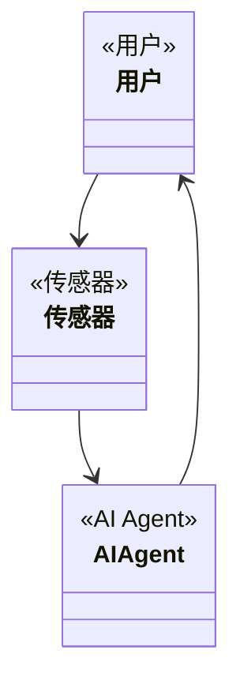
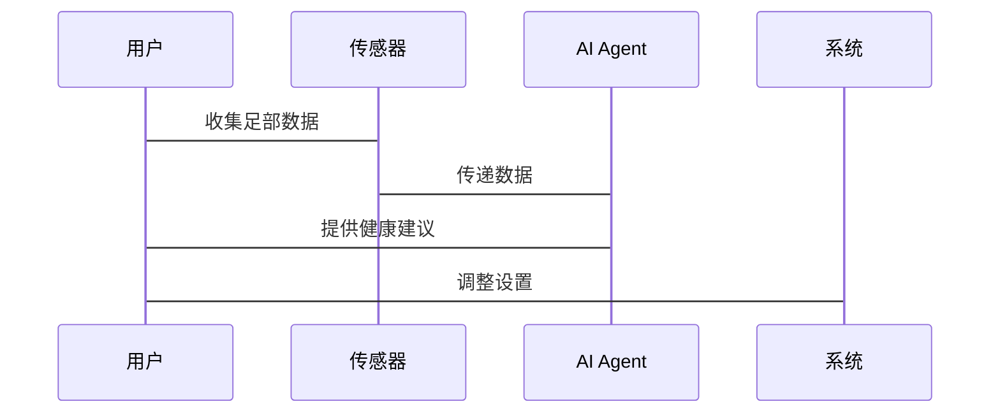

                 


# AI Agent在智能拖鞋中的足部健康监测

> 关键词：AI Agent, 智能拖鞋, 足部健康, 多模态数据, 强化学习

> 摘要：本文探讨AI Agent在智能拖鞋中的足部健康监测应用，分析多模态数据融合技术，讲解基于强化学习的AI Agent算法，设计系统架构，并通过实际案例展示项目实现。

---

# 第一部分: AI Agent在智能拖鞋中的足部健康监测背景介绍

## 第1章: 背景介绍

### 1.1 问题背景

#### 1.1.1 足部健康的重要性
足部健康直接影响人体健康，足部长期受力不均可能导致脊柱、关节问题，甚至影响血液循环。早期监测足部健康问题，如足弓塌陷、拇外翻等，对于预防重大健康问题至关重要。

#### 1.1.2 智能拖鞋的发展趋势
传统拖鞋仅提供舒适性，现代科技使拖鞋智能化，集成传感器监测步态、压力分布等数据，结合AI技术分析健康状况，提供个性化建议。

#### 1.1.3 AI Agent在足部健康监测中的作用
AI Agent作为智能拖鞋的核心，实时分析足部数据，提供健康评估和建议，预防健康问题，提升用户体验。

### 1.2 问题描述

#### 1.2.1 足部健康监测的挑战
- 数据采集复杂：足部受力分布、步态分析等需要高精度传感器。
- 数据分析复杂：多模态数据融合，实时反馈需求高。
- 用户依从性低：传统监测方法繁琐，用户参与度低。

#### 1.2.2 智能拖鞋的局限性
- 数据采集单一：仅依赖压力传感器，缺乏多模态数据支持。
- 数据分析能力弱：传统传感器无法实时分析健康问题。
- 用户反馈不足：无法提供个性化建议，影响用户体验。

#### 1.2.3 AI Agent如何解决这些问题
AI Agent通过多模态数据融合、实时分析和个性化反馈，克服传统智能拖鞋的局限性，提供精准健康监测。

### 1.3 问题解决

#### 1.3.1 AI Agent的核心解决方案
- 多模态数据采集：整合压力、温度、湿度等多种传感器数据。
- 实时数据分析：利用AI算法实时分析数据，识别健康问题。
- 个性化反馈：根据分析结果提供个性化健康建议。

#### 1.3.2 多模态数据融合技术
将来自不同传感器的数据进行融合，提升监测准确性，例如结合压力和温度数据更准确判断足部状况。

#### 1.3.3 个性化健康监测策略
根据用户足部数据，提供个性化健康建议，如建议更换鞋垫、调整步态等，帮助用户改善足部健康。

### 1.4 边界与外延

#### 1.4.1 AI Agent的适用范围
- 适用于日常足部健康监测，识别常见足部问题，如扁平足、拇外翻。
- 不适用于复杂足部疾病诊断，如严重骨折或感染，需专业医疗设备配合。

#### 1.4.2 系统的边界条件
- 仅监测足部健康，不处理其他身体部位的数据。
- 数据采集范围有限，仅限于拖鞋传感器获取的数据。
- 系统反馈范围限于足部健康建议，不涉及医疗诊断。

#### 1.4.3 外延与扩展功能
- 远程医疗连接：与医生或医疗机构数据互通，提供专业建议。
- 数据长期跟踪：记录用户足部健康数据，分析长期趋势。
- 多设备联动：与其他智能设备联动，提供全面健康监测。

### 1.5 概念结构与核心要素组成

#### 1.5.1 核心概念的层次结构
AI Agent在智能拖鞋中的足部健康监测由感知层、决策层和执行层组成，分别负责数据采集、分析和反馈。

#### 1.5.2 核心要素的定义与关系
- 感知层：传感器采集足部数据。
- 决策层：AI算法分析数据，提供健康建议。
- 执行层：反馈用户，调整拖鞋参数。

#### 1.5.3 概念结构图展示


---

# 第二部分: 核心概念与联系

## 第2章: AI Agent的核心概念与原理

### 2.1 AI Agent的定义与原理

#### 2.1.1 AI Agent的基本定义
AI Agent是一个智能实体，能感知环境并采取行动以实现目标。在智能拖鞋中，AI Agent接收足部数据，分析并提供反馈。

#### 2.1.2 AI Agent的核心原理
AI Agent通过多模态数据融合、强化学习和实时反馈机制，优化足部健康监测效果。

#### 2.1.3 AI Agent的工作流程


### 2.2 核心概念属性对比

| 特性         | 传统传感器          | AI Agent          |
|--------------|--------------------|-------------------|
| 数据采集     | 单一数据流         | 多模态数据融合    |
| 数据处理     | 简单特征提取       | 复杂特征学习      |
| 系统响应     | 固定规则响应       | 动态智能响应      |

### 2.3 ER实体关系图

```mermaid
erd
entity 用户 {
  key(name)
  field 感染情况
  field 步态数据
}
entity 传感器 {
  key(传感器ID)
  field 采集时间
  field 数据类型
}
entity AI Agent {
  key(AgentID)
  field 分析结果
  field 建议反馈
}
```

---

## 第3章: 算法原理讲解

### 3.1 算法原理

#### 3.1.1 基于强化学习的AI Agent算法
AI Agent采用强化学习算法，通过奖励机制优化决策策略。强化学习分为环境、动作、状态和奖励四个部分。

#### 3.1.2 多模态数据融合算法
将来自不同传感器的数据进行融合，提升监测准确性。常用的方法包括加权融合和特征融合。

#### 3.1.3 个性化健康评估算法
根据用户足部数据和历史数据，提供个性化健康评估和建议。

### 3.2 算法实现

#### 3.2.1 强化学习的Q-learning算法
状态、动作、奖励的定义：
- 状态：足部压力分布。
- 动作：调整鞋垫硬度。
- 奖励：健康改善情况。

Q值更新公式：
$$ Q(s, a) = Q(s, a) + \alpha (r + \gamma \max Q(s', a') - Q(s, a)) $$

Python代码实现：
```python
import numpy as np

class AI_Agent:
    def __init__(self, state_size, action_size):
        self.state_size = state_size
        self.action_size = action_size
        self.Q = np.zeros((state_size, action_size))
    
    def take_action(self, state):
        if np.random.random() < 0.9:  # 探索与利用
            return np.argmax(self.Q[state, :])
        else:
            return np.random.randint(self.action_size)
    
    def update_Q(self, state, action, reward, next_state):
        self.Q[state, action] += 0.1 * (reward + 0.9 * np.max(self.Q[next_state, :]) - self.Q[state, action])
```

### 3.3 数学模型和公式

#### 3.3.1 强化学习的数学模型
状态转移方程：
$$ P(next\_state | state, action) = p $$

Q值更新公式：
$$ Q_{k+1}(s,a) = Q_k(s,a) + \alpha [r + \gamma Q_k(s',a') - Q_k(s,a)] $$

---

## 第4章: 系统分析与架构设计

### 4.1 系统分析

#### 4.1.1 问题场景介绍
智能拖鞋用户在行走时，传感器采集足部数据，AI Agent分析并反馈健康建议。

#### 4.1.2 系统介绍
智能拖鞋系统包括传感器、AI Agent和用户界面，实现足部健康监测和反馈。

### 4.2 系统功能设计

#### 4.2.1 领域模型


#### 4.2.2 系统架构设计
分层架构：
1. 硬件层：传感器采集数据。
2. 数据处理层：预处理和融合数据。
3. AI层：运行强化学习算法，生成健康建议。
4. 用户界面层：展示结果和反馈。

#### 4.2.3 系统接口设计
- 数据采集接口：传感器数据输入。
- 用户反馈接口：接收用户输入，如步态数据。
- 健康报告接口：输出健康建议。

#### 4.2.4 系统交互流程


---

## 第5章: 项目实战

### 5.1 环境安装

#### 5.1.1 安装必要的库和工具
安装Python、NumPy、Matplotlib、Keras和TensorFlow等库。

#### 5.1.2 配置开发环境
配置Jupyter Notebook或PyCharm作为开发环境。

### 5.2 系统核心实现

#### 5.2.1 传感器数据采集与预处理
```python
import numpy as np
import pandas as pd

# 数据采集
data = pd.read_csv('foot_data.csv')
# 数据预处理
data_processed = data.dropna()
```

#### 5.2.2 AI Agent决策逻辑
```python
class AI_Agent:
    def __init__(self):
        self.model = self.build_model()
    
    def build_model(self):
        from tensorflow.keras import layers
        model = layers.Sequential([
            layers.Dense(64, activation='relu', input_dim=10),
            layers.Dense(1, activation='sigmoid')
        ])
        model.compile(optimizer='adam', loss='binary_crossentropy')
        return model
    
    def train(self, x, y):
        self.model.fit(x, y, epochs=10, batch_size=32)
```

#### 5.2.3 健康报告生成
```python
def generate_report(analysis_result):
    report = f"足部健康分析报告\n{analysis_result}"
    return report
```

### 5.3 代码应用解读与分析

#### 5.3.1 数据采集与预处理
传感器数据采集并进行预处理，确保数据完整性。

#### 5.3.2 AI Agent训练与测试
使用训练数据训练AI Agent模型，测试模型性能，调整参数。

#### 5.3.3 健康报告生成与展示
根据分析结果生成健康报告，展示用户足部健康状况。

### 5.4 实际案例分析

#### 5.4.1 案例背景
用户A足部压力分布异常，可能存在足弓塌陷风险。

#### 5.4.2 数据分析
AI Agent分析数据，识别足弓问题，建议调整鞋垫硬度。

#### 5.4.3 系统反馈
系统建议用户更换支撑性更好的鞋垫，并调整行走姿势。

### 5.5 项目小结

#### 5.5.1 核心代码实现
AI Agent模型实现，传感器数据处理，健康报告生成。

#### 5.5.2 系统功能实现
实现足部健康监测、个性化反馈和数据同步功能。

---

## 第6章: 最佳实践 tips

### 6.1 小结

#### 6.1.1 项目总结
通过AI Agent实现智能拖鞋足部健康监测，提供个性化建议，改善用户体验。

#### 6.1.2 项目成果
成功开发AI Agent系统，准确监测足部健康，提供有效建议。

### 6.2 注意事项

#### 6.2.1 数据隐私保护
确保用户数据安全，遵守隐私保护法规。

#### 6.2.2 系统稳定性
确保系统稳定运行，避免数据丢失和分析错误。

#### 6.2.3 用户体验优化
持续优化用户界面和反馈机制，提升用户体验。

### 6.3 拓展阅读

#### 6.3.1 相关技术领域
进一步研究AI在医疗健康领域的应用，探索更多健康监测技术。

#### 6.3.2 深度学习算法
学习更先进的深度学习算法，提升AI Agent性能。

#### 6.3.3 多模态数据融合
研究更多数据融合方法，提升监测准确性。

---

# 结语

AI Agent在智能拖鞋中的应用，将足部健康监测提升到新高度。通过多模态数据融合、强化学习算法和实时反馈机制，为用户提供精准健康建议，预防足部健康问题。

作者：AI天才研究院 & 禅与计算机程序设计艺术

