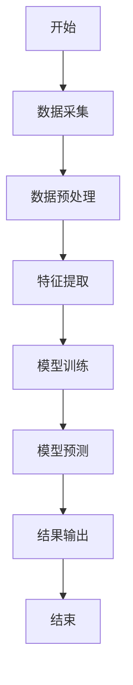
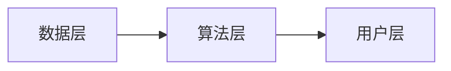

                 


# AI Agent在智能拖鞋中的足部健康评估

## 关键词：AI Agent, 智能拖鞋, 足部健康, 健康评估, 传感器, 机器学习

## 摘要：本文详细探讨了AI Agent在智能拖鞋中的足部健康评估应用。通过分析足部健康的重要性、AI Agent的核心技术、算法原理、系统架构设计、项目实战以及最佳实践，展示了如何利用AI技术实现智能化的足部健康监测。文章结合理论与实践，为智能拖鞋的设计和应用提供了新的思路和解决方案。

---

## 第一部分: AI Agent在智能拖鞋中的足部健康评估背景

## 第1章: 足部健康评估的背景与需求

### 1.1 足部健康的重要性
#### 1.1.1 足部健康与全身健康的关系
足部是人体的重要组成部分，足部健康直接关系到全身的健康。足部问题可能引发腰背痛、关节炎等疾病，甚至影响行走能力。通过早期发现和干预，可以有效预防这些健康问题。

#### 1.1.2 足部疾病的常见类型与影响
常见的足部疾病包括足底筋膜炎、拇外翻、足跟痛、跖疣等。这些疾病不仅影响行走舒适性，还可能导致严重的健康问题，如慢性疼痛和运动功能受限。

#### 1.1.3 足部健康评估的必要性
随着人们生活水平的提高，对健康关注度的增加，足部健康评估的需求日益增长。通过科学的评估方法，可以及时发现足部问题，采取有效的预防和治疗措施。

---

### 1.2 智能拖鞋的发展现状
#### 1.2.1 智能鞋类的技术演变
智能鞋类经历了从简单传感器到复杂AI系统的演变。早期的智能鞋主要关注步态分析和能量反馈，而现代智能鞋则集成了AI技术，能够进行实时健康评估和个性化建议。

#### 1.2.2 当前市场上的智能拖鞋产品
目前市面上的智能拖鞋主要采用传感器技术，能够监测步频、步长、压力分布等数据。部分高端产品还结合了AI算法，能够进行初步的足部健康评估。

#### 1.2.3 用户对智能足部健康评估的需求
用户对足部健康评估的需求主要体现在实时监测、个性化建议和预防保健方面。AI Agent的引入能够满足用户对智能化、个性化健康服务的需求。

---

### 1.3 传统足部健康评估方法的局限性
#### 1.3.1 传统足部检查方法的不足
传统足部检查方法通常依赖于医生的主观判断，缺乏客观的数据支持。检查过程耗时且成本较高，难以实现大规模普及。

#### 1.3.2 传统医疗设备的局限性
传统的足部健康评估设备价格昂贵，操作复杂，且需要专业人员操作。这些设备难以在家庭环境中使用，限制了其应用范围。

#### 1.3.3 现有足部健康评估技术的痛点
现有的足部健康评估技术主要依赖于实验室设备，无法实现实时监测和个性化评估。此外，数据采集和分析的效率较低，难以满足用户的需求。

---

### 1.4 AI Agent在智能拖鞋中的应用潜力
#### 1.4.1 AI技术在足部健康评估中的优势
AI技术能够实时采集和分析足部数据，提供快速、准确的健康评估结果。通过机器学习算法，AI Agent可以不断优化评估模型，提高评估精度。

#### 1.4.2 智能拖鞋结合AI Agent的创新性
将AI Agent嵌入智能拖鞋中，可以实现足部健康评估的智能化和个性化。用户可以在日常生活中的任何时间进行足部健康监测，无需依赖专业设备和人员。

#### 1.4.3 未来足部健康评估的发展趋势
随着AI技术的不断发展，足部健康评估将更加智能化和便捷化。未来的智能拖鞋将不仅仅是一个 footwear，更是一个个人健康助手，能够提供全面的健康监测和管理服务。

---

## 第2章: AI Agent的核心概念与技术原理

### 2.1 AI Agent的定义与分类
#### 2.1.1 AI Agent的定义
AI Agent是一种智能实体，能够感知环境、执行任务并做出决策。在智能拖鞋中，AI Agent主要用于分析足部数据，提供健康评估和个性化建议。

#### 2.1.2 AI Agent的主要分类
AI Agent可以分为简单反射型、基于模型的反应型、目标驱动型和实用驱动型。在智能拖鞋中，通常使用基于传感器数据的反应型AI Agent。

#### 2.1.3 AI Agent在智能拖鞋中的应用场景
AI Agent在智能拖鞋中的应用场景包括步态分析、足部压力分布监测、足部健康评估和个性化健康建议。

---

### 2.2 AI Agent的核心技术
#### 2.2.1 传感器数据采集技术
智能拖鞋中的传感器包括压力传感器、加速度传感器、温度传感器和湿度传感器。这些传感器能够实时采集足部的压力、运动和环境数据。

#### 2.2.2 数据预处理与特征提取
采集到的原始数据需要经过预处理，去除噪声和异常值。特征提取是将数据转换为有用的特征，如步频、步长、压力分布等。

#### 2.2.3 机器学习与深度学习算法
常用的机器学习算法包括支持向量机（SVM）、随机森林（Random Forest）和K近邻（KNN）。深度学习算法如卷积神经网络（CNN）和循环神经网络（RNN）也在某些场景中得到应用。

---

### 2.3 AI Agent与传统传感器的区别
#### 2.3.1 传统传感器的局限性
传统传感器只能采集基本的物理数据，无法进行智能分析和决策。数据处理需要依赖外部设备和专业人员。

#### 2.3.2 AI Agent的智能性与自适应性
AI Agent能够实时分析数据，提供智能反馈和决策。它可以根据用户的行为和环境变化，自适应地调整评估模型。

#### 2.3.3 AI Agent在数据处理中的优势
AI Agent能够处理复杂的数据模式，发现传统传感器无法察觉的健康问题。通过机器学习算法，AI Agent可以不断优化评估模型，提高准确性。

---

### 2.4 AI Agent在足部健康评估中的实体关系图
```mermaid
er
actor: 用户
action: 使用智能拖鞋
footwear: 智能拖鞋
sensor: 传感器
data: 数据
algorithm: 评估算法
result: 评估结果
```

---

## 第3章: AI Agent在足部健康评估中的算法原理

### 3.1 算法概述
AI Agent在足部健康评估中通常采用监督学习算法。以下是典型的算法流程：



---

### 3.2 数据采集与预处理
#### 3.2.1 数据采集
传感器数据包括压力、加速度、温度和湿度。数据采集需要考虑采样频率和精度。

#### 3.2.2 数据预处理
预处理步骤包括去噪、归一化和异常值处理。预处理后的数据更有利于后续分析。

---

### 3.3 特征提取与模型训练
#### 3.3.1 特征提取
常用的特征包括步频、步长、压力中心位置和步态特征。特征提取可以通过统计方法或机器学习算法实现。

#### 3.3.2 模型训练
常用的机器学习算法包括SVM、Random Forest和KNN。训练好的模型可以用于分类和回归任务。

---

### 3.4 模型预测与结果分析
模型预测包括足部健康状态分类和健康建议生成。结果分析需要考虑模型的准确率、召回率和F1分数。

---

## 第4章: AI Agent在智能拖鞋中的系统架构设计

### 4.1 系统功能设计
智能拖鞋系统主要包括数据采集模块、健康评估模块和用户反馈模块。

#### 4.1.1 数据采集模块
数据采集模块负责采集足部数据，包括压力、加速度和环境参数。

#### 4.1.2 健康评估模块
健康评估模块基于AI Agent算法，对足部数据进行分析，生成健康评估结果。

#### 4.1.3 用户反馈模块
用户反馈模块将评估结果以直观的方式呈现给用户，包括健康报告和个性化建议。

---

### 4.2 系统架构设计
系统的架构设计包括数据层、算法层和应用层。数据层负责存储和管理数据，算法层负责数据处理和模型训练，应用层负责用户交互和结果展示。



---

## 第5章: 项目实战

### 5.1 环境安装
项目需要Python 3.8以上版本，安装库包括numpy、scikit-learn、tensorflow和mermaid。

### 5.2 核心代码实现
以下是AI Agent的核心代码实现：

```python
import numpy as np
from sklearn import svm

# 示例数据
X = np.array([[1, 2], [3, 4], [5, 6]])
y = np.array([0, 1, 0])

# 训练模型
model = svm.SVC()
model.fit(X, y)

# 预测
new_data = np.array([[7, 8]])
print(model.predict(new_data))
```

### 5.3 代码解读与分析
以上代码实现了SVM分类器的训练和预测。数据集分为训练集和测试集，模型通过训练学习数据特征，用于分类任务。

---

## 第6章: 最佳实践与总结

### 6.1 最佳实践
在实际应用中，需要注意数据的多样性和模型的可解释性。定期更新模型参数，确保系统的准确性和稳定性。

### 6.2 小结
AI Agent在智能拖鞋中的应用为足部健康评估提供了新的可能性。通过传感器技术和机器学习算法，可以实现智能化、个性化的健康监测服务。

### 6.3 注意事项
在设计智能拖鞋系统时，需要考虑传感器的精度、算法的效率和用户体验。确保系统的易用性和可靠性。

### 6.4 拓展阅读
建议读者进一步学习传感器技术、机器学习算法和系统架构设计的相关知识，以深入理解和应用AI Agent技术。

---

## 作者：AI天才研究院 & 禅与计算机程序设计艺术

---

通过以上内容，您可以逐步深入理解AI Agent在智能拖鞋中的足部健康评估的应用。希望这篇文章对您有所帮助！

