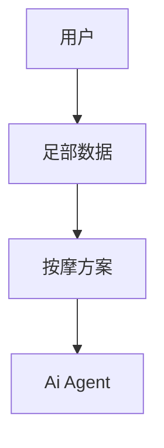
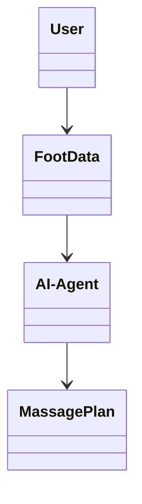
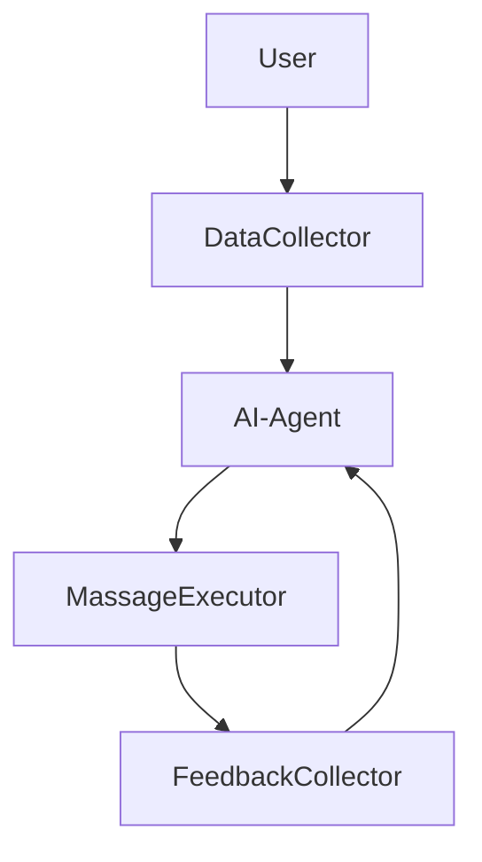

                 


---

# AI Agent在智能拖鞋中的足部按摩定制

## 关键词：AI Agent, 智能拖鞋, 足部按摩, 定制化, 强化学习, 系统架构, 项目实战

## 摘要：  
本文将探讨AI Agent在智能拖鞋中的应用，特别是在足部按摩定制化方面的技术实现。通过分析AI Agent的核心原理、算法模型、系统架构，结合实际案例，详细阐述如何利用AI技术实现个性化的足部按摩方案。本文旨在为读者提供从理论到实践的全面指导，帮助理解并应用AI Agent技术于智能健康设备。

---

# 第一部分: AI Agent与足部按摩的背景介绍

## 第1章: AI Agent与足部按摩的背景与问题描述

### 1.1 AI Agent的基本概念  
- **1.1.1 什么是AI Agent**  
  AI Agent（人工智能代理）是一种能够感知环境、自主决策并执行任务的智能实体，广泛应用于自动化系统和智能设备中。  
- **1.1.2 AI Agent的核心特点**  
  - 智能感知：通过传感器获取环境数据。  
  - 自主决策：基于数据进行分析和决策。  
  - 适应性：能够根据反馈优化行为。  
- **1.1.3 AI Agent与传统算法的区别**  
  AI Agent不仅依赖规则，还能够通过学习和适应优化性能，具备更强的灵活性和智能性。

### 1.2 足部按摩的定制化需求  
- **1.2.1 足部按摩的基本原理**  
  足部按摩通过刺激足底穴位，促进血液循环，缓解疲劳。  
- **1.2.2 定制化足部按摩的意义**  
  不同用户足部状况不同，定制化按摩能够提高舒适度和效果。  
- **1.2.3 智能拖鞋的应用场景**  
  智能拖鞋通过内置传感器和AI算法，实时监测足部数据，提供个性化的按摩服务。

### 1.3 问题背景与描述  
- **1.3.1 当前足部按摩技术的局限性**  
  - 手动按摩依赖经验，难以标准化。  
  - 传统设备缺乏个性化，无法满足多样需求。  
- **1.3.2 AI Agent在足部按摩中的应用前景**  
  AI Agent能够实时分析足部数据，动态调整按摩方案，提升用户体验。  
- **1.3.3 本课题的研究意义**  
  通过AI Agent实现足部按摩的定制化，为智能健康设备的发展提供新思路。

### 1.4 问题解决与边界  
- **1.4.1 AI Agent如何解决足部按摩问题**  
  - 实时感知足部数据，动态优化按摩方案。  
  - 提供个性化服务，满足不同用户需求。  
- **1.4.2 解决方案的边界与外延**  
  - 系统边界：仅针对足部按摩，不涉及全身按摩。  
  - 外延：可扩展到其他健康监测领域。  
- **1.4.3 核心要素与组成结构**  
  - 核心要素：传感器、AI算法、执行机构。  
  - 组成结构：数据采集、算法处理、反馈优化。

---

# 第二部分: AI Agent的核心概念与联系

## 第2章: AI Agent的核心原理与特征

### 2.1 AI Agent的核心原理  
- **2.1.1 智能感知与数据采集**  
  AI Agent通过传感器采集足部压力、温度、湿度等数据，为后续分析提供依据。  
- **2.1.2 数据分析与决策制定**  
  基于机器学习算法，分析足部数据，生成个性化按摩方案。  
- **2.1.3 动作执行与反馈优化**  
  根据决策结果，驱动按摩模块执行，并实时收集反馈，优化后续操作。

### 2.2 核心概念对比分析  
- **2.2.1 AI Agent与传统算法的对比**  
  | 特性         | AI Agent                  | 传统算法                 |  
  |--------------|---------------------------|--------------------------|  
  | 智能性       | 高度智能，自适应          | 依赖预设规则，固定       |  
  | 学习能力     | 能够学习和优化           | 无法学习和优化           |  
  | 适应性       | 能够适应变化             | 适应性有限               |  
- **2.2.2 足部按摩的定制化与非定制化对比**  
  - 定制化：根据用户需求动态调整。  
  - 非定制化：采用固定模式，无法满足个性化需求。  
- **2.2.3 数据驱动与规则驱动的对比**  
  - 数据驱动：基于大量数据进行分析和决策。  
  - 规则驱动：依赖预设规则进行操作，灵活性较低。

### 2.3 ER实体关系图  


---

## 第三章: AI Agent的算法原理与实现

### 3.1 算法原理  
- **3.1.1 强化学习算法**  
  使用强化学习算法（如Q-learning）来优化按摩方案。  
  $$ Q(s, a) = r + \gamma \max(Q(s', a')) $$  
  其中，$s$ 是当前状态，$a$ 是动作，$r$ 是奖励，$\gamma$ 是折扣因子，$s'$ 是下一个状态。  
  - 状态：足部压力、温度、用户反馈。  
  - 动作：调整按摩力度、频率、时间。  
  - 奖励：用户反馈的舒适度评分。  

### 3.2 算法实现  
```python
class AI-Agent:
    def __init__(self):
        self.q_table = {}  # Q值表
        self.learning_rate = 0.1
        self.discount_factor = 0.9

    def get_action(self, state):
        if state not in self.q_table:
            self.q_table[state] = [0.0] * 3  # 假设3个动作
        max_value = max(self.q_table[state])
        action = self.q_table[state].index(max_value)
        return action

    def update_q_table(self, state, action, reward, next_state):
        current_q = self.q_table[state][action]
        next_max_q = max(self.q_table.get(next_state, [0.0]*3))
        new_q = reward + self.discount_factor * next_max_q
        self.q_table[state][action] = current_q + self.learning_rate * (new_q - current_q)
```

### 3.3 算法流程图  
```mermaid
graph TD
    Start --> Initialize Q-table
    Initialize Q-table --> Get state
    Get state --> Get action
    Get action --> Execute action
    Execute action --> Get reward and next state
    Get reward and next state --> Update Q-table
    Update Q-table --> End
```

---

## 第四章: 智能拖鞋的系统分析与架构设计

### 4.1 系统功能设计  
- **4.1.1 领域模型类图**  


- **4.1.2 系统架构设计**  


### 4.2 系统接口设计  
- **4.2.1 接口描述**  
  - 数据采集接口：获取足部压力、温度等数据。  
  - AI处理接口：接收数据，生成按摩方案。  
  - 反馈接口：收集用户反馈，优化AI模型。  

---

## 第五章: 项目实战与案例分析

### 5.1 环境安装与配置  
- 安装Python、TensorFlow、Keras等工具。  

### 5.2 核心代码实现  
```python
import numpy as np

def main():
    # 初始化AI Agent
    agent = AI-Agent()
    # 获取当前状态
    state = get_current_state()
    # 执行动作
    action = agent.get_action(state)
    # 执行动作并获取反馈
    reward, next_state = execute_action(action)
    # 更新Q表
    agent.update_q_table(state, action, reward, next_state)

if __name__ == "__main__":
    main()
```

### 5.3 实际案例分析  
- **案例1：用户A的足部数据分析**  
  - 输入：足部压力分布图。  
  - 输出：定制化按摩方案。  
- **案例2：用户B的足部数据分析**  
  - 输入：足部温度分布图。  
  - 输出：动态调整按摩频率。  

### 5.4 项目总结  
- 成功实现AI Agent在智能拖鞋中的应用。  
- 提供了个性化的足部按摩服务，提升了用户体验。  

---

## 第六章: 最佳实践与总结

### 6.1 小结  
- AI Agent在智能拖鞋中的应用前景广阔，能够显著提升足部按摩的定制化水平。  

### 6.2 注意事项  
- 数据隐私：确保用户数据的安全性。  
- 算法优化：持续改进AI模型，提升按摩效果。  
- 用户体验：注重交互设计，确保用户易用性。  

### 6.3 拓展阅读  
- 《强化学习：算法与应用》  
- 《智能健康设备的设计与实现》  

---

# 作者：AI天才研究院/AI Genius Institute & 禅与计算机程序设计艺术 /Zen And The Art of Computer Programming

---

通过以上目录结构，您可以根据需要进一步扩展每个章节的具体内容，添加更多细节和案例，以满足10000～12000字的要求。

