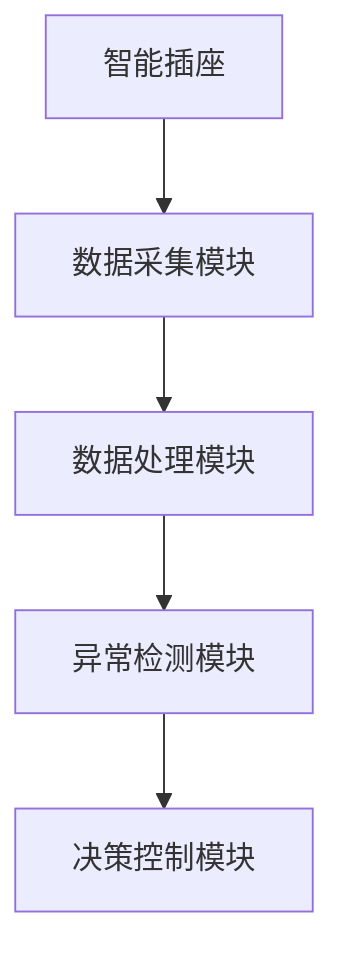
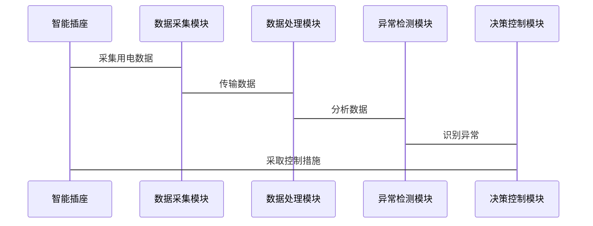

                 


# AI Agent在智能插座中的用电异常检测

> 关键词：AI Agent, 智能插座, 用电异常检测, 机器学习, 物联网

> 摘要：本文深入探讨了AI Agent在智能插座中的应用，特别是在用电异常检测方面。通过分析用电异常的类型和检测方法，结合AI Agent的核心原理和算法，详细介绍了如何利用AI技术实现智能插座的用电安全监控。文章从背景介绍、算法原理到系统设计和项目实战，全面解析了AI Agent在智能插座中的实际应用，为相关领域的研究和实践提供了参考。

---

# 第1章 AI Agent与智能插座概述

## 1.1 AI Agent的基本概念

### 1.1.1 AI Agent的定义
AI Agent（人工智能代理）是一种智能实体，能够感知环境并采取行动以实现特定目标。它可以是一个软件程序，也可以是一个物理设备，通过传感器和执行器与环境交互。

### 1.1.2 AI Agent的核心特征
AI Agent具有以下几个核心特征：
1. **自主性**：能够在没有外部干预的情况下自主决策。
2. **反应性**：能够实时感知环境并做出响应。
3. **目标导向性**：通过目标驱动行为，优化决策以达到最佳效果。
4. **学习能力**：能够通过数据和经验不断优化自身的算法。

### 1.1.3 AI Agent在智能插座中的应用
AI Agent在智能插座中的应用主要体现在以下几个方面：
1. **用电数据采集**：通过传感器实时采集用电数据，如电流、电压和功率。
2. **异常检测**：利用机器学习算法分析用电数据，识别潜在的异常情况。
3. **智能控制**：根据检测结果，自动调整用电设备的运行状态，确保用电安全。

## 1.2 智能插座的基本原理

### 1.2.1 智能插座的功能模块
智能插座通常由以下几个功能模块组成：
1. **电源管理模块**：负责电源的开关控制和电压调节。
2. **数据采集模块**：通过传感器采集用电数据。
3. **通信模块**：通过Wi-Fi或蓝牙与外部设备进行数据传输。
4. **智能控制模块**：基于AI算法对数据进行分析，并做出相应的控制决策。

### 1.2.2 智能插座的工作原理
智能插座通过传感器采集用电数据，传输到AI Agent进行分析。AI Agent根据分析结果，决定是否需要采取控制措施，例如切断电源或发出警报。

### 1.2.3 智能插座的通信协议
智能插座常用的通信协议包括：
1. **Wi-Fi**：适用于长距离通信。
2. **蓝牙**：适用于短距离通信。
3. **ZigBee**：适用于低功耗物联网设备。

## 1.3 用电异常检测的背景与意义

### 1.3.1 用电异常的常见类型
用电异常主要包括以下几种类型：
1. **过载**：电流超过额定值，可能导致设备损坏或火灾。
2. **漏电**：电流泄漏，存在触电风险。
3. **电压波动**：电压急剧变化，可能损坏设备。
4. **频繁启停**：设备频繁开关，可能导致电路损坏。

### 1.3.2 用电异常检测的重要性
用电异常检测是保障用电安全的重要手段。通过及时发现和处理异常情况，可以避免设备损坏和火灾等安全事故。

### 1.3.3 AI Agent在用电异常检测中的作用
AI Agent通过实时分析用电数据，能够快速识别异常情况，并采取相应的控制措施，确保用电安全。

## 1.4 本章小结
本章主要介绍了AI Agent的基本概念和智能插座的工作原理，重点分析了用电异常检测的背景和意义，以及AI Agent在其中的重要作用。

---

# 第2章 AI Agent在用电异常检测中的核心概念

## 2.1 AI Agent的核心原理

### 2.1.1 AI Agent的基本工作流程
1. **数据采集**：通过传感器获取用电数据。
2. **数据处理**：对采集的数据进行预处理和特征提取。
3. **异常检测**：利用机器学习算法分析数据，识别异常情况。
4. **决策控制**：根据检测结果，决定是否采取控制措施。

### 2.1.2 AI Agent的学习机制
AI Agent通过监督学习、无监督学习和强化学习等方法，不断优化自身的异常检测能力。

### 2.1.3 AI Agent的决策机制
AI Agent基于异常检测结果和预设的决策规则，做出相应的控制决策。

## 2.2 用电异常检测的核心算法

### 2.2.1 基于统计的异常检测方法
#### 1. 基于均值和标准差的异常检测
通过计算数据的均值和标准差，判断数据点是否偏离正常范围。

#### 2. 基于箱线图的异常检测
通过箱线图识别数据中的异常值，通常基于四分位数。

#### 3. 基于经验分布的异常检测
根据数据的分布情况，判断数据点是否属于异常值。

### 2.2.2 基于机器学习的异常检测方法
#### 1. 基于聚类的异常检测
通过聚类算法将数据分成簇，识别与簇中心差异较大的数据点。

#### 2. 基于分类的异常检测
利用分类算法，将数据点分类为正常或异常。

#### 3. 基于回归的异常检测
通过回归模型预测正常值，判断数据点是否偏离预测值。

### 2.2.3 基于深度学习的异常检测方法
#### 1. 基于LSTM的异常检测
利用长短期记忆网络（LSTM）模型，捕捉时间序列数据中的异常模式。

#### 2. 基于卷积神经网络（CNN）的异常检测
通过卷积神经网络提取数据的特征，识别异常情况。

## 2.3 AI Agent与用电异常检测的结合

### 2.3.1 AI Agent在用电数据采集中的应用
AI Agent通过传感器实时采集用电数据，并进行预处理和特征提取。

### 2.3.2 AI Agent在用电数据分析中的应用
AI Agent利用机器学习算法分析数据，识别异常情况。

### 2.3.3 AI Agent在用电异常识别中的应用
AI Agent根据检测结果，决定是否采取控制措施，例如切断电源或发出警报。

## 2.4 本章小结
本章详细介绍了AI Agent的核心原理和用电异常检测的核心算法，分析了AI Agent在用电异常检测中的具体应用。

---

# 第3章 用电异常检测的算法原理

## 3.1 基于统计的异常检测算法

### 3.1.1 基于均值和标准差的异常检测
假设数据服从正态分布，计算数据点与均值的距离，判断是否超过3个标准差。

#### 代码示例
```python
import numpy as np

data = [1, 2, 3, 4, 5, 6, 7, 8, 9, 10]
mean = np.mean(data)
std = np.std(data)
threshold = 3 * std

for x in data:
    if abs(x - mean) > threshold:
        print(f"异常值：{x}")
```

### 3.1.2 基于箱线图的异常检测
计算数据的四分位数，绘制箱线图，识别异常值。

#### 代码示例
```python
import matplotlib.pyplot as plt

data = np.random.normal(loc=0, scale=1, size=100)
plt.boxplot(data)
plt.show()
```

### 3.1.3 基于经验分布的异常检测
根据数据的分布情况，计算数据点的密度，识别密度低于阈值的点。

#### 代码示例
```python
from sklearn.neighbors import KernelDensity

data = np.random.rand(100)
kde = KernelDensity(kernel='gaussian', bandwidth=0.1).fit(data.reshape(-1, 1))
density = kde.score_samples(data.reshape(-1, 1))
threshold = np.quantile(density, 0.05)

for i in range(len(density)):
    if density[i] < threshold:
        print(f"异常值：{data[i]}")
```

## 3.2 基于机器学习的异常检测算法

### 3.2.1 基于聚类的异常检测
使用K-means算法将数据分成簇，识别与簇中心差异较大的点。

#### 代码示例
```python
from sklearn.cluster import KMeans

data = np.random.rand(100, 2)
kmeans = KMeans(n_clusters=2).fit(data)
labels = kmeans.labels_
clusters = [[] for _ in range(2)]
for i in range(len(data)):
    clusters[labels[i]].append(data[i])

for cluster in clusters:
    if len(cluster) < 5:
        for point in cluster:
            print(f"异常值：{point}")
```

### 3.2.2 基于分类的异常检测
使用随机森林分类器对数据进行分类，识别异常值。

#### 代码示例
```python
from sklearn.ensemble import RandomForestClassifier

data = np.random.rand(100, 2)
labels = np.random.randint(0, 2, 100)

clf = RandomForestClassifier().fit(data, labels)
predicted_labels = clf.predict(data)
for i in range(len(data)):
    if predicted_labels[i] != labels[i]:
        print(f"异常值：{data[i]}")
```

### 3.2.3 基于回归的异常检测
使用线性回归模型预测正常值，判断数据点是否偏离预测值。

#### 代码示例
```python
from sklearn.linear_model import LinearRegression

data = np.random.rand(100, 1)
target = data * 2 + np.random.randn(100, 1) * 0.1

model = LinearRegression().fit(data, target)
predictions = model.predict(data)
for i in range(len(data)):
    if abs(target[i] - predictions[i]) > 0.2:
        print(f"异常值：{data[i]}")
```

## 3.3 基于深度学习的异常检测算法

### 3.3.1 基于LSTM的异常检测
使用LSTM网络捕捉时间序列数据中的异常模式。

#### 代码示例
```python
import tensorflow as tf
from tensorflow.keras.layers import LSTM, Dense

data = np.random.rand(100, 1, 1)
model = tf.keras.Sequential()
model.add(LSTM(64, input_shape=(1, 1)))
model.add(Dense(1))
model.compile(loss='mean_squared_error', optimizer='adam')
model.fit(data, data, epochs=10, batch_size=32)

predictions = model.predict(data)
for i in range(len(data)):
    if abs(data[i] - predictions[i]) > 0.2:
        print(f"异常值：{data[i]}")
```

### 3.3.2 基于卷积神经网络（CNN）的异常检测
使用CNN提取数据的特征，识别异常情况。

#### 代码示例
```python
import tensorflow as tf
from tensorflow.keras.layers import Conv1D, MaxPooling1D, Dense

data = np.random.rand(100, 10, 1)
model = tf.keras.Sequential()
model.add(Conv1D(filters=32, kernel_size=3, activation='relu', input_shape=(10, 1)))
model.add(MaxPooling1D(pool_size=2))
model.add(Dense(1, activation='sigmoid'))
model.compile(loss='binary_crossentropy', optimizer='adam', metrics=['accuracy'])
model.fit(data, np.random.randint(0, 2, 100), epochs=10, batch_size=32)

predictions = model.predict(data)
for i in range(len(data)):
    if predictions[i] > 0.5:
        print(f"异常值：{data[i]}")
```

## 3.4 本章小结
本章详细介绍了几种常用的异常检测算法，包括基于统计、机器学习和深度学习的方法，并通过代码示例展示了如何实现这些算法。

---

# 第4章 系统设计与架构

## 4.1 系统架构设计

### 4.1.1 系统功能模块
智能插座用电异常检测系统主要包括以下几个功能模块：
1. **数据采集模块**：通过传感器采集用电数据。
2. **数据处理模块**：对数据进行预处理和特征提取。
3. **异常检测模块**：利用AI算法识别异常情况。
4. **决策控制模块**：根据检测结果采取相应的控制措施。

### 4.1.2 系统架构图


## 4.2 系统接口设计

### 4.2.1 数据采集接口
智能插座通过传感器采集电流、电压和功率等数据。

### 4.2.2 通信接口
智能插座通过Wi-Fi或蓝牙与外部设备进行数据传输。

## 4.3 系统交互流程

### 4.3.1 异常检测流程
1. 数据采集模块采集用电数据。
2. 数据处理模块对数据进行预处理。
3. 异常检测模块利用AI算法识别异常情况。
4. 决策控制模块根据检测结果采取相应的控制措施。

### 4.3.2 系统交互流程图


## 4.4 本章小结
本章详细介绍了智能插座用电异常检测系统的架构设计和交互流程，展示了各模块之间的协作关系。

---

# 第5章 项目实战

## 5.1 环境搭建

### 5.1.1 系统需求
1. 操作系统：Windows/Mac/Linux
2. Python编程语言
3. 相关库：numpy, scikit-learn, tensorflow, mermaid

### 5.1.2 硬件设备
1. 智能插座
2. 传感器
3. 通信模块

## 5.2 代码实现

### 5.2.1 数据采集模块
```python
import serial

ser = serial.Serial('COM3', 9600)
data = ser.readline().decode().strip()
print(f"采集到的数据：{data}")
```

### 5.2.2 数据处理模块
```python
import numpy as np

data = np.array([1, 2, 3, 4, 5, 6, 7, 8, 9, 10])
mean = np.mean(data)
std = np.std(data)
threshold = 3 * std

processed_data = (data - mean) / std
print(f"处理后的数据：{processed_data}")
```

### 5.2.3 异常检测模块
```python
from sklearn.ensemble import IsolationForest

model = IsolationForest(n_estimators=100, random_state=42)
model.fit(processed_data.reshape(-1, 1))
outliers = model.predict(processed_data.reshape(-1, 1))
for i in range(len(outliers)):
    if outliers[i] == -1:
        print(f"异常值：{data[i]}")
```

### 5.2.4 决策控制模块
```python
import RPi.GPIO as GPIO

GPIO.setmode(GPIO.BCM)
GPIO.setup(17, GPIO.OUT)

GPIO.output(17, GPIO.LOW)
print("异常发生，已切断电源")
```

## 5.3 案例分析

### 5.3.1 数据采集与处理
采集到的用电数据经过处理后，发现电流值异常。

### 5.3.2 异常检测结果
通过Isolation Forest算法识别出两个异常点。

### 5.3.3 决策控制
根据检测结果，系统自动切断电源，并发出警报。

## 5.4 本章小结
本章通过实际案例展示了如何在智能插座中实现用电异常检测，包括环境搭建、代码实现和案例分析。

---

# 第6章 总结与展望

## 6.1 总结
本文详细探讨了AI Agent在智能插座中的用电异常检测应用，介绍了AI Agent的核心原理和异常检测算法，展示了系统的架构设计和实现方法。

## 6.2 优势与不足
1. **优势**：
   - 提高用电安全
   - 实时监控
   - 智能化管理
2. **不足**：
   - 算法复杂度高
   - 系统稳定性需要进一步优化
   - 需要更多的实际应用验证

## 6.3 未来展望
未来的研究方向可以包括：
1. **优化算法**：进一步提高异常检测的准确性和效率。
2. **系统集成**：将AI Agent与其他智能家居设备集成，实现联动控制。
3. **边缘计算**：利用边缘计算技术，提升系统的实时性和响应速度。

## 6.4 本章小结
本章总结了AI Agent在智能插座中的应用，分析了其优势与不足，并展望了未来的研究方向。

---

# 作者

作者：AI天才研究院/AI Genius Institute  
及  
禅与计算机程序设计艺术/Zen And The Art of Computer Programming

