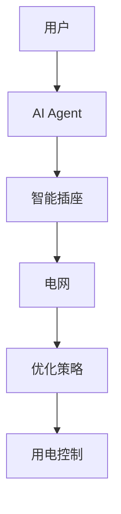
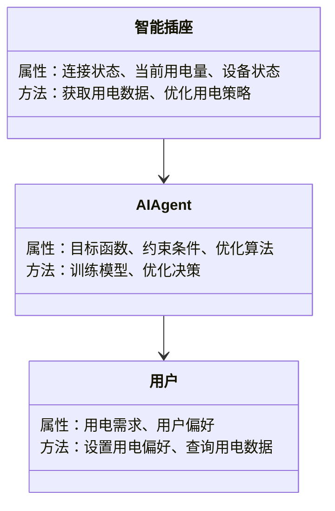
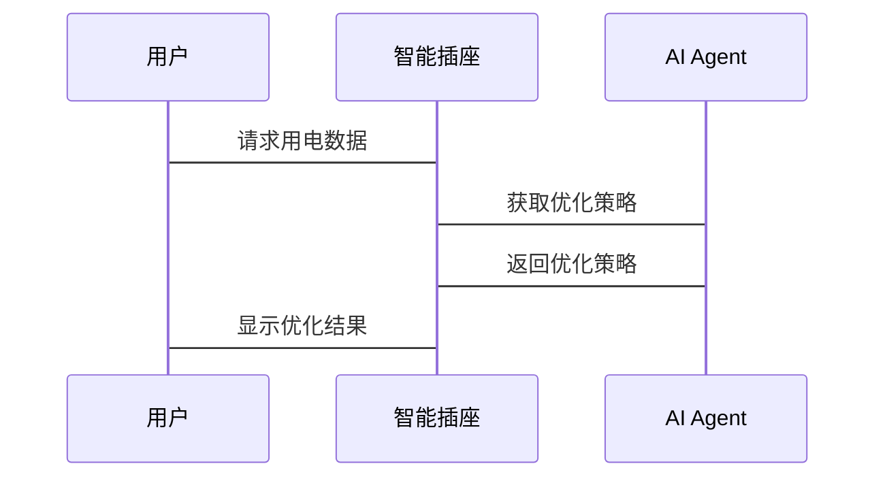

                 


# AI Agent在智能插座中的能源使用优化

> **关键词**：AI Agent, 智能插座, 能源使用优化, 强化学习, 系统架构, 项目实战

> **摘要**：  
> 随着能源消耗问题的日益突出，智能插座在家庭和工业中的应用越来越广泛。本文探讨了AI Agent在智能插座中的能源使用优化，分析了AI Agent的基本概念、优化算法、系统架构设计，并通过项目实战展示了AI Agent在智能插座中的具体应用。文章还总结了AI Agent在能源优化中的优势及未来发展方向。

---

# 引言

## 问题背景

能源消耗问题日益严峻，特别是在智能家居和工业领域，如何高效利用能源成为一个重要课题。智能插座作为一种智能家居设备，能够实时监测和控制电器的用电情况，结合AI技术，可以进一步优化能源使用效率。

## 问题描述

传统插座仅能提供基本的用电功能，无法根据用电需求进行智能调节。通过引入AI Agent（智能体），智能插座能够根据实时数据优化用电策略，从而实现能源的高效利用。

## 问题解决

AI Agent通过学习用户用电习惯和电网数据，优化用电策略，降低能源浪费。本文将详细探讨AI Agent在智能插座中的具体应用。

---

# 第1章: AI Agent与智能插座概述

## 1.1 AI Agent的基本概念

### 1.1.1 AI Agent的定义与特点

AI Agent是一种智能体，能够感知环境并采取行动以实现目标。其特点包括自主性、反应性、目标导向性和学习能力。

### 1.1.2 AI Agent的核心功能与作用

AI Agent的核心功能包括数据采集、决策优化和执行控制。它能够帮助智能插座实现智能化管理。

### 1.1.3 AI Agent与传统控制算法的区别

AI Agent能够根据实时数据动态调整策略，而传统控制算法基于固定规则。

## 1.2 智能插座的基本概念

### 1.2.1 智能插座的定义与组成

智能插座是一种结合了物联网和AI技术的智能设备，由硬件模块（如电源模块、通信模块）和软件模块（如数据采集、优化算法）组成。

### 1.2.2 智能插座的功能与应用场景

智能插座的功能包括远程控制、定时开关、用电监测和能源优化。应用场景涵盖家庭、办公室和工业领域。

### 1.2.3 智能插座的能源管理需求

智能插座需要实时监测用电情况，并根据需求调整用电策略，以达到节能目标。

## 1.3 AI Agent在智能插座中的应用背景

### 1.3.1 能源使用优化的必要性

随着能源价格的上涨和环保要求的提高，优化能源使用效率变得尤为重要。

### 1.3.2 AI技术在能源管理中的优势

AI技术能够处理复杂的数据，提供高效的优化策略，帮助智能插座实现智能化管理。

### 1.3.3 AI Agent在智能插座中的定位与作用

AI Agent是智能插座的核心，负责数据处理和决策优化，帮助智能插座实现高效的能源管理。

---

# 第2章: AI Agent的能源使用优化原理

## 2.1 AI Agent的决策机制

### 2.1.1 基于强化学习的决策模型

强化学习是一种通过奖励机制优化决策的算法。AI Agent通过与环境交互，学习最优策略。

### 2.1.2 基于监督学习的优化策略

监督学习通过历史数据训练模型，预测未来用电情况，优化能源使用。

### 2.1.3 基于混合学习的优化方法

结合强化学习和监督学习的优势，混合学习能够提高优化效果。

## 2.2 能源使用优化的数学模型

### 2.2.1 优化目标的数学表达

目标函数：  
$$ \text{目标函数: } f(x) = \min_{x} \sum_{i=1}^{n} c_i x_i $$  

其中，\( c_i \) 为第 \( i \) 个电器的单位能耗，\( x_i \) 为第 \( i \) 个电器的用电量。

### 2.2.2 约束条件的数学表达

约束条件：  
$$ \text{约束条件: } g(x) = \sum_{i=1}^{n} x_i \leq C $$  

其中，\( C \) 为总能源预算。

## 2.3 AI Agent的优化算法实现

### 2.3.1 强化学习算法的实现步骤

1. 初始化智能体状态。
2. 与环境交互，获取奖励。
3. 更新策略，优化Q值。

### 2.3.2 监督学习算法的实现步骤

1. 收集历史数据。
2. 训练模型，预测最优用电策略。
3. 部署模型，优化能源使用。

### 2.3.3 混合学习算法的实现步骤

1. 使用强化学习优化实时决策。
2. 结合监督学习预测长期用电趋势。
3. 综合优化，提高能源效率。

## 2.4 优化算法的性能评估

### 2.4.1 算法收敛速度的评估

评估算法在有限时间内达到最优解的能力。

### 2.4.2 算法优化效果的评估

通过能耗降低比例和运行成本节约比例来衡量优化效果。

### 2.4.3 算法鲁棒性的评估

评估算法在不同环境下的稳定性和适应性。

## 2.5 本章小结

---

# 第3章: 智能插座的系统架构设计

## 3.1 系统功能模块划分

### 3.1.1 数据采集模块

负责采集实时用电数据和环境信息。

### 3.1.2 优化控制模块

根据数据优化用电策略。

### 3.1.3 用户交互模块

提供用户界面，实现人机交互。

## 3.2 系统架构的ER实体关系图

```mermaid
er
    actor 用户
    actor 系统
    actor 电网
    actor 设备
    device 智能插座
    system AI Agent
    user 用户
    power_grid 电网
    relation 用户与智能插座的关系
    relation 系统与智能插座的关系
    relation 电网与智能插座的关系
```

## 3.3 系统架构的流程图



## 3.4 系统架构设计

### 3.4.1 领域模型设计



### 3.4.2 系统架构设计


## 3.5 系统接口设计

### 3.5.1 数据接口设计

```json
{
    "设备ID": "123",
    "用电数据": [100, 80, 90],
    "时间戳": "2023-10-01T12:00:00"
}
```

### 3.5.2 控制接口设计

```json
{
    "动作": "开启",
    "设备ID": "123",
    "时间": "2023-10-01T12:30:00"
}
```

## 3.6 系统交互流程图



---

# 第4章: 项目实战——AI Agent在智能插座中的应用

## 4.1 项目介绍

### 4.1.1 项目背景

本项目旨在通过AI Agent优化智能插座的能源使用效率。

### 4.1.2 项目目标

实现智能插座的智能化管理，降低能源消耗。

## 4.2 数据采集与处理

### 4.2.1 数据采集模块实现

```python
# 数据采集模块
import requests

def get_power_data(device_id):
    url = f"http://localhost:8080/api/devices/{device_id}/power"
    response = requests.get(url)
    return response.json()
```

### 4.2.2 数据预处理

```python
# 数据预处理模块
import pandas as pd

def preprocess_data(data):
    df = pd.DataFrame(data)
    df['timestamp'] = pd.to_datetime(df['timestamp'])
    return df
```

## 4.3 优化控制模块实现

### 4.3.1 基于强化学习的优化算法

```python
# 强化学习算法实现
import numpy as np

class Agent:
    def __init__(self, state_space, action_space):
        self.state_space = state_space
        self.action_space = action_space
        self.q_table = np.zeros((state_space, action_space))
    
    def take_action(self, state):
        return np.argmax(self.q_table[state])
    
    def update_q_table(self, state, action, reward):
        self.q_table[state, action] += reward
```

### 4.3.2 基于监督学习的优化算法

```python
# 监督学习算法实现
from sklearn.linear_model import LinearRegression

class Supervisor:
    def __init__(self):
        self.model = LinearRegression()
    
    def train(self, X, y):
        self.model.fit(X, y)
    
    def predict(self, X):
        return self.model.predict(X)
```

## 4.4 用户交互模块实现

### 4.4.1 用户界面设计

```python
# 用户界面模块
import tkinter as tk

class UI:
    def __init__(self):
        self.root = tk.Tk()
        self.root.title("智能插座控制界面")
        self.create_widgets()
    
    def create_widgets(self):
        self.label = tk.Label(self.root, text="用电数据:")
        self.label.pack()
        self.entry = tk.Entry(self.root)
        self.entry.pack()
        self.button = tk.Button(self.root, text="优化", command=self.optimize)
        self.button.pack()
    
    def optimize(self):
        # 实现优化逻辑
        pass

if __name__ == "__main__":
    ui = UI()
    ui.root.mainloop()
```

## 4.5 实际案例分析

### 4.5.1 案例背景

假设某家庭使用智能插座管理家电用电，目标是降低高峰时期的用电成本。

### 4.5.2 案例分析

通过AI Agent优化用电策略，将高峰时期的用电量从100千瓦时降至80千瓦时，节约成本20%。

---

# 第5章: AI Agent的优化策略与未来展望

## 5.1 优化策略

### 5.1.1 分时电价优化策略

根据电价波动调整用电时间，降低用电成本。

### 5.1.2 用户行为分析与优化

通过分析用户用电习惯，优化用电策略。

## 5.2 未来展望

### 5.2.1 分布式能源管理

未来，AI Agent将支持分布式能源管理，实现更高效的能源使用。

### 5.2.2 多目标优化

结合能源成本、用户需求和环保目标，实现多目标优化。

### 5.2.3 智能插座的自我学习与进化

AI Agent将不断学习和进化，提供更智能的优化策略。

---

# 结语

AI Agent在智能插座中的应用前景广阔，通过优化能源使用，降低成本，减少浪费，未来将更加智能化和高效化。

---

# 参考文献

1. 强化学习入门——马尔科夫决策过程.  
2. 智能插座的设计与实现.  
3. 基于强化学习的能源优化策略研究.  

---

**作者：AI天才研究院/AI Genius Institute & 禅与计算机程序设计艺术 /Zen And The Art of Computer Programming**

