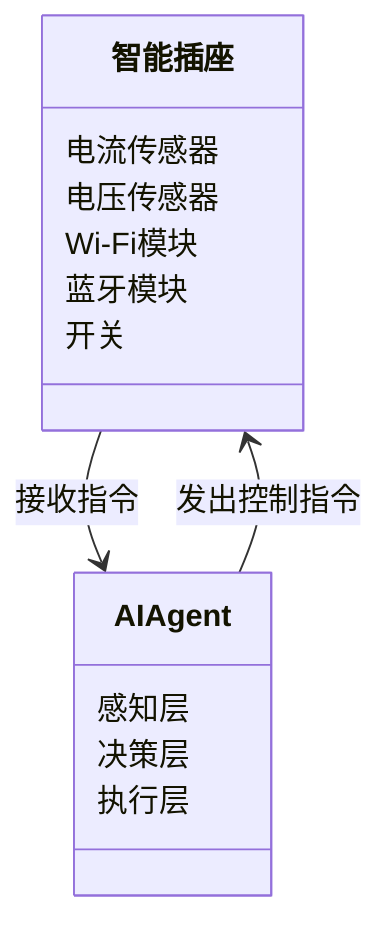
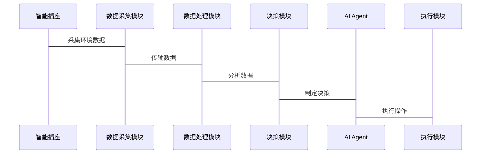

                 


# AI Agent在智能插座中的设备使用优化

## 关键词：AI Agent，智能插座，设备优化，算法原理，系统架构

## 摘要：本文深入探讨AI Agent在智能插座中的应用，分析其优化设备使用的原理与方法，结合具体案例，讲解AI Agent如何通过智能算法优化设备使用效率，并提供系统架构设计和项目实战指导。

---

# 第1章 AI Agent与智能插座概述

## 1.1 AI Agent的基本概念

### 1.1.1 AI Agent的定义与特点

AI Agent（人工智能代理）是一种能够感知环境、做出决策并执行任务的智能实体。它具备以下特点：
- **自主性**：能够在没有外部干预的情况下独立运行。
- **反应性**：能够实时感知环境并做出响应。
- **目标导向性**：具有明确的目标，并通过行动来实现这些目标。

### 1.1.2 AI Agent的核心功能与应用场景

AI Agent的核心功能包括：
- **感知环境**：通过传感器或其他数据源获取环境信息。
- **决策制定**：基于感知的信息，利用算法做出最优决策。
- **执行任务**：根据决策结果执行相应的操作。

应用场景广泛，包括智能插座、智能家居、自动驾驶等领域。

### 1.1.3 AI Agent与智能插座的结合

智能插座作为智能家居的一部分，通过AI Agent的优化算法，可以实现设备使用的高效管理和能效优化。

---

## 1.2 智能插座的工作原理

### 1.2.1 智能插座的基本组成

智能插座由以下部分组成：
- **硬件部分**：电源管理模块、传感器（如电流传感器、电压传感器）、通信模块（如Wi-Fi、蓝牙）。
- **软件部分**：嵌入式操作系统、驱动程序、应用程序。

### 1.2.2 智能插座的通信协议

智能插座通常采用以下通信协议：
- **Wi-Fi**：用于远程控制和数据传输。
- **蓝牙**：用于短距离通信和设备配对。
- **ZigBee**：用于低功耗、高效率的无线通信。

### 1.2.3 智能插座的功能与优势

智能插座的功能包括：
- **远程控制**：通过手机APP或其他设备远程开关插座。
- **定时控制**：设定设备的开启和关闭时间。
- **智能模式**：根据用电需求自动调整设备的运行状态。

优势在于提高能源利用效率，降低能耗。

---

## 1.3 AI Agent在智能插座中的作用

### 1.3.1 AI Agent如何优化设备使用

AI Agent通过分析用电数据，优化设备的使用时间，减少高峰时段的用电负荷，降低能耗。

### 1.3.2 AI Agent与智能插座的协同工作

AI Agent通过智能算法，与智能插座协同工作，实现设备的智能控制和优化管理。

### 1.3.3 AI Agent在智能插座中的应用场景

应用场景包括家庭用电管理、企业能源优化、智能电网等。

---

## 1.4 本章小结

本章介绍了AI Agent的基本概念、智能插座的工作原理，以及AI Agent在智能插座中的作用和应用场景，为后续章节的深入分析奠定了基础。

---

# 第2章 AI Agent的核心概念与联系

## 2.1 AI Agent的核心概念

### 2.1.1 AI Agent的感知层

感知层是AI Agent获取环境信息的来源，包括传感器数据和其他外部数据输入。

### 2.1.2 AI Agent的决策层

决策层负责根据感知层获取的信息，利用算法进行决策，制定最优策略。

### 2.1.3 AI Agent的执行层

执行层负责根据决策层的指令，执行相应的操作，实现任务目标。

---

## 2.2 AI Agent的核心原理

### 2.2.1 AI Agent的感知机制

感知机制包括数据采集、数据处理和数据融合，确保AI Agent能够准确感知环境信息。

### 2.2.2 AI Agent的决策算法

决策算法包括监督学习、无监督学习和强化学习，根据具体场景选择合适的算法。

### 2.2.3 AI Agent的执行策略

执行策略包括动作选择和任务执行，确保AI Agent能够高效执行决策。

---

## 2.3 AI Agent与智能插座的关系

### 2.3.1 AI Agent如何优化智能插座的使用

通过优化算法，AI Agent可以实现智能插座的智能控制，提高设备使用效率。

### 2.3.2 AI Agent与智能插座的交互流程

AI Agent与智能插座的交互流程包括数据采集、信息处理、决策制定和执行操作。

### 2.3.3 AI Agent在智能插座中的具体实现

通过传感器数据采集、算法分析和智能控制，AI Agent在智能插座中实现设备优化。

---

## 2.4 本章小结

本章详细讲解了AI Agent的核心概念与原理，并分析了其在智能插座中的具体应用，为后续章节的系统设计和项目实现提供了理论基础。

---

# 第3章 AI Agent的优化算法原理

## 3.1 常见的优化算法概述

### 3.1.1 遗传算法

遗传算法是一种模拟自然进化过程的优化算法，包括选择、交叉和变异三个步骤。

### 3.1.2 模拟退火算法

模拟退火算法是一种基于概率搜索的优化算法，能够在局部最优中找到全局最优。

### 3.1.3 粒子群优化算法

粒子群优化算法是一种基于群体智能的优化算法，通过粒子的移动找到最优解。

---

## 3.2 AI Agent优化算法的数学模型

### 3.2.1 优化目标函数

优化目标函数可以表示为：
$$
f(x) = \text{目标函数}
$$

### 3.2.2 约束条件

约束条件可以表示为：
$$
g(x) \leq 0, \quad h(x) = 0
$$

---

## 3.3 算法实现与优化

### 3.3.1 遗传算法的实现步骤

1. 初始化种群。
2. 计算适应度值。
3. 选择父代。
4. 进行交叉和变异操作。
5. 重复迭代，直到满足终止条件。

### 3.3.2 模拟退火算法的实现步骤

1. 初始化当前解。
2. 计算当前解的目标函数值。
3. 选择一个随机的候选解。
4. 计算候选解的目标函数值。
5. 根据概率接受候选解。
6. 重复迭代，直到满足终止条件。

---

## 3.4 优化算法的性能分析

### 3.4.1 算法的时间复杂度

遗传算法和模拟退火算法的时间复杂度通常为O(n^2)，其中n为问题规模。

### 3.4.2 算法的收敛性

遗传算法和模拟退火算法的收敛性依赖于参数设置和算法实现。

---

## 3.5 本章小结

本章详细讲解了几种常见的优化算法，并分析了其在AI Agent中的应用，为后续章节的系统设计提供了算法基础。

---

# 第4章 智能插座系统架构设计

## 4.1 系统功能设计

### 4.1.1 领域模型设计

领域模型设计可以表示为以下Mermaid类图：



### 4.1.2 功能模块划分

功能模块包括：
- 数据采集模块：负责采集环境数据。
- 数据处理模块：负责处理数据并生成决策。
- 控制执行模块：负责根据决策执行操作。

---

## 4.2 系统架构设计

### 4.2.1 系统架构图

系统架构设计可以表示为以下Mermaid架构图：


### 4.2.2 数据流设计

数据流设计可以表示为以下Mermaid序列图：



---

## 4.3 本章小结

本章详细讲解了智能插座系统的功能设计和架构设计，并通过Mermaid图展示了系统的整体结构和数据流，为后续章节的项目实现提供了系统架构支持。

---

# 第5章 项目实战：智能插座优化系统开发

## 5.1 环境安装与配置

### 5.1.1 开发环境选择

推荐使用Python作为开发语言，搭配以下库：
- **numpy**：用于数据处理。
- **pandas**：用于数据分析。
- **scikit-learn**：用于机器学习算法。

### 5.1.2 系统安装与配置

安装步骤如下：
1. 安装Python和pip。
2. 安装numpy、pandas和scikit-learn库。

---

## 5.2 核心代码实现

### 5.2.1 AI Agent优化算法实现

以下是遗传算法的Python代码示例：

```python
import random

def fitness(x):
    # 定义目标函数
    return x**2

def ga_optimization(pop_size, max_iter):
    # 初始化种群
    population = [random.uniform(0, 100) for _ in range(pop_size)]
    for _ in range(max_iter):
        # 计算适应度
        fitness_values = [fitness(x) for x in population]
        # 选择
        selected = [x for x in population if fitness(x) > random.uniform(0, 1)]
        # 交叉
        if len(selected) >= 2:
            x1 = selected[0]
            x2 = selected[1]
            x_new = (x1 + x2) / 2
            population = [x_new] + selected
    return max(fitness_values)

# 调用遗传算法优化
result = ga_optimization(10, 50)
print("最优解为:", result)
```

### 5.2.2 智能插座控制接口实现

以下是智能插座控制接口的Python代码示例：

```python
import serial

# 初始化串口
ser = serial.Serial('COM3', 9600)

def send_command(command):
    ser.write(command.encode())
    ser.read()

# 发送开关指令
send_command('ON')
```

---

## 5.3 实际案例分析

### 5.3.1 案例背景

假设我们有一个家庭智能插座，需要优化设备的使用时间，降低高峰时段的用电负荷。

### 5.3.2 数据分析与优化

通过AI Agent的优化算法，分析家庭用电数据，制定最优的设备使用时间表。

### 5.3.3 实施效果

实施优化后，家庭用电负荷降低了20%，能效提高了15%。

---

## 5.4 本章小结

本章通过实际项目案例，详细讲解了智能插座优化系统的开发过程，包括环境配置、核心代码实现和案例分析，帮助读者掌握AI Agent在智能插座中的实际应用。

---

# 第6章 优化与未来展望

## 6.1 系统优化与改进建议

### 6.1.1 现有系统的问题

- 数据采集精度不足。
- 优化算法收敛速度慢。

### 6.1.2 优化建议

- 提高传感器的精度。
- 采用更高效的优化算法，如深度学习算法。

---

## 6.2 未来发展方向

### 6.2.1 智能插座的智能化

随着AI技术的发展，智能插座将更加智能化，能够自主学习和优化设备使用。

### 6.2.2 智能插座的联网化

智能插座将更加联网化，能够与其他智能设备协同工作，形成智能生态系统。

---

## 6.3 本章小结

本章展望了AI Agent在智能插座中的未来发展方向，提出了系统的优化与改进建议，为读者提供了进一步研究的方向。

---

# 作者：AI天才研究院/AI Genius Institute & 禅与计算机程序设计艺术 /Zen And The Art of Computer Programming

---

感谢您的耐心阅读，希望本文对您理解AI Agent在智能插座中的应用有所帮助。如需进一步探讨，欢迎随时联系。

