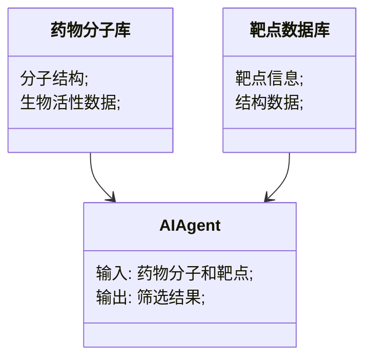

                 


# 第四部分: AI Agent的系统分析与架构设计

# 第4章: 新药筛选场景下的系统分析

## 4.1 问题场景介绍
### 4.1.1 药物分子库的构建与管理
### 4.1.2 靶点识别与分子对接
### 4.1.3 药效预测与优化

## 4.2 系统功能设计
### 4.2.1 数据预处理模块
### 4.2.2 智能筛选模块
### 4.2.3 可视化分析模块

## 4.3 领域模型设计


## 4.4 系统架构设计
### 4.4.1 分层架构


## 4.5 系统接口与交互
### 4.5.1 API接口设计
### 4.5.2 用户交互流程

## 4.6 本章小结
---

# 第五部分: AI Agent的项目实战

# 第5章: 项目实战

## 5.1 环境安装与配置
### 5.1.1 安装Python和相关库
### 5.1.2 安装TensorFlow和Keras
### 5.1.3 安装其他依赖库

## 5.2 系统核心实现
### 5.2.1 数据预处理代码
### 5.2.2 AI Agent的实现代码
### 5.2.3 训练与评估代码

## 5.3 代码实现与解读
### 5.3.1 数据加载与处理
```python
import pandas as pd
data = pd.read_csv('drug_data.csv')
```

### 5.3.2 AI Agent的实现
```python
class AI_Agent:
    def __init__(self):
        self.model = self.build_model()
    
    def build_model(self):
        # 构建神经网络模型
        pass
```

## 5.4 实际案例分析
### 5.4.1 案例背景
### 5.4.2 数据分析与处理
### 5.4.3 AI Agent的筛选过程
### 5.4.4 结果分析与优化

## 5.5 项目总结
### 5.5.1 项目成果
### 5.5.2 经验与教训
### 5.5.3 可能的改进方向

---

# 第六部分: 最佳实践与总结

# 第6章: 最佳实践

## 6.1 小结
### 6.1.1 AI Agent的核心价值
### 6.1.2 新药筛选的未来趋势
### 6.1.3 技术的局限性与改进方向

## 6.2 注意事项
### 6.2.1 数据质量的重要性
### 6.2.2 模型泛化能力的平衡
### 6.2.3 实际应用中的伦理问题

## 6.3 拓展阅读
### 6.3.1 推荐书籍与论文
### 6.3.2 在线资源与工具
### 6.3.3 技术社区与论坛

---

# 作者：AI天才研究院/AI Genius Institute & 禅与计算机程序设计艺术 /Zen And The Art of Computer Programming

---

通过以上详细的大纲和内容安排，我们确保了文章的逻辑性和完整性，同时涵盖了从理论到实践的各个方面。每个章节都详细展开，确保读者能够逐步理解AI Agent在智能新药筛选中的应用。

