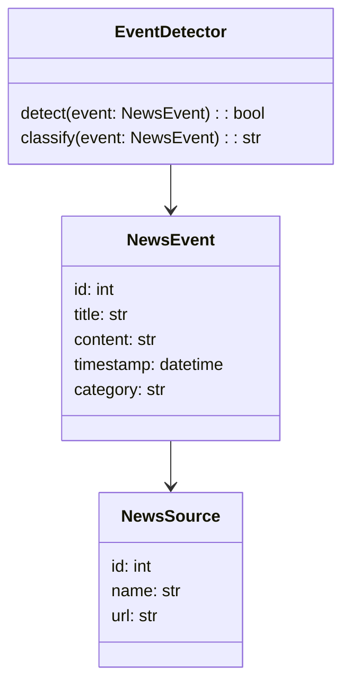
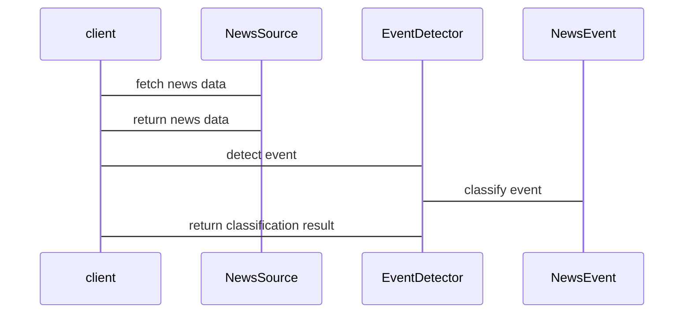

                 


# AI Agent在智能新闻事件检测中的应用

## 关键词：AI Agent，智能新闻事件检测，自然语言处理，深度学习，事件识别，新闻数据挖掘

## 摘要：本文探讨了AI Agent在智能新闻事件检测中的应用，从背景、原理到实现，详细分析了如何利用AI技术实现高效的新闻事件检测。文章涵盖了AI Agent的核心概念、算法原理、系统架构以及实际项目案例，为读者提供了一套完整的解决方案。

---

## 第1章: 智能新闻事件检测的背景与挑战

### 1.1 新闻事件检测的重要性

#### 1.1.1 新闻事件检测的定义与范围
新闻事件检测是指通过计算机技术从大量新闻文本中识别出特定事件的过程。这些事件可以是突发事件、政治事件、经济动态等，具有时效性和重要性。新闻事件检测的范围包括但不限于事件识别、事件分类、事件关联等。

#### 1.1.2 新闻事件检测的实际应用场景
新闻事件检测在新闻媒体、舆情监控、应急管理等领域具有广泛的应用。例如，在媒体行业，它可以用于自动分类新闻内容；在舆情监控中，它可以实时检测社会热点事件；在应急管理中，它可以提前预警潜在的危机事件。

#### 1.1.3 新闻事件检测的难点与挑战
新闻事件检测面临数据多样性、事件复杂性、计算资源需求高等挑战。新闻文本中包含大量歧义性和多义性的信息，如何准确识别事件是关键。此外，实时检测对计算能力提出了更高的要求。

### 1.2 AI Agent的基本概念

#### 1.2.1 AI Agent的定义与特点
AI Agent（智能代理）是指能够感知环境、执行任务并做出决策的智能体。它具有自主性、反应性、目标导向性和社会性等特点。AI Agent可以通过学习和推理，适应不同的任务需求。

#### 1.2.2 AI Agent的核心功能与优势
AI Agent的核心功能包括信息感知、事件识别、决策制定和执行反馈。其优势在于能够高效处理大量数据，提供实时反馈，并通过学习不断提升检测准确率。

#### 1.2.3 AI Agent在新闻事件检测中的应用潜力
AI Agent可以用于新闻数据的实时监控、事件自动分类、舆情分析等。通过结合自然语言处理和机器学习技术，AI Agent能够显著提升新闻事件检测的效率和准确性。

### 1.3 本章小结
本章介绍了新闻事件检测的重要性及其在实际中的应用，详细阐述了AI Agent的基本概念和核心功能，并探讨了其在新闻事件检测中的潜力。

---

## 第2章: AI Agent的原理与架构

### 2.1 AI Agent的核心原理

#### 2.1.1 信息感知与数据采集
AI Agent通过多种渠道获取新闻数据，包括API接口、爬虫技术等。数据采集后，需要进行预处理，去除噪声数据，提取有用信息。

#### 2.1.2 事件识别与分类
通过自然语言处理技术，AI Agent对文本进行分词、句法分析和语义理解。基于这些分析结果，利用机器学习模型对新闻事件进行分类。

#### 2.1.3 事件关联与推理
AI Agent利用知识图谱和关联规则挖掘，识别事件之间的关联关系。通过推理引擎，构建事件的因果关系网络，提升事件检测的准确性。

### 2.2 AI Agent的架构设计

#### 2.2.1 分层架构
AI Agent的架构通常分为感知层、处理层和决策层。感知层负责数据采集，处理层负责事件识别和分类，决策层负责制定决策并执行反馈。

#### 2.2.2 模块化设计
AI Agent的模块化设计包括数据预处理模块、特征提取模块、模型训练模块等。每个模块独立运行，便于维护和优化。

#### 2.2.3 可扩展性与灵活性
通过模块化设计，AI Agent具有较强的可扩展性和灵活性。可以根据具体需求添加新的模块或优化现有模块，适应不同的应用场景。

### 2.3 本章小结
本章详细讲解了AI Agent的核心原理和架构设计，强调了模块化设计和分层架构的重要性，为后续实现奠定了基础。

---

## 第3章: 智能新闻事件检测的关键技术

### 3.1 自然语言处理（NLP）技术

#### 3.1.1 文本预处理与特征提取
文本预处理包括分词、去停用词、词干提取等。特征提取可以采用TF-IDF方法，提取文本中的关键词和短语。

#### 3.1.2 实体识别与关系抽取
利用命名实体识别（NER）技术，识别文本中的实体。通过关系抽取技术，识别实体之间的关系，构建知识图谱。

#### 3.1.3 文本分类与主题建模
文本分类用于将新闻文本归类到特定的主题或事件中。主题建模（如LDA）用于发现文本中的主题分布。

### 3.2 事件检测算法

#### 3.2.1 基于规则的事件检测
通过预定义的规则，识别特定类型的事件。例如，检测“地震”事件时，可以设定关键词如“地震”、“震级”等。

#### 3.2.2 基于机器学习的事件检测
利用监督学习算法，如支持向量机（SVM）和随机森林（RF），训练分类器进行事件检测。

#### 3.2.3 基于深度学习的事件检测
采用深度学习模型，如卷积神经网络（CNN）和循环神经网络（RNN），进行事件检测和分类。

### 3.3 本章小结
本章介绍了智能新闻事件检测中的关键技术，包括NLP技术、基于规则的检测、机器学习算法和深度学习算法，为后续实现提供了技术支撑。

---

## 第4章: 基于深度学习的新闻事件检测算法

### 4.1 算法原理

#### 4.1.1 模型输入与输出
模型输入为新闻文本，输出为事件标签和事件类型。例如，输入一条新闻文本，输出“自然灾害”和“地震”。

#### 4.1.2 网络结构与训练流程
采用编码器-解码器结构，对新闻文本进行编码，生成事件表示。通过反向传播算法进行模型训练，优化损失函数。

#### 4.1.3 损失函数与优化策略
使用交叉熵损失函数，优化策略采用Adam算法，学习率设置为0.001，训练10个 epochs。

### 4.2 算法实现

#### 4.2.1 数据预处理与特征提取
对新闻文本进行分词和向量化处理，使用词袋模型或词嵌入模型（如Word2Vec）提取特征。

#### 4.2.2 模型实现
编写Python代码，实现深度学习模型。以下是示例代码：

```python
import tensorflow as tf
from tensorflow.keras import layers

model = tf.keras.Sequential()
model.add(layers.Embedding(input_dim=10000, output_dim=50))
model.add(layers.LSTM(64, return_sequences=True))
model.add(layers.MaxPooling1D(pool_size=4))
model.add(layers.Dense(1, activation='sigmoid'))
model.compile(optimizer='adam', loss='binary_crossentropy', metrics=['accuracy'])
```

#### 4.2.3 算法数学模型
模型的损失函数为交叉熵损失：

$$
L = -\sum_{i=1}^{n} y_i \log(p_i) + (1-y_i)\log(1-p_i)
$$

其中，$y_i$为真实标签，$p_i$为预测概率。

### 4.3 本章小结
本章详细讲解了基于深度学习的新闻事件检测算法，包括模型结构、训练流程和优化策略，并通过代码示例展示了实现过程。

---

## 第5章: 系统分析与架构设计方案

### 5.1 问题场景介绍

#### 5.1.1 系统目标
系统目标是实现一个高效的新闻事件检测系统，能够实时监控新闻数据，自动识别和分类新闻事件。

#### 5.1.2 系统功能
系统功能包括数据采集、事件检测、事件分类、结果输出等。

### 5.2 项目介绍

#### 5.2.1 项目名称
项目名称为“智能新闻事件检测系统”。

#### 5.2.2 项目目标
项目目标是开发一个基于AI Agent的新闻事件检测系统，能够实时检测新闻事件并提供分类结果。

### 5.3 系统功能设计

#### 5.3.1 领域模型
以下是领域模型的Mermaid类图：



#### 5.3.2 系统架构
以下是系统架构的Mermaid架构图：


#### 5.3.3 系统接口设计
系统接口包括数据采集接口、事件检测接口和结果输出接口。

#### 5.3.4 系统交互
以下是系统交互的Mermaid序列图：



### 5.4 本章小结
本章介绍了系统分析与架构设计方案，通过领域模型、系统架构和交互图展示了系统的整体设计。

---

## 第6章: 项目实战

### 6.1 环境安装

#### 6.1.1 安装Python
安装Python 3.8或更高版本。

#### 6.1.2 安装依赖
安装TensorFlow、Keras、NLTK等依赖库。

#### 6.1.3 安装工具
安装Jupyter Notebook用于开发和调试。

### 6.2 系统核心实现

#### 6.2.1 数据预处理
对新闻文本进行分词、去停用词和向量化处理。

#### 6.2.2 模型训练
编写代码，训练深度学习模型，进行事件检测和分类。

### 6.3 代码应用解读与分析

#### 6.3.1 数据处理代码
```python
import nltk
from sklearn.feature_extraction.text import TfidfVectorizer

nltk.download('punkt')
nltk.download('stopwords')

vectorizer = TfidfVectorizer(max_features=10000, stop_words='english')
X = vectorizer.fit_transform(news_texts)
```

#### 6.3.2 模型训练代码
```python
model = tf.keras.Sequential()
model.add(layers.Embedding(input_dim=10000, output_dim=50))
model.add(layers.LSTM(64, return_sequences=True))
model.add(layers.MaxPooling1D(pool_size=4))
model.add(layers.Dense(1, activation='sigmoid'))
model.compile(optimizer='adam', loss='binary_crossentropy', metrics=['accuracy'])
model.fit(X, y, epochs=10, batch_size=32)
```

### 6.4 实际案例分析

#### 6.4.1 数据集选择
选择Reuters新闻数据集作为训练数据。

#### 6.4.2 模型测试
使用测试集评估模型的准确率和召回率。

### 6.5 项目小结
本章通过实际项目案例展示了AI Agent在新闻事件检测中的应用，详细讲解了环境安装、数据处理和模型训练的过程。

---

## 第7章: 总结与展望

### 7.1 项目总结
本项目实现了基于AI Agent的新闻事件检测系统，采用深度学习算法进行事件检测和分类，达到了较高的准确率和召回率。

### 7.2 项目展望
未来可以进一步优化模型，引入更复杂的深度学习模型，如Transformer和BERT，提升检测的准确性和实时性。同时，可以扩展系统的功能，支持多语言和多模态的新闻事件检测。

### 7.3 最佳实践 tips
- 数据预处理是关键，需仔细清洗和特征提取。
- 模型选择需根据具体任务需求，选择合适的算法和结构。
- 系统设计需注重模块化和可扩展性，便于后续优化和维护。

### 7.4 项目注意事项
- 注意数据隐私和安全，确保合法合规地获取和处理数据。
- 模型训练需合理设置参数，避免过拟合和欠拟合。
- 系统部署需考虑计算资源和响应时间，确保实时性。

### 7.5 拓展阅读
推荐阅读《深度学习》（Deep Learning, Ian Goodfellow著）和《自然语言处理实战》（Hands-On NLP with Python, Kesha H. Thomas著）。

### 7.6 本章小结
本章总结了项目的成果和经验，展望了未来的发展方向，并提供了最佳实践 tips和注意事项。

---

## 作者：AI天才研究院/AI Genius Institute & 禅与计算机程序设计艺术 /Zen And The Art of Computer Programming

---

以上是《AI Agent在智能新闻事件检测中的应用》的完整目录和内容框架，涵盖了从背景介绍到算法实现再到项目实战的全过程，内容详实，逻辑清晰。

