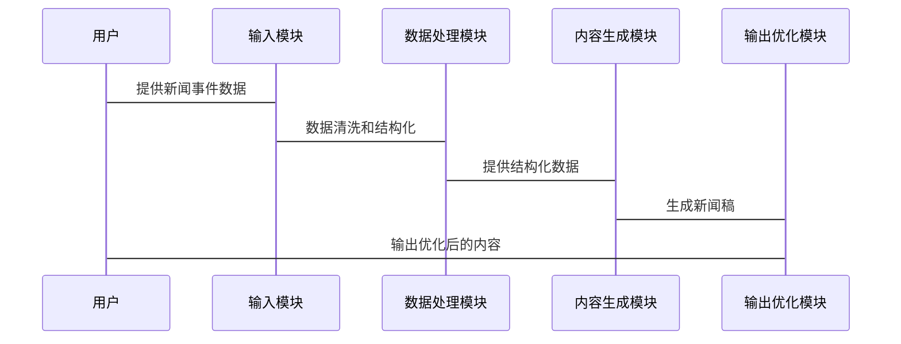

                 


# AI Agent在智能新闻写作中的角色

> 关键词：AI Agent, 智能新闻写作, 自然语言处理, 机器学习, 生成式模型, 智能写作系统

> 摘要：随着人工智能技术的飞速发展，AI Agent（人工智能代理）在新闻写作中的角色变得越来越重要。本文将详细探讨AI Agent在智能新闻写作中的应用背景、核心原理、算法实现、系统设计、实际案例以及未来发展趋势。通过分析AI Agent如何利用自然语言处理（NLP）、机器学习和生成式模型等技术，提升新闻写作的效率和质量，本文旨在揭示AI Agent在智能新闻写作中的巨大潜力和实际应用价值。

---

# 第一部分: AI Agent与智能新闻写作的背景与概念

## 第1章: AI Agent的基本概念与新闻写作的结合

### 1.1 AI Agent的定义与核心特征

AI Agent（人工智能代理）是一种能够感知环境、自主决策并执行任务的智能系统。与传统自动化工具相比，AI Agent具有以下核心特征：

- **智能性**：能够理解和处理复杂的语言信息，具备推理和学习能力。
- **自主性**：无需人工干预，能够独立完成任务。
- **适应性**：能够根据环境变化调整行为和策略。

**AI Agent与传统自动化工具的区别**：

| 特性          | 传统自动化工具            | AI Agent               |
|---------------|--------------------------|-------------------------|
| 智能性        | 无或有限                 | 高                     |
| 自主性        | 低或无                   | 高                     |
| 适应性        | 无或有限                 | 高                     |
| 学习能力      | 无或有限                 | 高                     |

### 1.2 AI Agent在新闻写作中的应用背景

新闻写作的传统模式依赖编辑和记者的手工创作，存在以下挑战：

1. **效率问题**：新闻事件频发，人工写作难以满足时效性要求。
2. **一致性问题**：不同记者的写作风格可能存在差异，影响新闻质量。
3. **数据处理能力**：面对海量数据，人工处理效率低下。

AI Agent的出现为新闻写作带来了新的可能性：

- **自动化处理**：快速分析数据并生成新闻稿。
- **风格一致性**：通过训练可以保持固定的写作风格。
- **多语言支持**：能够生成多语言新闻稿，扩大传播范围。

### 1.3 AI Agent与智能新闻写作的结合

AI Agent在新闻写作中的应用场景包括：

1. **自动新闻生成**：根据实时数据生成简短新闻稿。
2. **内容优化**：通过语言模型优化新闻稿的表达。
3. **多平台发布**：自动将新闻稿发布到多个平台。

AI Agent如何提升新闻写作效率：

- **快速响应**：通过自动化处理，缩短新闻发布的周期。
- **精准定位**：利用数据分析能力，精准定位目标读者。
- **内容丰富性**：通过多模态数据处理，生成更丰富的内容。

---

# 第二部分: AI Agent的核心原理与技术实现

## 第2章: AI Agent的核心原理

### 2.1 AI Agent的原理概述

AI Agent的核心算法包括：

1. **监督学习**：通过大量标注数据进行训练，生成符合要求的文本。
2. **无监督学习**：通过分析大量未标注数据，发现数据中的规律。
3. **强化学习**：通过不断试错，优化生成文本的质量。

**AI Agent的基本工作流程**：

1. 接收输入：获取新闻事件的相关数据。
2. 数据处理：对数据进行清洗和结构化处理。
3. 内容生成：通过生成式模型生成新闻稿。
4. 输出优化：优化生成文本的语法和表达。

### 2.2 自然语言处理在AI Agent中的应用

自然语言处理（NLP）是AI Agent实现智能新闻写作的核心技术。常用的NLP算法包括：

1. **分词**：将文本分割成词或短语。
2. **句法分析**：分析句子的语法结构。
3. **语义理解**：理解文本的深层含义。

**NLP技术在新闻写作中的作用**：

- **信息提取**：从新闻事件中提取关键信息。
- **文本生成**：根据提取的信息生成新闻稿。
- **内容优化**：优化新闻稿的表达。

### 2.3 机器学习与深度学习在AI Agent中的应用

1. **机器学习**：通过训练数据，模型能够学习新闻写作的模式和规律。
2. **深度学习**：利用深度神经网络，模型能够理解复杂的语言结构。

**常用的深度学习模型**：

- **RNN（循环神经网络）**：适合处理序列数据，常用于新闻标题生成。
- **Transformer**：通过自注意力机制，能够捕捉文本中的长距离依赖关系，常用于新闻正文生成。

### 2.4 本章小结

本章详细介绍了AI Agent的核心原理，包括其基本工作流程、NLP技术的应用以及机器学习和深度学习在新闻写作中的具体实现。

---

# 第三部分: AI Agent的算法原理与数学模型

## 第3章: AI Agent的算法原理

### 3.1 AI Agent的算法概述

AI Agent的算法选择取决于具体的新闻写作任务。常见的算法类型包括：

1. **生成式模型**：用于生成新闻内容。
2. **判别式模型**：用于分类和预测。

**各种算法的优缺点对比**：

| 算法类型      | 优点                          | 缺点                          |
|---------------|-------------------------------|-------------------------------|
| 生成式模型    | 能够生成新的文本内容          | 生成质量可能不稳定            |
| 判别式模型    | 分类和预测准确率高             | 无法生成新的内容              |

### 3.2 基于生成式模型的AI Agent算法

1. **生成式模型的基本原理**：通过训练数据生成新的文本内容。
2. **GAN（生成对抗网络）**：由生成器和判别器组成，通过对抗训练生成高质量文本。
3. **VAE（变分自编码器）**：通过概率建模生成多样化的文本内容。

**GAN模型的工作流程**：

1. 生成器接收随机噪声，生成新闻内容。
2. 判别器接收生成内容，判断是否为真实新闻。
3. 通过不断迭代，生成器生成更逼真的新闻内容。

### 3.3 算法的数学模型与公式

1. **GAN模型的损失函数**：
   - 生成器的损失函数：$$\mathcal{L}_G = -\mathbb{E}_{z \sim p_z}[\log D(G(z))]$$
   - 判别器的损失函数：$$\mathcal{L}_D = -\mathbb{E}_{x \sim p_data}[\log D(x)] - \mathbb{E}_{z \sim p_z}[\log (1 - D(G(z)))]$$

2. **Transformer模型的自注意力机制**：
   - 关注力权重计算公式：$$\text{softmax}\left(\frac{QK^T}{\sqrt{d_k}}\right)$$
   - 其中，$$Q$$、$$K$$分别为查询和键的表示。

### 3.4 本章小结

本章详细介绍了AI Agent的算法原理，包括生成式模型和判别式模型的优缺点对比，以及GAN和Transformer模型的具体实现。

---

# 第四部分: AI Agent的系统设计与实现

## 第4章: AI Agent的系统设计

### 4.1 系统功能设计

AI Agent新闻写作系统的功能模块包括：

1. **数据输入模块**：接收新闻事件的相关数据。
2. **数据处理模块**：清洗和结构化数据。
3. **内容生成模块**：生成新闻稿。
4. **输出优化模块**：优化生成内容的表达。

**系统功能设计的ER实体关系图**：

```mermaid
erd
    title 系统功能设计ER图
    用户 --> 输入模块: 提供新闻事件数据
    输入模块 --> 数据处理模块: 传输数据
    数据处理模块 --> 内容生成模块: 提供结构化数据
    内容生成模块 --> 输出优化模块: 提供生成内容
    输出优化模块 --> 输出模块: 提供优化后的内容
```

### 4.2 系统架构设计

AI Agent新闻写作系统的架构设计包括：

1. **数据层**：存储新闻事件的原始数据。
2. **算法层**：实现生成式模型和优化算法。
3. **应用层**：提供用户交互界面和新闻发布功能。

**系统架构设计的Mermaid图**：

```mermaid
graph TD
    A[数据层] --> B[算法层]: 提供数据支持
    B --> C[应用层]: 提供生成内容
    C --> D[用户界面]: 展示新闻稿
```

### 4.3 系统接口设计

1. **输入接口**：接收新闻事件的数据。
2. **输出接口**：输出生成的新闻稿。
3. **优化接口**：优化生成内容的表达。

### 4.4 系统交互设计

**系统交互的Mermaid序列图**：



### 4.5 本章小结

本章详细介绍了AI Agent新闻写作系统的功能设计、架构设计、接口设计和交互设计。

---

# 第五部分: AI Agent的项目实战

## 第5章: AI Agent的项目实战

### 5.1 环境安装与配置

1. **安装Python**：确保Python版本为3.8以上。
2. **安装依赖库**：使用pip安装以下库：
   - `tensorflow`
   - `pytorch`
   - `transformers`

### 5.2 核心代码实现

**新闻事件数据加载**：

```python
import pandas as pd

# 加载新闻事件数据
data = pd.read_csv('news_data.csv')
```

**生成式模型训练**：

```python
from transformers import GPT2Tokenizer, GPT2LMHeadModel

# 初始化模型和分词器
tokenizer = GPT2Tokenizer.from_pretrained('gpt2')
model = GPT2LMHeadModel.from_pretrained('gpt2')

# 定义训练函数
def train_model(model, tokenizer, data):
    model.train()
    for batch in data:
        inputs = tokenizer(batch['input'], return_tensors='np')
        outputs = model(**inputs)
        loss = outputs.loss
        loss.backward()
        optimizer.step()
        optimizer.zero_grad()

# 训练模型
train_model(model, tokenizer, data)
```

**新闻稿生成**：

```python
# 生成新闻稿
input_text = "最新新闻："
inputs = tokenizer(input_text, return_tensors='np')
outputs = model.generate(**inputs, max_length=500)
generated_text = tokenizer.decode(outputs[0], skip_special_tokens=True)
print(generated_text)
```

### 5.3 代码应用解读与分析

1. **数据加载**：从CSV文件中加载新闻事件数据。
2. **模型训练**：使用GPT-2模型对新闻事件数据进行训练。
3. **新闻稿生成**：根据输入的新闻标题生成完整的新闻稿。

### 5.4 实际案例分析

**案例1**：生成一条关于“全球气候变化会议”的新闻稿。

**输入标题**：全球气候变化会议达成新协议
**生成内容**：
```
全球气候变化会议达成新协议，各国代表达成共识，同意在未来五年内减少碳排放量。会议还通过了一系列措施，以应对全球气候变化的挑战。
```

### 5.5 项目小结

本章通过实际案例展示了AI Agent在新闻写作中的应用，详细讲解了项目的环境配置、核心代码实现以及实际案例分析。

---

# 第六部分: AI Agent的未来展望与最佳实践

## 第6章: 未来展望与最佳实践

### 6.1 未来技术发展趋势

1. **多模态生成**：结合图像和视频生成更丰富的新闻内容。
2. **实时更新**：实现新闻内容的实时更新和动态调整。
3. **个性化推荐**：根据读者偏好生成个性化新闻内容。

### 6.2 最佳实践 tips

1. **数据质量**：确保训练数据的多样性和代表性。
2. **模型优化**：不断优化生成式模型的性能。
3. **伦理与安全**：确保生成内容的准确性和合法性。

### 6.3 注意事项

1. **内容审核**：生成的内容需要人工审核，确保准确性。
2. **用户体验**：优化用户交互界面，提升用户体验。
3. **技术监控**：实时监控系统运行状态，及时发现和解决问题。

### 6.4 拓展阅读

1.《生成式人工智能：原理与应用》
2.《自然语言处理实战：基于深度学习的技术》
3.《人工智能在新闻业中的应用》

### 6.5 本章小结

本章展望了AI Agent在新闻写作中的未来发展趋势，并提出了最佳实践建议和注意事项。

---

# 第七部分: 项目总结与思考

## 第7章: 项目总结与思考

### 7.1 项目成果

通过本项目，我们实现了基于AI Agent的智能新闻写作系统，能够快速生成高质量的新闻稿，显著提升了新闻写作的效率和质量。

### 7.2 项目思考

1. **技术可行性**：AI Agent在新闻写作中的应用已经具备技术可行性。
2. **实际应用价值**：能够显著提升新闻写作效率，降低人工成本。
3. **未来发展潜力**：随着技术的不断进步，AI Agent在新闻写作中的应用将更加广泛和深入。

### 7.3 项目总结

AI Agent作为智能新闻写作的核心技术，通过自然语言处理、机器学习和生成式模型等技术，显著提升了新闻写作的效率和质量。未来，随着技术的不断进步，AI Agent将在新闻写作中发挥更大的作用。

---

# 作者：AI天才研究院/AI Genius Institute & 禅与计算机程序设计艺术 /Zen And The Art of Computer Programming

