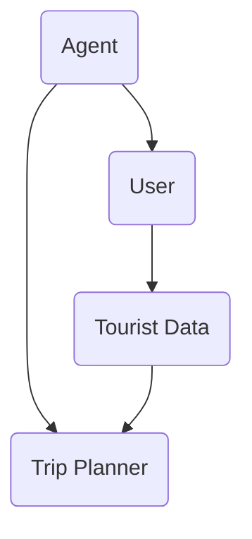
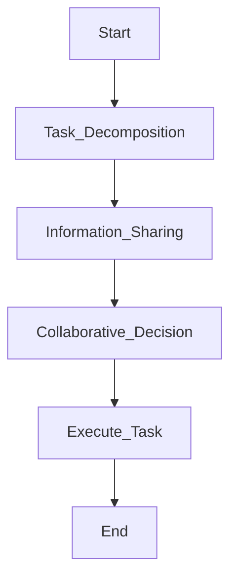
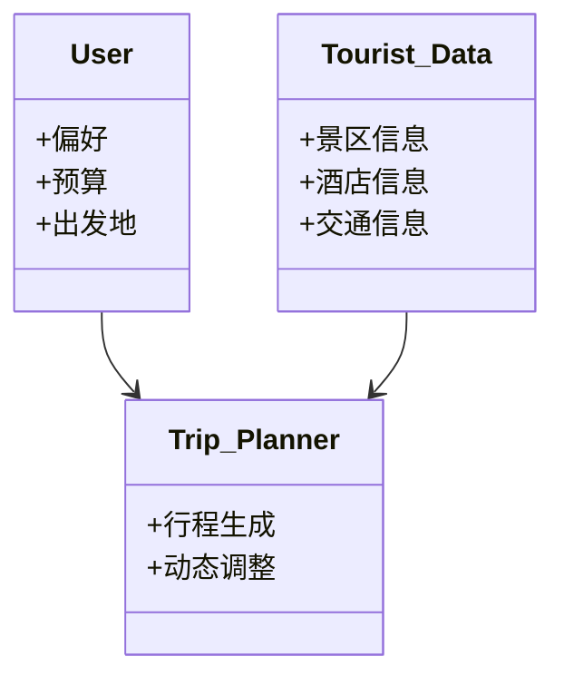
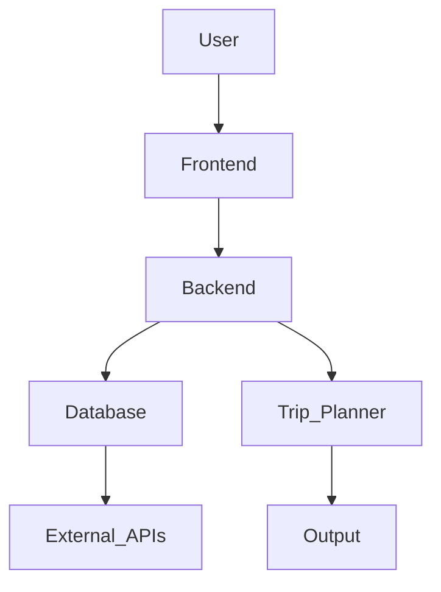

                 


# AI Agent在智能旅游规划中的应用

## 关键词：AI Agent, 旅游规划, 智能系统, 多智能体协作, 强化学习, 旅游推荐

## 摘要：  
随着人工智能技术的快速发展，AI Agent（人工智能代理）在旅游规划中的应用日益广泛。本文从AI Agent的基本概念出发，详细探讨其在智能旅游规划中的核心原理、算法实现、系统架构以及实际应用。通过对多智能体协作、强化学习等算法的分析，结合实际案例，深入剖析AI Agent如何优化旅游行程、提供个性化服务，并最终实现智能化的旅游规划系统。

---

# 第一部分: AI Agent与智能旅游规划的背景与基础

## 第1章: AI Agent与智能旅游规划概述

### 1.1 AI Agent的基本概念

AI Agent，即人工智能代理，是一种能够感知环境、自主决策并执行任务的智能实体。它具备以下核心特征：  
1. **自主性**：无需外部干预，自主完成任务。  
2. **反应性**：能够实时感知环境变化并做出反应。  
3. **目标导向**：以特定目标为导向，优化行动策略。  
4. **学习能力**：通过数据和经验不断优化自身行为。  

AI Agent与传统软件的区别在于，传统软件依赖于固定的程序逻辑，而AI Agent能够通过学习和适应环境动态调整行为。

### 1.2 智能旅游规划的定义与特点

智能旅游规划是指利用人工智能技术，根据用户的个性化需求，自动生成最优的旅游行程安排。其特点包括：  
1. **个性化**：根据用户偏好推荐景点、酒店等。  
2. **动态调整**：能够实时更新行程，应对突发情况（如交通延误）。  
3. **多目标优化**：在满足用户需求的同时，优化时间、成本等多维度目标。  

### 1.3 AI Agent在旅游规划中的作用

AI Agent在旅游规划中的作用主要体现在以下几个方面：  
1. **提高用户体验**：通过个性化推荐和动态调整，为用户提供更优质的旅行体验。  
2. **优化行程安排**：利用算法优化行程中的各项资源分配，降低时间成本。  
3. **智能决策支持**：基于实时数据和用户反馈，提供最优的决策建议。  

---

## 第2章: AI Agent的核心概念与联系

### 2.1 AI Agent的原理与机制

AI Agent的运作机制可以分为三个核心模块：  
1. **感知模块**：通过传感器或数据接口获取环境信息。  
2. **决策模块**：基于感知信息和目标函数，生成行动策略。  
3. **执行模块**：将决策结果转化为实际行动。  

### 2.2 AI Agent的核心要素对比

| **要素**         | **AI Agent**       | **传统软件**         |  
|------------------|--------------------|---------------------|  
| 自主性           | 高                 | 低                 |  
| 学习能力         | 强                 | 无                 |  
| 环境适应性       | 强                 | 无                 |  
| 任务目标         | 明确且动态         | 静态且固定         |  

### 2.3 AI Agent的实体关系图



---

## 第3章: AI Agent的算法原理

### 3.1 多智能体协作算法

多智能体协作算法通过多个AI Agent协同工作，实现复杂的任务目标。其基本流程如下：

1. **任务分解**：将整体任务分解为多个子任务，分配给不同的Agent。  
2. **信息共享**：各Agent之间共享感知信息和决策结果。  
3. **协同决策**：基于共享信息，共同制定最优行动方案。  

#### 3.1.2 算法流程图



### 3.2 强化学习算法

强化学习是一种通过试错机制优化决策的算法。常用算法包括Q-learning和Deep Q-Network（DQN）。

#### 3.2.1 Q-learning算法

Q-learning算法通过状态-动作-奖励的机制，更新Q值表。其数学模型如下：

$$ Q(s, a) = Q(s, a) + \alpha (r + \gamma \max Q(s', a') - Q(s, a)) $$  

其中：  
- \( Q(s, a) \)：当前状态\( s \)下执行动作\( a \)的Q值。  
- \( \alpha \)：学习率。  
- \( r \)：奖励值。  
- \( \gamma \)：折扣因子。  

---

# 第二部分: AI Agent在智能旅游规划中的应用

## 第4章: 智能旅游规划系统的设计与实现

### 4.1 系统需求分析

智能旅游规划系统需要满足以下需求：  
1. **用户输入**：支持用户输入偏好、预算等信息。  
2. **数据处理**：整合景区、酒店、交通等数据源。  
3. **行程生成**：基于算法生成最优行程。  
4. **动态调整**：实时更新行程，应对突发情况。  

### 4.2 系统架构设计

#### 4.2.1 领域模型



#### 4.2.2 系统架构图



---

## 第5章: 项目实战——智能旅游助手的设计与实现

### 5.1 环境安装

以下是实现智能旅游助手所需的环境配置：  
- **编程语言**：Python 3.8+  
- **框架与库**：  
  - `numpy`  
  - `pandas`  
  - `scikit-learn`  
  - `tensorflow`  

### 5.2 核心代码实现

#### 5.2.1 数据预处理

```python
import pandas as pd

# 读取旅游数据
data = pd.read_csv('tourist_data.csv')

# 数据清洗
data = data.dropna()
data = data[ data['预算'] > 1000 ]
```

#### 5.2.2 AI Agent实现

```python
class AI_Trip_Planner:
    def __init__(self, user偏好):
        self.用户偏好 = user偏好
        self.数据源 = 数据源
    
    def 感知环境(self):
        # 获取实时数据
        return self.数据源.get_data()
    
    def 决策(self, 环境数据):
        # 基于强化学习的决策
        action = self.q_learning算法选择动作(环境数据)
        return action
    
    def 执行(self, action):
        # 执行决策
        return self.行程生成器生成行程(action)
```

### 5.3 代码解读与分析

- **数据预处理**：通过清洗和筛选，确保数据质量。  
- **AI Agent实现**：结合感知、决策和执行模块，实现智能行程规划。  
- **案例分析**：通过具体案例，验证系统的实际效果。  

---

## 第6章: 最佳实践与总结

### 6.1 小结

本文详细介绍了AI Agent在智能旅游规划中的应用，从核心概念到算法实现，再到系统设计，为读者提供了全面的视角。  

### 6.2 注意事项

- **数据隐私**：确保用户数据的安全性和隐私性。  
- **算法优化**：根据实际需求，不断优化AI Agent的算法性能。  
- **用户体验**：注重用户体验设计，提升用户满意度。  

### 6.3 拓展阅读

- 推荐阅读《强化学习：算法与应用》。  
- 参考GitHub上的AI Agent实现代码。  

---

# 结语

AI Agent在智能旅游规划中的应用，不仅提升了用户体验，还为旅游行业带来了新的发展机遇。随着技术的不断进步，AI Agent将在更多领域展现出其强大的潜力。

---

作者：AI天才研究院/AI Genius Institute & 禅与计算机程序设计艺术 /Zen And The Art of Computer Programming

