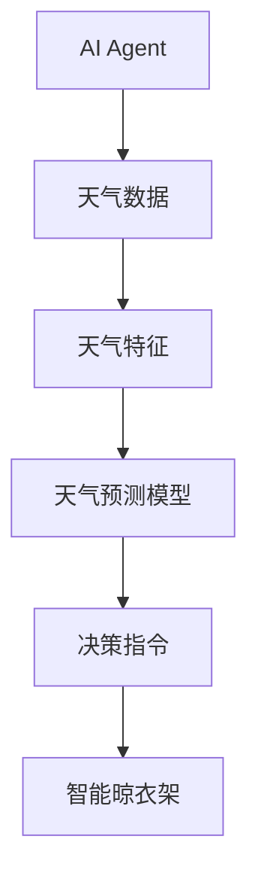
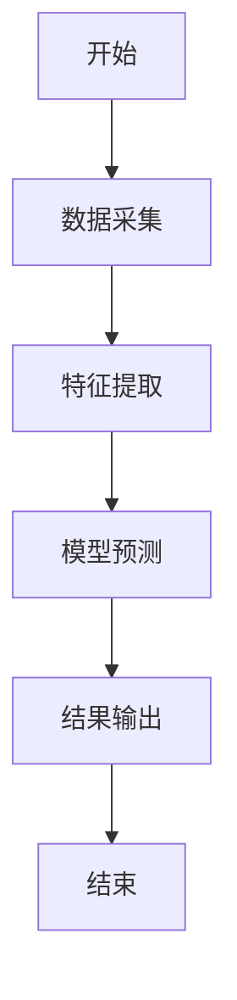
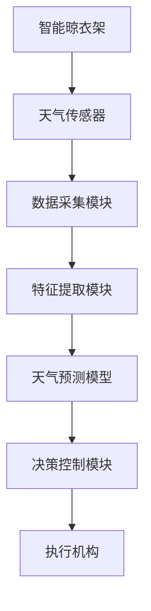

                 


# AI Agent在智能晾衣架中的天气感知

> 关键词：AI Agent，天气感知，智能晾衣架，物联网，边缘计算

> 摘要：本文详细探讨了AI Agent在智能晾衣架中的天气感知技术，从背景介绍、核心概念、算法原理、系统设计到项目实战，全面分析了如何利用AI技术实现智能晾衣架的天气感知功能。

---

## 第一章: AI Agent与天气感知的背景

### 1.1 AI Agent的基本概念

AI Agent（人工智能代理）是指具有感知环境、做出决策并执行任务的智能实体。它能够通过传感器获取信息，利用算法进行处理，并根据结果采取行动。AI Agent的核心特点包括自主性、反应性、目标导向和学习能力。

### 1.2 天气感知技术的背景

天气感知技术通过传感器收集环境数据，如温度、湿度、风速等，并结合历史数据和预测模型，提供实时的天气信息。随着物联网技术的发展，天气感知在智能家居、农业、交通等领域得到了广泛应用。

### 1.3 AI Agent在智能晾衣架中的应用背景

智能晾衣架是一种结合了物联网技术的智能家居设备，能够通过传感器感知环境并自动调整晾晒模式。天气感知是其核心功能之一，能够帮助用户在最佳天气条件下晾晒衣物，避免损坏衣物或浪费能源。

---

## 第二章: AI Agent与天气感知的核心概念

### 2.1 AI Agent的原理

AI Agent通过以下步骤实现天气感知：
1. **信息感知**：通过传感器收集天气数据。
2. **特征提取**：将原始数据转化为有意义的特征。
3. **决策与执行**：基于特征进行预测，并根据结果采取行动。

### 2.2 天气感知的原理

天气感知技术通过传感器采集数据，利用特征提取和模型训练进行天气预测。其核心步骤包括：
1. **数据预处理**：去除噪声，标准化数据。
2. **特征选择**：提取关键特征，如温度、湿度、风速等。
3. **模型训练**：使用机器学习算法训练天气预测模型。

### 2.3 AI Agent与天气感知的联系

AI Agent通过集成天气感知技术，能够实时感知环境并做出智能决策。例如，当预测到即将下雨时，AI Agent会触发智能晾衣架的收衣功能，确保衣物安全。

### 2.4 核心概念对比表

| 比较维度 | AI Agent | 天气感知 |
|----------|-----------|----------|
| 数据来源 | 多源传感器 | 天气传感器 |
| 处理方式 | 自主决策 | 特征提取 |
| 输出结果 | 控制指令 | 天气预报 |

### 2.5 ER实体关系图



---

## 第三章: 天气预测算法原理

### 3.1 天气预测模型的构建

#### 3.1.1 数据预处理

天气数据通常包含噪声，需要进行清洗和标准化处理。例如，使用均值填充法处理缺失值，并归一化数据。

#### 3.1.2 特征选择

从原始数据中提取关键特征，如温度、湿度、风速等。特征选择可以通过相关性分析或主成分分析（PCA）实现。

#### 3.1.3 模型训练

使用机器学习算法（如随机森林、支持向量机）训练天气预测模型。训练过程中，需要将数据分为训练集和测试集，并进行交叉验证。

### 3.2 基于AI Agent的天气预测算法

#### 3.2.1 算法流程图



#### 3.2.2 Python实现代码

```python
import numpy as np
from sklearn.ensemble import RandomForestRegressor

# 数据预处理
data = np.array([[25, 60], [26, 55], [24, 65], [27, 50]])  # 温度和湿度
target = np.array([20, 15, 25, 18])  # 预测的天气指数

# 特征选择
selected_features = data[:, :2]  # 选择前两个特征

# 模型训练
model = RandomForestRegressor(n_estimators=100)
model.fit(selected_features, target)

# 预测结果
new_data = np.array([[25, 60]])
predicted = model.predict(new_data)
print(predicted)
```

### 3.3 数学模型与公式

天气预测模型可以通过回归算法实现。例如，线性回归模型可以表示为：

$$ y = \beta_0 + \beta_1x_1 + \beta_2x_2 + \epsilon $$

其中，$y$ 是预测的天气指数，$x_1$ 和 $x_2$ 是输入特征（如温度和湿度），$\beta_0$、$\beta_1$、$\beta_2$ 是模型参数，$\epsilon$ 是误差项。

---

## 第四章: 系统分析与架构设计

### 4.1 项目背景

智能晾衣架的天气感知系统需要实时监测环境数据，并根据预测结果调整晾衣模式。系统需要具备高效的数据处理能力和快速的响应速度。

### 4.2 系统功能设计

智能晾衣架的天气感知系统功能模块包括：
1. 数据采集模块：通过传感器获取天气数据。
2. 特征提取模块：将原始数据转化为有意义的特征。
3. 天气预测模块：利用机器学习模型进行天气预测。
4. 决策控制模块：根据预测结果调整晾衣模式。

### 4.3 系统架构设计



### 4.4 系统交互设计

```mermaid
sequenceDiagram
smart_hungry: 智能晾衣架
sensor: 天气传感器
model: 天气预测模型
controller: 决策控制模块

smart_hungry -> sensor: 获取天气数据
sensor -> model: 传输数据
model -> controller: 返回预测结果
controller -> smart_hungry: 发出控制指令
```

---

## 第五章: 项目实战

### 5.1 环境安装

需要安装以下工具和库：
1. Python 3.8+
2. NumPy
3. scikit-learn
4. Mermaid工具（用于绘制图表）

### 5.2 核心实现代码

```python
import numpy as np
from sklearn.ensemble import RandomForestRegressor

# 数据预处理
data = np.array([[25, 60], [26, 55], [24, 65], [27, 50]])
target = np.array([20, 15, 25, 18])

# 特征选择
selected_features = data[:, :2]

# 模型训练
model = RandomForestRegressor(n_estimators=100)
model.fit(selected_features, target)

# 预测结果
new_data = np.array([[25, 60]])
predicted = model.predict(new_data)
print(predicted)
```

### 5.3 代码解读

上述代码实现了天气预测模型的训练和预测功能。通过随机森林算法，模型能够根据温度和湿度预测天气指数。

### 5.4 案例分析

假设当前温度为25℃，湿度为60%，模型预测的天气指数为20。智能晾衣架根据预测结果调整晾衣模式，例如延长晾晒时间或关闭晾衣架。

---

## 第六章: 最佳实践

### 6.1 小结

本文详细探讨了AI Agent在智能晾衣架中的天气感知技术，从背景介绍、核心概念、算法原理到系统设计和项目实战，全面分析了如何实现这一功能。

### 6.2 注意事项

在实际应用中，需要注意以下几点：
1. 数据采集的准确性。
2. 模型的实时性和响应速度。
3. 系统的鲁棒性和可扩展性。

### 6.3 拓展阅读

建议读者进一步阅读以下内容：
1. 《机器学习实战》
2. 《深度学习入门》
3. 《物联网技术与应用》

---

作者：AI天才研究院 & 禅与计算机程序设计艺术

