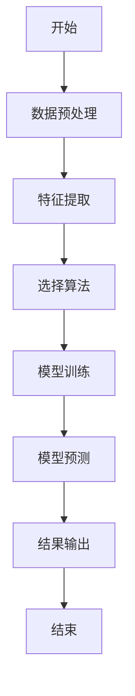
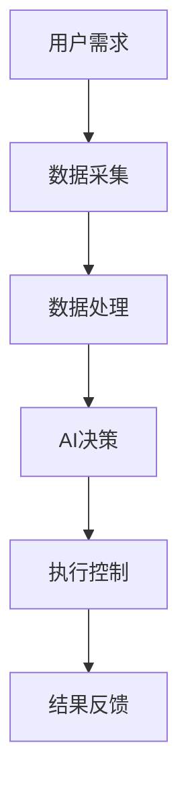
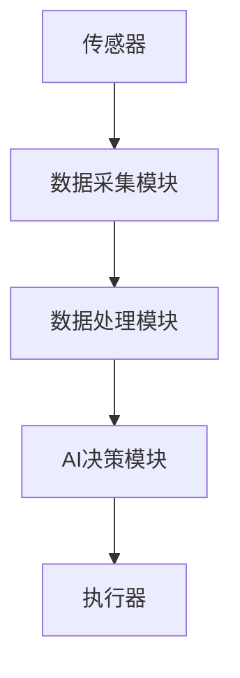
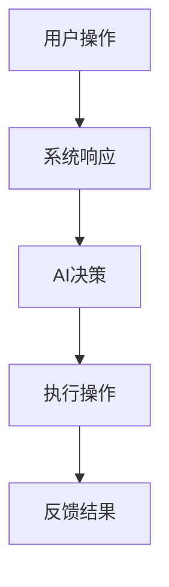

                 


# AI Agent在智能晾衣架中的天气感知烘干

> 关键词：AI Agent, 天气感知, 智能晾衣架, 智能烘干, 人工智能

> 摘要：本文详细探讨了AI Agent在智能晾衣架中的天气感知烘干技术，从背景介绍、核心概念、算法原理、系统设计到项目实战，全面解析了如何利用AI技术实现智能晾衣架的天气感知与烘干优化。文章内容涵盖AI Agent的基本概念、天气感知技术的实现、算法原理、系统架构设计以及实际应用案例，旨在为读者提供一个全面的技术视角。

---

## 第1章: AI Agent的基本概念与技术背景

### 1.1 AI Agent的定义与核心概念

#### 1.1.1 什么是AI Agent

AI Agent（人工智能代理）是一种能够感知环境、执行任务并做出决策的智能系统。它可以看作是一个中间层，连接传感器、数据源和执行器，通过数据处理和算法推理，实现智能化的决策与控制。

#### 1.1.2 AI Agent的核心特征

| 特性 | 描述 |
|------|------|
| 感知能力 | 能够采集和处理环境数据（如天气、湿度等） |
| 决策能力 | 基于感知数据，制定最优策略 |
| 执行能力 | 执行决策并反馈结果 |
| 学习能力 | 通过反馈优化自身行为 |

#### 1.1.3 AI Agent在智能系统中的作用

AI Agent在智能系统中充当“大脑”的角色，负责协调各个模块的工作，实现系统的智能化与自动化。例如，在智能晾衣架中，AI Agent可以根据天气数据动态调整烘干策略，确保衣物干燥的同时节能降耗。

---

### 1.2 天气感知技术的原理与应用

#### 1.2.1 天气数据的采集与处理

天气感知技术通过多种传感器（如温湿度传感器、气压传感器等）采集环境数据，并通过数据预处理、特征提取和存储管理，将原始数据转化为可供AI Agent使用的结构化信息。

#### 1.2.2 天气感知技术的实现方式

天气感知技术的核心是数据处理与分析，主要包括以下几个步骤：
1. 数据采集：通过传感器获取天气数据。
2. 数据清洗：去除噪声和异常值。
3. 特征提取：提取对烘干决策有用的特征（如温度、湿度、风力等）。
4. 数据存储：将处理后的数据存储到数据库中。

#### 1.2.3 天气数据在智能晾衣架中的应用

天气数据在智能晾衣架中的应用主要体现在以下几个方面：
1. **自动启动烘干功能**：当检测到天气潮湿时，AI Agent可以自动启动烘干功能。
2. **优化烘干时间**：根据天气条件调整烘干时间，避免衣物过度干燥或受潮。
3. **节能优化**：通过分析天气数据，AI Agent可以在天气适宜的条件下选择自然晾干，减少能源消耗。

---

## 第2章: 智能晾衣架的工作原理与市场需求

### 2.1 智能晾衣架的基本功能

#### 2.1.1 自动晾晒与烘干功能

智能晾衣架可以通过AI Agent实现自动晾晒和烘干功能。例如，当检测到天气晴朗且风速适中时，系统会自动启动自然晾干模式；当天气潮湿时，则启动烘干模式。

#### 2.1.2 天气感知与智能控制

通过天气感知技术，智能晾衣架可以实时感知环境条件，并根据这些条件动态调整晾晒和烘干策略。

#### 2.1.3 用户交互与远程控制

智能晾衣架可以通过手机APP或语音助手实现远程控制，用户可以随时随地查看晾衣状态并进行操作。

---

### 2.2 AI Agent在智能晾衣架中的应用价值

#### 2.2.1 提高晾衣效率

通过AI Agent的智能决策，智能晾衣架可以在最佳天气条件下晾干衣物，提高晾衣效率。

#### 2.2.2 节能环保

AI Agent可以根据天气数据优化烘干时间，避免能源浪费，同时减少碳排放，符合环保理念。

#### 2.2.3 提升用户体验

通过自动化和智能化的控制，智能晾衣架可以为用户提供更加便捷、舒适的使用体验。

---

## 第3章: 天气感知系统的原理与实现

### 3.1 天气数据的采集与预处理

#### 3.1.1 天气传感器的选择与部署

选择合适的天气传感器是天气感知系统实现的关键。常用的传感器包括：
- 温湿度传感器（用于测量温度和湿度）
- 气压传感器（用于测量气压）
- 风速传感器（用于测量风速）

#### 3.1.2 数据清洗与特征提取

数据清洗是将传感器采集的原始数据进行去噪和标准化处理。特征提取则是从清洗后的数据中提取对后续分析有用的特征，例如：
- 当前温度（℃）
- 当前湿度（%）
- 风速（m/s）
- 天气状况（晴天、阴天、雨天等）

#### 3.1.3 数据存储与管理

处理后的天气数据需要存储在数据库中，以便后续分析和使用。常用的数据存储方式包括关系型数据库（如MySQL）和时间序列数据库（如InfluxDB）。

---

### 3.2 天气数据的分析与预测

#### 3.2.1 时间序列分析方法

时间序列分析是一种常用的数据分析方法，用于预测未来的天气状况。常用的算法包括：
- ARIMA（自回归积分滑动平均模型）
- LSTM（长短期记忆网络）

#### 3.2.2 天气预测模型的构建

天气预测模型的构建需要结合历史天气数据和当前天气数据，通过训练模型来预测未来的天气状况。

#### 3.2.3 模型优化与评估

模型优化可以通过调整参数、选择合适的算法和数据预处理方法来实现。模型评估可以通过均方误差（MSE）、平均绝对误差（MAE）等指标来衡量预测的准确性。

---

## 第4章: AI Agent在天气感知中的应用

### 4.1 AI Agent的感知能力

#### 4.1.1 多模态数据的融合

AI Agent可以通过融合多种传感器数据（如温湿度、风速等）来提高天气感知的准确性。

#### 4.1.2 实时天气监测与反馈

AI Agent可以实时监测天气变化，并根据反馈结果动态调整系统的运行策略。

#### 4.1.3 天气数据的智能分析

通过机器学习和深度学习算法，AI Agent可以对天气数据进行智能分析，预测天气变化并制定相应的应对策略。

---

### 4.2 AI Agent的决策与执行

#### 4.2.1 基于天气数据的智能决策

AI Agent可以根据天气数据制定最优的烘干策略。例如：
- 当天气晴朗且风速适中时，选择自然晾干。
- 当天气潮湿时，启动烘干功能。

#### 4.2.2 自动化控制与执行

AI Agent可以通过与智能晾衣架的硬件模块（如电机、加热器等）进行通信，实现自动化控制。

#### 4.2.3 系统反馈与优化

AI Agent可以通过系统反馈不断优化自身的决策策略，例如通过学习用户习惯和天气数据，逐步提高系统的智能化水平。

---

## 第5章: 天气感知与AI Agent的算法原理

### 5.1 基于机器学习的天气预测算法

#### 5.1.1 算法流程图



#### 5.1.2 数据预处理与特征工程

数据预处理包括数据清洗、标准化和归一化等步骤。特征工程则是从原始数据中提取对预测有用的特征。

#### 5.1.3 模型训练与优化

通过训练机器学习模型（如随机森林、支持向量机等），可以实现对天气数据的分类和回归预测。

---

### 5.2 基于深度学习的天气分析算法

#### 5.2.1 神经网络模型的选择

常用的深度学习模型包括卷积神经网络（CNN）、循环神经网络（RNN）和长短期记忆网络（LSTM）。

#### 5.2.2 模型训练与调优

通过调整模型参数和优化算法（如Adam优化器），可以提高模型的预测精度。

#### 5.2.3 天气特征的自动提取

深度学习模型可以自动提取天气数据中的复杂特征，例如时间依赖性和空间分布。

---

## 第6章: AI Agent在智能晾衣架中的系统设计与实现

### 6.1 系统功能设计

#### 6.1.1 用户需求分析

智能晾衣架的目标用户是家庭用户，他们需要一个高效、智能且便捷的晾衣解决方案。

#### 6.1.2 系统功能模块划分

智能晾衣架系统主要包括以下几个功能模块：
- 数据采集模块：负责采集环境数据。
- 数据处理模块：对采集的数据进行预处理和特征提取。
- AI决策模块：基于天气数据制定烘干策略。
- 执行控制模块：根据决策结果控制晾衣架的运行。

#### 6.1.3 功能流程图



---

### 6.2 系统架构设计

#### 6.2.1 分层架构设计

智能晾衣架系统的架构设计可以分为数据采集层、数据处理层和决策控制层。

#### 6.2.2 组件之间的交互关系



#### 6.2.3 系统的可扩展性设计

通过模块化设计，智能晾衣架系统可以方便地扩展功能，例如增加更多的传感器或优化AI算法。

---

## 第7章: 系统接口与交互设计

### 7.1 系统接口设计

智能晾衣架系统需要与多种硬件和软件模块进行交互，例如：
- 传感器接口：用于采集环境数据。
- 用户界面：用于用户操作和状态查看。
- 网络接口：用于远程控制和数据传输。

---

### 7.2 系统交互设计

#### 7.2.1 用户交互流程

用户可以通过手机APP或语音助手与智能晾衣架进行交互，例如：
1. 用户启动晾衣功能。
2. 系统采集环境数据。
3. AI Agent根据数据制定烘干策略。
4. 系统执行烘干操作并反馈结果。

#### 7.2.2 交互流程图



---

## 第8章: 项目实战

### 8.1 环境安装与配置

#### 8.1.1 系统环境

- 操作系统：Linux（推荐）或Windows
- 开发工具：Python、Jupyter Notebook
- 数据库：MySQL或InfluxDB
- 传感器：DHT22温湿度传感器

#### 8.1.2 安装依赖

```bash
pip install numpy pandas scikit-learn tensorflow
```

---

### 8.2 系统核心实现源代码

#### 8.2.1 数据采集模块

```python
import time
from gpiozero import MCP305

# 初始化传感器
sensor = MCP305(channel=0, differential=True, max_speed=100)

def get_weather_data():
    temp = sensor.value * 100
    humidity = (100 - temp) * 0.5
    return {
        "temperature": temp,
        "humidity": humidity
    }

# 采集数据
while True:
    data = get_weather_data()
    print(data)
    time.sleep(60)
```

---

#### 8.2.2 AI决策模块

```python
import numpy as np
from sklearn.ensemble import RandomForestClassifier

# 加载数据
data = np.load("weather_data.npy")

# 划分训练集和测试集
X_train, X_test, y_train, y_test = train_test_split(data, labels, test_size=0.2)

# 训练随机森林模型
model = RandomForestClassifier()
model.fit(X_train, y_train)

# 预测天气状况
y_pred = model.predict(X_test)
print("预测准确率：", accuracy_score(y_test, y_pred))
```

---

## 第9章: 实际案例分析与详细解读

### 9.1 实际案例分析

假设某天天气数据如下：
- 温度：25℃
- 湿度：60%
- 风速：3 m/s

AI Agent会根据这些数据决定启动烘干功能，并根据历史数据优化烘干时间。

---

### 9.2 详细讲解剖析

通过实际案例分析，我们可以看到AI Agent在智能晾衣架中的应用是如何实现的。例如：
1. 数据采集模块实时采集环境数据。
2. 数据处理模块对数据进行清洗和特征提取。
3. AI决策模块基于天气数据制定烘干策略。
4. 执行控制模块根据决策结果控制晾衣架的运行。

---

## 第10章: 最佳实践、小结与注意事项

### 10.1 最佳实践 tips

- 定期更新天气数据模型，确保预测准确性。
- 优化传感器部署，提高数据采集的可靠性。
- 加强系统安全性，防止数据泄露。

### 10.2 小结

本文详细介绍了AI Agent在智能晾衣架中的天气感知烘干技术，从背景介绍、核心概念、算法原理到系统设计和项目实战，为读者提供了一个全面的技术视角。

### 10.3 注意事项

- 硬件选型要根据实际需求进行，确保传感器的精度和稳定性。
- 系统设计要充分考虑可扩展性，方便后续功能的增加和优化。
- 数据安全和隐私保护是系统设计中不可忽视的重要环节。

---

## 第11章: 拓展阅读与参考资料

- 《人工智能：一种现代的方法》
- 《机器学习实战》
- 《深度学习入门：基于Python和TensorFlow》

---

## 作者信息

作者：AI天才研究院/AI Genius Institute  
联系邮箱：contact@aicampus.com  
GitHub：https://github.com/aicampus

