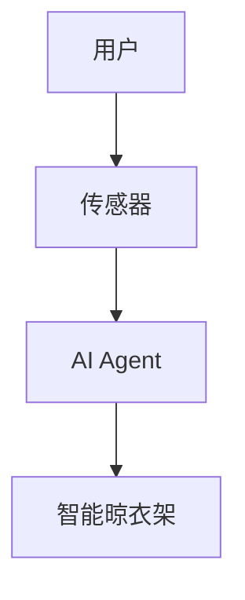
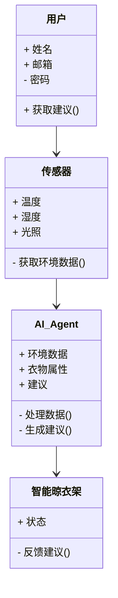
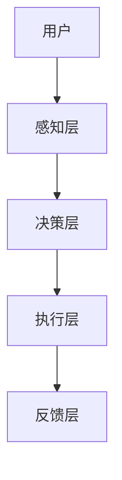

                 


# AI Agent在智能晾衣架中的衣物护理建议

## 关键词：AI Agent、智能晾衣架、衣物护理、人工智能、智能家居

## 摘要：  
本文探讨了AI Agent在智能晾衣架中的应用，重点分析了AI Agent如何通过感知环境、分析数据和学习优化，为衣物护理提供科学建议。文章从背景介绍、核心概念、算法原理、系统架构到项目实战，全面阐述了AI Agent在智能晾衣架中的技术实现与实际应用。

---

# 第1章 背景介绍

## 1.1 核心概念  
### 1.1.1 问题背景  
随着智能家居的普及，智能晾衣架逐渐成为家庭生活中不可或缺的设备。衣物护理不仅是日常生活的基本需求，更是提升生活质量的重要环节。然而，传统的晾衣方式存在诸多问题：  
- **天气影响**：晾衣时间过长或过短可能导致衣物受潮或曝晒。  
- **材质差异**：不同材质的衣物需要不同的晾晒条件。  
- **效率问题**：用户无法实时监控晾衣进度，难以根据天气变化调整晾晒策略。  

### 1.1.2 问题描述  
AI Agent（人工智能代理）是一种能够感知环境、自主决策并执行任务的智能系统。在智能晾衣架中，AI Agent的核心任务是根据环境数据（如天气、温度、湿度）和衣物属性（如材质、颜色、重量），提供个性化的晾衣建议。

### 1.1.3 问题解决  
AI Agent通过以下方式解决衣物护理问题：  
1. **环境感知**：实时采集天气、温度、湿度等数据。  
2. **数据分析**：结合衣物材质和用户需求，优化晾衣时间与方式。  
3. **智能决策**：基于历史数据和实时反馈，动态调整晾衣策略。  

### 1.1.4 边界与外延  
- **功能边界**：AI Agent仅负责衣物护理建议，不直接控制晾衣架的机械操作。  
- **外延扩展**：AI Agent可与其他智能家居设备联动，如空调、加湿器等。  

### 1.1.5 概念结构与核心要素组成  
- **核心要素**：环境数据、衣物属性、用户需求、AI算法。  
- **系统架构**：感知层、决策层、执行层。  

---

## 1.2 本章小结  
本章介绍了AI Agent在智能晾衣架中的背景与应用，明确了AI Agent的核心功能和边界条件，为后续章节的分析奠定了基础。

---

# 第2章 核心概念与联系

## 2.1 AI Agent的工作原理  
### 2.1.1 感知模块  
AI Agent通过传感器采集环境数据（如温度、湿度、光照）和衣物属性（如材质、重量）。  
- **数据预处理**：去除噪声，提取特征。  

### 2.1.2 决策模块  
AI Agent基于预处理后的数据，结合规则库或机器学习模型生成建议。  
- **基于规则的决策**：根据预设规则（如“晴天晾衣时间≥4小时”）生成建议。  
- **基于学习的决策**：利用历史数据训练模型，预测最佳晾衣时间。  

### 2.1.3 执行模块  
AI Agent将决策结果反馈给晾衣架，用户可根据建议调整晾衣操作。  

---

## 2.2 核心概念对比  
### 2.2.1 不同AI Agent类型对比  

| 类型                | 描述                                   | 优缺点                           |
|---------------------|--------------------------------------|----------------------------------|
| 基于规则的AI Agent  | 依赖预设规则，简单易实现               | 灵活性差，难以处理复杂场景         |
| 基于知识的AI Agent  | 使用知识库推理，提供更复杂的决策       | 需要大量知识构建，维护成本高       |
| 基于学习的AI Agent  | 利用机器学习模型自动生成决策           | 可处理复杂场景，但需要大量数据     |

### 2.2.2 实体关系图  


---

## 2.3 本章小结  
本章分析了AI Agent的核心概念，对比了不同类型的AI Agent，并通过实体关系图展示了系统的构成。

---

# 第3章 算法原理讲解

## 3.1 算法原理  
### 3.1.1 基于规则的算法  
- **规则定义**：例如，晴天时建议晾衣时间≥4小时，雨天时建议关闭晾衣架。  
- **实现步骤**：  
  1. 采集环境数据。  
  2. 判断是否满足预设规则。  
  3. 输出建议。  

### 3.1.2 基于知识的算法  
- **知识库构建**：存储衣物材质、天气条件等知识。  
- **知识推理**：利用推理引擎生成建议。  

### 3.1.3 基于学习的算法  
- **机器学习模型**：如决策树、随机森林。  
- **模型训练**：利用历史数据训练模型，预测最佳晾衣时间。  

---

## 3.2 算法实现  
### 3.2.1 基于规则的实现  
```python
def get_dryingAdvice(weather, humidity):
    if weather == "晴" and humidity < 60:
        return "建议晾衣，预计4小时完成"
    elif weather == "阴" and humidity > 70:
        return "不建议晾衣，建议使用烘干机"
    else:
        return "根据天气变化，随时调整"
```

### 3.2.2 基于学习的实现  
```python
# 数据预处理
import pandas as pd
data = pd.read_csv("drying_data.csv")
X = data.drop(columns=["建议"])
y = data["建议"]

# 模型训练
from sklearn.tree import DecisionTreeClassifier
model = DecisionTreeClassifier()
model.fit(X, y)

# 预测
new_weather = "晴"
new_humidity = 50
prediction = model.predict([[new_weather, new_humidity]])
print(prediction)
```

---

## 3.3 数学模型与公式  
### 3.3.1 概率模型  
$$ P(\text{建议晾衣} | \text{天气}=x, \text{湿度}=y) $$  

### 3.3.2 决策树模型  
$$ \text{决策规则} = \text{特征权重} \times \text{特征值} $$  

---

## 3.4 本章小结  
本章详细讲解了AI Agent的算法原理，包括基于规则、知识和学习的算法，并通过代码和数学公式进行了具体实现。

---

# 第4章 系统分析与架构设计

## 4.1 问题场景介绍  
智能晾衣架系统需要处理以下问题：  
- 如何实时采集环境数据？  
- 如何高效处理数据并生成建议？  

## 4.2 系统功能设计  
### 4.2.1 领域模型  


### 4.2.2 系统架构  


## 4.3 本章小结  
本章通过系统分析与架构设计，明确了智能晾衣架AI Agent的核心功能和实现方式。

---

# 第5章 项目实战

## 5.1 环境安装  
- **Python**：安装Python 3.8及以上版本。  
- **库依赖**：安装pandas、scikit-learn、mermaid等。  

## 5.2 核心代码实现  
### 5.2.1 数据预处理  
```python
import pandas as pd
data = pd.read_csv("drying_data.csv")
data.dropna(inplace=True)
```

### 5.2.2 模型训练  
```python
from sklearn.tree import DecisionTreeClassifier
model = DecisionTreeClassifier()
model.fit(X, y)
```

## 5.3 本章小结  
本章通过实际项目案例，展示了AI Agent在智能晾衣架中的具体实现过程。

---

# 第6章 最佳实践

## 6.1 项目经验总结  
- 数据质量的重要性：确保数据的完整性和准确性。  
- 模型的可解释性：便于用户理解和调整。  
- 系统的可扩展性：支持未来功能的扩展。  

## 6.2 小结与展望  
本文全面介绍了AI Agent在智能晾衣架中的衣物护理建议，未来可以进一步优化算法，提升用户体验。

---

# 作者  
作者：AI天才研究院 & 禅与计算机程序设计艺术

