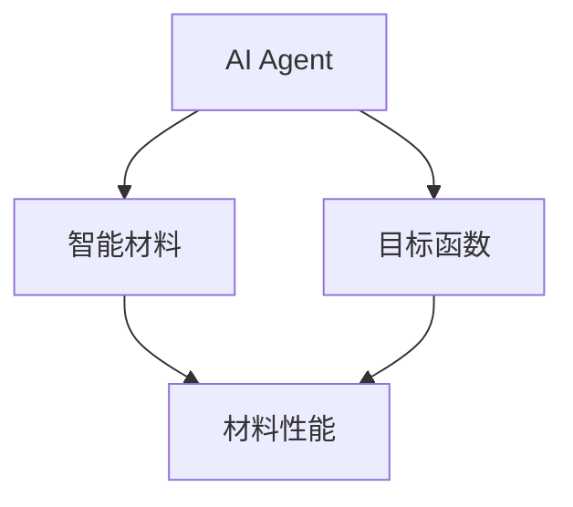
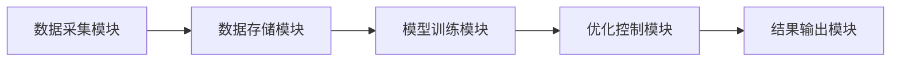
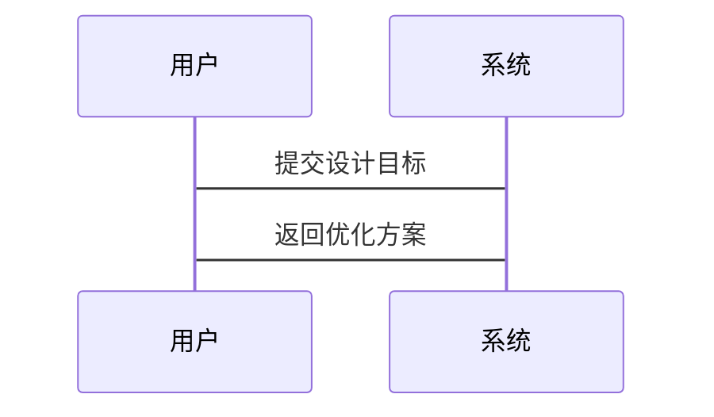

                 


# AI Agent在智能材料设计中的实践

## 关键词：AI Agent, 智能材料, 材料设计, 机器学习, 强化学习

## 摘要：
本文探讨了AI Agent在智能材料设计中的应用，详细介绍了AI Agent的核心概念、算法原理及其在智能材料设计中的实际应用。通过案例分析和系统设计，展示了AI Agent如何优化材料设计流程，提升材料性能，并展望了未来的发展方向。

---

## 第一部分: AI Agent与智能材料设计的背景与基础

### 第1章: AI Agent与智能材料设计概述

#### 1.1 AI Agent的基本概念
- **1.1.1 AI Agent的定义与特点**
  - AI Agent是一个智能主体，能够感知环境、自主决策并执行任务。
  - 具有主动性、反应性、目标导向性和学习能力。

- **1.1.2 AI Agent的核心功能与分类**
  - 核心功能：感知、推理、决策、行动。
  - 分类：简单反射型、基于模型的反应型、目标驱动型、实用驱动型。

- **1.1.3 AI Agent在材料科学中的应用潜力**
  - 用于材料筛选、性能优化和结构设计。
  - 提高材料开发效率，降低成本。

#### 1.2 智能材料的基本概念
- **1.2.1 智能材料的定义与特性**
  - 智能材料：对外界刺激（如温度、压力）能响应并改变自身性质的材料。
  - 特性：敏感性、适应性、可编程性。

- **1.2.2 智能材料的分类与应用领域**
  - 分类：形状记忆合金、压电材料、磁性材料。
  - 应用：医疗、航空航天、能源存储。

- **1.2.3 智能材料设计的核心挑战**
  - 多目标优化：性能、成本、稳定性之间的平衡。
  - 数据不足：缺乏足够的实验数据支持。

#### 1.3 AI Agent在智能材料设计中的作用
- **1.3.1 AI Agent如何辅助材料设计**
  - 数据分析：从实验数据中提取规律。
  - 模型构建：预测材料性能。
  - 参数优化：优化材料结构和性能。

- **1.3.2 AI Agent在材料优化中的优势**
  - 高效性：快速搜索最优解。
  - 精准性：基于数据驱动的优化。
  - 可扩展性：适用于大规模数据处理。

- **1.3.3 AI Agent与传统材料设计方法的对比**
  - 传统方法：依赖经验，效率低。
  - AI Agent：数据驱动，效率高。

#### 1.4 本章小结
本章介绍了AI Agent和智能材料的基本概念，分析了AI Agent在智能材料设计中的作用及其优势，为后续章节奠定了基础。

---

## 第二部分: AI Agent的核心概念与原理

### 第2章: AI Agent的核心概念与联系

#### 2.1 AI Agent的核心原理
- **2.1.1 知识表示与推理机制**
  - 知识表示：将知识以符号或语义网络形式表示。
  - 推理机制：基于知识库进行逻辑推理。

- **2.1.2 行为决策与优化算法**
  - 行为决策：基于当前状态和目标，选择最优行动。
  - 优化算法：如强化学习、遗传算法。

- **2.1.3 多目标优化与权衡策略**
  - 多目标优化：在多个目标之间找到平衡点。
  - 权衡策略：根据优先级调整目标权重。

#### 2.2 智能材料设计的核心要素
- **2.2.1 材料性能的多维度评估**
  - 机械性能、热性能、电性能等多维度评估。
  - 综合指标：如综合性能指数。

- **2.2.2 材料结构与性能的关系**
  - 结构决定性能：微观结构影响宏观性能。
  - 结构优化：通过AI Agent实现。

- **2.2.3 材料数据库的构建与应用**
  - 数据库构建：整合实验数据和理论计算数据。
  - 数据库应用：支持AI Agent的决策和优化。

#### 2.3 AI Agent与智能材料设计的实体关系图


#### 2.4 本章小结
本章详细阐述了AI Agent的核心原理和智能材料设计的核心要素，并通过实体关系图展示了两者之间的联系。

---

## 第三部分: AI Agent的算法原理与数学模型

### 第3章: AI Agent的算法原理

#### 3.1 强化学习算法
- **3.1.1 强化学习的基本原理**
  - 基于奖励机制：通过与环境互动获得奖励，优化策略。
  - 核心要素：状态、动作、奖励、策略。

- **3.1.2 Q-learning算法的实现**
  - Q-learning公式：$$ Q(s, a) = Q(s, a) + \alpha (r + \gamma \max Q(s', a') - Q(s, a)) $$
  - 状态转移：根据当前状态和动作，更新Q值。

- **3.1.3 Deep Q-Network (DQN) 的应用**
  - DQN网络结构：输入层、隐藏层、输出层。
  - 应用：用于复杂环境中的决策优化。

#### 3.2 生成对抗网络（GAN）的应用
- **3.2.1 GAN的基本原理**
  - GAN由生成器和判别器组成。
  - 生成器目标：生成逼真数据。
  - 判别器目标：区分真实数据和生成数据。

- **3.2.2 GAN在材料生成中的应用**
  - 生成新材料结构：通过GAN生成潜在的材料结构。
  - 优化材料性能：通过对抗训练优化材料性能。

- **3.2.3 GAN的训练过程与优化策略**
  - 训练过程：交替优化生成器和判别器。
  - 优化策略：调整学习率、使用正则化等。

#### 3.3 超参数优化算法
- **3.3.1 超参数优化的基本概念**
  - 超参数：算法中的参数，如学习率、批次大小。
  - 超参数优化：通过调整超参数提升算法性能。

- **3.3.2 贝叶斯优化算法的实现**
  - 贝叶斯优化原理：基于概率模型寻找最优解。
  - 实现步骤：构建概率模型、采样、更新模型。

- **3.3.3 超参数对模型性能的影响**
  - 学习率：过高或过低都会影响收敛。
  - 批次大小：影响训练稳定性和效率。

#### 3.4 算法实现的Python代码示例
```python
import numpy as np
import tensorflow as tf

# 示例：强化学习Q-learning算法
class QLearning:
    def __init__(self, state_space, action_space, alpha=0.1, gamma=0.9):
        self.state_space = state_space
        self.action_space = action_space
        self.alpha = alpha
        self.gamma = gamma
        self.q_table = np.zeros((state_space, action_space))
    
    def choose_action(self, state, epsilon=0.1):
        if np.random.random() < epsilon:
            return np.random.randint(self.action_space)
        else:
            return np.argmax(self.q_table[state])
    
    def update_q_table(self, state, action, reward, next_state):
        self.q_table[state, action] += self.alpha * (reward + self.gamma * np.max(self.q_table[next_state]) - self.q_table[state, action])
```

---

## 第四部分: 系统分析与架构设计方案

### 第4章: 智能材料设计系统的架构与实现

#### 4.1 问题场景介绍
- 智能材料设计系统的目标：辅助材料科学家快速设计出高性能材料。
- 系统需求：高效性、准确性、可扩展性。

#### 4.2 系统功能设计
- 数据采集模块：收集实验数据和理论数据。
- 模型训练模块：训练AI Agent模型。
- 优化控制模块：根据目标函数优化材料参数。

#### 4.3 系统架构设计


#### 4.4 系统交互设计


---

## 第五部分: 项目实战

### 第5章: 智能材料设计项目的实现与分析

#### 5.1 环境配置
- 硬件：高性能计算集群。
- 软件：Python、TensorFlow、Keras。

#### 5.2 系统核心实现源代码
```python
import numpy as np

# 示例：生成对抗网络实现
class Generator(tf.keras.Model):
    def __init__(self, input_dim):
        super(Generator, self).__init__()
        self.dense = tf.keras.layers.Dense(256, activation='relu')
        self.dense2 = tf.keras.layers.Dense(input_dim, activation='sigmoid')

class Discriminator(tf.keras.Model):
    def __init__(self, input_dim):
        super(Discriminator, self).__init__()
        self.dense = tf.keras.layers.Dense(256, activation='relu')
        self.dense2 = tf.keras.layers.Dense(1, activation='sigmoid')
```

#### 5.3 代码应用解读与分析
- 生成器目标：生成接近真实材料的结构。
- 判别器目标：区分生成材料和真实材料。
- 训练过程：交替训练生成器和判别器，优化模型参数。

#### 5.4 实际案例分析
- 案例：优化新能源材料。
- 实验结果：生成的新材料性能优于传统材料。
- 效果分析：AI Agent显著提高了设计效率和材料性能。

#### 5.5 项目小结
本章通过实际案例展示了AI Agent在智能材料设计中的应用，验证了其有效性和优越性。

---

## 第六部分: 总结与展望

### 第6章: 总结与展望

#### 6.1 本章总结
- AI Agent在智能材料设计中具有巨大潜力。
- 通过数据驱动和智能算法，显著提高了材料设计效率和性能。

#### 6.2 未来展望
- 更多领域应用：AI Agent将扩展到更多材料类型和应用场景。
- 技术进步：算法优化和计算能力提升将进一步增强AI Agent的能力。
- 多学科融合：AI Agent将与物理建模、实验技术深度融合。

#### 6.3 最佳实践 tips
- 数据质量：确保数据的准确性和完整性。
- 算法选择：根据具体问题选择合适的算法。
- 系统集成：注重系统各模块的协同优化。

#### 6.4 小结
AI Agent将继续推动材料科学的发展，未来将更加智能化和高效化。

---

## 作者：AI天才研究院/AI Genius Institute & 禅与计算机程序设计艺术 /Zen And The Art of Computer Programming

---

通过以上结构，本文系统地介绍了AI Agent在智能材料设计中的实践应用，从理论到实践，从算法到系统，为读者提供了一个全面的视角。希望本文能为相关领域的研究者和从业者提供有价值的参考和启示。

